# Repeating Earthquake Activity at RCM

## Waveforms
[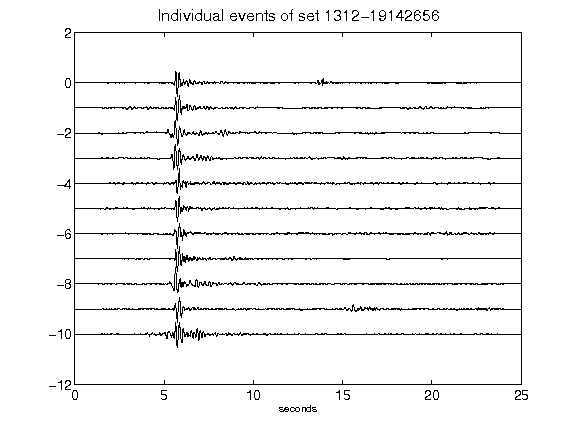](figures/1312-19142656_AllEv.png)[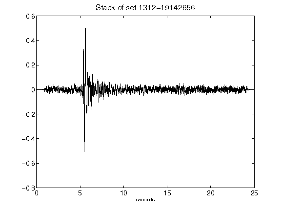](figures/1312-19142656_Stack.png)[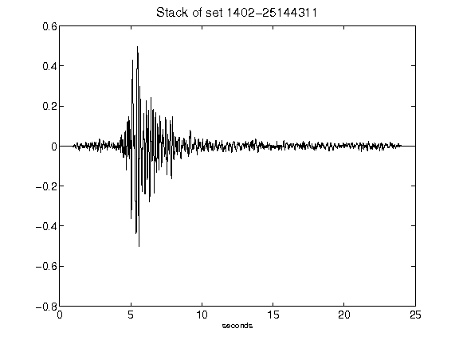](figures/1402-25144311_Stack.png)[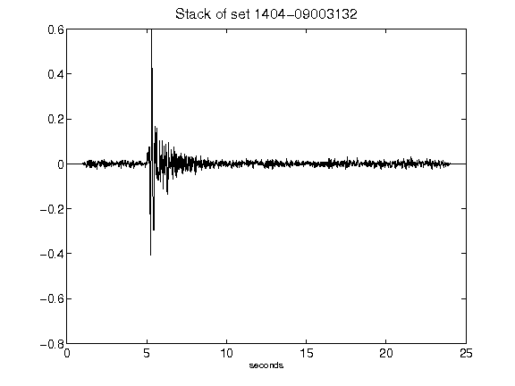](figures/1404-09003132_Stack.png)[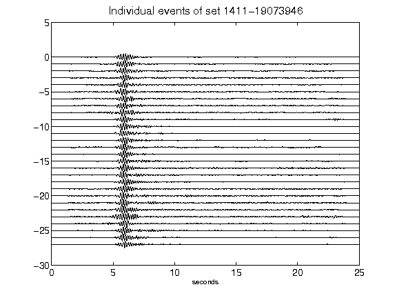](figures/1411-19073946_AllEv.png)[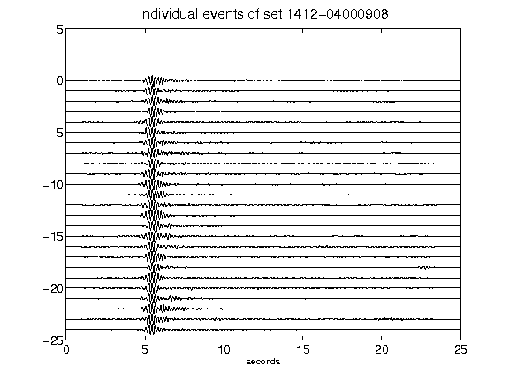](figures/1412-04000908_AllEv.png)[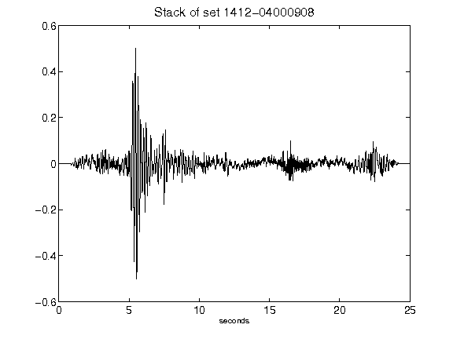](figures/1412-04000908_Stack.png)[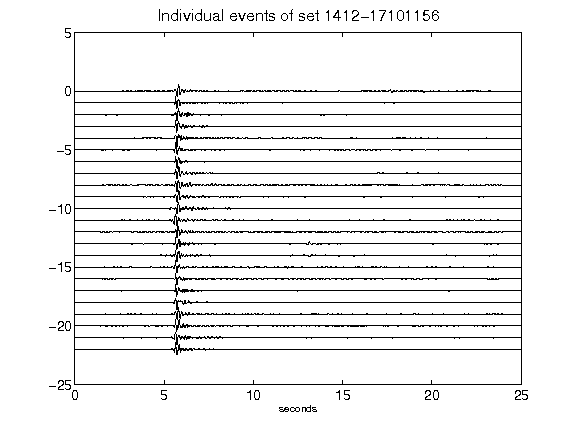](figures/1412-17101156_AllEv.png)[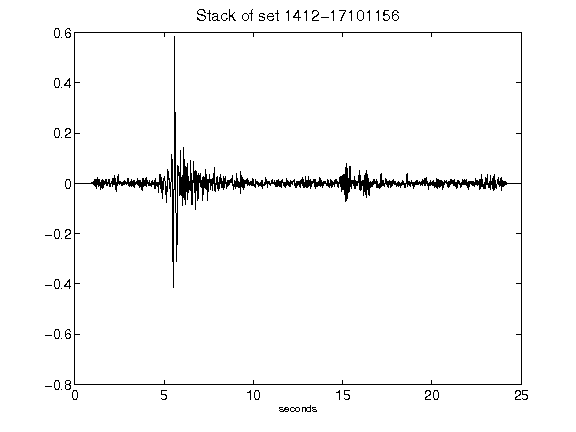](figures/1412-17101156_Stack.png)[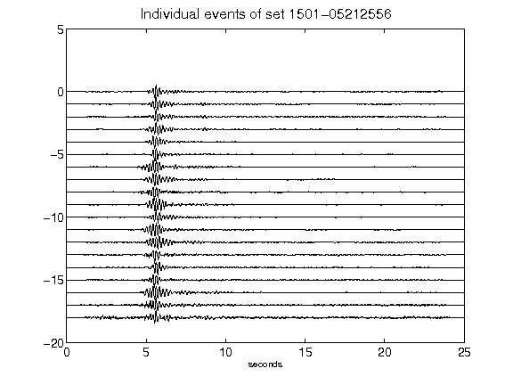](figures/1501-05212556_AllEv.png)[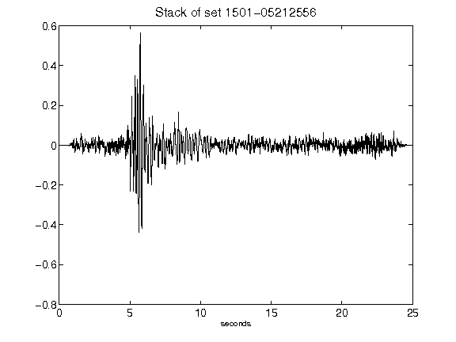](figures/1501-05212556_Stack.png)[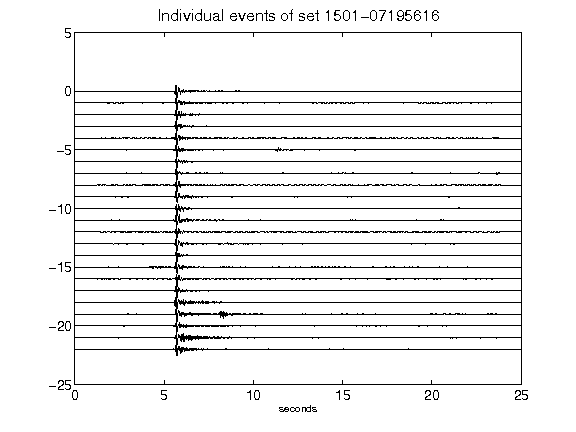](figures/1501-07195616_AllEv.png)[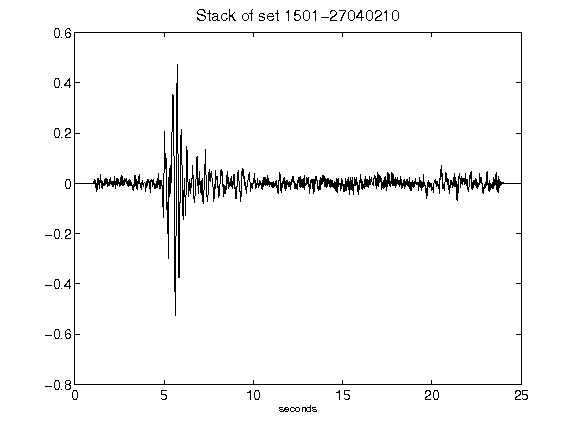](figures/1501-27040210_Stack.png)[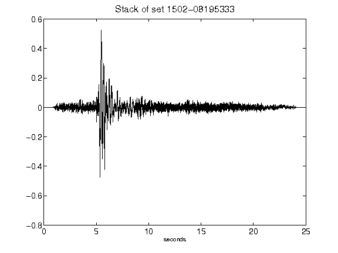](figures/1502-08195333_Stack.png)[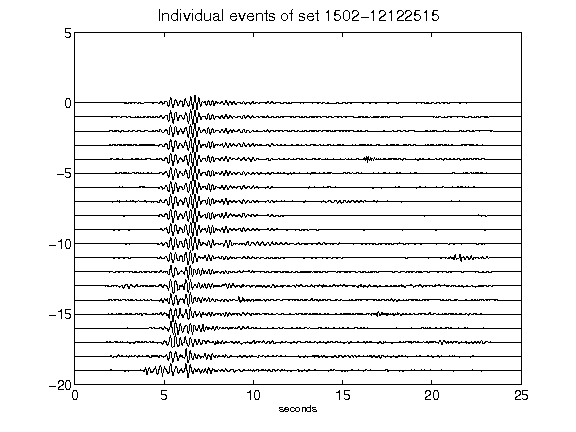](figures/1502-12122515_AllEv.png)[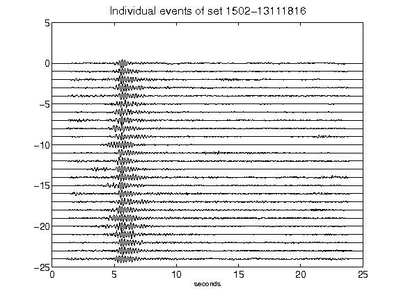](figures/1502-13111816_AllEv.png)[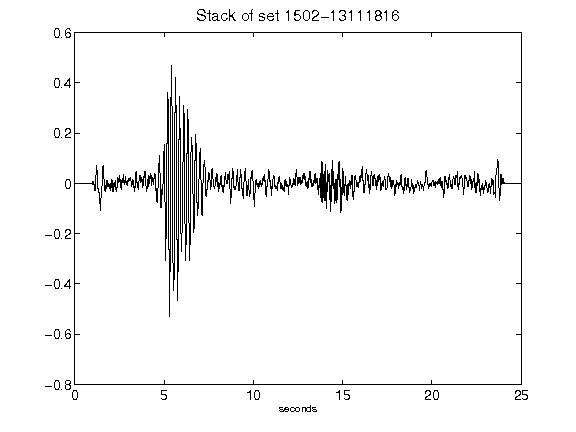](figures/1502-13111816_Stack.png)[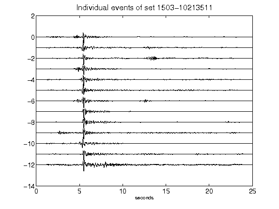](figures/1503-10213511_AllEv.png)[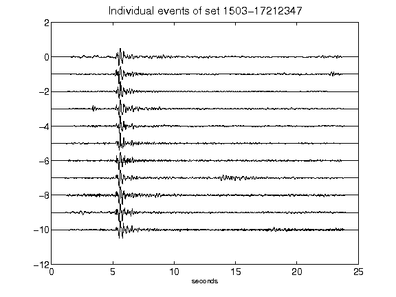](figures/1503-17212347_AllEv.png)[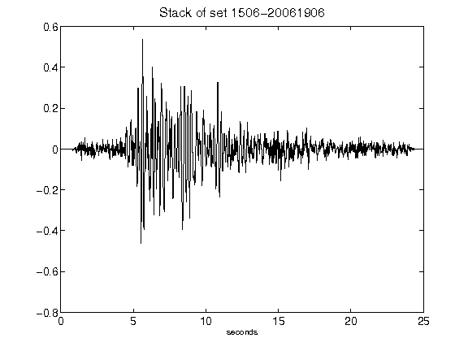](figures/1506-20061906_Stack.png)