# Repeating Earthquake Activity at RCM

## Waveforms
[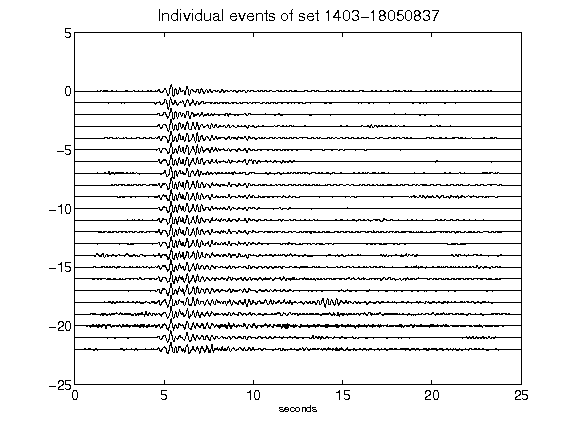](figures/1403-18050837_AllEv.png)[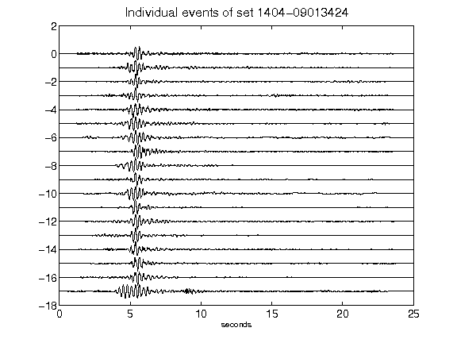](figures/1404-09013424_AllEv.png)[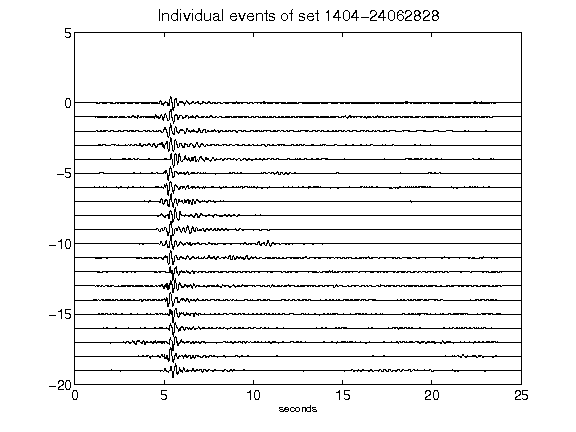](figures/1404-24062828_AllEv.png)[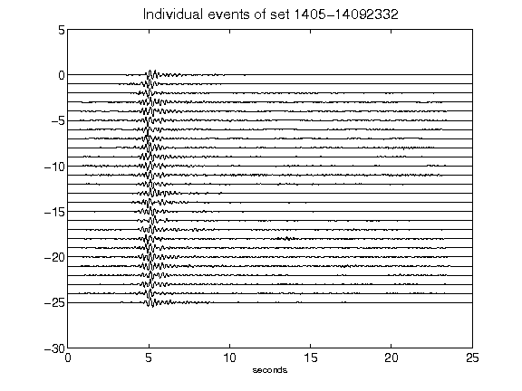](figures/1405-14092332_AllEv.png)[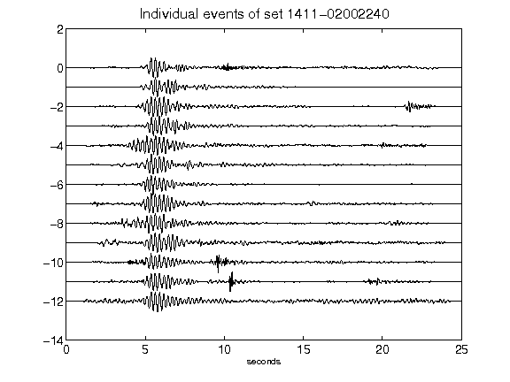](figures/1411-02002240_AllEv.png)[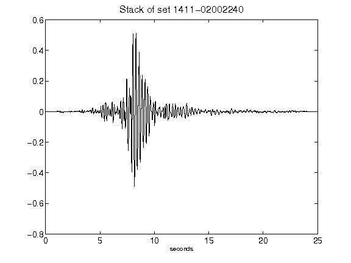](figures/1411-02002240_Stack.png)[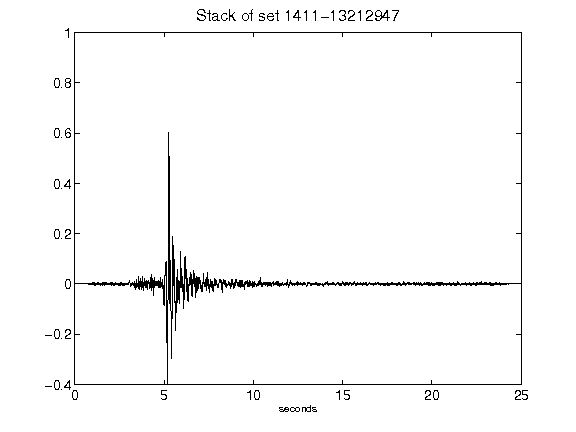](figures/1411-13212947_Stack.png)[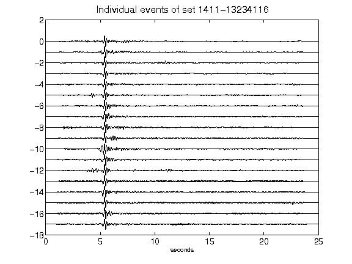](figures/1411-13234116_AllEv.png)[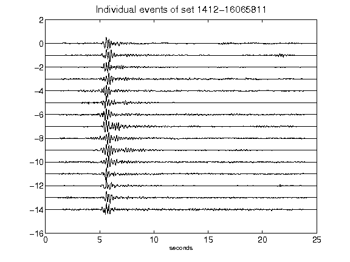](figures/1412-16065811_AllEv.png)[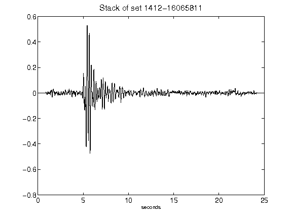](figures/1412-16065811_Stack.png)[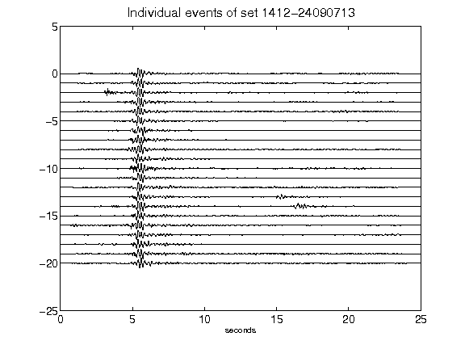](figures/1412-24090713_AllEv.png)[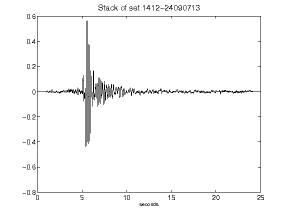](figures/1412-24090713_Stack.png)[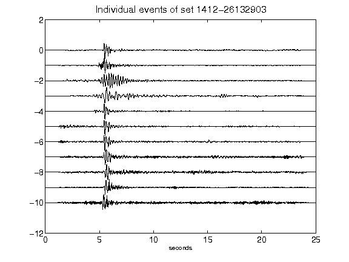](figures/1412-26132903_AllEv.png)[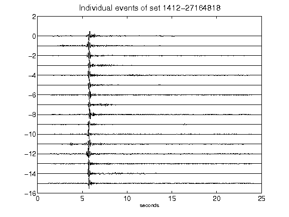](figures/1412-27164818_AllEv.png)[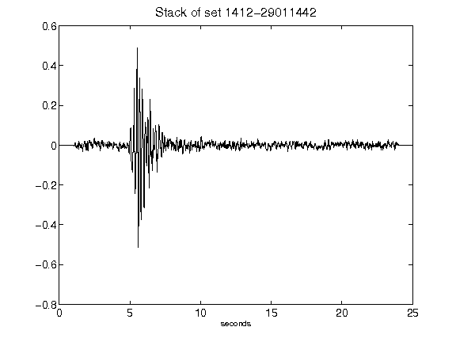](figures/1412-29011442_Stack.png)[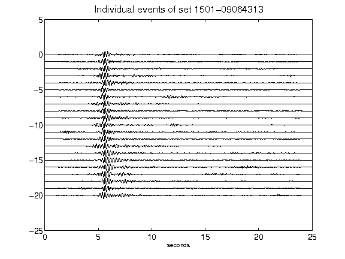](figures/1501-09064313_AllEv.png)[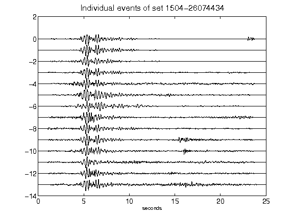](figures/1504-26074434_AllEv.png)[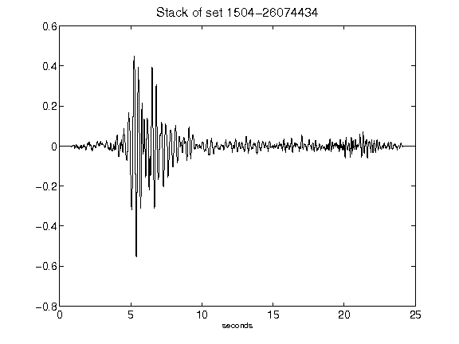](figures/1504-26074434_Stack.png)[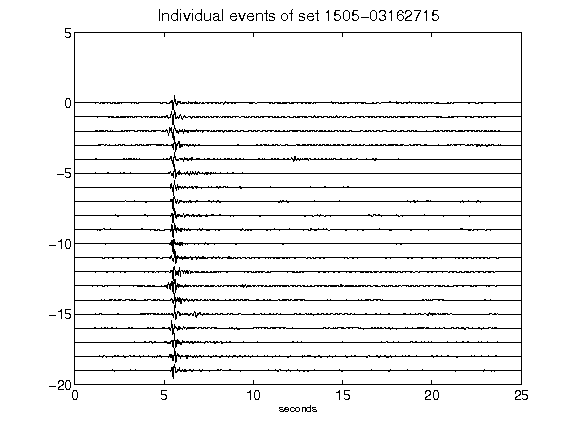](figures/1505-03162715_AllEv.png)[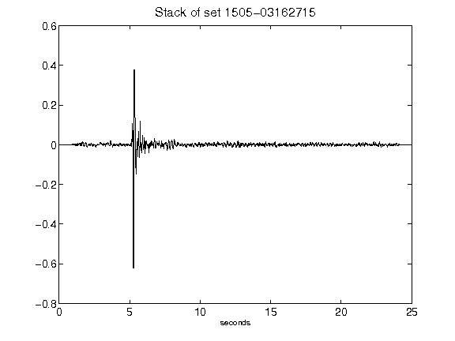](figures/1505-03162715_Stack.png)[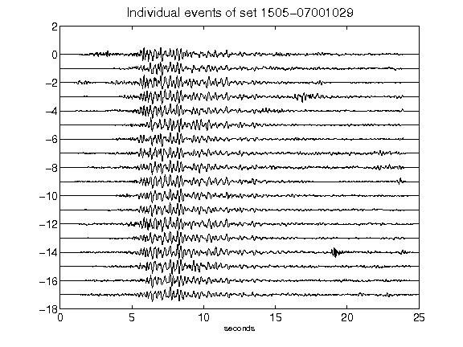](figures/1505-07001029_AllEv.png)[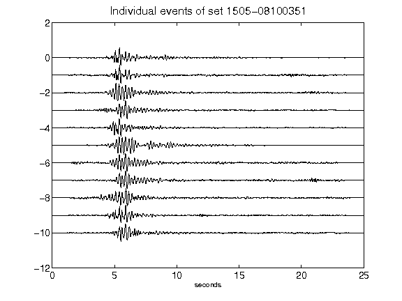](figures/1505-08100351_AllEv.png)