# Repeating Earthquake Activity at RCM

## Waveforms
[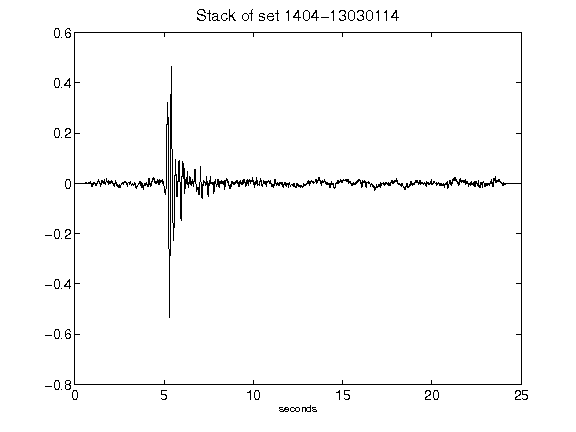](figures/1404-13030114_Stack.png)[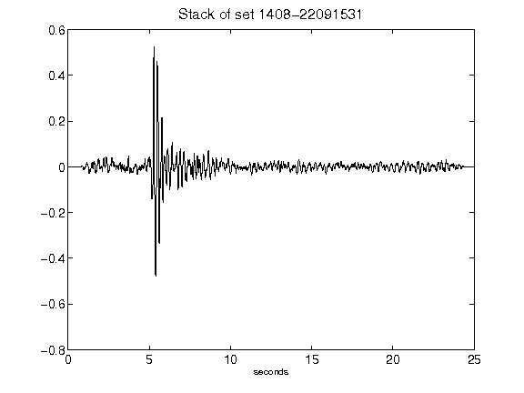](figures/1408-22091531_Stack.png)[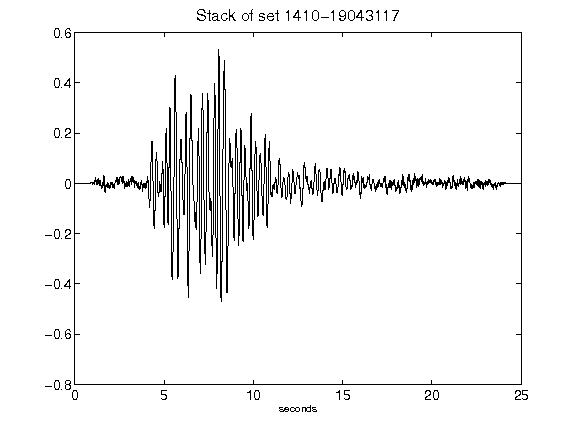](figures/1410-19043117_Stack.png)[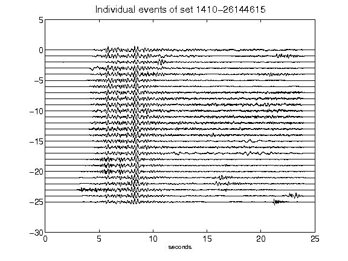](figures/1410-26144615_AllEv.png)[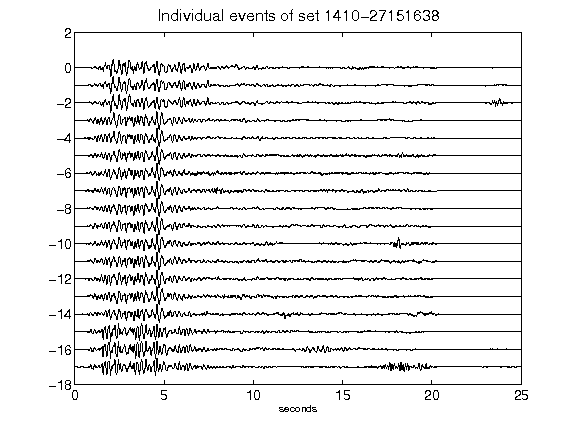](figures/1410-27151638_AllEv.png)[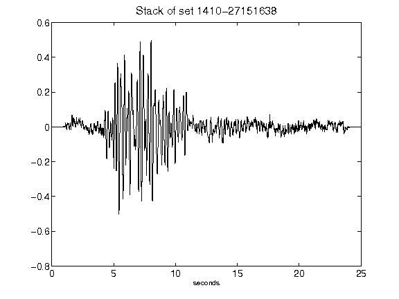](figures/1410-27151638_Stack.png)[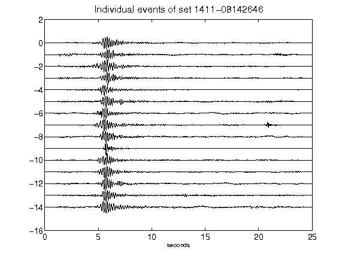](figures/1411-08142646_AllEv.png)[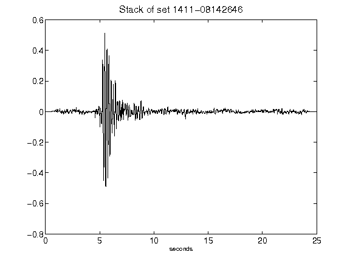](figures/1411-08142646_Stack.png)[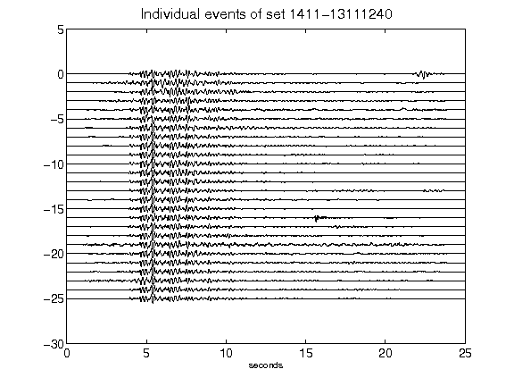](figures/1411-13111240_AllEv.png)[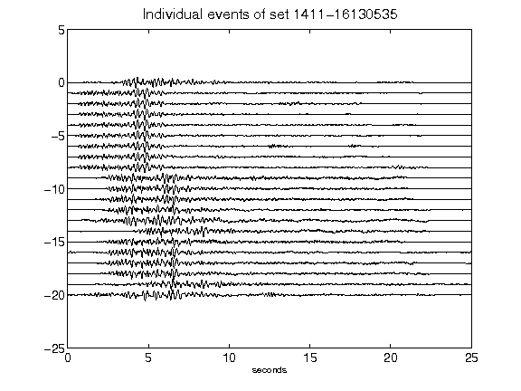](figures/1411-16130535_AllEv.png)[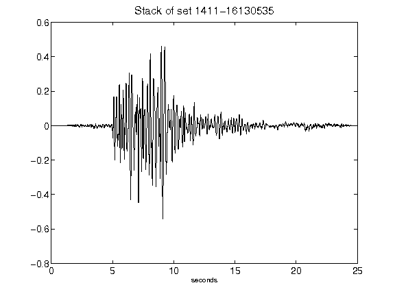](figures/1411-16130535_Stack.png)[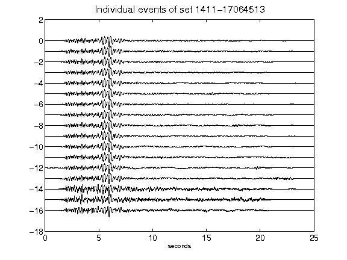](figures/1411-17064513_AllEv.png)[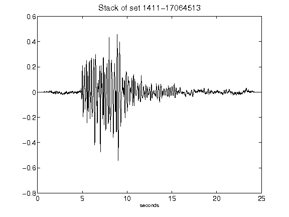](figures/1411-17064513_Stack.png)[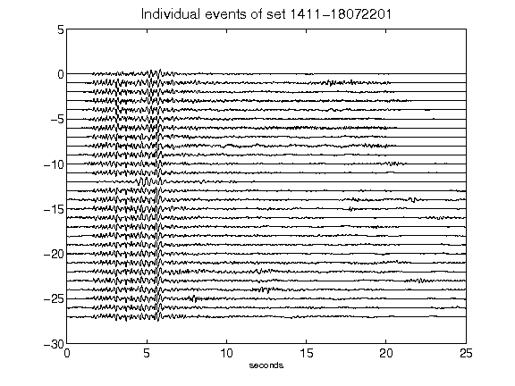](figures/1411-18072201_AllEv.png)[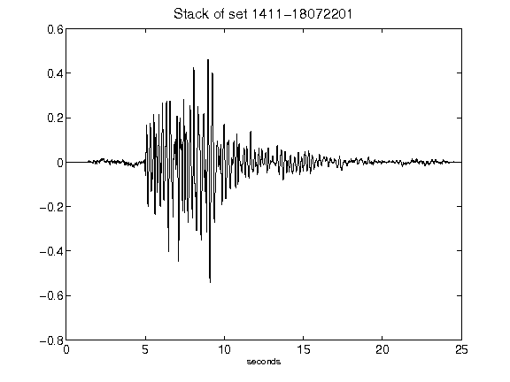](figures/1411-18072201_Stack.png)