# Repeating Earthquake Activity at RCM

## Waveforms
[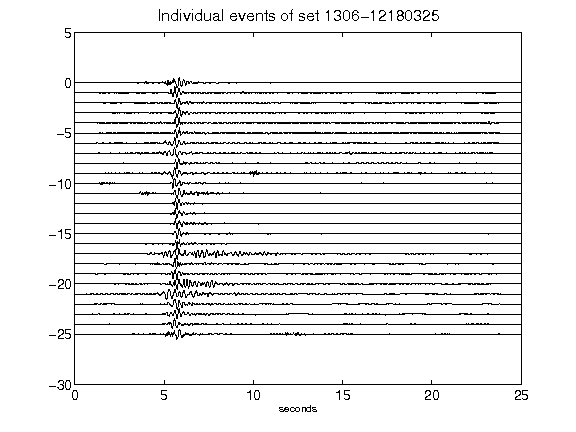](figures/1306-12180325_AllEv.png)[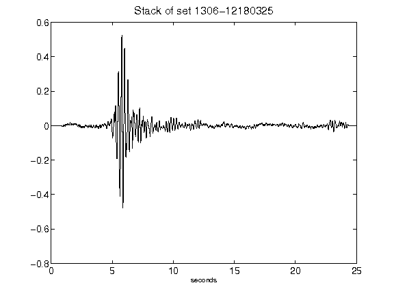](figures/1306-12180325_Stack.png)[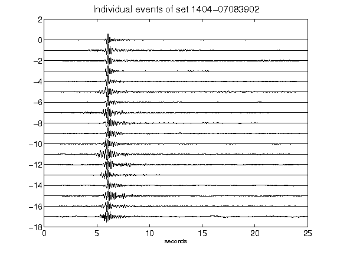](figures/1404-07083902_AllEv.png)[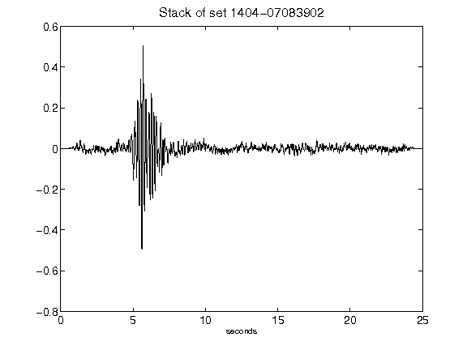](figures/1404-07083902_Stack.png)[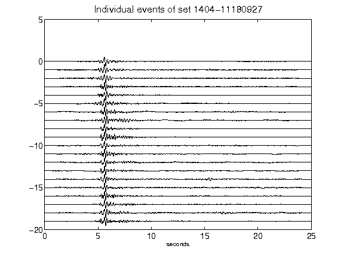](figures/1404-11180927_AllEv.png)[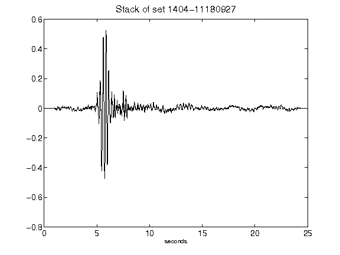](figures/1404-11180927_Stack.png)[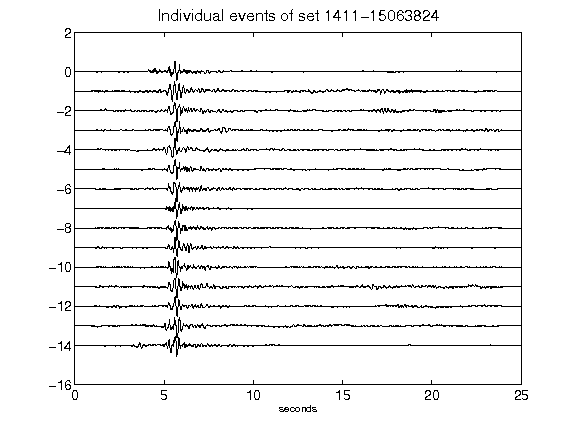](figures/1411-15063824_AllEv.png)[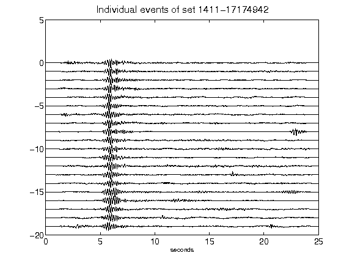](figures/1411-17174942_AllEv.png)[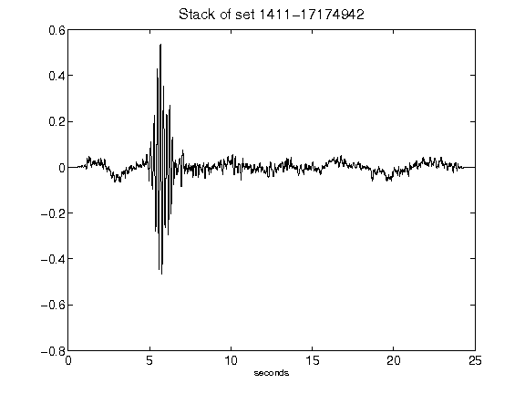](figures/1411-17174942_Stack.png)[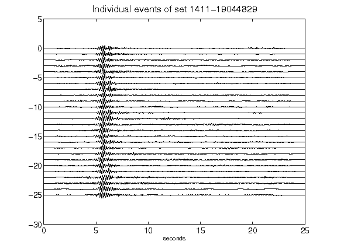](figures/1411-19044829_AllEv.png)[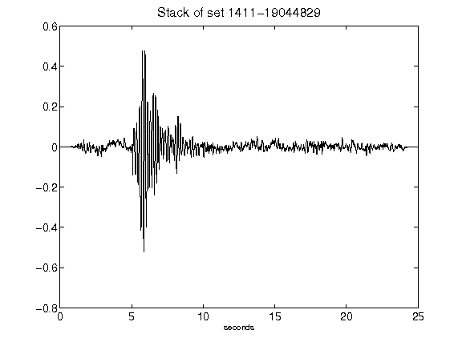](figures/1411-19044829_Stack.png)[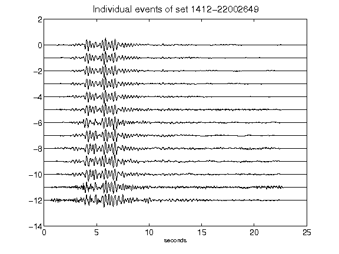](figures/1412-22002649_AllEv.png)[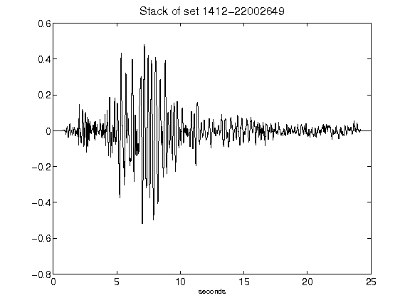](figures/1412-22002649_Stack.png)