# Repeating Earthquake Activity at RCM

## Waveforms
[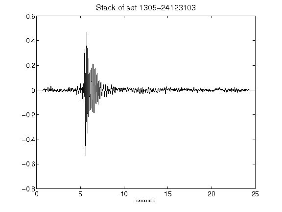](figures/1305-24123103_Stack.png)[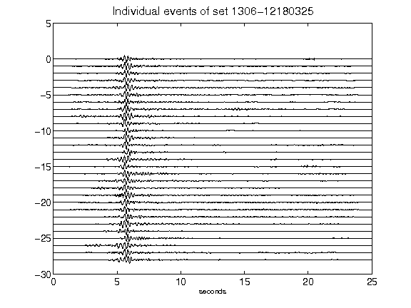](figures/1306-12180325_AllEv.png)[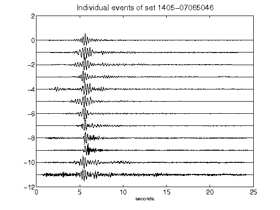](figures/1405-07065046_AllEv.png)[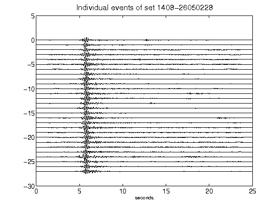](figures/1408-26050228_AllEv.png)[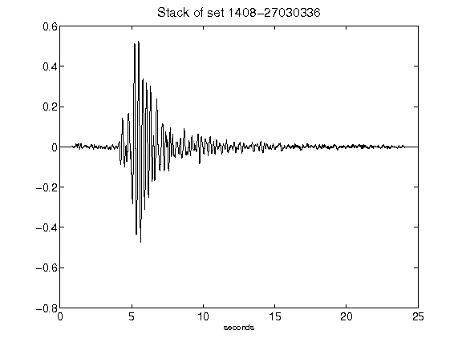](figures/1408-27030336_Stack.png)[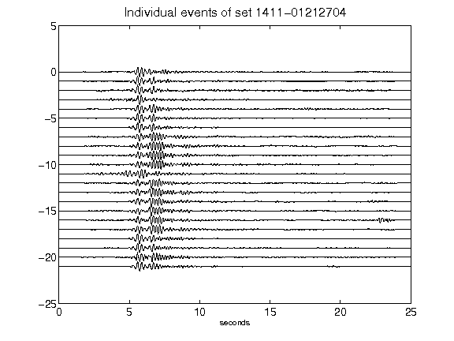](figures/1411-01212704_AllEv.png)[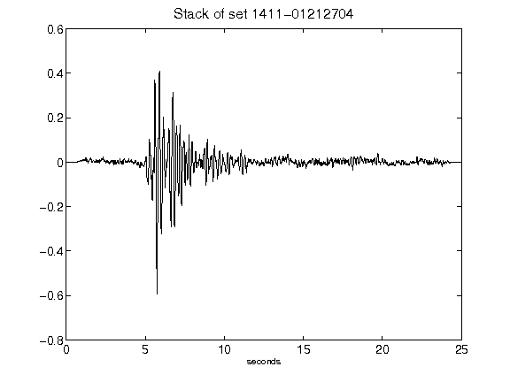](figures/1411-01212704_Stack.png)[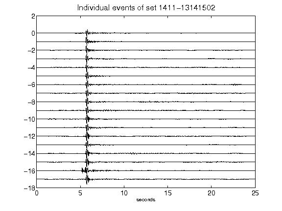](figures/1411-13141502_AllEv.png)[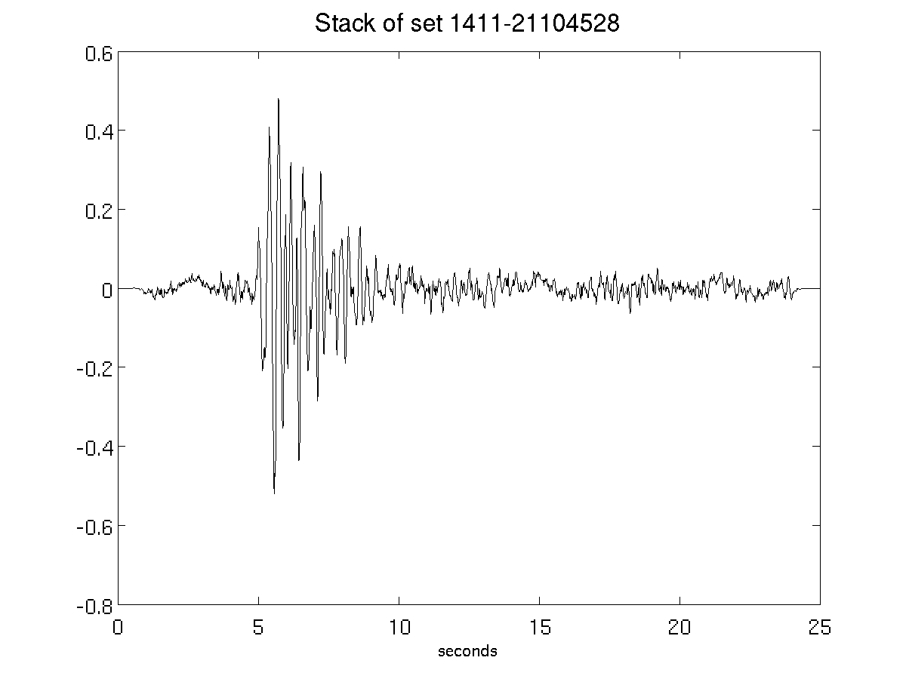](figures/1411-21104528_Stack.png)[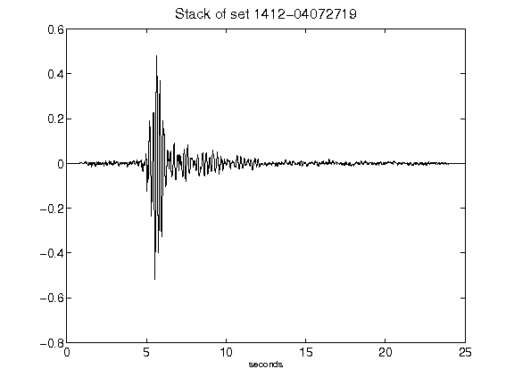](figures/1412-04072719_Stack.png)[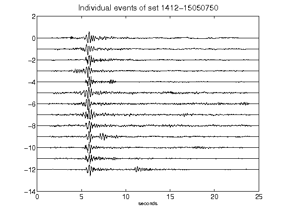](figures/1412-15050750_AllEv.png)[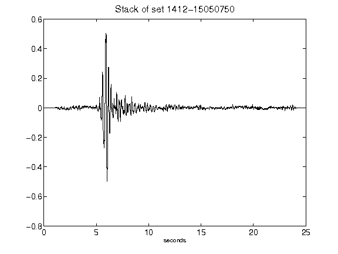](figures/1412-15050750_Stack.png)[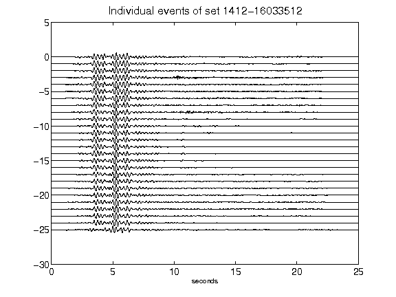](figures/1412-16033512_AllEv.png)[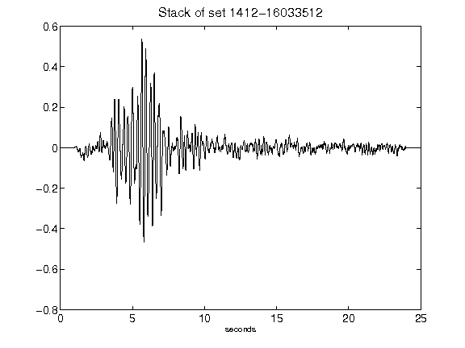](figures/1412-16033512_Stack.png)[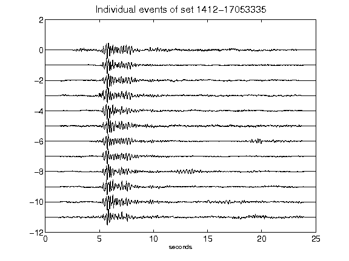](figures/1412-17053335_AllEv.png)[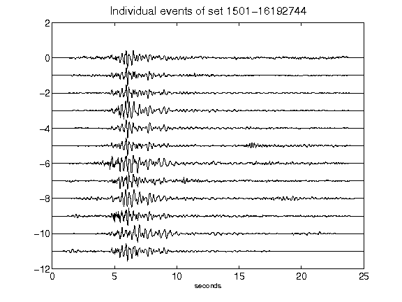](figures/1501-16192744_AllEv.png)[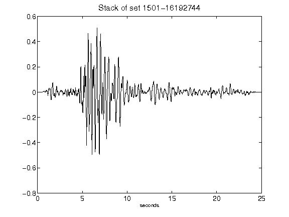](figures/1501-16192744_Stack.png)[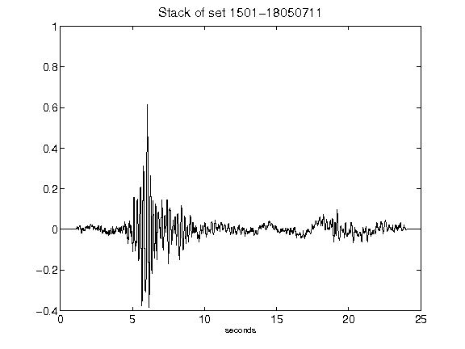](figures/1501-18050711_Stack.png)[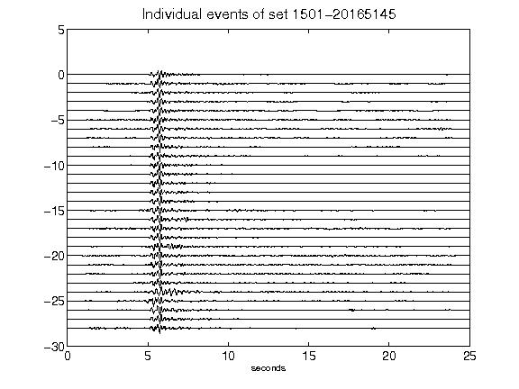](figures/1501-20165145_AllEv.png)[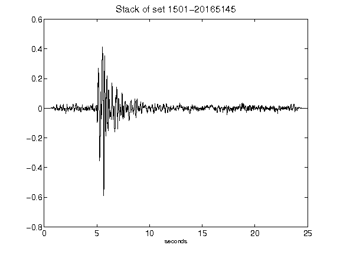](figures/1501-20165145_Stack.png)[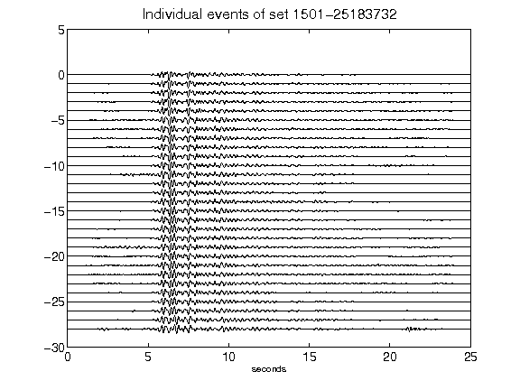](figures/1501-25183732_AllEv.png)[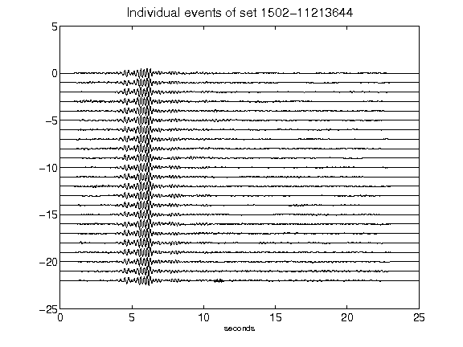](figures/1502-11213644_AllEv.png)[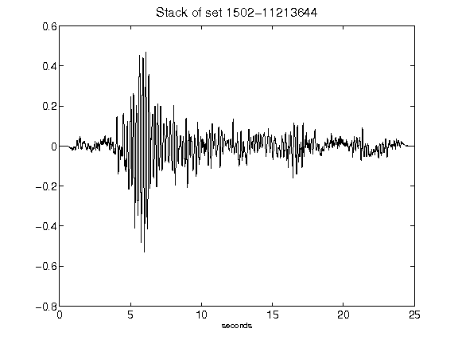](figures/1502-11213644_Stack.png)[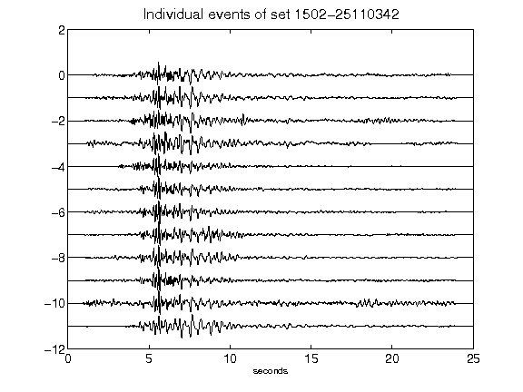](figures/1502-25110342_AllEv.png)[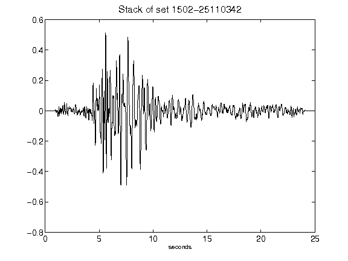](figures/1502-25110342_Stack.png)[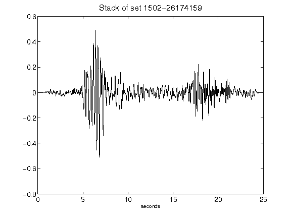](figures/1502-26174159_Stack.png)[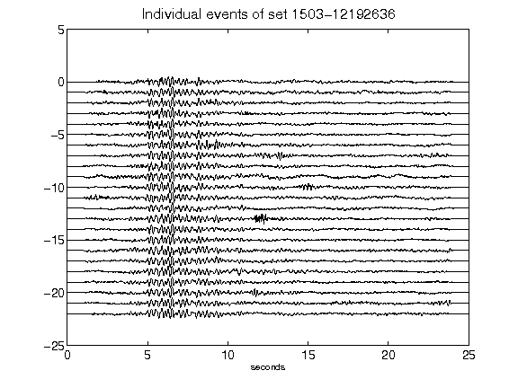](figures/1503-12192636_AllEv.png)