# Repeating Earthquake Activity at RCM

## Waveforms
[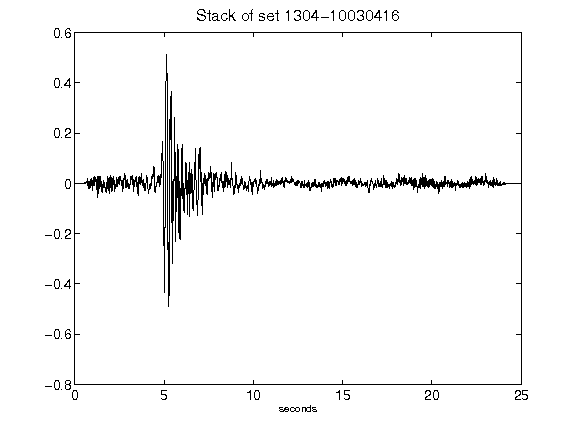](figures/1304-10030416_Stack.png)[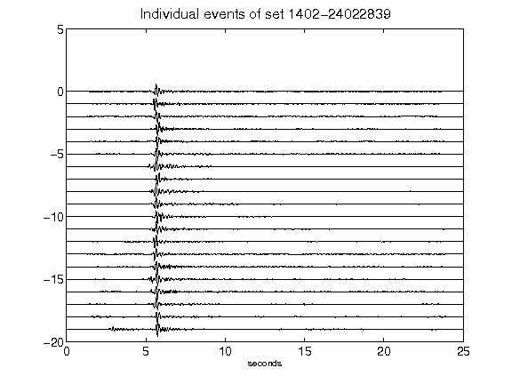](figures/1402-24022839_AllEv.png)[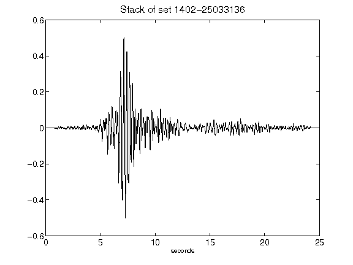](figures/1402-25033136_Stack.png)[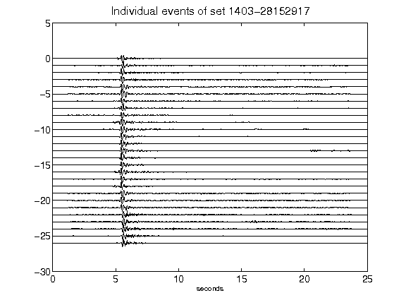](figures/1403-28152917_AllEv.png)[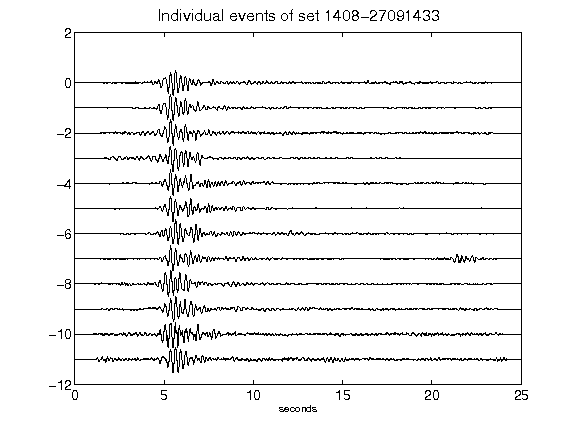](figures/1408-27091433_AllEv.png)[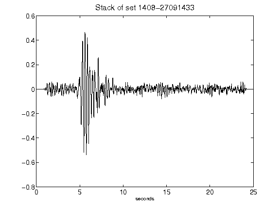](figures/1408-27091433_Stack.png)[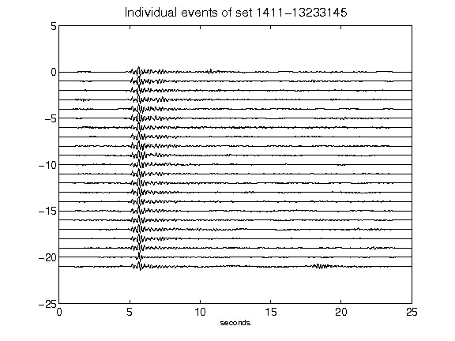](figures/1411-13233145_AllEv.png)[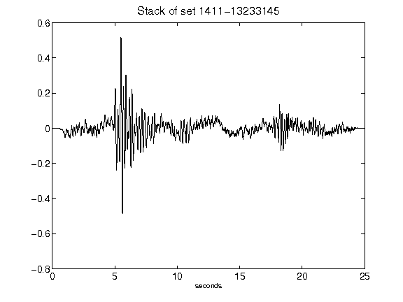](figures/1411-13233145_Stack.png)[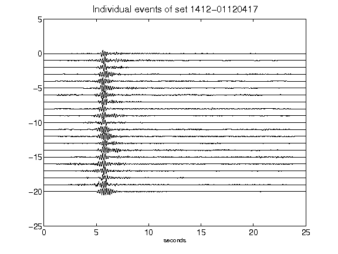](figures/1412-01120417_AllEv.png)[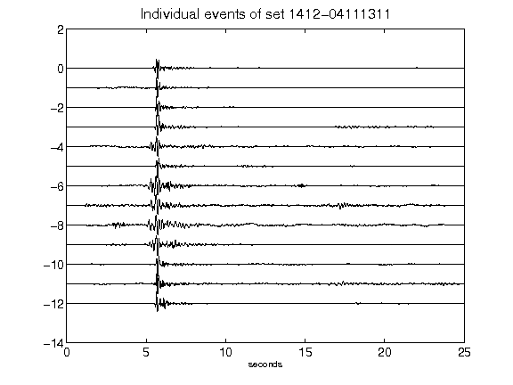](figures/1412-04111311_AllEv.png)[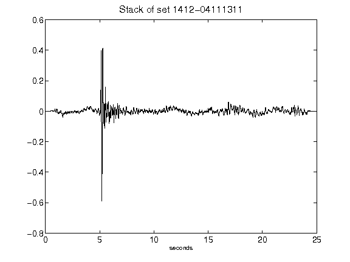](figures/1412-04111311_Stack.png)[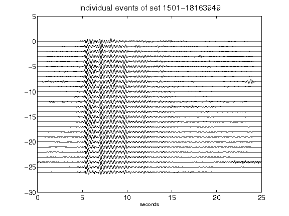](figures/1501-18163949_AllEv.png)[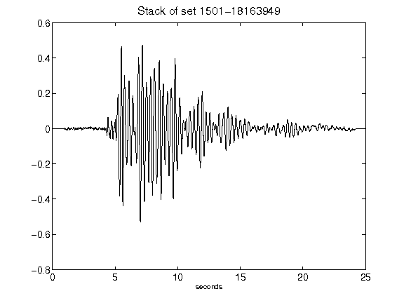](figures/1501-18163949_Stack.png)