# Repeating Earthquake Activity at RCM

## Waveforms
[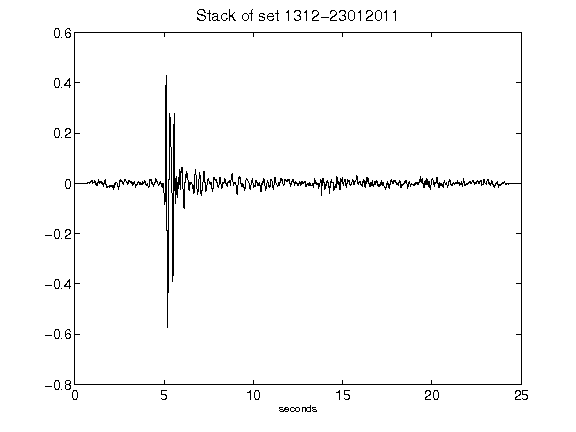](figures/1312-23012011_Stack.png)[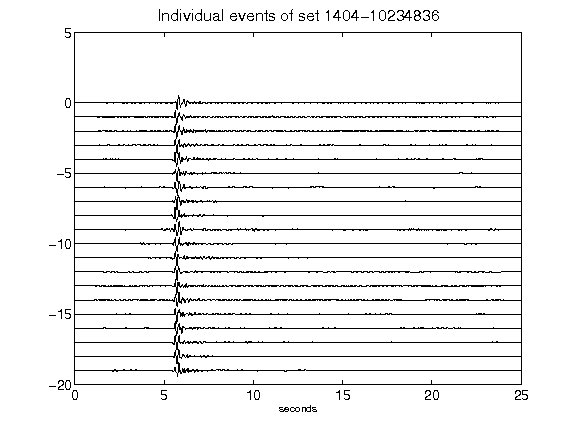](figures/1404-10234836_AllEv.png)[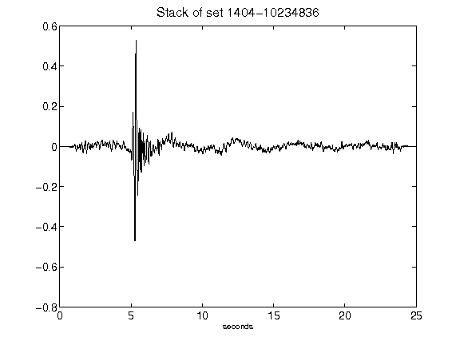](figures/1404-10234836_Stack.png)[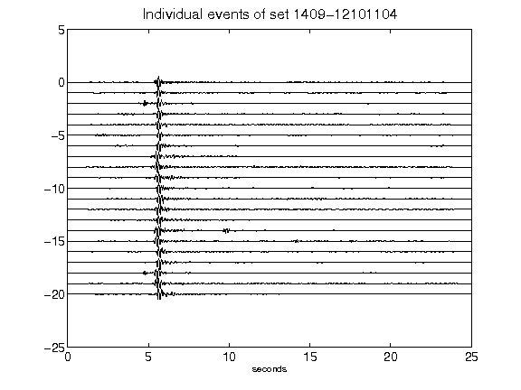](figures/1409-12101104_AllEv.png)[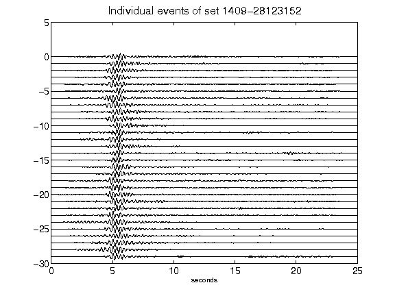](figures/1409-28123152_AllEv.png)[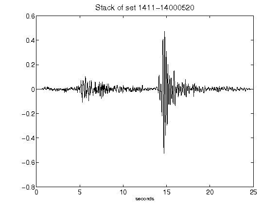](figures/1411-14000520_Stack.png)[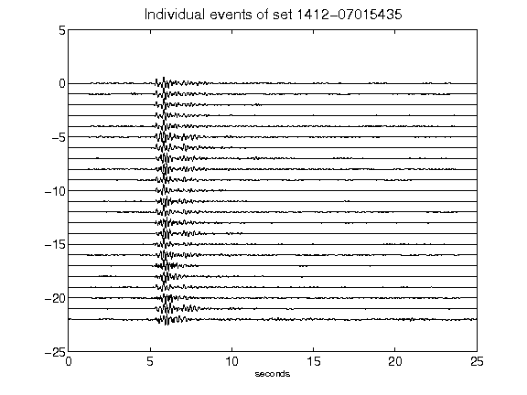](figures/1412-07015435_AllEv.png)[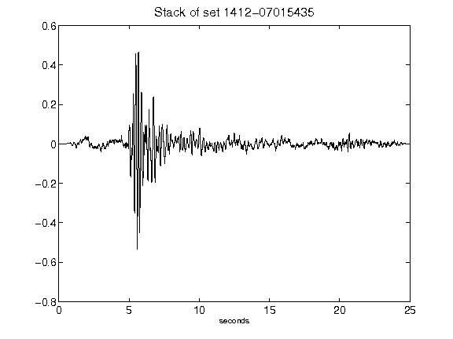](figures/1412-07015435_Stack.png)[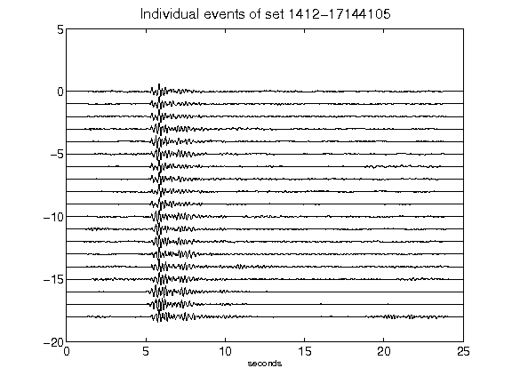](figures/1412-17144105_AllEv.png)[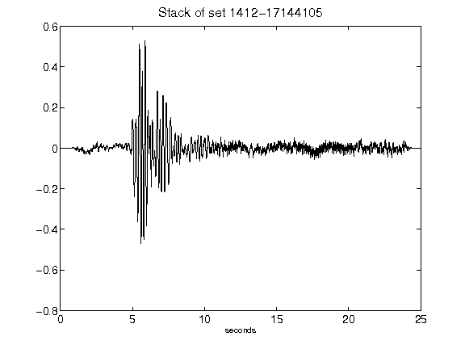](figures/1412-17144105_Stack.png)[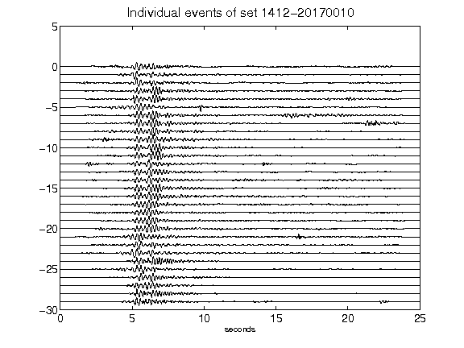](figures/1412-20170010_AllEv.png)[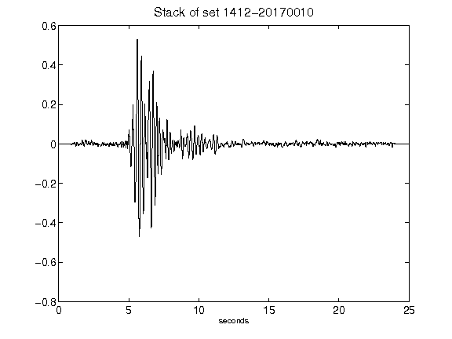](figures/1412-20170010_Stack.png)[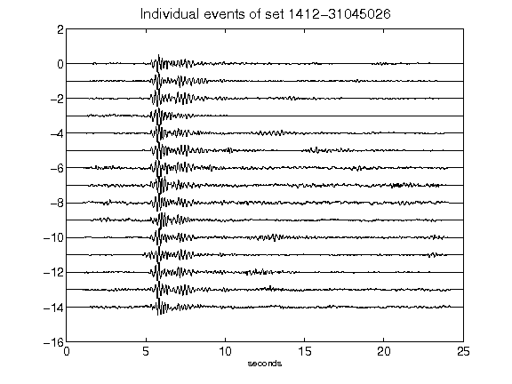](figures/1412-31045026_AllEv.png)[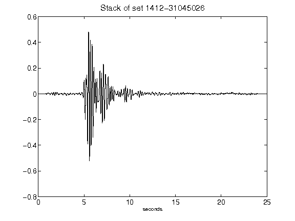](figures/1412-31045026_Stack.png)[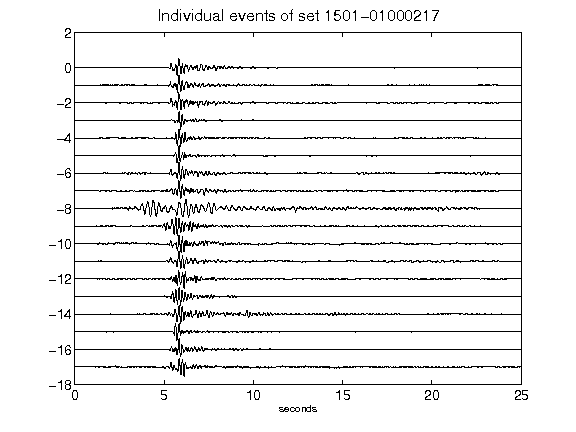](figures/1501-01000217_AllEv.png)[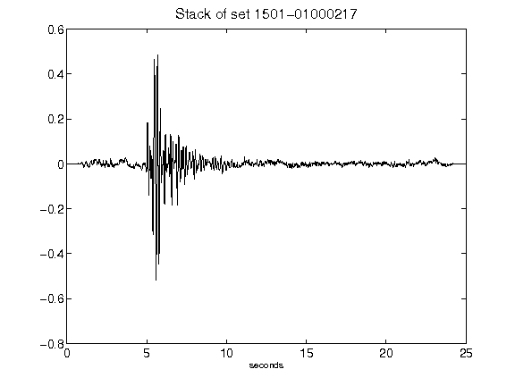](figures/1501-01000217_Stack.png)[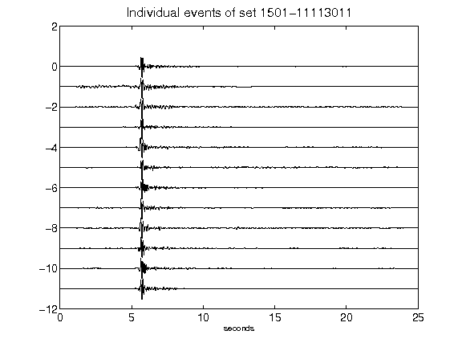](figures/1501-11113011_AllEv.png)[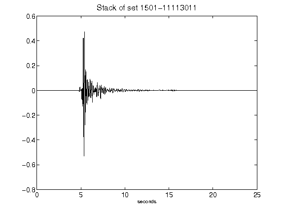](figures/1501-11113011_Stack.png)[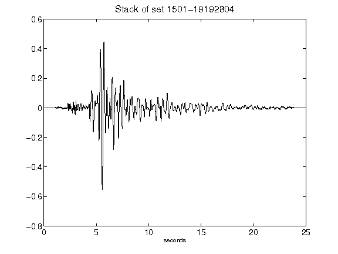](figures/1501-19192804_Stack.png)[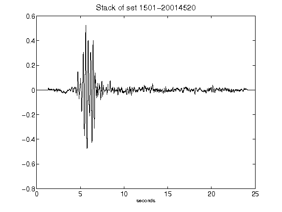](figures/1501-20014520_Stack.png)[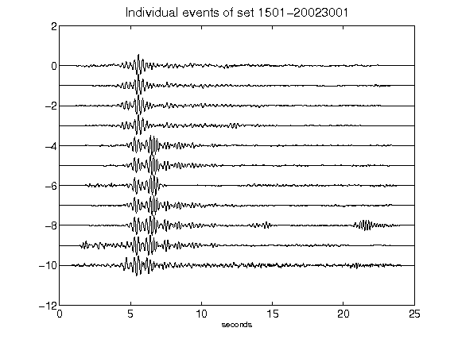](figures/1501-20023001_AllEv.png)[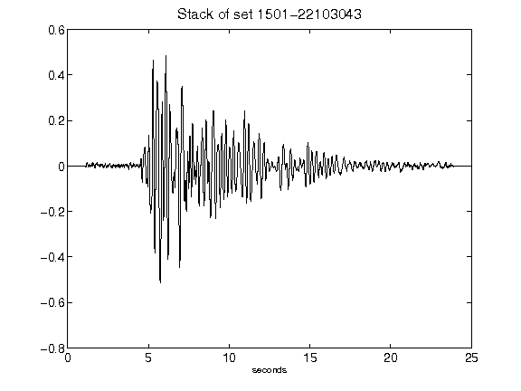](figures/1501-22103043_Stack.png)[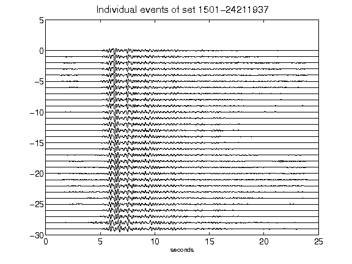](figures/1501-24211937_AllEv.png)[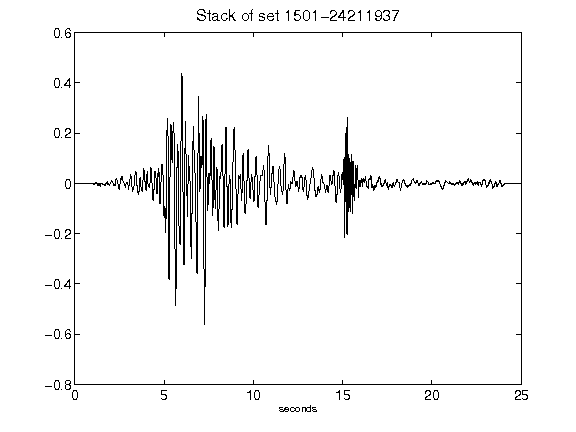](figures/1501-24211937_Stack.png)[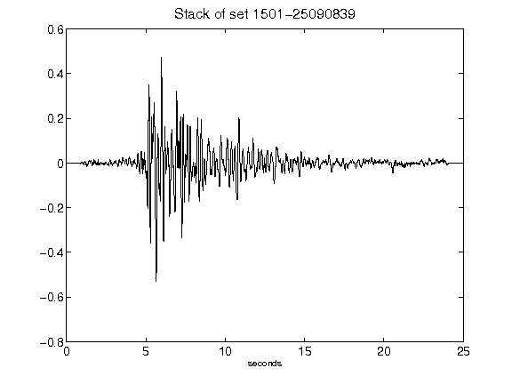](figures/1501-25090839_Stack.png)[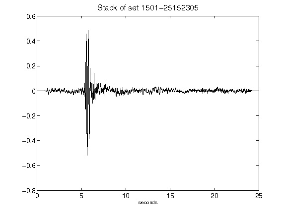](figures/1501-25152305_Stack.png)