# Repeating Earthquake Activity at RCM

## Waveforms
[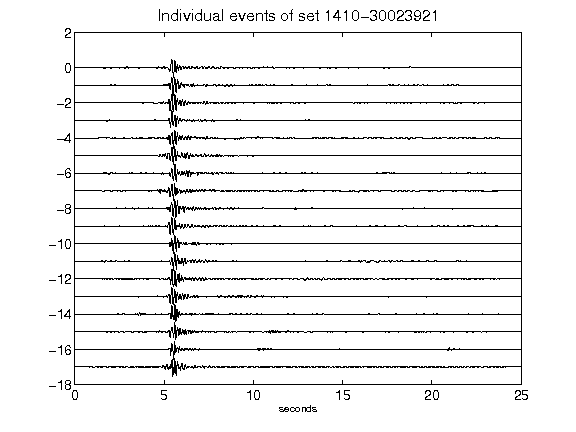](figures/1410-30023921_AllEv.png)[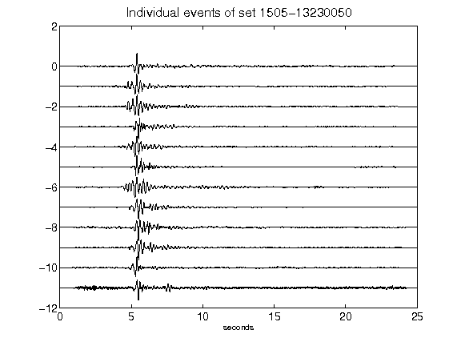](figures/1505-13230050_AllEv.png)[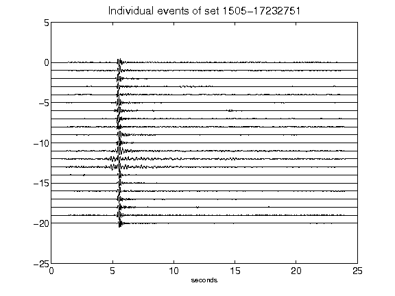](figures/1505-17232751_AllEv.png)[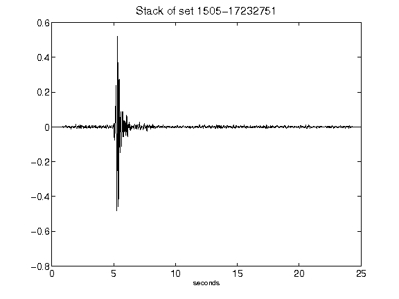](figures/1505-17232751_Stack.png)[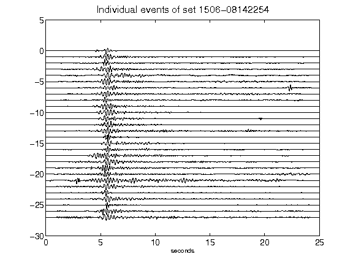](figures/1506-08142254_AllEv.png)[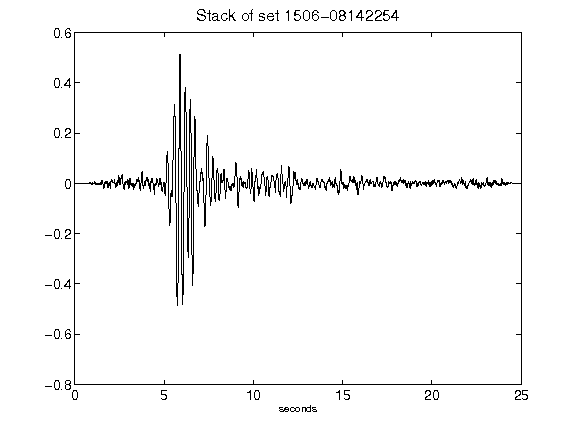](figures/1506-08142254_Stack.png)[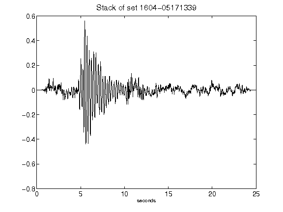](figures/1604-05171339_Stack.png)[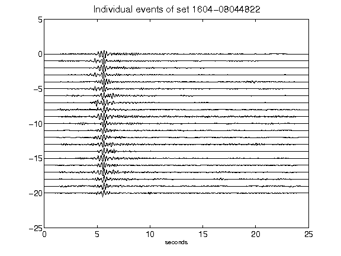](figures/1604-08044822_AllEv.png)[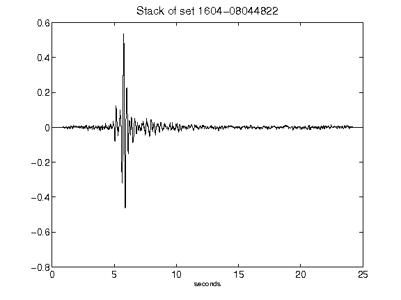](figures/1604-08044822_Stack.png)[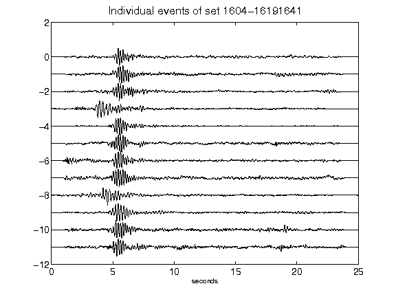](figures/1604-16191641_AllEv.png)[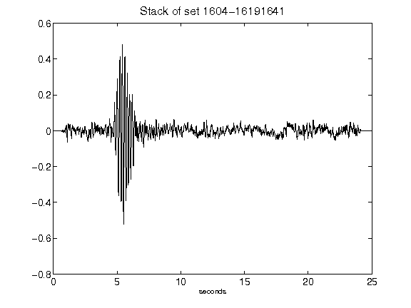](figures/1604-16191641_Stack.png)