# Repeating Earthquake Activity at RCM

## Waveforms
[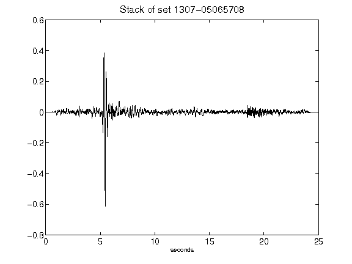](figures/1307-05065708_Stack.png)[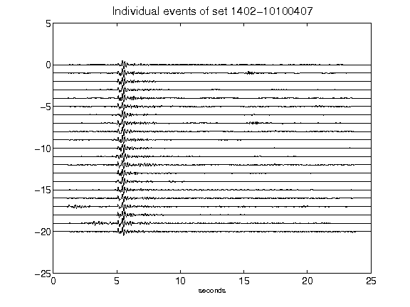](figures/1402-10100407_AllEv.png)[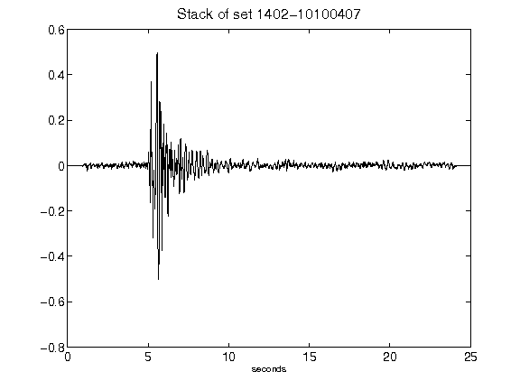](figures/1402-10100407_Stack.png)[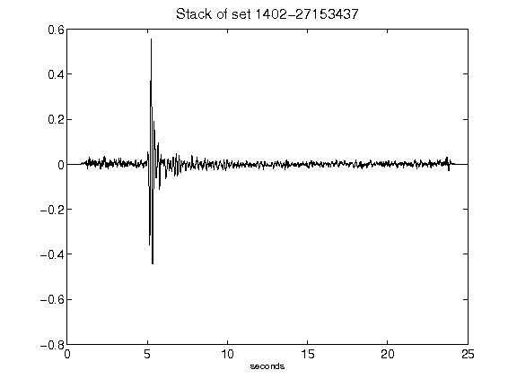](figures/1402-27153437_Stack.png)[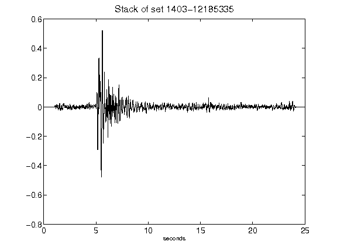](figures/1403-12185335_Stack.png)[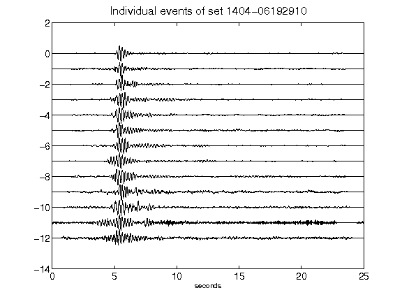](figures/1404-06192910_AllEv.png)[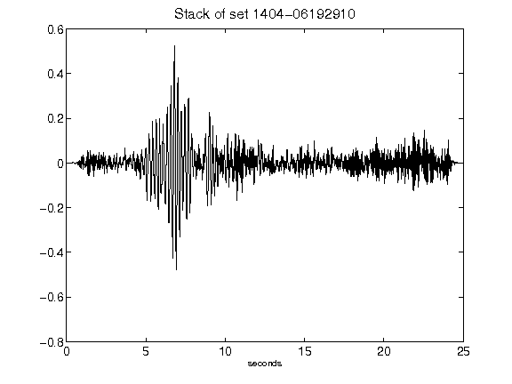](figures/1404-06192910_Stack.png)[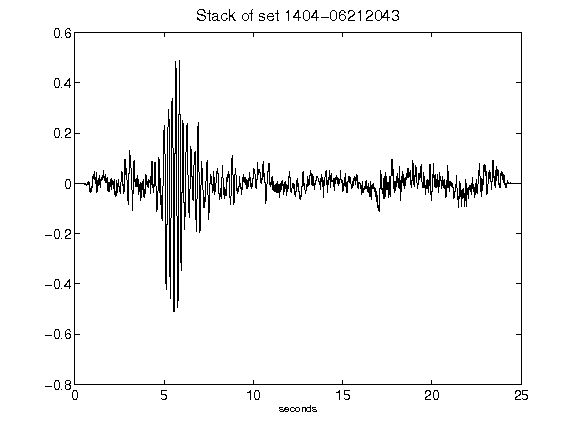](figures/1404-06212043_Stack.png)[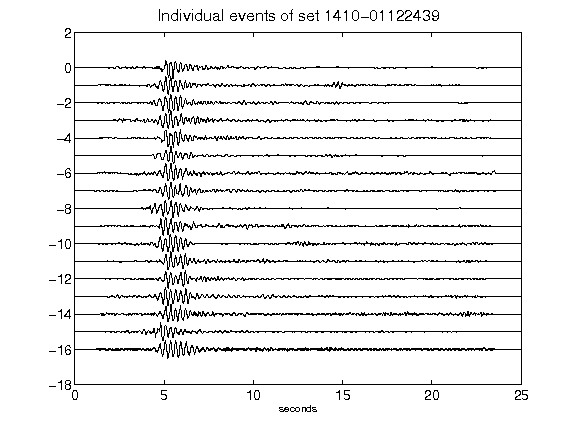](figures/1410-01122439_AllEv.png)[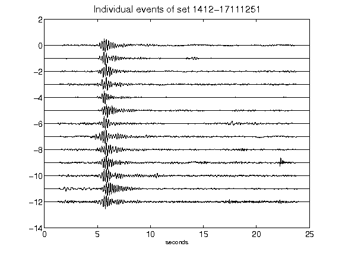](figures/1412-17111251_AllEv.png)[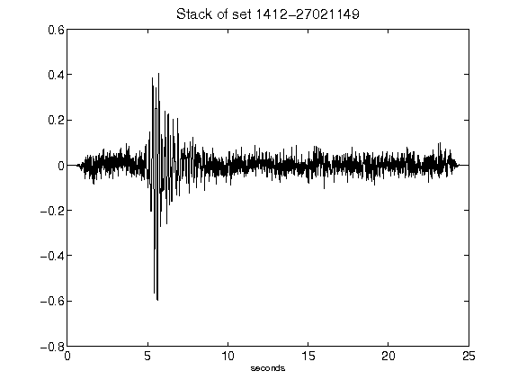](figures/1412-27021149_Stack.png)[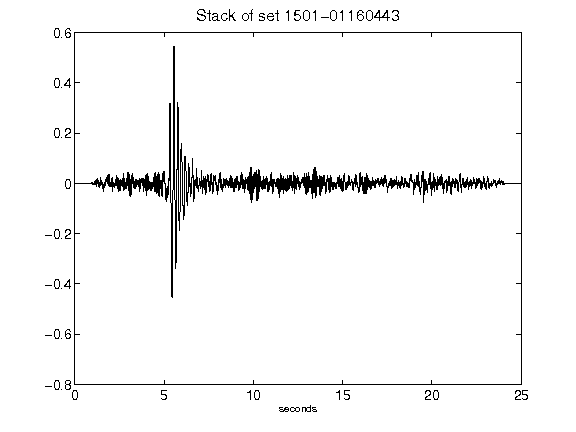](figures/1501-01160443_Stack.png)[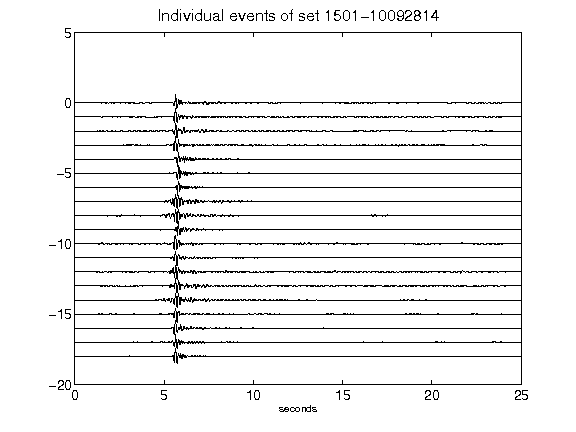](figures/1501-10092814_AllEv.png)[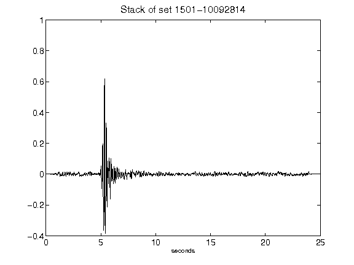](figures/1501-10092814_Stack.png)[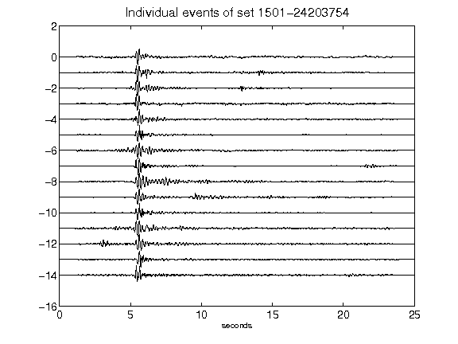](figures/1501-24203754_AllEv.png)[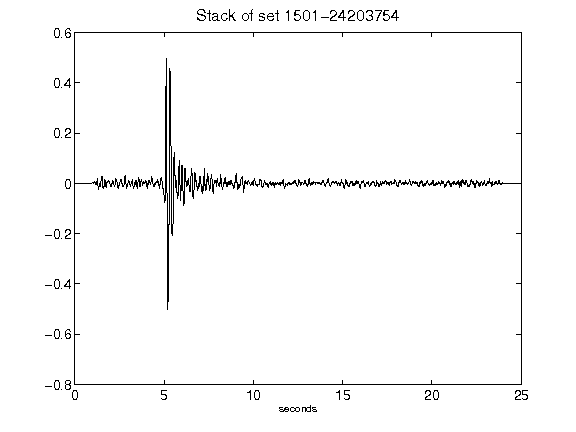](figures/1501-24203754_Stack.png)[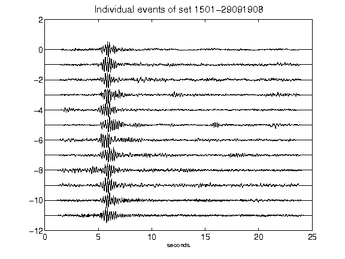](figures/1501-29091908_AllEv.png)[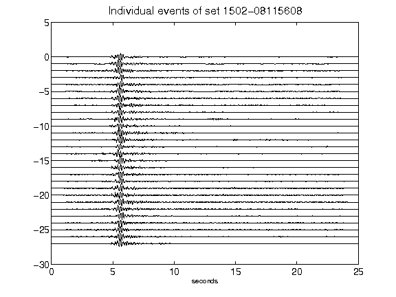](figures/1502-08115608_AllEv.png)[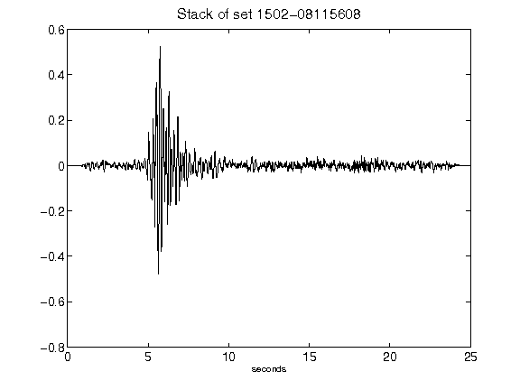](figures/1502-08115608_Stack.png)[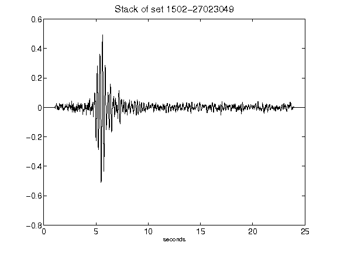](figures/1502-27023049_Stack.png)[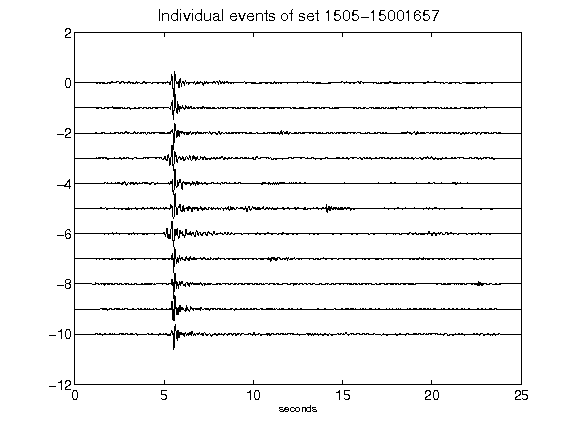](figures/1505-15001657_AllEv.png)[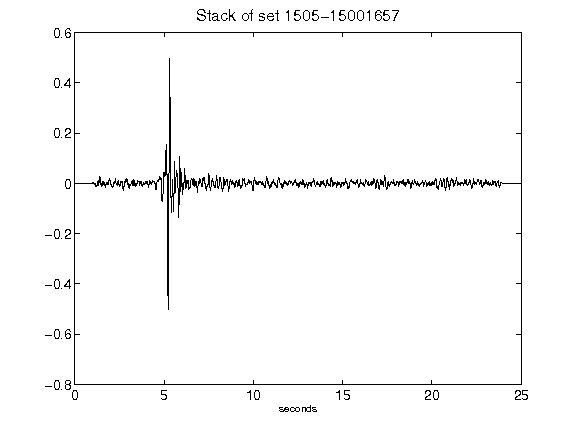](figures/1505-15001657_Stack.png)[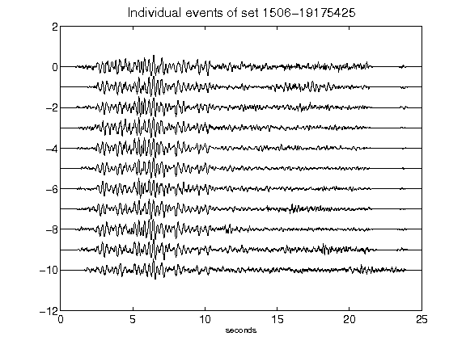](figures/1506-19175425_AllEv.png)