# Repeating Earthquake Activity at RCM

## Waveforms
[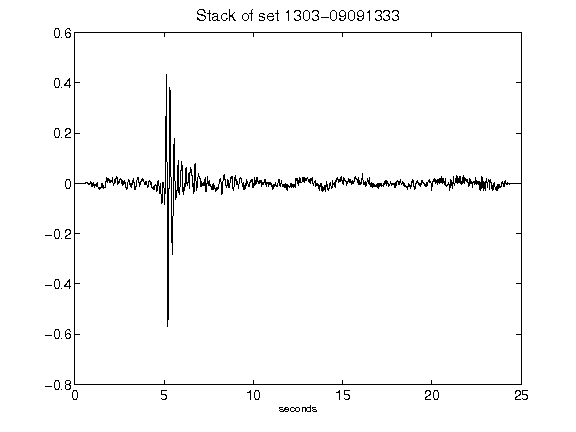](figures/1303-09091333_Stack.png)[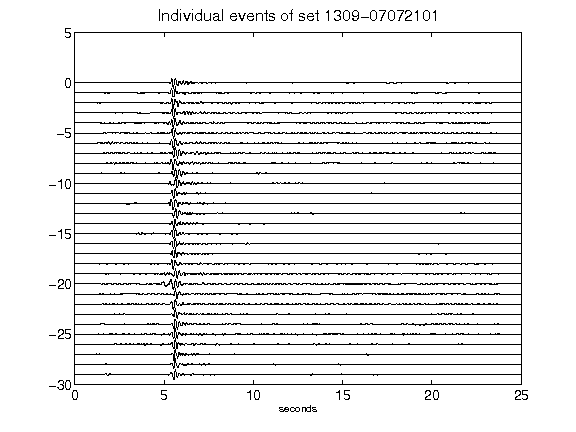](figures/1309-07072101_AllEv.png)[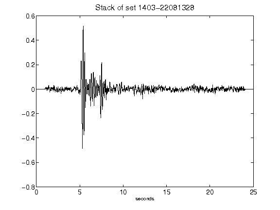](figures/1403-22081328_Stack.png)[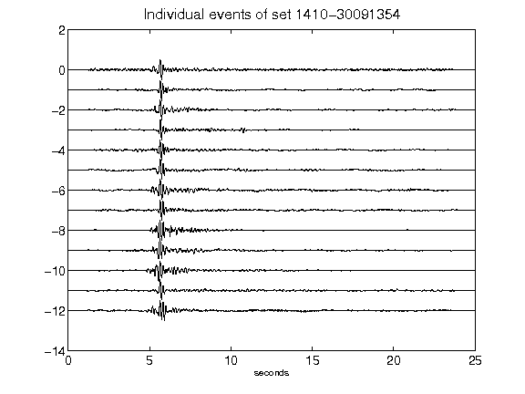](figures/1410-30091354_AllEv.png)[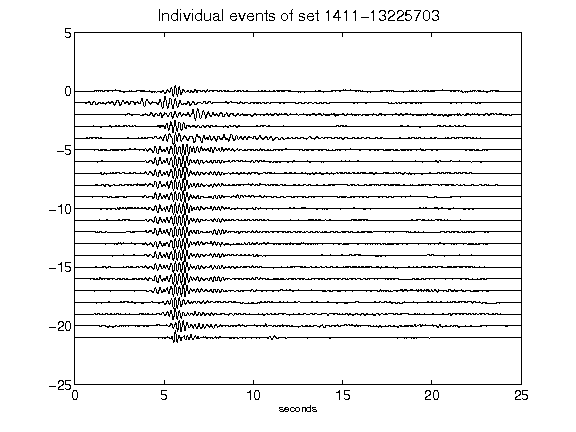](figures/1411-13225703_AllEv.png)[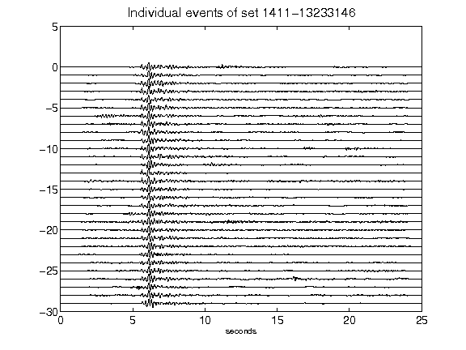](figures/1411-13233146_AllEv.png)[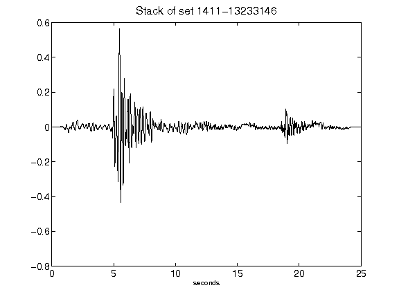](figures/1411-13233146_Stack.png)[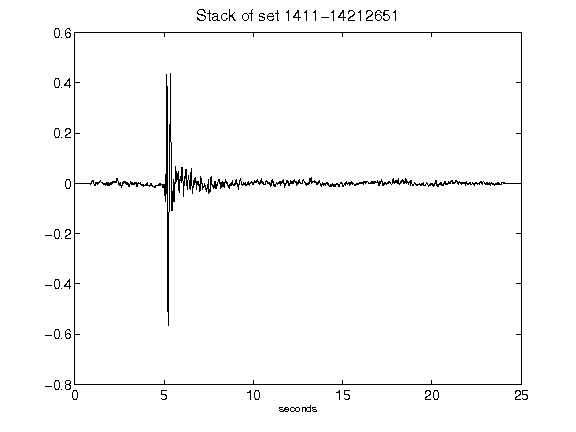](figures/1411-14212651_Stack.png)[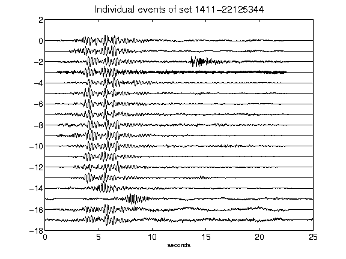](figures/1411-22125344_AllEv.png)[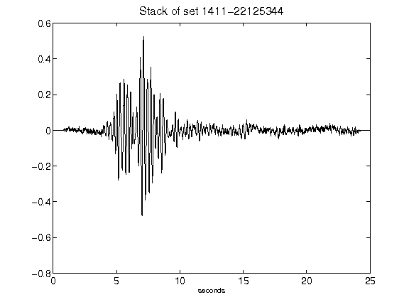](figures/1411-22125344_Stack.png)[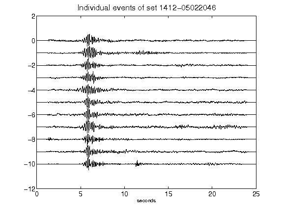](figures/1412-05022046_AllEv.png)[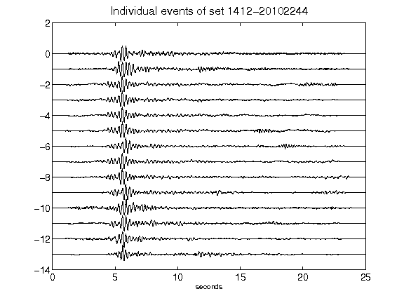](figures/1412-20102244_AllEv.png)[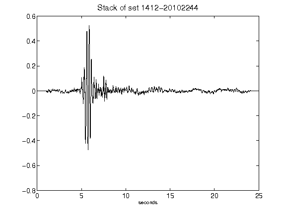](figures/1412-20102244_Stack.png)[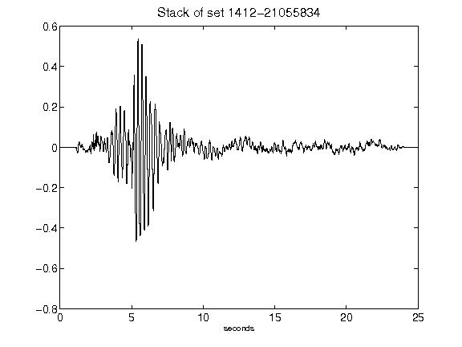](figures/1412-21055834_Stack.png)[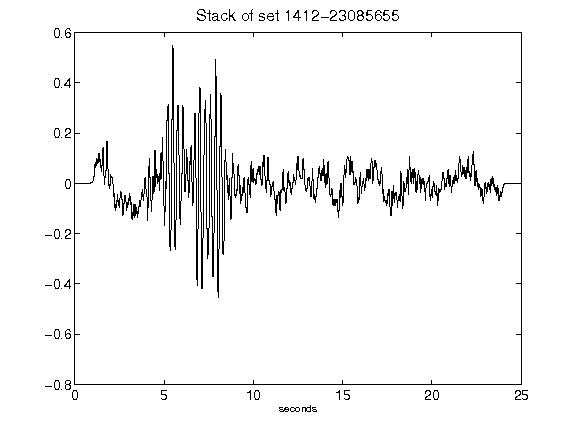](figures/1412-23085655_Stack.png)[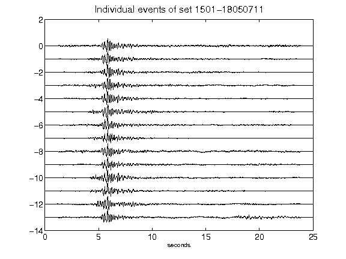](figures/1501-18050711_AllEv.png)[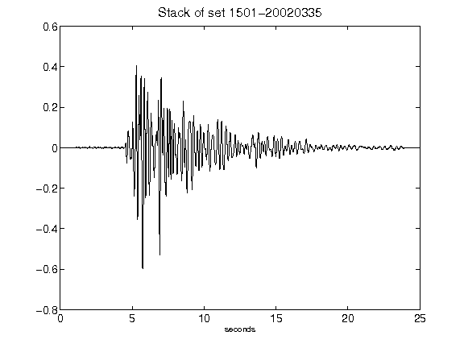](figures/1501-20020335_Stack.png)[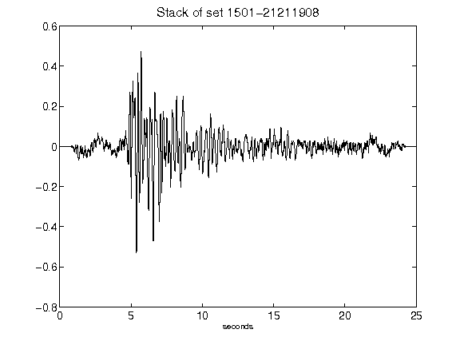](figures/1501-21211908_Stack.png)