# Repeating Earthquake Activity at RCM

## Waveforms
[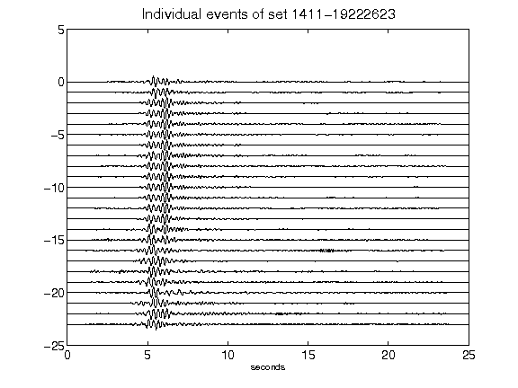](figures/1411-19222623_AllEv.png)[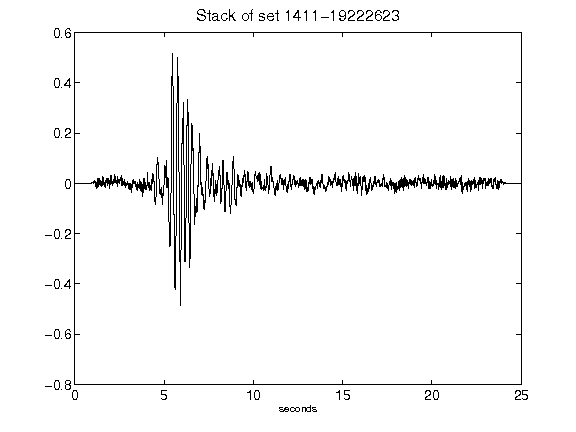](figures/1411-19222623_Stack.png)[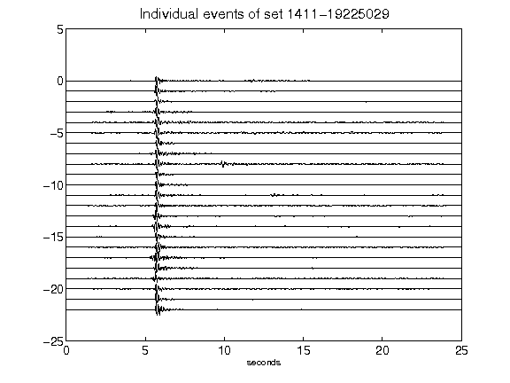](figures/1411-19225029_AllEv.png)[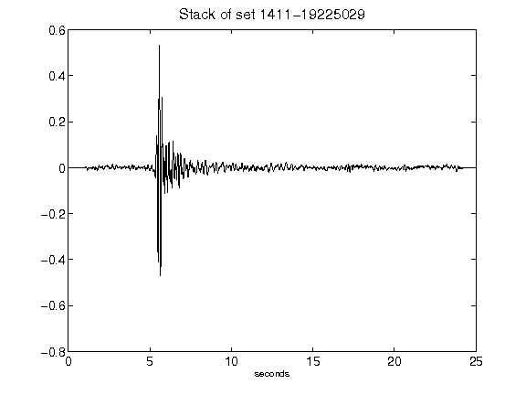](figures/1411-19225029_Stack.png)[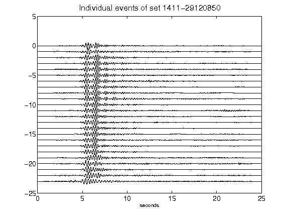](figures/1411-29120850_AllEv.png)[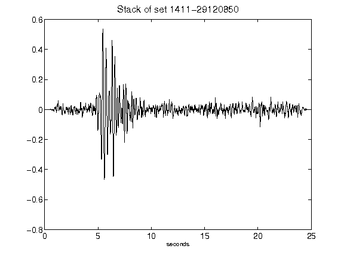](figures/1411-29120850_Stack.png)[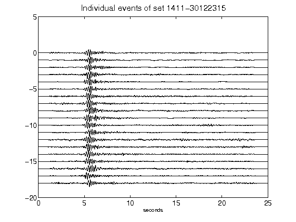](figures/1411-30122315_AllEv.png)[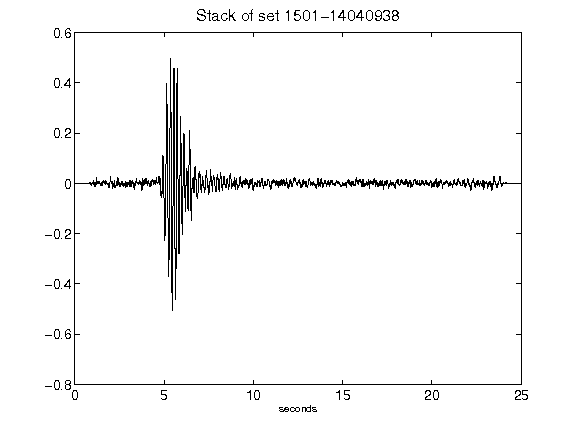](figures/1501-14040938_Stack.png)[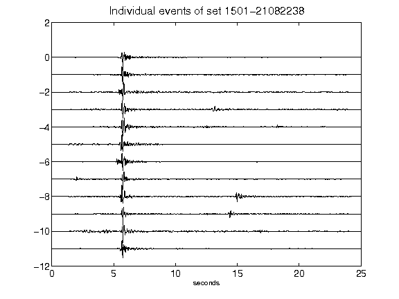](figures/1501-21082238_AllEv.png)[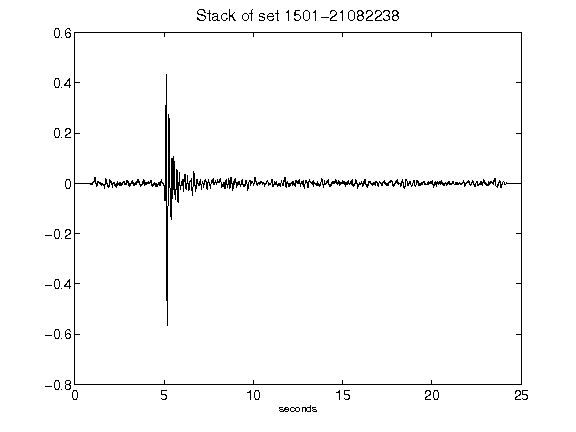](figures/1501-21082238_Stack.png)[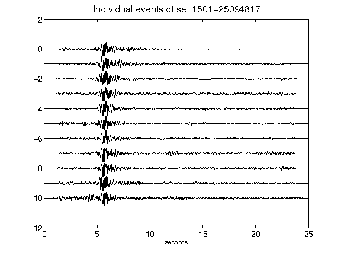](figures/1501-25094817_AllEv.png)[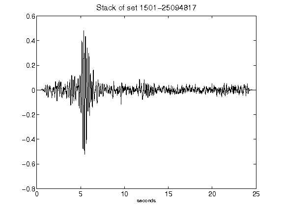](figures/1501-25094817_Stack.png)[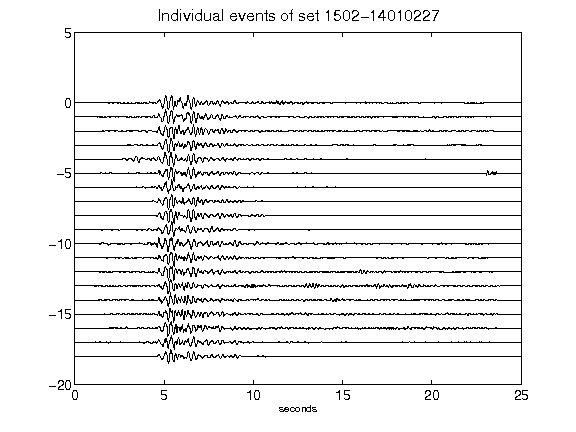](figures/1502-14010227_AllEv.png)[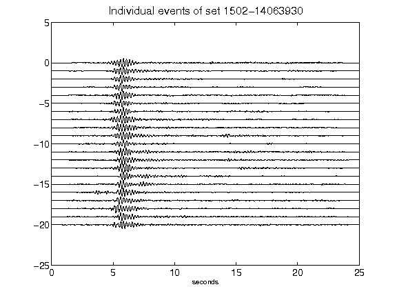](figures/1502-14063930_AllEv.png)[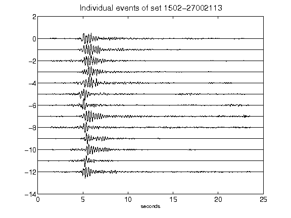](figures/1502-27002113_AllEv.png)[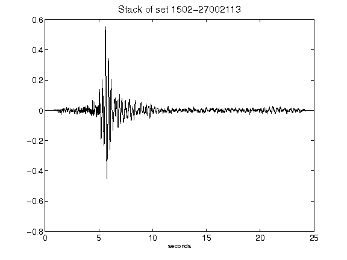](figures/1502-27002113_Stack.png)[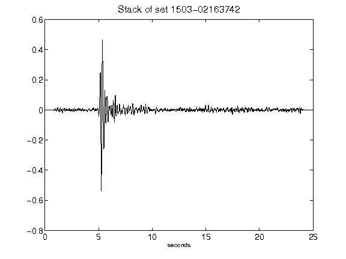](figures/1503-02163742_Stack.png)[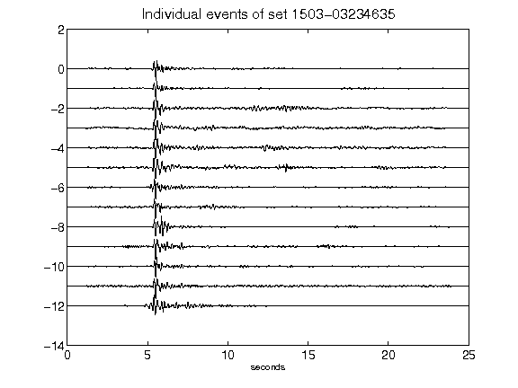](figures/1503-03234635_AllEv.png)[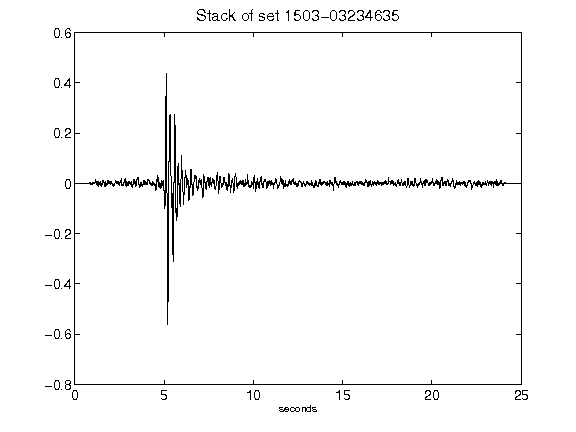](figures/1503-03234635_Stack.png)[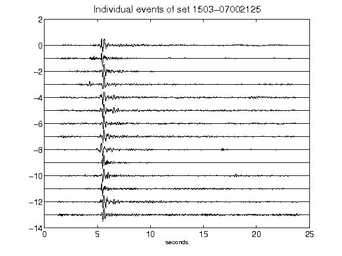](figures/1503-07002125_AllEv.png)[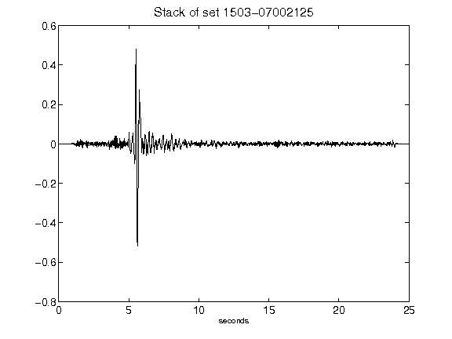](figures/1503-07002125_Stack.png)[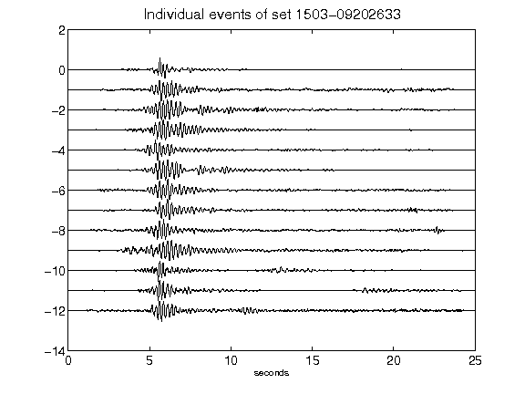](figures/1503-09202633_AllEv.png)[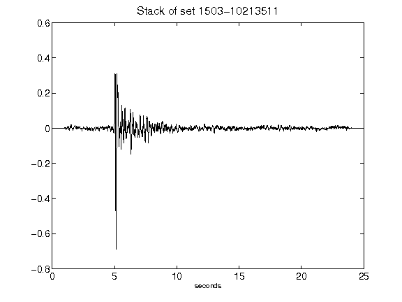](figures/1503-10213511_Stack.png)[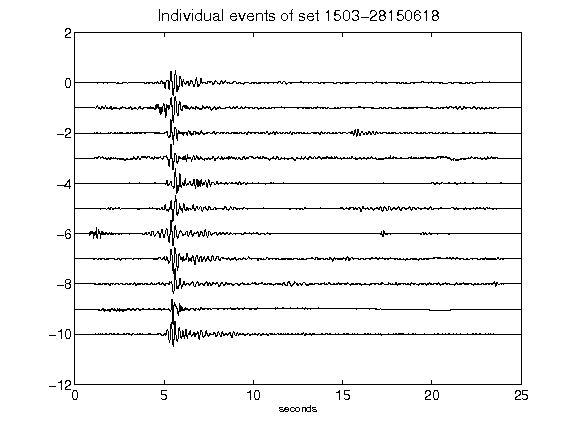](figures/1503-28150618_AllEv.png)[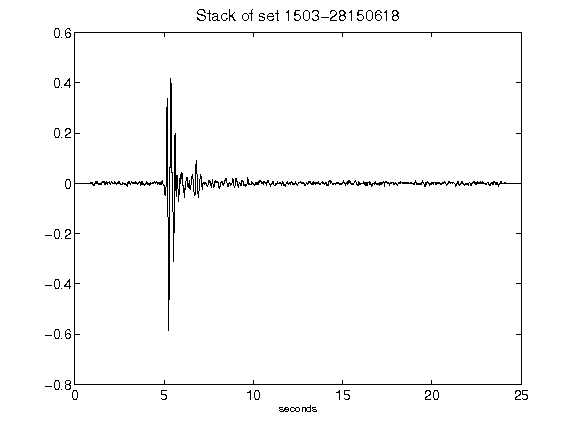](figures/1503-28150618_Stack.png)[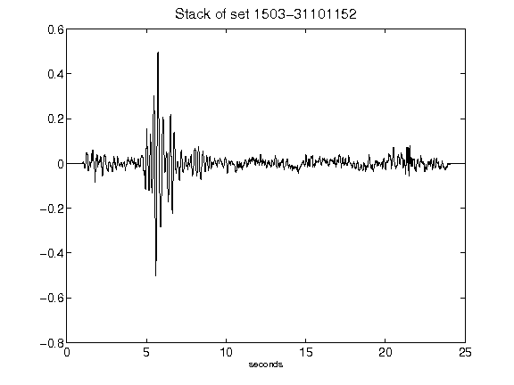](figures/1503-31101152_Stack.png)[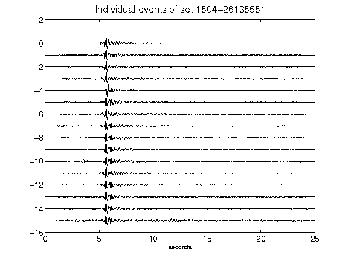](figures/1504-26135551_AllEv.png)[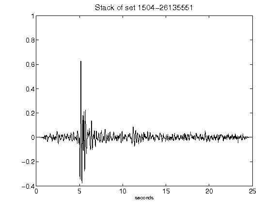](figures/1504-26135551_Stack.png)[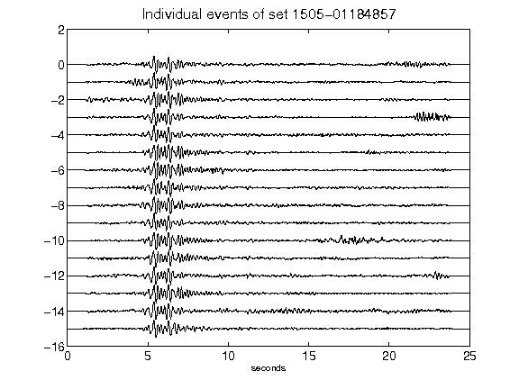](figures/1505-01184857_AllEv.png)[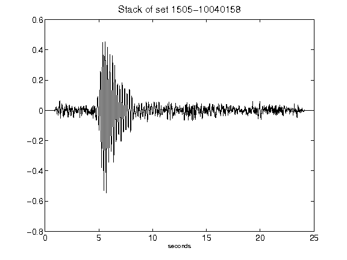](figures/1505-10040158_Stack.png)[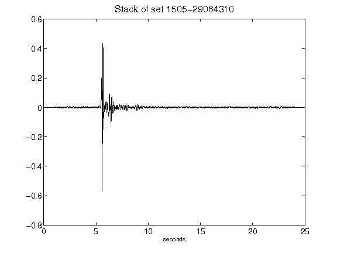](figures/1505-29064310_Stack.png)