# Repeating Earthquake Activity at RCM

## Waveforms
[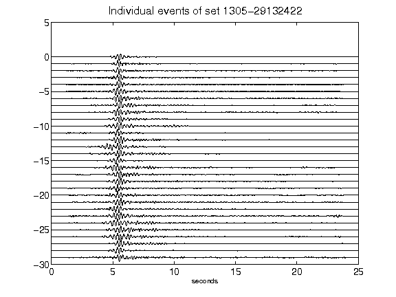](figures/1305-29132422_AllEv.png)[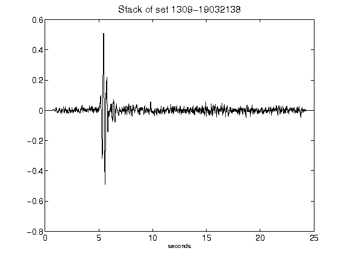](figures/1309-19032138_Stack.png)[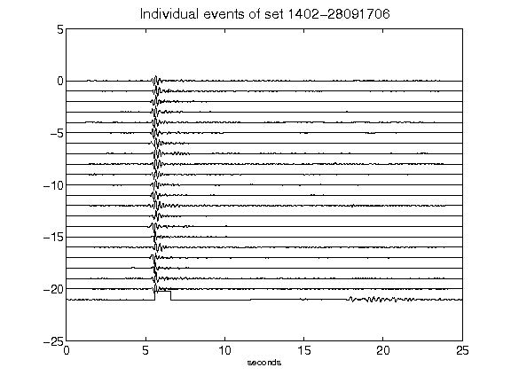](figures/1402-28091706_AllEv.png)[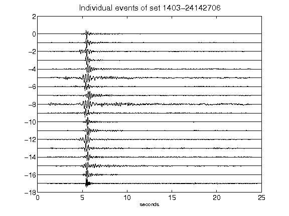](figures/1403-24142706_AllEv.png)[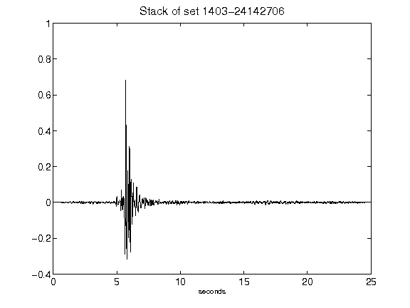](figures/1403-24142706_Stack.png)[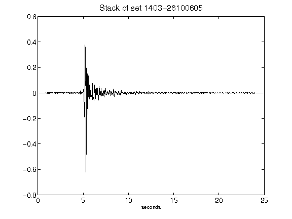](figures/1403-26100605_Stack.png)[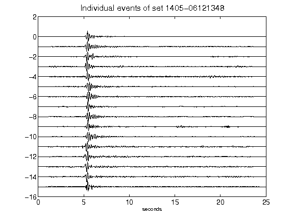](figures/1405-06121348_AllEv.png)[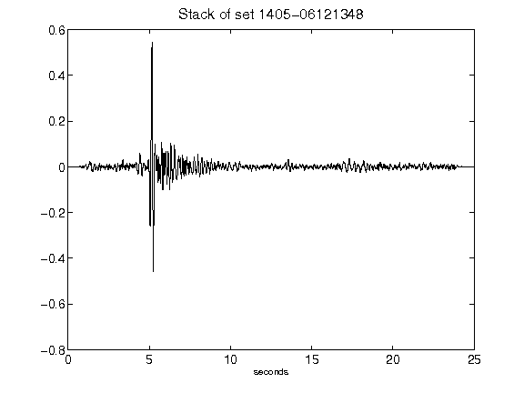](figures/1405-06121348_Stack.png)[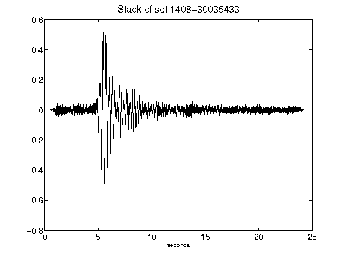](figures/1408-30035433_Stack.png)[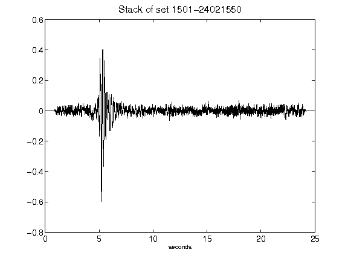](figures/1501-24021550_Stack.png)[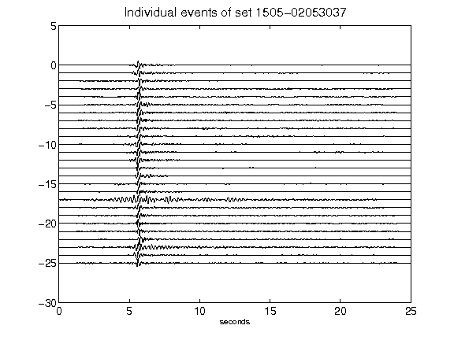](figures/1505-02053037_AllEv.png)[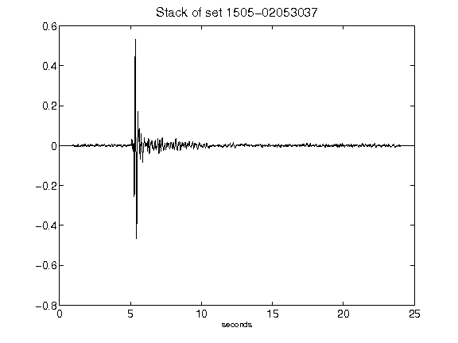](figures/1505-02053037_Stack.png)[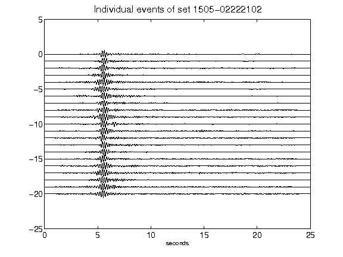](figures/1505-02222102_AllEv.png)[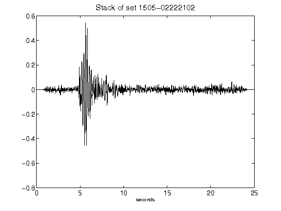](figures/1505-02222102_Stack.png)[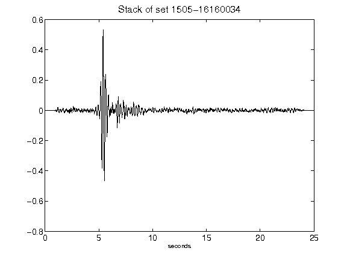](figures/1505-16160034_Stack.png)[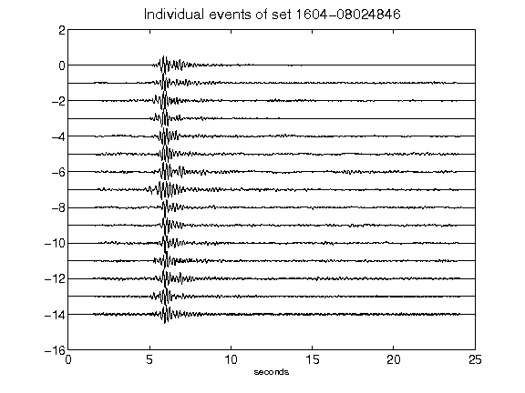](figures/1604-08024846_AllEv.png)[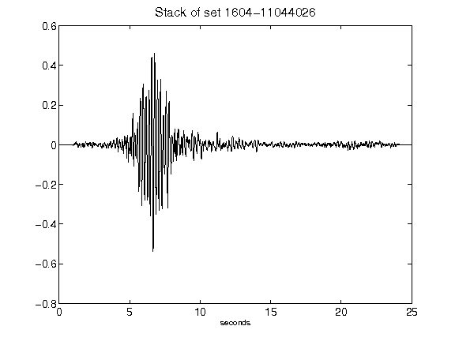](figures/1604-11044026_Stack.png)[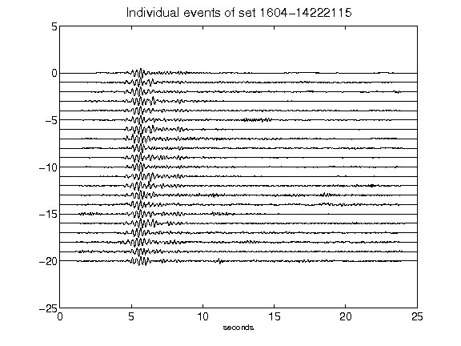](figures/1604-14222115_AllEv.png)[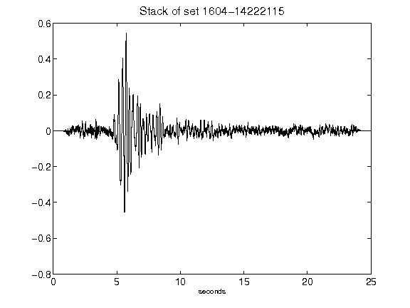](figures/1604-14222115_Stack.png)[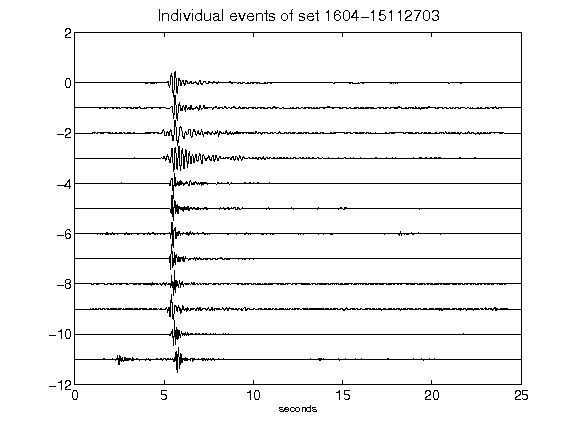](figures/1604-15112703_AllEv.png)[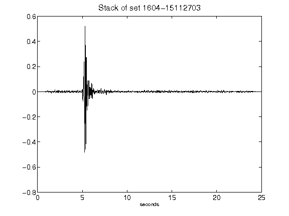](figures/1604-15112703_Stack.png)[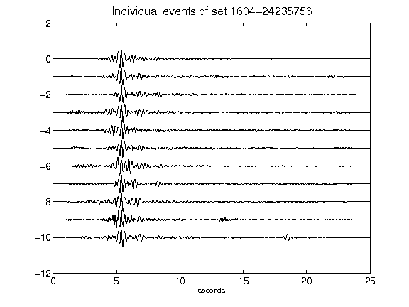](figures/1604-24235756_AllEv.png)[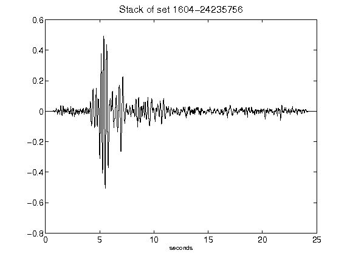](figures/1604-24235756_Stack.png)[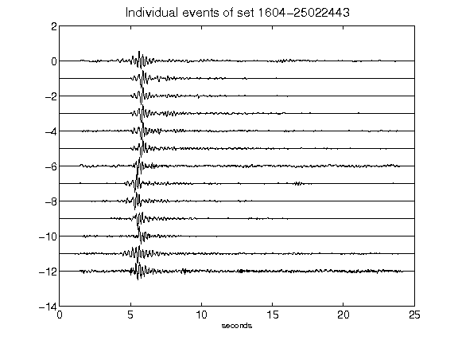](figures/1604-25022443_AllEv.png)[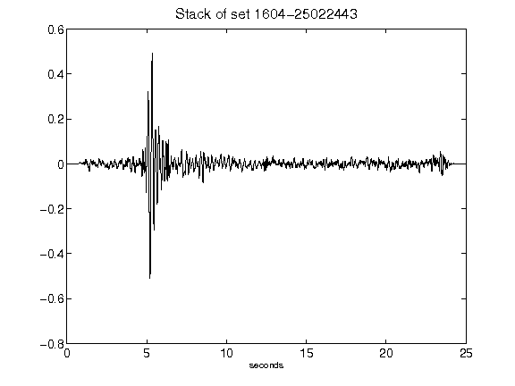](figures/1604-25022443_Stack.png)