# Repeating Earthquake Activity at RCM

## Waveforms
[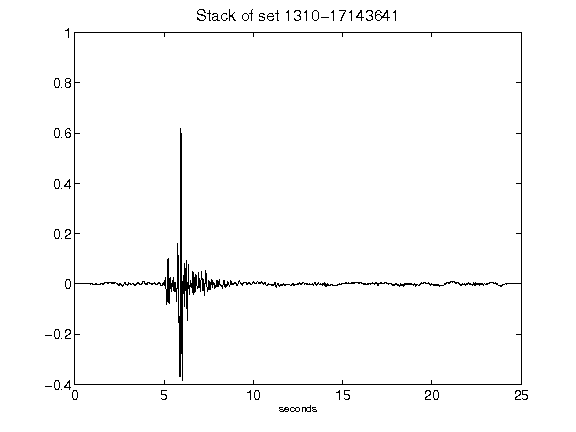](figures/1310-17143641_Stack.png)[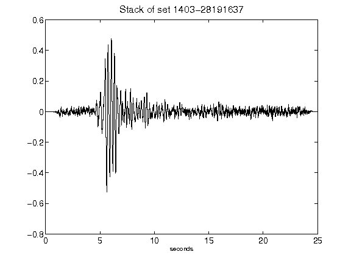](figures/1403-28191637_Stack.png)[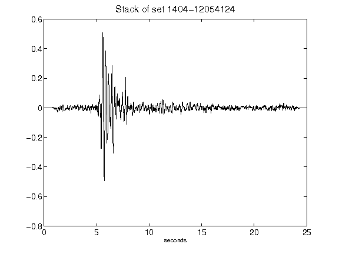](figures/1404-12054124_Stack.png)[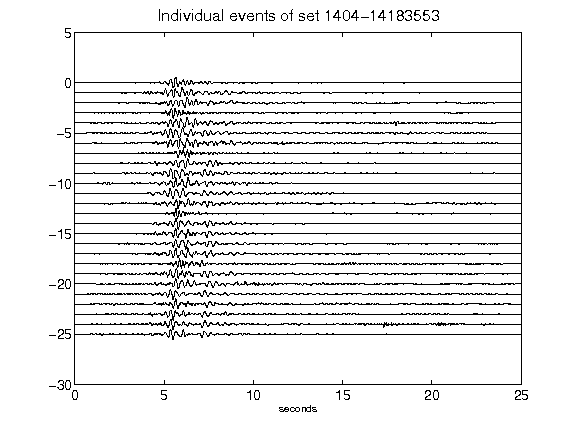](figures/1404-14183553_AllEv.png)[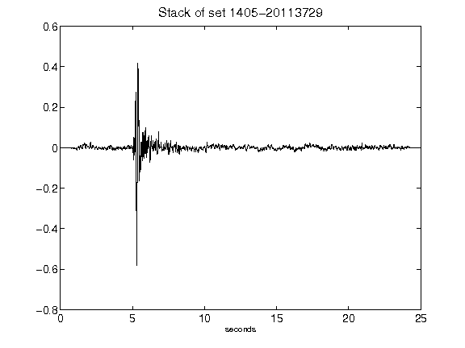](figures/1405-20113729_Stack.png)[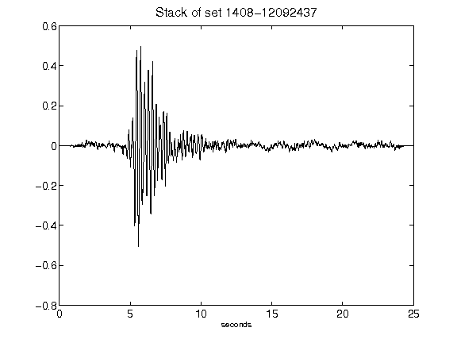](figures/1408-12092437_Stack.png)[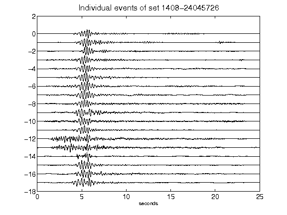](figures/1408-24045726_AllEv.png)[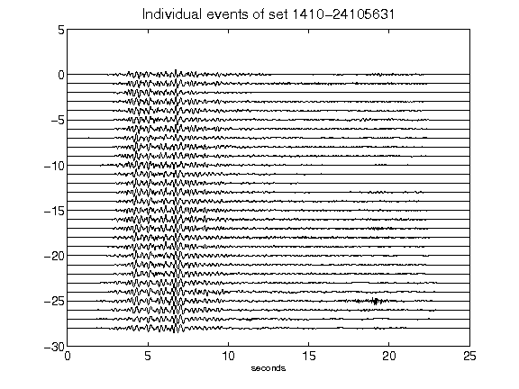](figures/1410-24105631_AllEv.png)[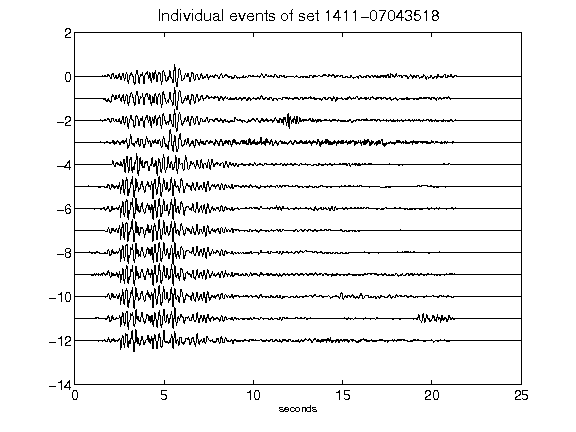](figures/1411-07043518_AllEv.png)[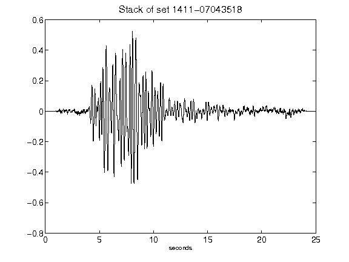](figures/1411-07043518_Stack.png)[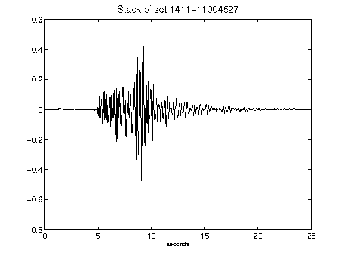](figures/1411-11004527_Stack.png)[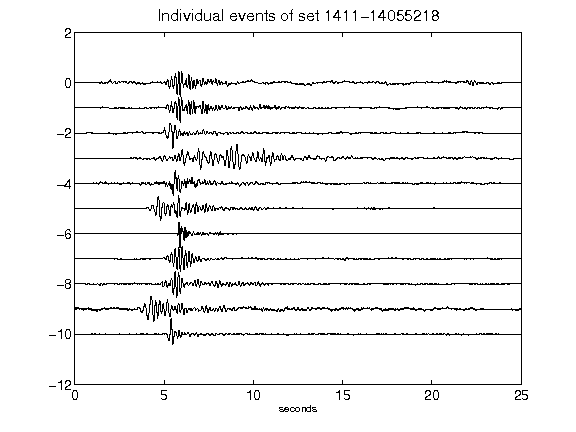](figures/1411-14055218_AllEv.png)[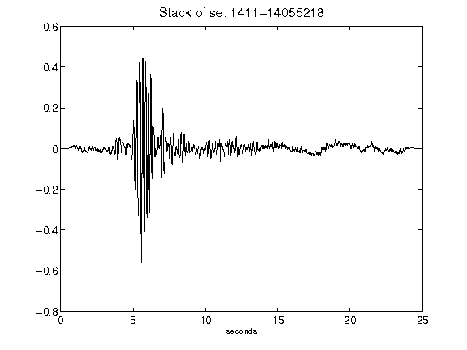](figures/1411-14055218_Stack.png)[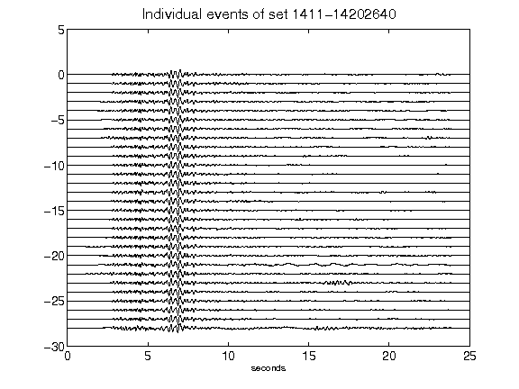](figures/1411-14202640_AllEv.png)[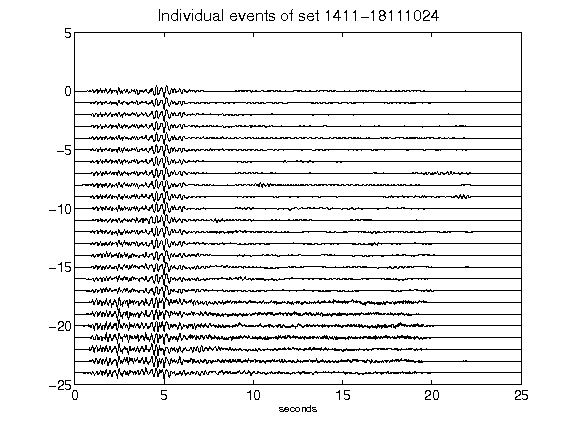](figures/1411-18111024_AllEv.png)[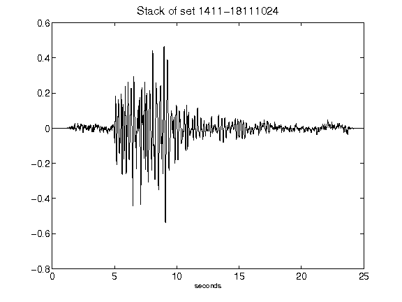](figures/1411-18111024_Stack.png)[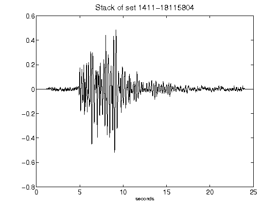](figures/1411-18115804_Stack.png)