# Repeating Earthquake Activity at RCM

## Waveforms
[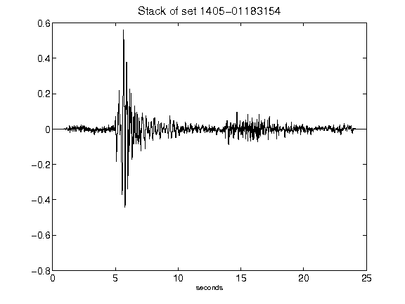](figures/1405-01183154_Stack.png)[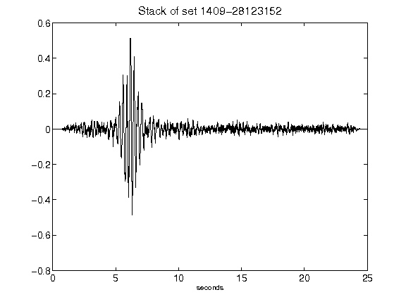](figures/1409-28123152_Stack.png)[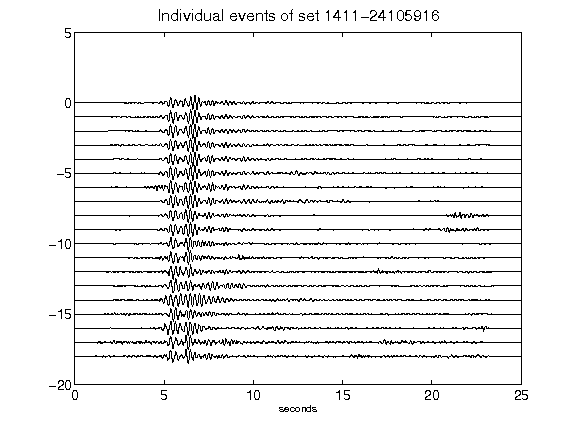](figures/1411-24105916_AllEv.png)[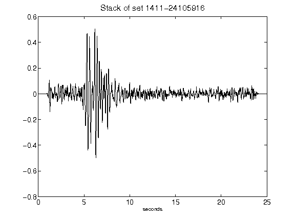](figures/1411-24105916_Stack.png)[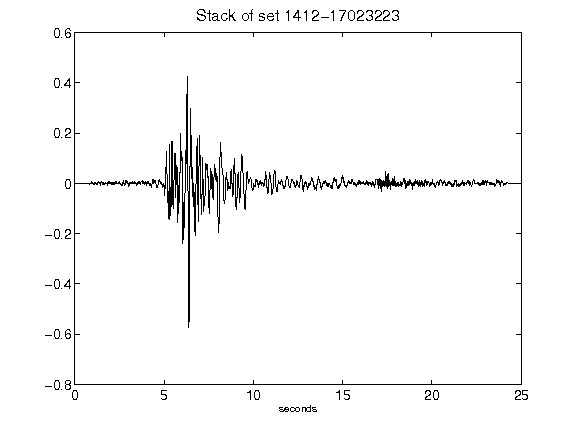](figures/1412-17023223_Stack.png)[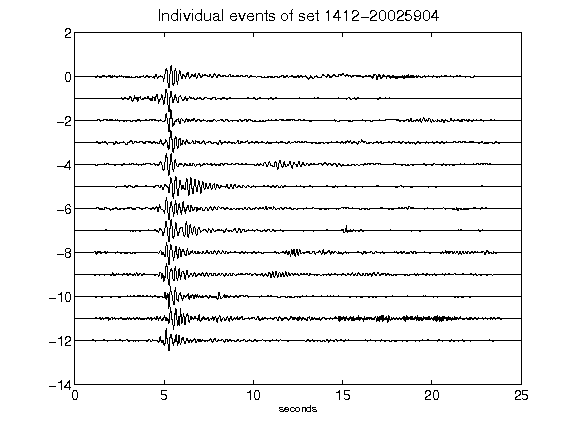](figures/1412-20025904_AllEv.png)[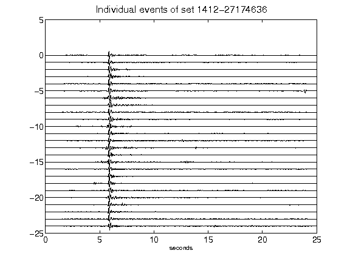](figures/1412-27174636_AllEv.png)[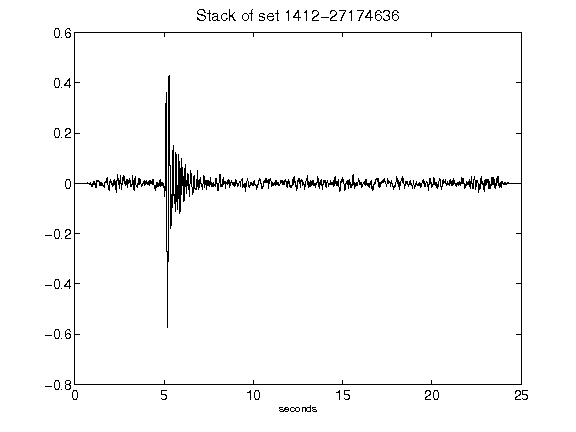](figures/1412-27174636_Stack.png)[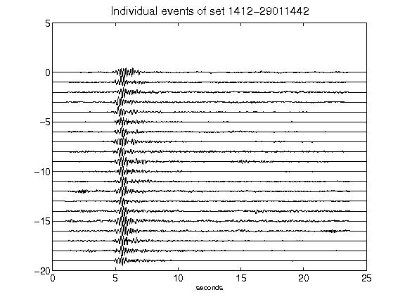](figures/1412-29011442_AllEv.png)[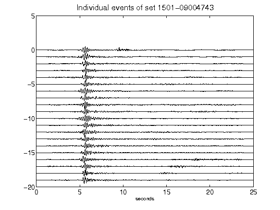](figures/1501-09004743_AllEv.png)[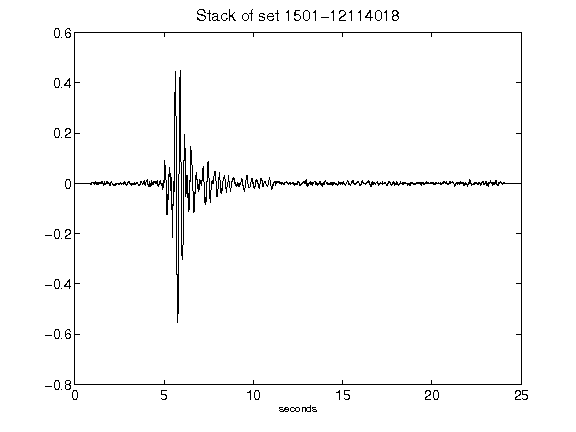](figures/1501-12114018_Stack.png)[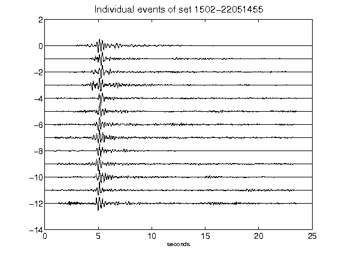](figures/1502-22051455_AllEv.png)[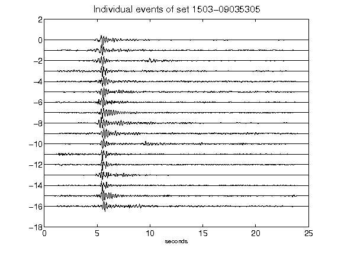](figures/1503-09035305_AllEv.png)[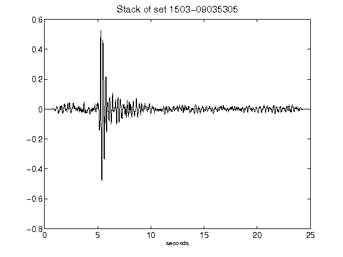](figures/1503-09035305_Stack.png)[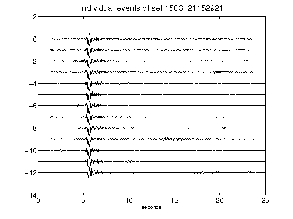](figures/1503-21152921_AllEv.png)[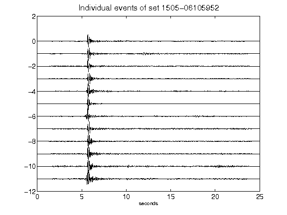](figures/1505-06105952_AllEv.png)[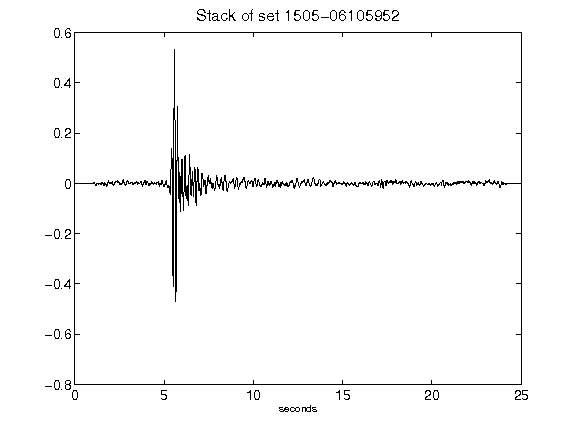](figures/1505-06105952_Stack.png)[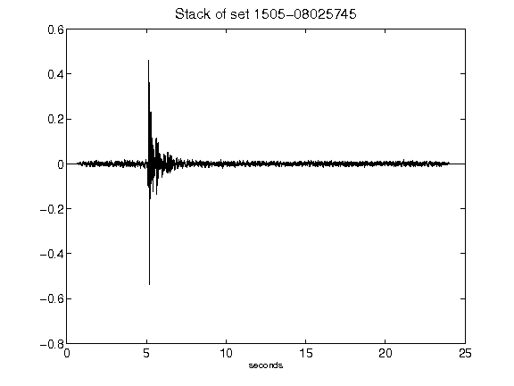](figures/1505-08025745_Stack.png)[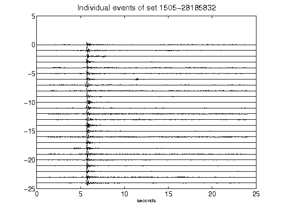](figures/1505-28185832_AllEv.png)[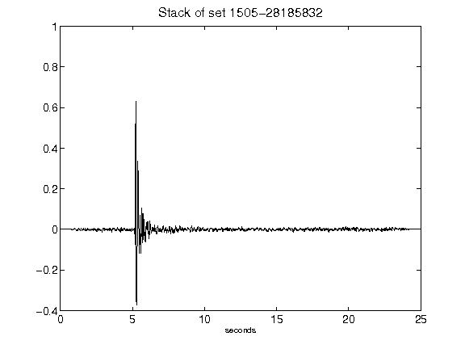](figures/1505-28185832_Stack.png)[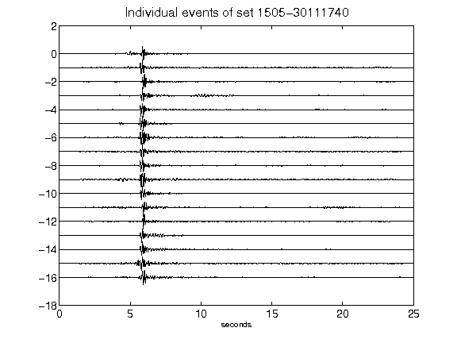](figures/1505-30111740_AllEv.png)[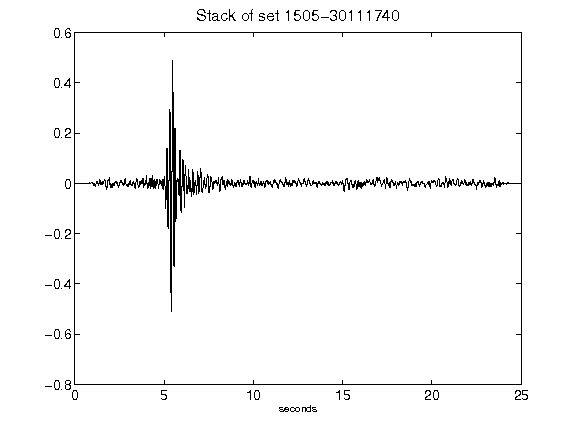](figures/1505-30111740_Stack.png)