# Repeating Earthquake Activity at RCM

## Waveforms
[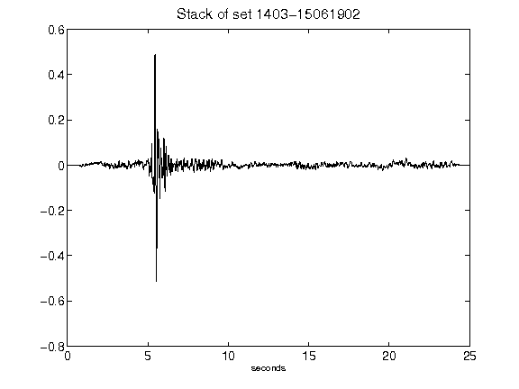](figures/1403-15061902_Stack.png)[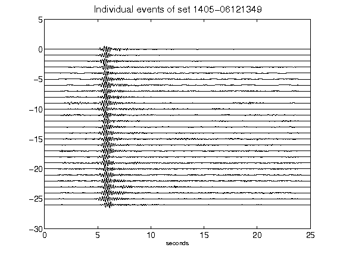](figures/1405-06121349_AllEv.png)[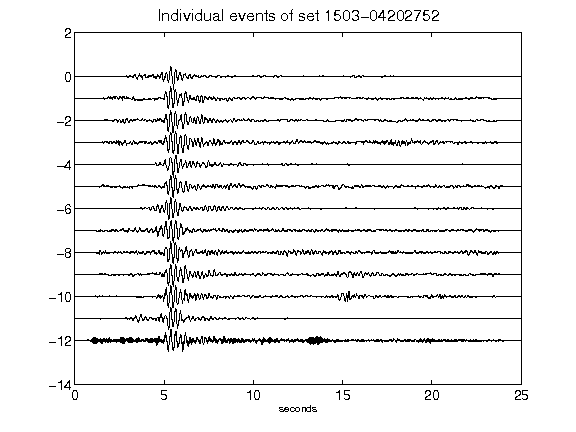](figures/1503-04202752_AllEv.png)[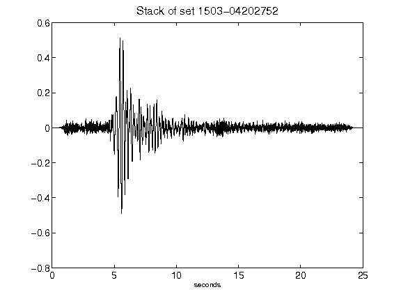](figures/1503-04202752_Stack.png)[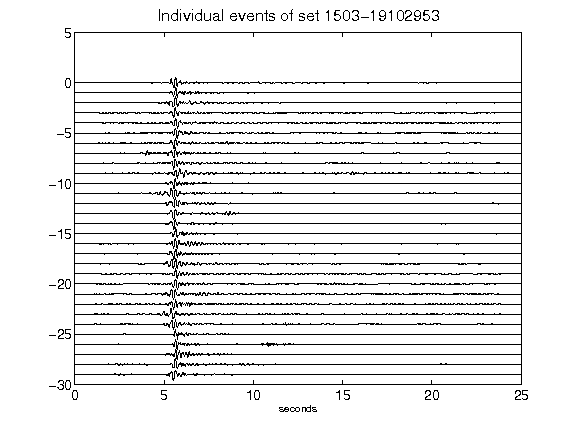](figures/1503-19102953_AllEv.png)[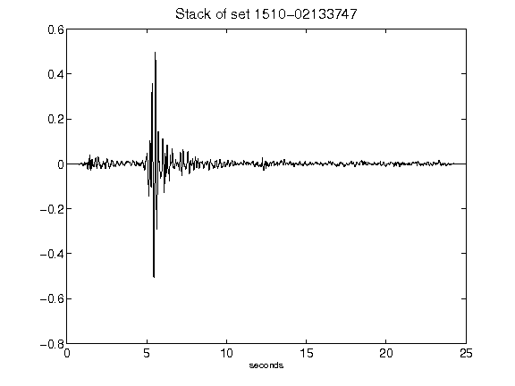](figures/1510-02133747_Stack.png)[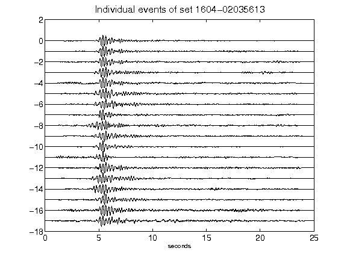](figures/1604-02035613_AllEv.png)[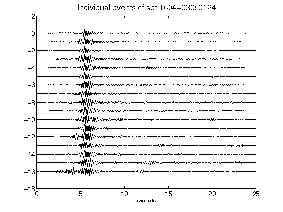](figures/1604-03050124_AllEv.png)[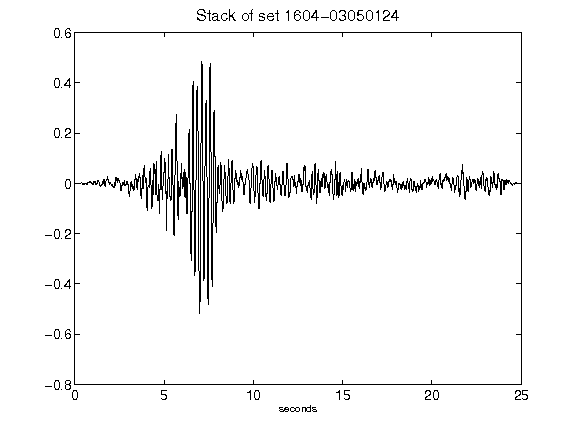](figures/1604-03050124_Stack.png)[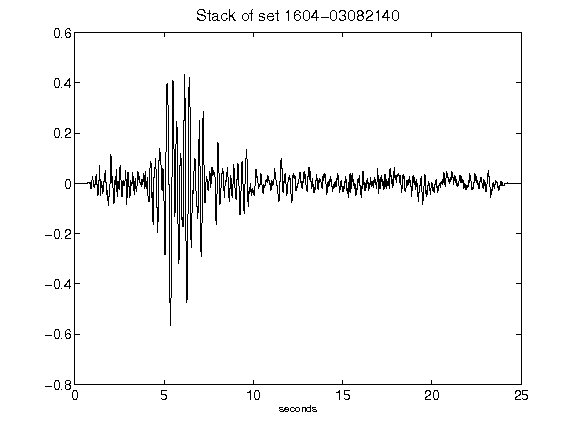](figures/1604-03082140_Stack.png)[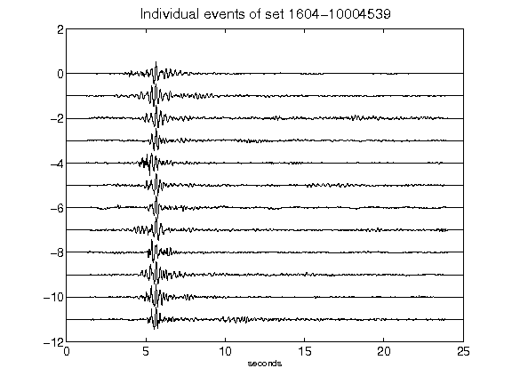](figures/1604-10004539_AllEv.png)[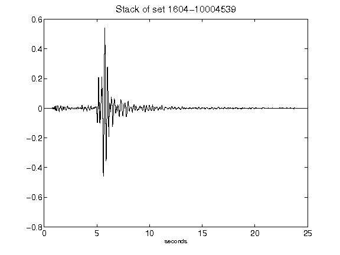](figures/1604-10004539_Stack.png)[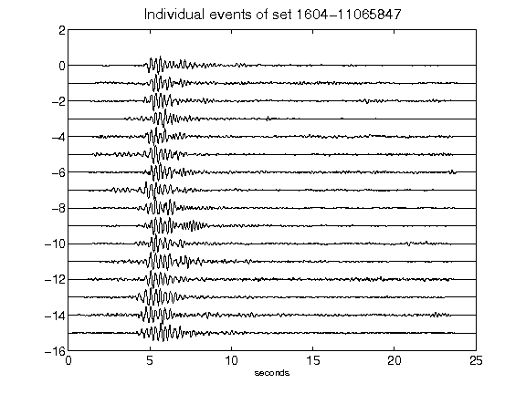](figures/1604-11065847_AllEv.png)[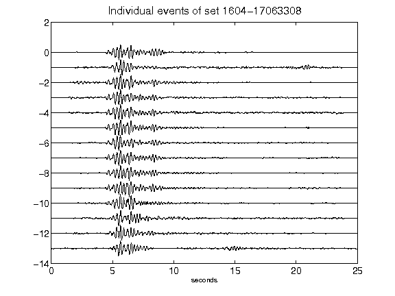](figures/1604-17063308_AllEv.png)[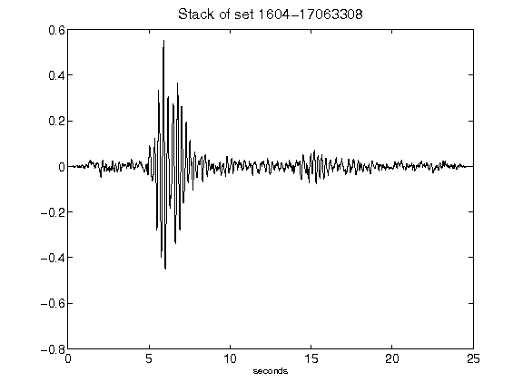](figures/1604-17063308_Stack.png)[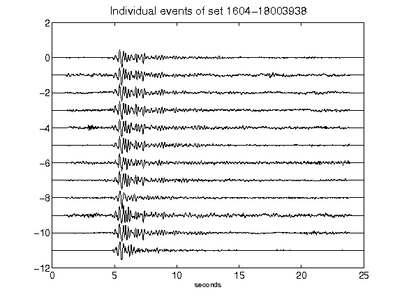](figures/1604-18003938_AllEv.png)[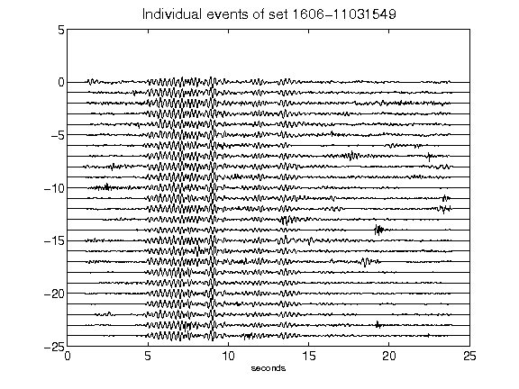](figures/1606-11031549_AllEv.png)[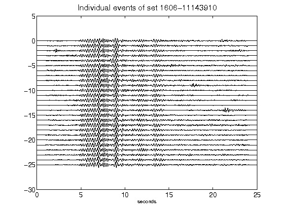](figures/1606-11143910_AllEv.png)[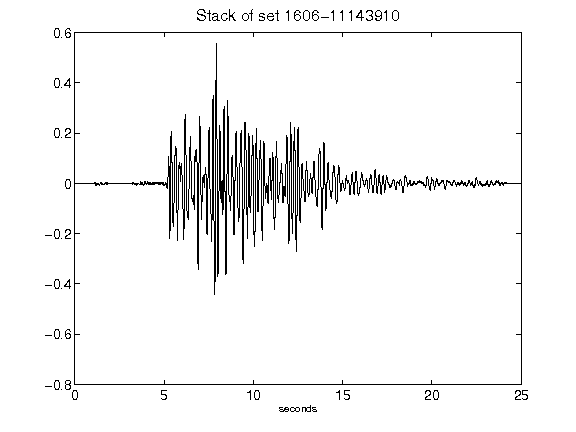](figures/1606-11143910_Stack.png)