# Repeating Earthquake Activity at RCM

## Waveforms
[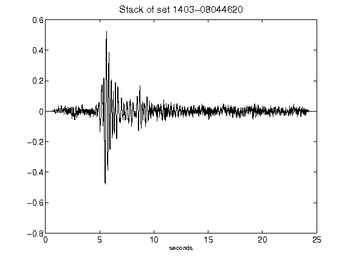](figures/1403-08044620_Stack.png)[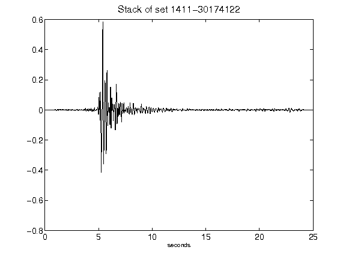](figures/1411-30174122_Stack.png)[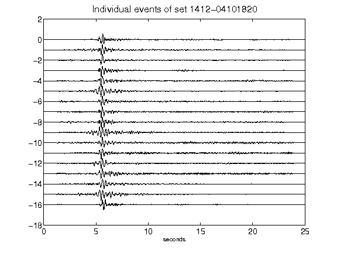](figures/1412-04101820_AllEv.png)[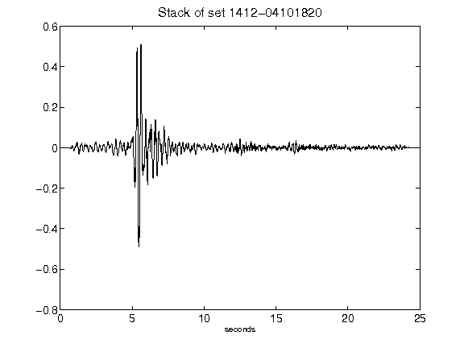](figures/1412-04101820_Stack.png)[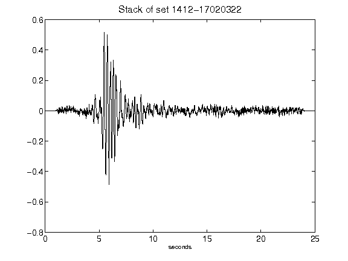](figures/1412-17020322_Stack.png)[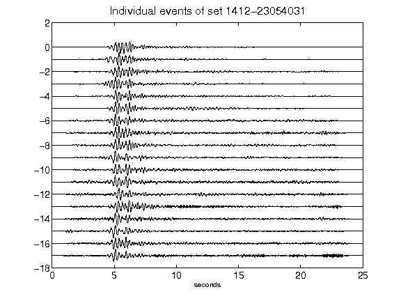](figures/1412-23054031_AllEv.png)[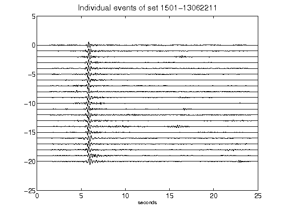](figures/1501-13062211_AllEv.png)[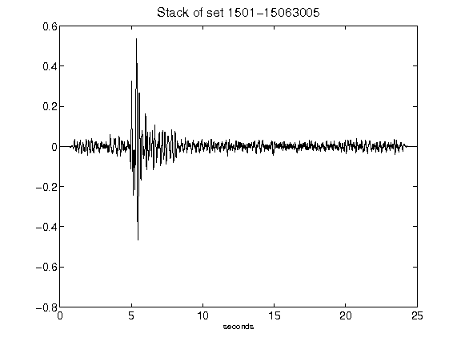](figures/1501-15063005_Stack.png)[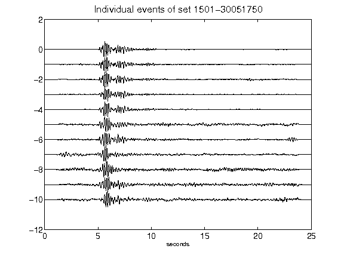](figures/1501-30051750_AllEv.png)[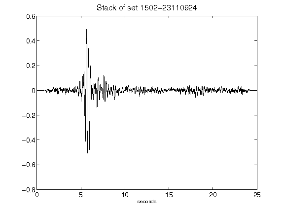](figures/1502-23110924_Stack.png)[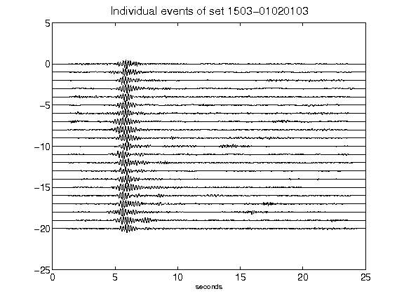](figures/1503-01020103_AllEv.png)[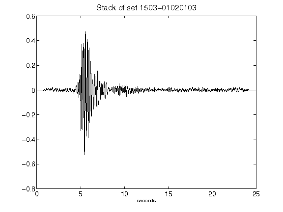](figures/1503-01020103_Stack.png)[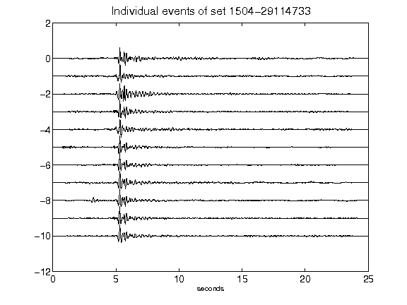](figures/1504-29114733_AllEv.png)[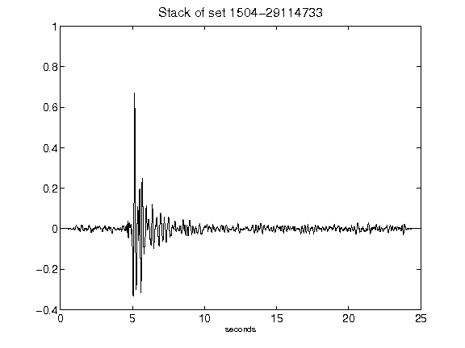](figures/1504-29114733_Stack.png)