# Repeating Earthquake Activity at RCM

## Waveforms
[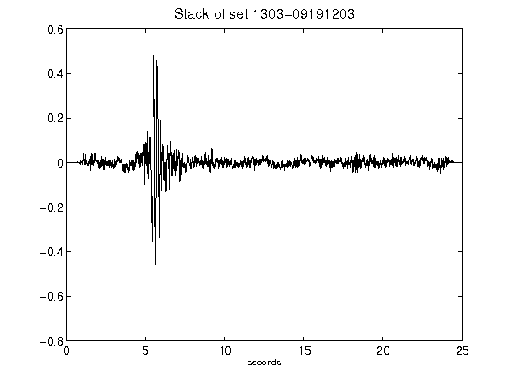](figures/1303-09191203_Stack.png)[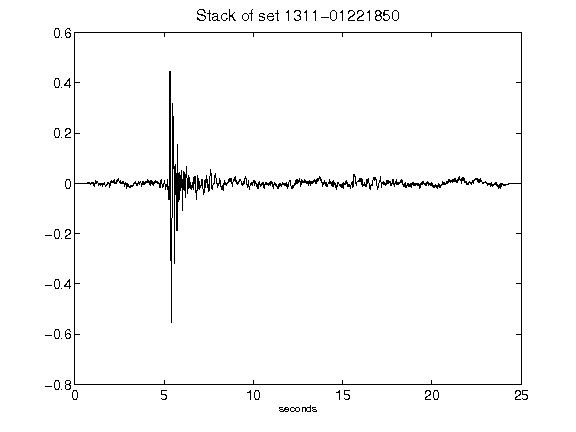](figures/1311-01221850_Stack.png)[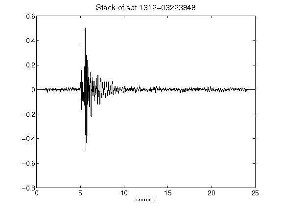](figures/1312-03223848_Stack.png)[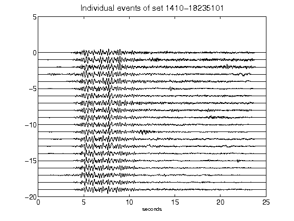](figures/1410-18235101_AllEv.png)[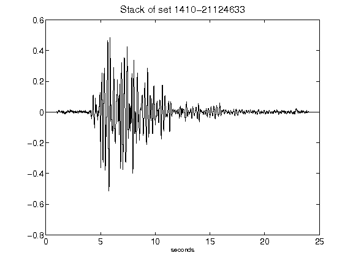](figures/1410-21124633_Stack.png)[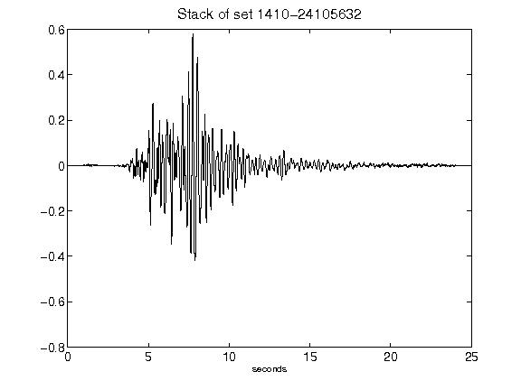](figures/1410-24105632_Stack.png)[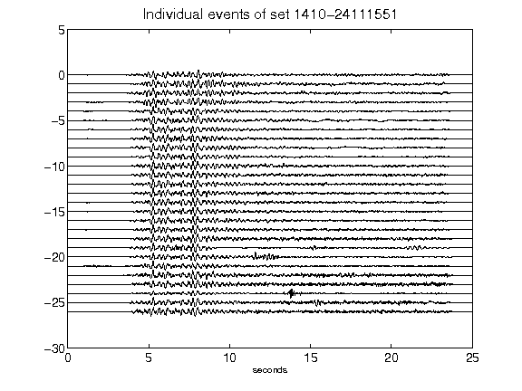](figures/1410-24111551_AllEv.png)[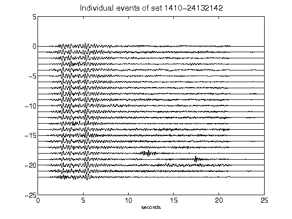](figures/1410-24132142_AllEv.png)[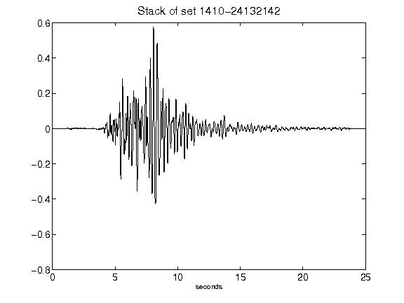](figures/1410-24132142_Stack.png)[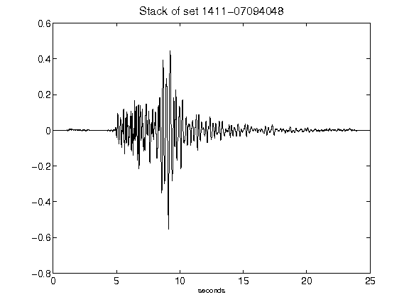](figures/1411-07094048_Stack.png)[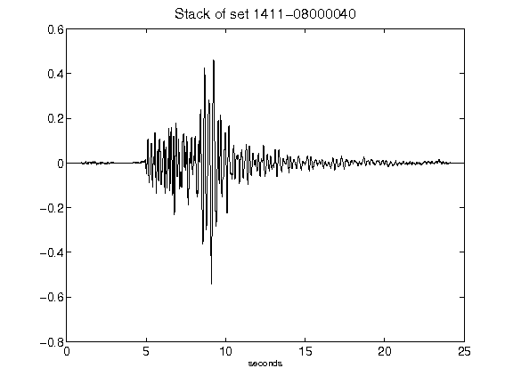](figures/1411-08000040_Stack.png)[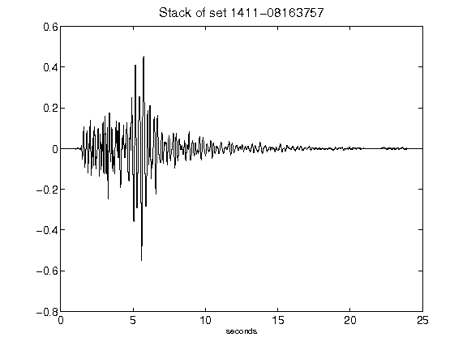](figures/1411-08163757_Stack.png)[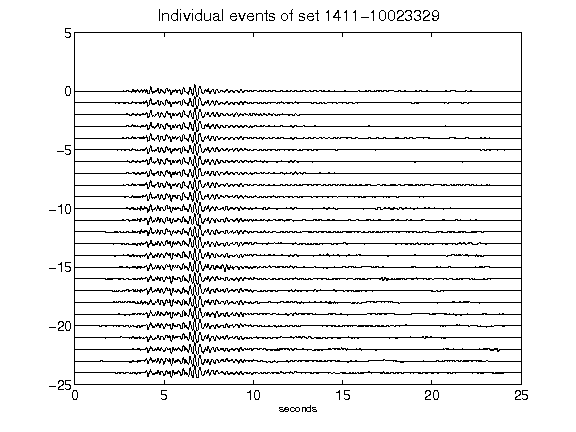](figures/1411-10023329_AllEv.png)[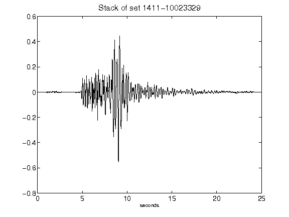](figures/1411-10023329_Stack.png)[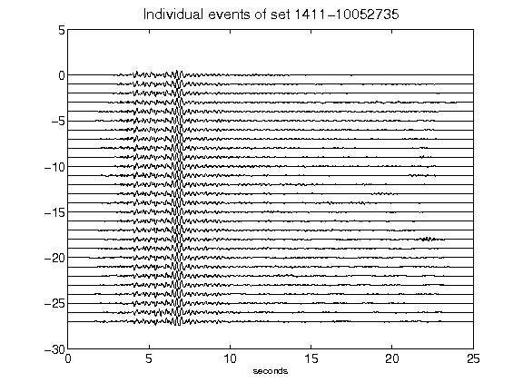](figures/1411-10052735_AllEv.png)[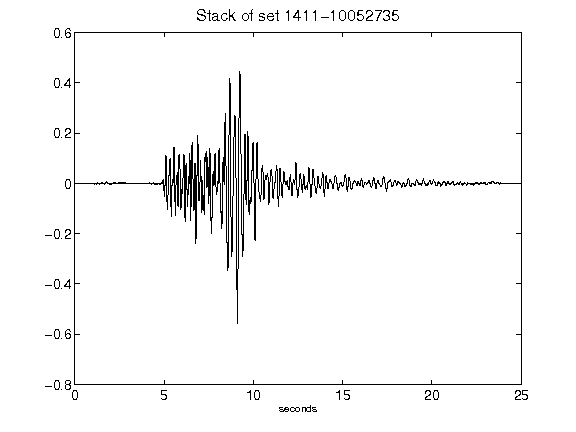](figures/1411-10052735_Stack.png)