# Repeating Earthquake Activity at RCM

## Waveforms
[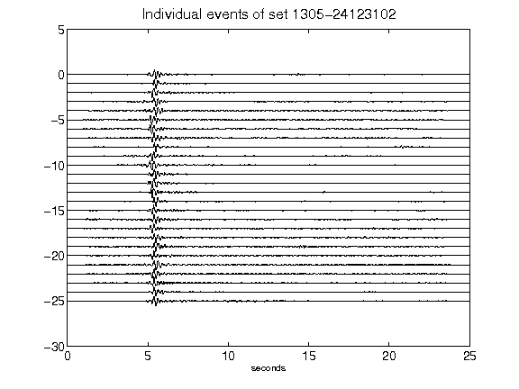](figures/1305-24123102_AllEv.png)[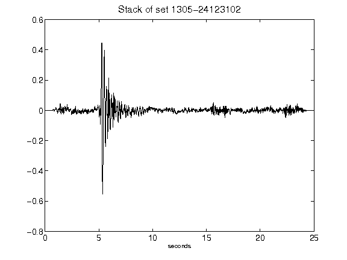](figures/1305-24123102_Stack.png)[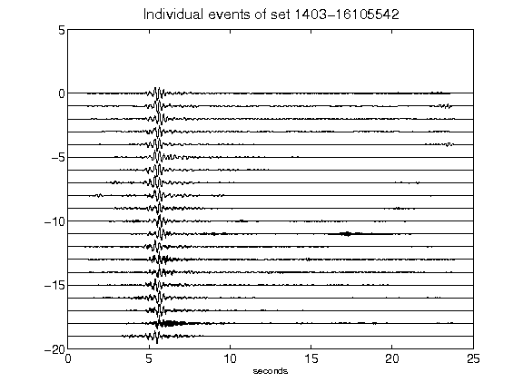](figures/1403-16105542_AllEv.png)[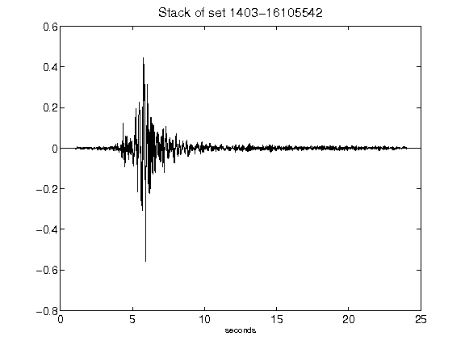](figures/1403-16105542_Stack.png)[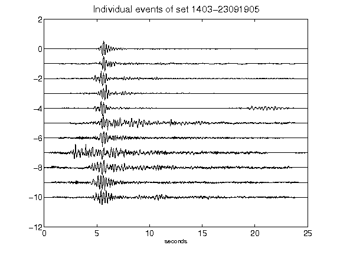](figures/1403-23091905_AllEv.png)[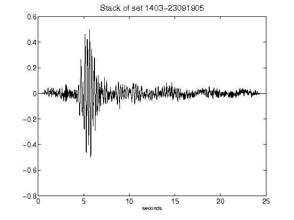](figures/1403-23091905_Stack.png)[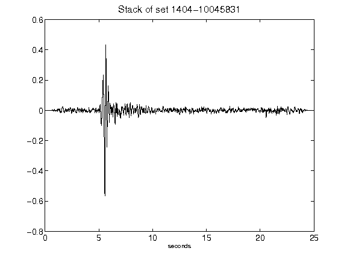](figures/1404-10045831_Stack.png)[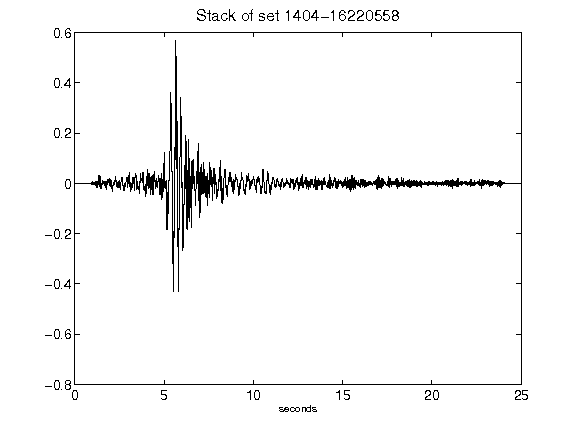](figures/1404-16220558_Stack.png)[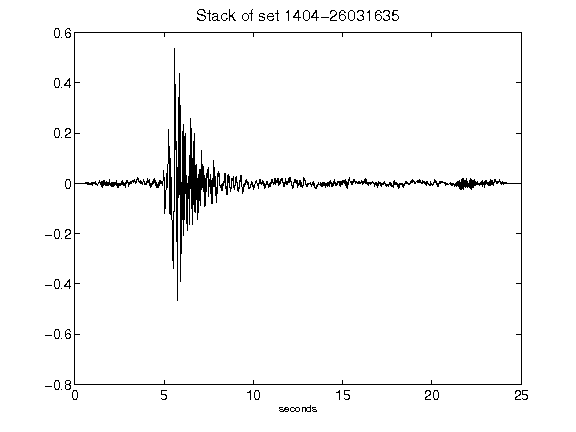](figures/1404-26031635_Stack.png)[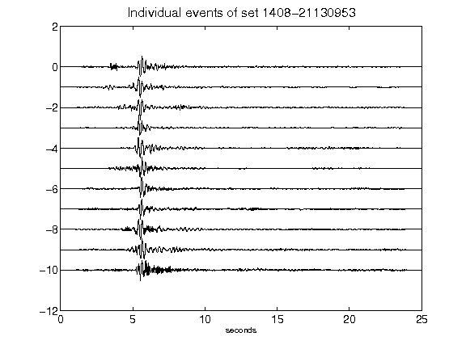](figures/1408-21130953_AllEv.png)[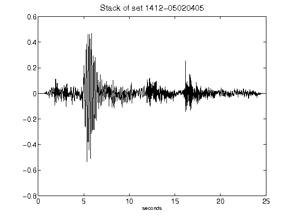](figures/1412-05020405_Stack.png)[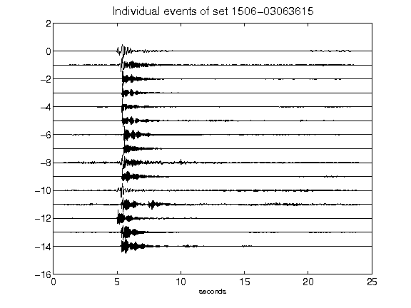](figures/1506-03063615_AllEv.png)[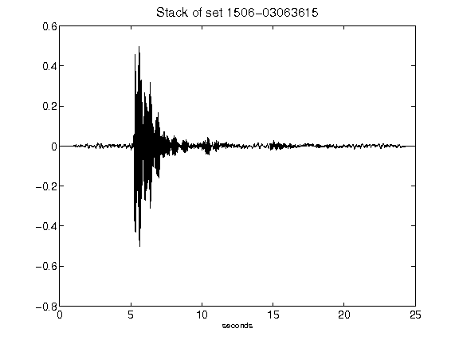](figures/1506-03063615_Stack.png)[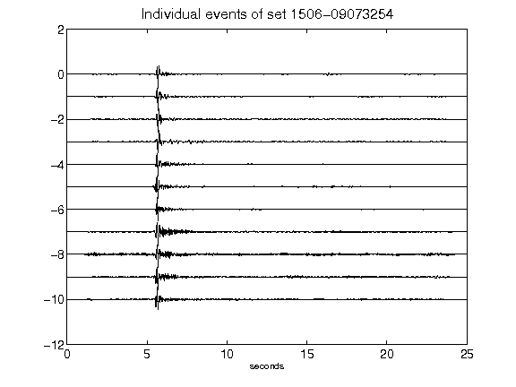](figures/1506-09073254_AllEv.png)[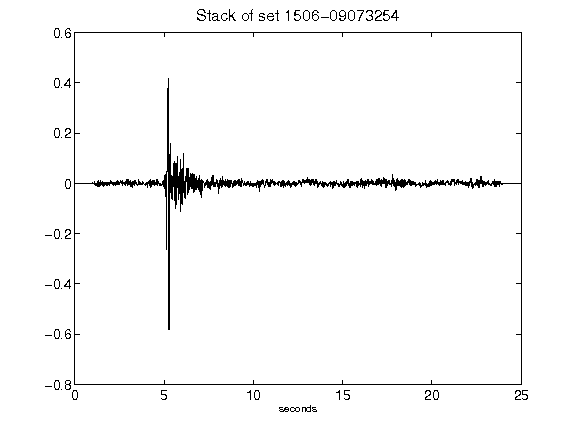](figures/1506-09073254_Stack.png)[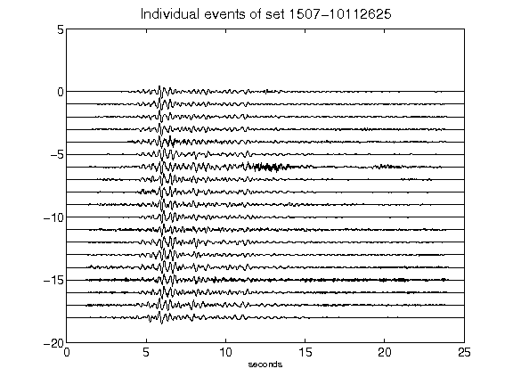](figures/1507-10112625_AllEv.png)[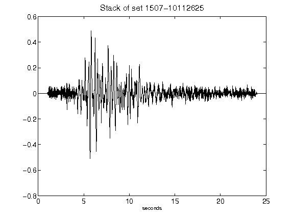](figures/1507-10112625_Stack.png)[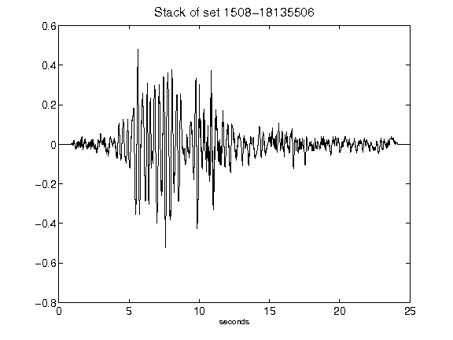](figures/1508-18135506_Stack.png)[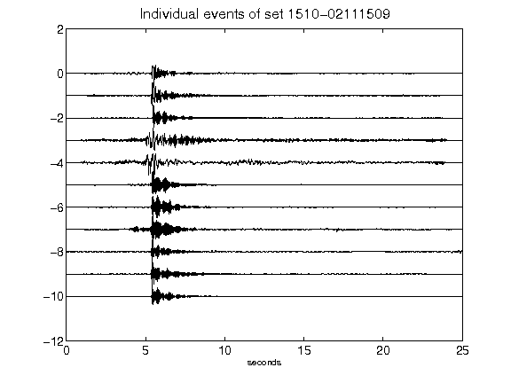](figures/1510-02111509_AllEv.png)[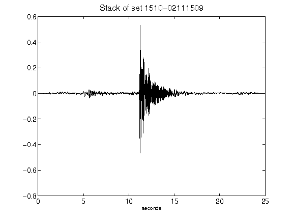](figures/1510-02111509_Stack.png)