# Repeating Earthquake Activity at RCM

## Waveforms
[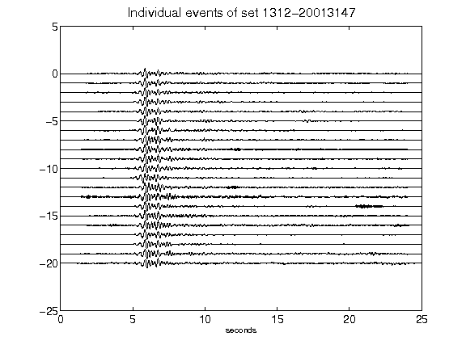](figures/1312-20013147_AllEv.png)[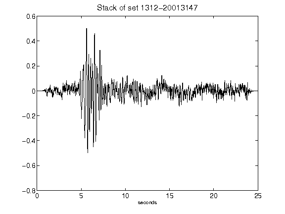](figures/1312-20013147_Stack.png)[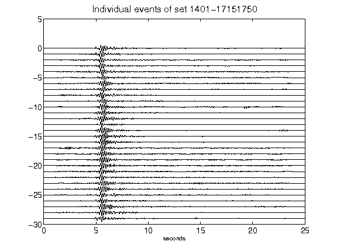](figures/1401-17151750_AllEv.png)[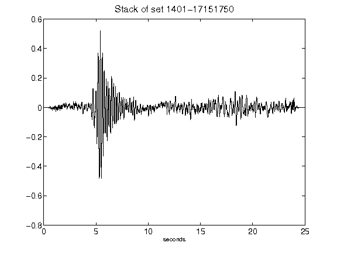](figures/1401-17151750_Stack.png)[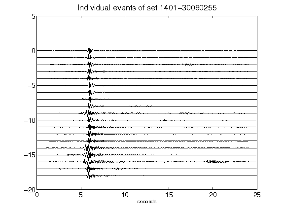](figures/1401-30060255_AllEv.png)[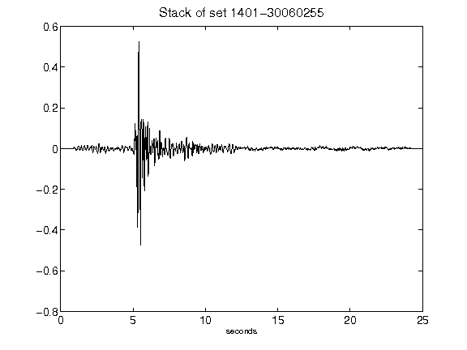](figures/1401-30060255_Stack.png)[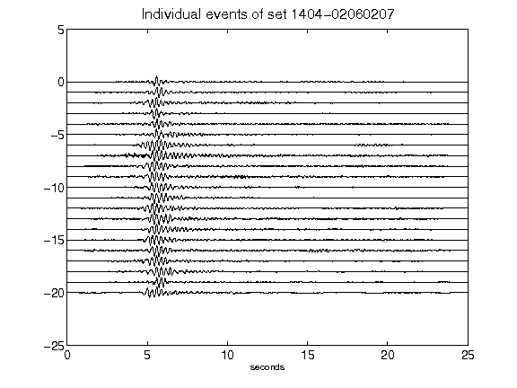](figures/1404-02060207_AllEv.png)[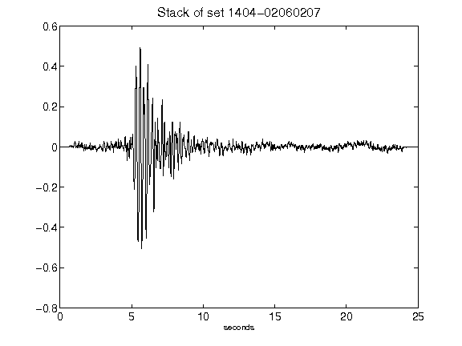](figures/1404-02060207_Stack.png)[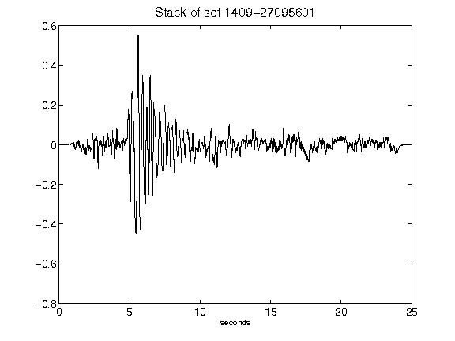](figures/1409-27095601_Stack.png)[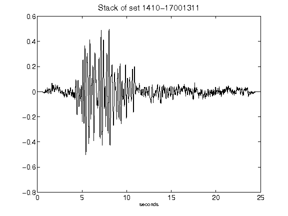](figures/1410-17001311_Stack.png)[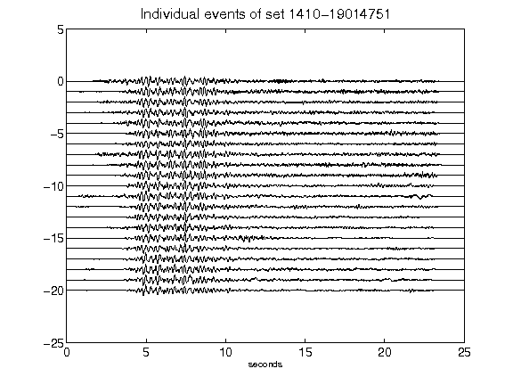](figures/1410-19014751_AllEv.png)[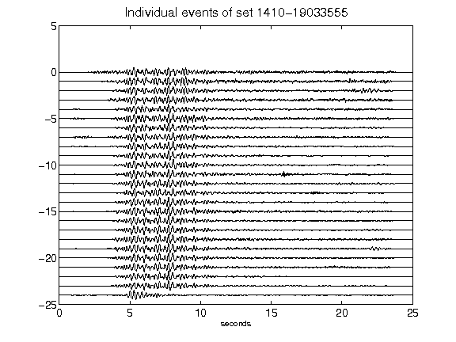](figures/1410-19033555_AllEv.png)[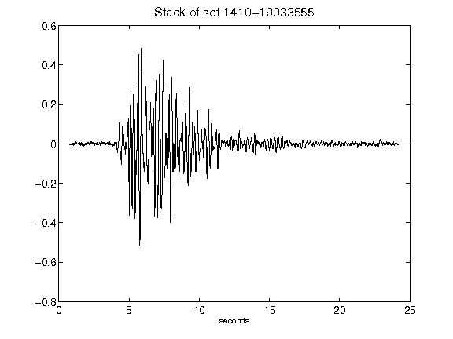](figures/1410-19033555_Stack.png)[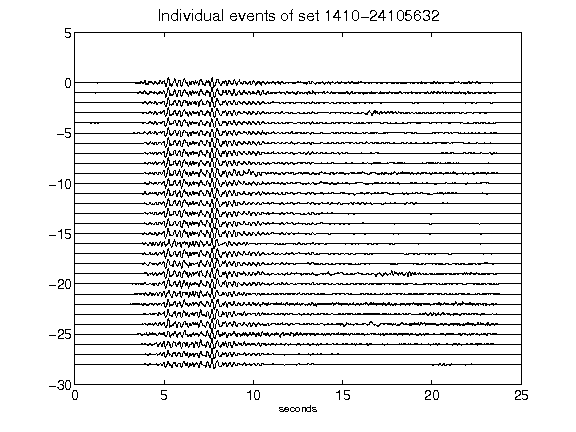](figures/1410-24105632_AllEv.png)[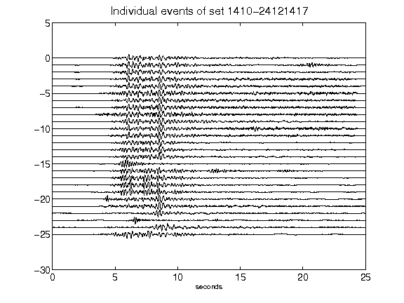](figures/1410-24121417_AllEv.png)[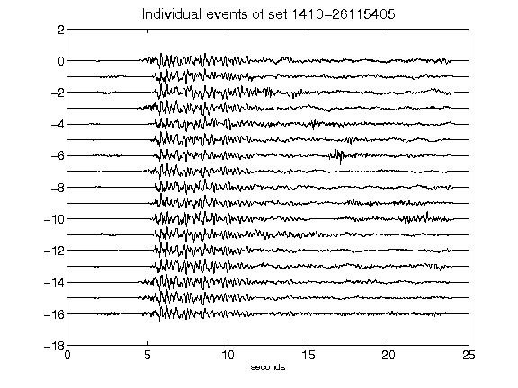](figures/1410-26115405_AllEv.png)[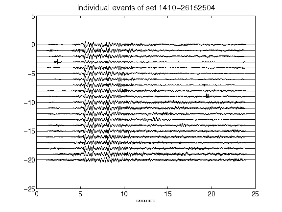](figures/1410-26152504_AllEv.png)[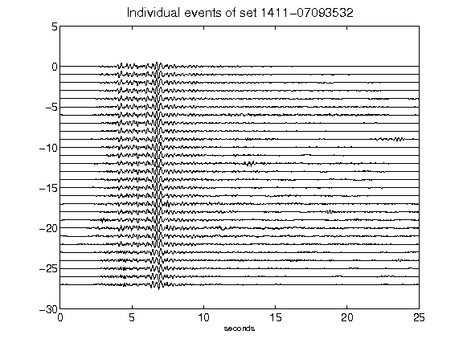](figures/1411-07093532_AllEv.png)[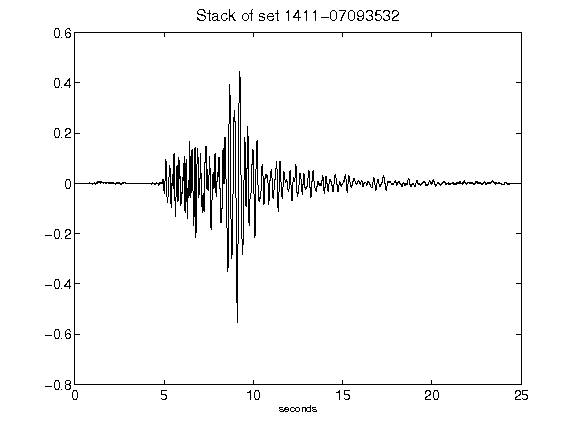](figures/1411-07093532_Stack.png)[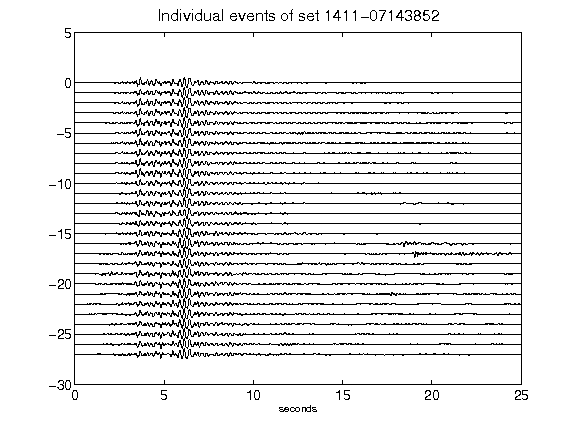](figures/1411-07143852_AllEv.png)[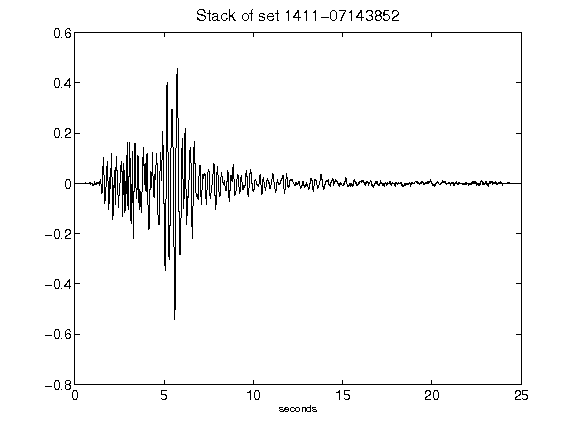](figures/1411-07143852_Stack.png)