# Repeating Earthquake Activity at RCM

## Waveforms
[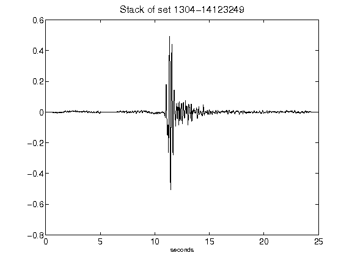](figures/1304-14123249_Stack.png)[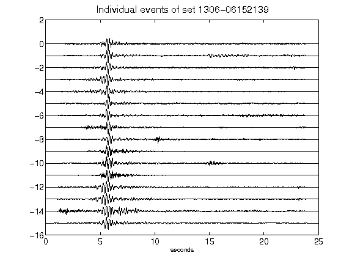](figures/1306-06152139_AllEv.png)[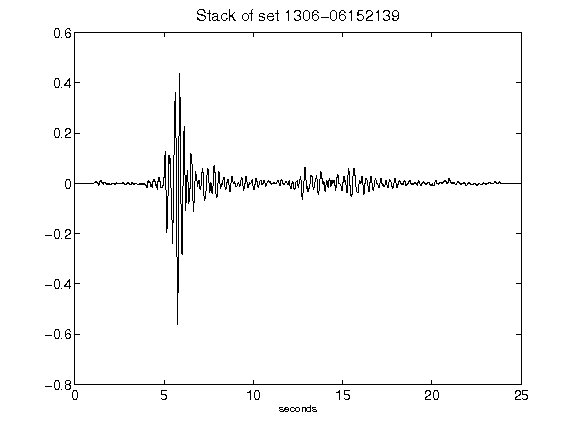](figures/1306-06152139_Stack.png)[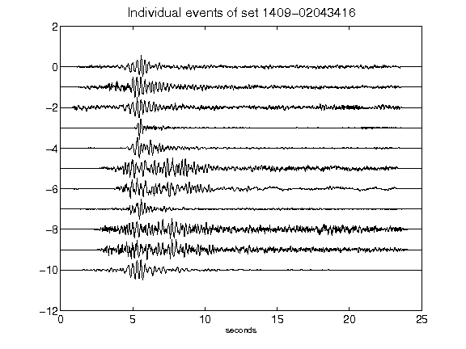](figures/1409-02043416_AllEv.png)[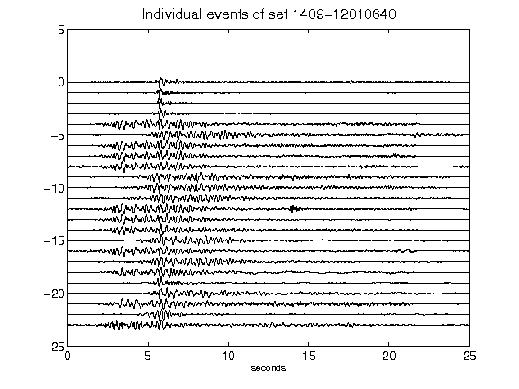](figures/1409-12010640_AllEv.png)[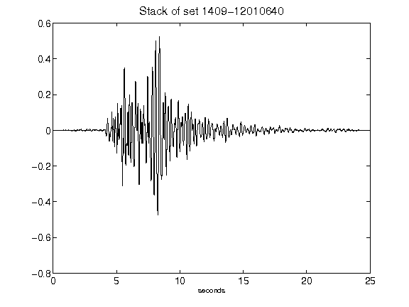](figures/1409-12010640_Stack.png)[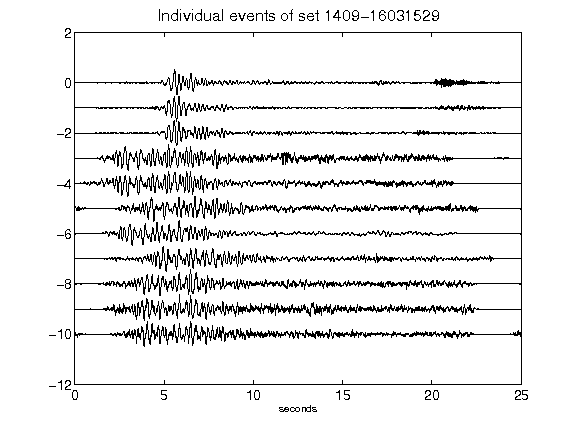](figures/1409-16031529_AllEv.png)[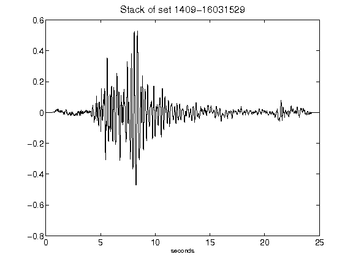](figures/1409-16031529_Stack.png)[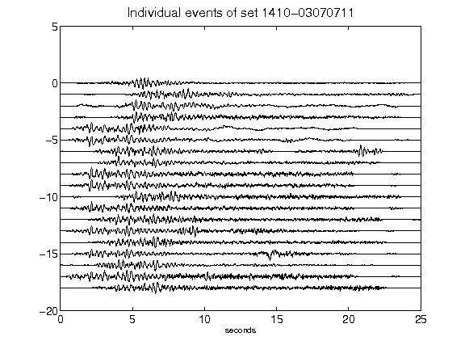](figures/1410-03070711_AllEv.png)[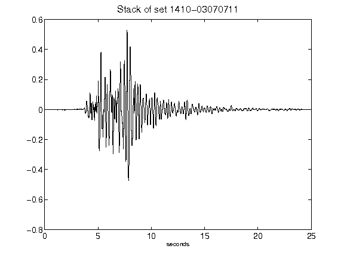](figures/1410-03070711_Stack.png)[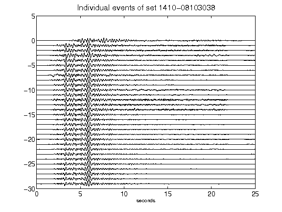](figures/1410-08103038_AllEv.png)[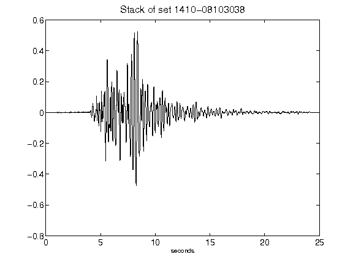](figures/1410-08103038_Stack.png)[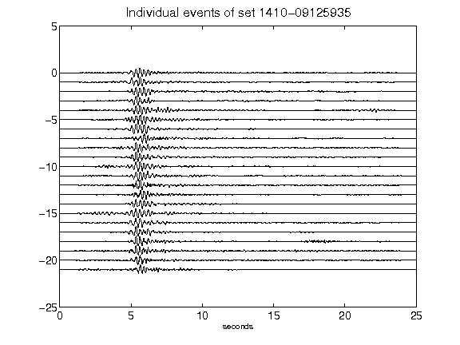](figures/1410-09125935_AllEv.png)[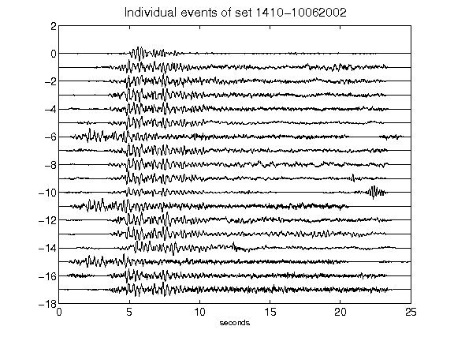](figures/1410-10062002_AllEv.png)[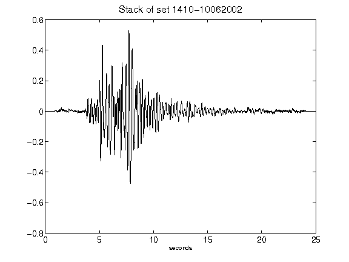](figures/1410-10062002_Stack.png)[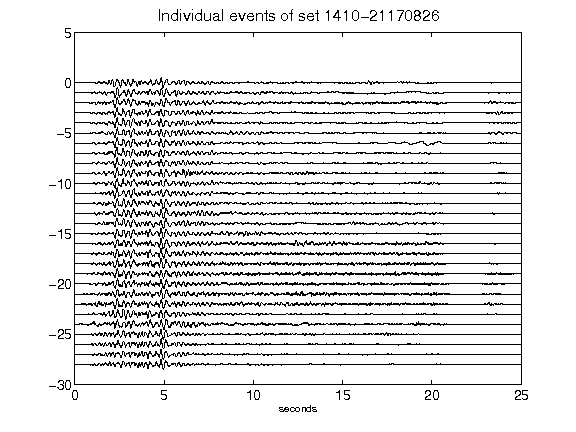](figures/1410-21170826_AllEv.png)[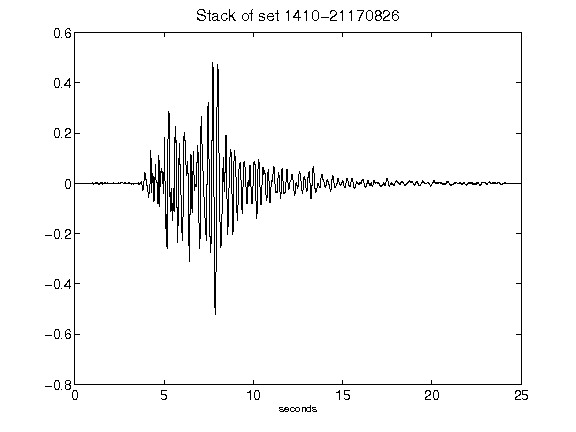](figures/1410-21170826_Stack.png)[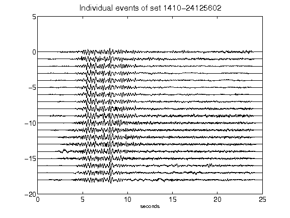](figures/1410-24125602_AllEv.png)[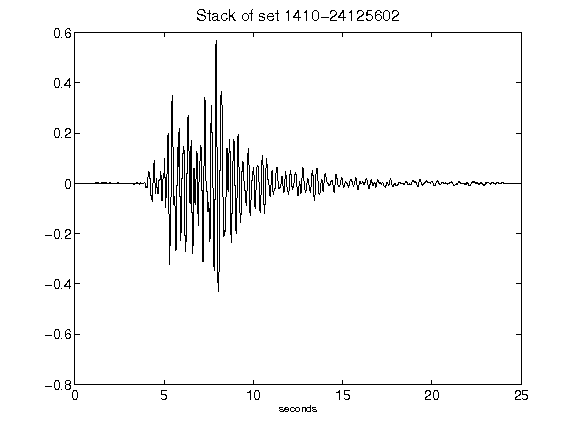](figures/1410-24125602_Stack.png)[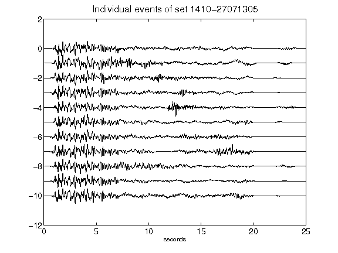](figures/1410-27071305_AllEv.png)[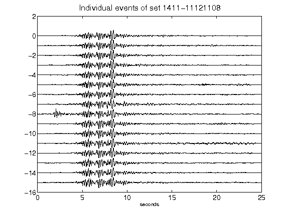](figures/1411-11121108_AllEv.png)[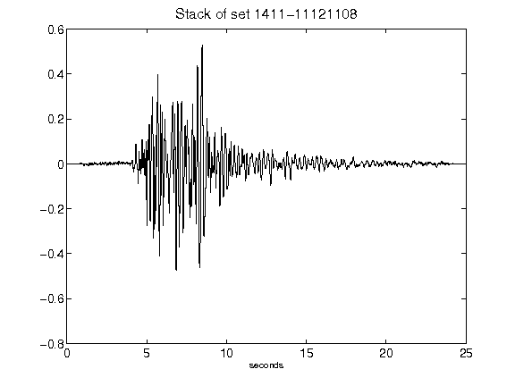](figures/1411-11121108_Stack.png)