# Repeating Earthquake Activity at RCM

## Waveforms
[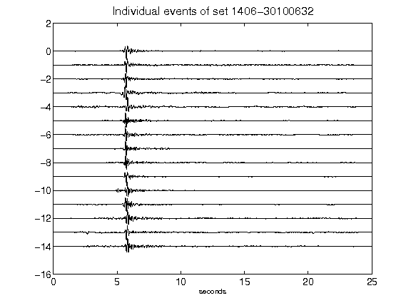](figures/1406-30100632_AllEv.png)[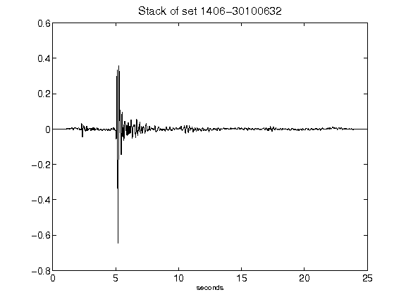](figures/1406-30100632_Stack.png)[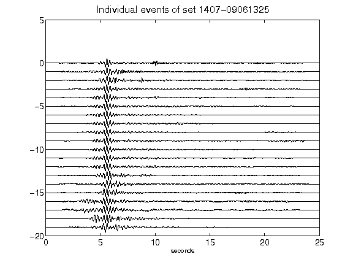](figures/1407-09061325_AllEv.png)[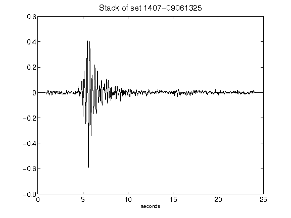](figures/1407-09061325_Stack.png)[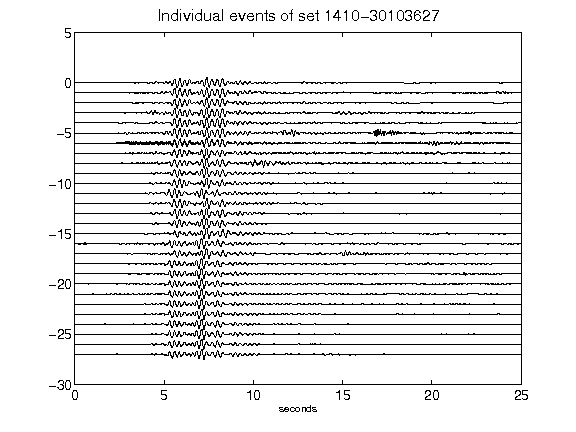](figures/1410-30103627_AllEv.png)[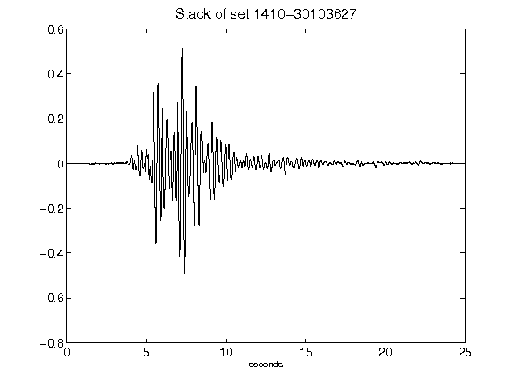](figures/1410-30103627_Stack.png)[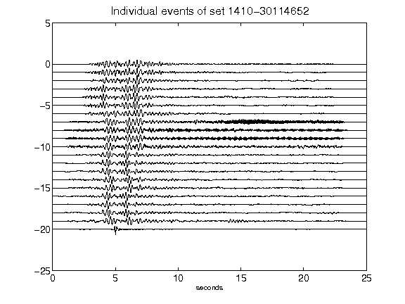](figures/1410-30114652_AllEv.png)[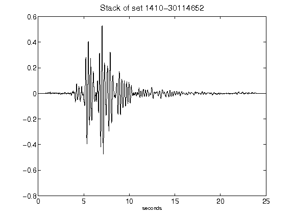](figures/1410-30114652_Stack.png)[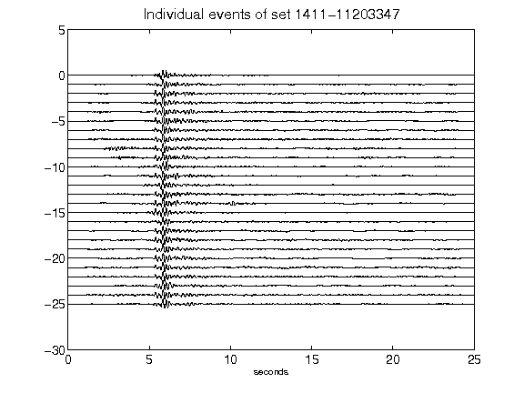](figures/1411-11203347_AllEv.png)[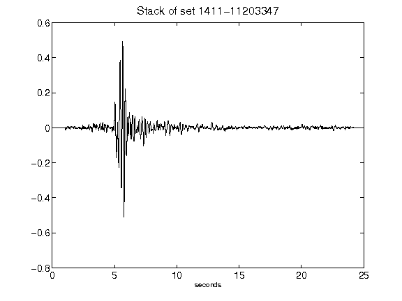](figures/1411-11203347_Stack.png)[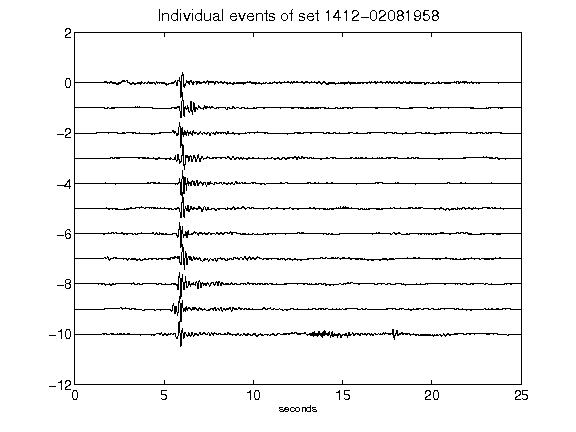](figures/1412-02081958_AllEv.png)[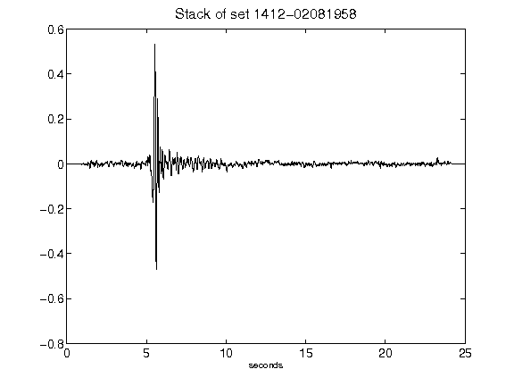](figures/1412-02081958_Stack.png)