# Repeating Earthquake Activity at RCM

## Waveforms
[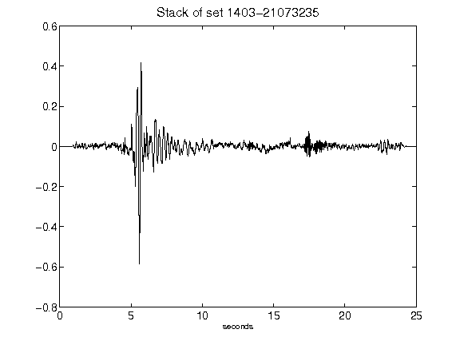](figures/1403-21073235_Stack.png)[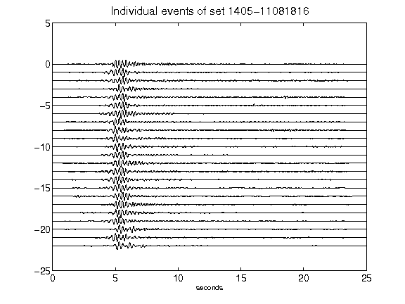](figures/1405-11081816_AllEv.png)[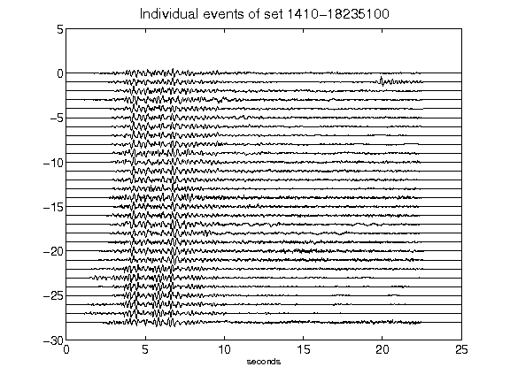](figures/1410-18235100_AllEv.png)[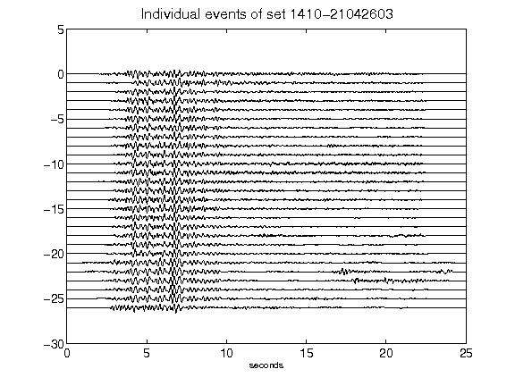](figures/1410-21042603_AllEv.png)[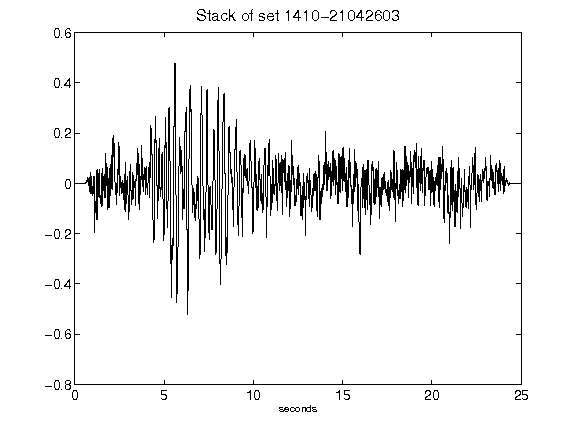](figures/1410-21042603_Stack.png)[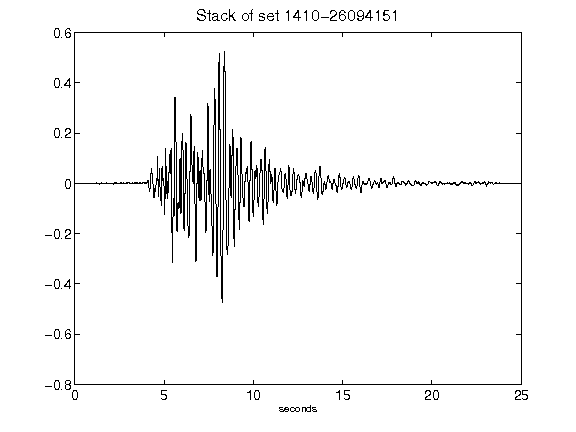](figures/1410-26094151_Stack.png)[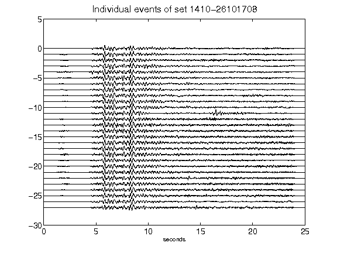](figures/1410-26101708_AllEv.png)[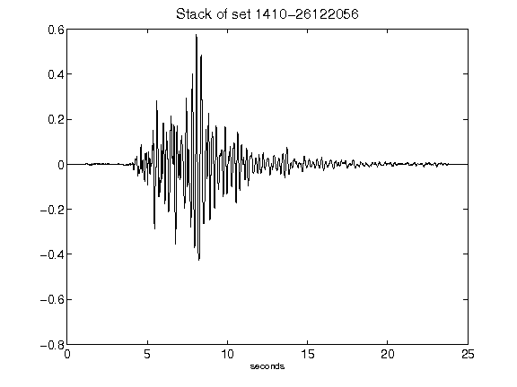](figures/1410-26122056_Stack.png)[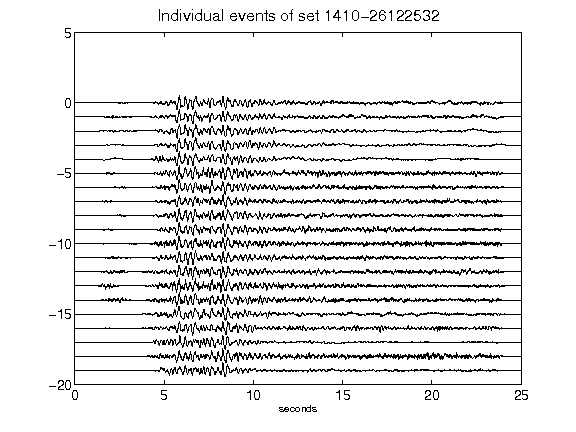](figures/1410-26122532_AllEv.png)[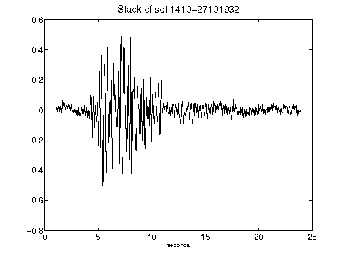](figures/1410-27101932_Stack.png)[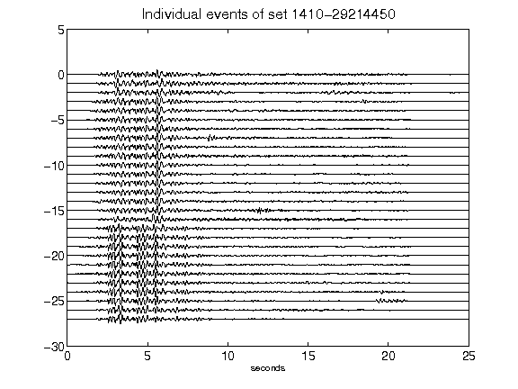](figures/1410-29214450_AllEv.png)[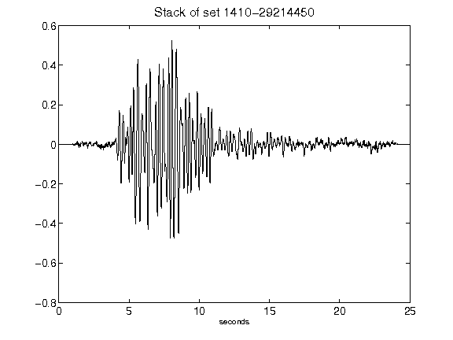](figures/1410-29214450_Stack.png)[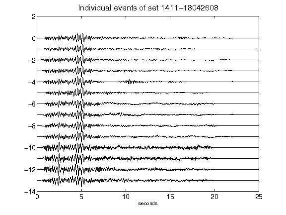](figures/1411-18042608_AllEv.png)[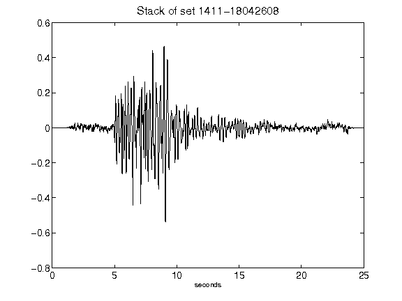](figures/1411-18042608_Stack.png)