# Repeating Earthquake Activity at RCM

## Waveforms
[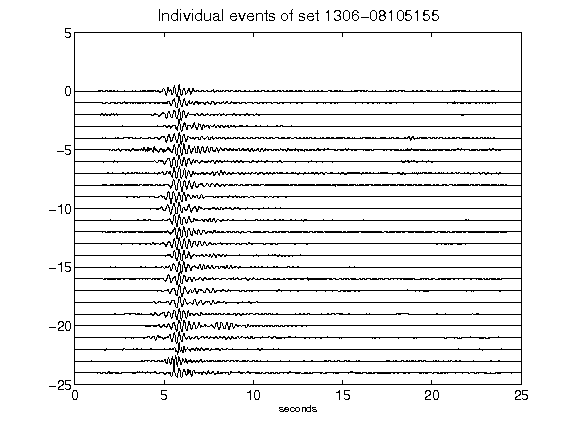](figures/1306-08105155_AllEv.png)[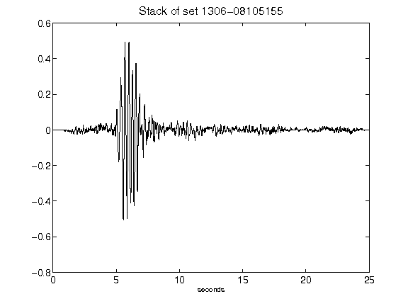](figures/1306-08105155_Stack.png)[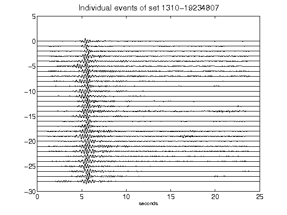](figures/1310-19234807_AllEv.png)[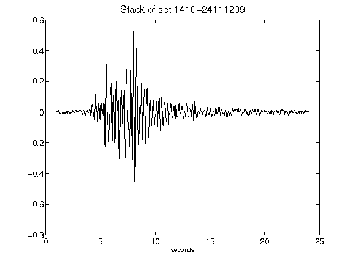](figures/1410-24111209_Stack.png)[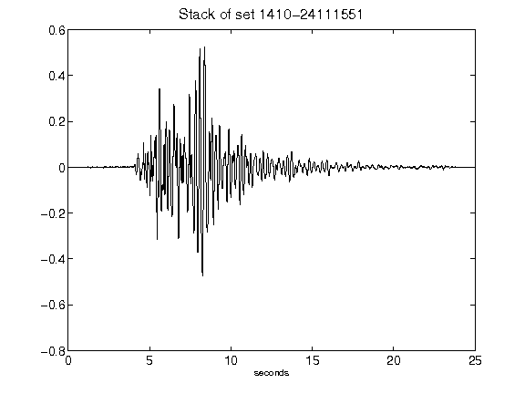](figures/1410-24111551_Stack.png)[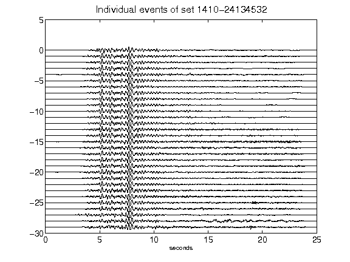](figures/1410-24134532_AllEv.png)[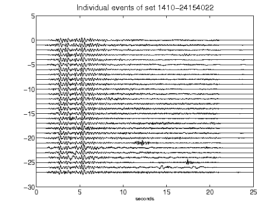](figures/1410-24154022_AllEv.png)[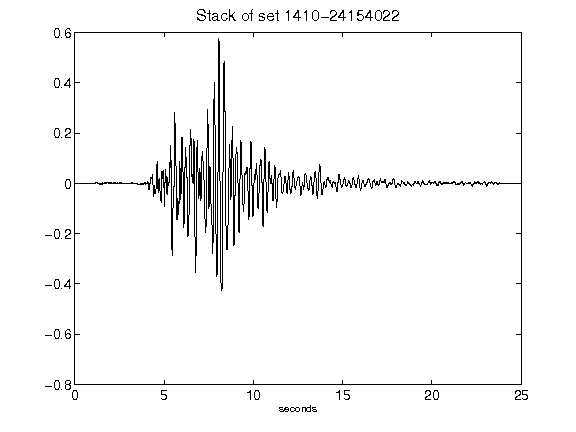](figures/1410-24154022_Stack.png)[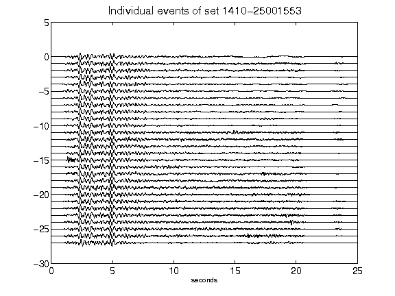](figures/1410-25001553_AllEv.png)[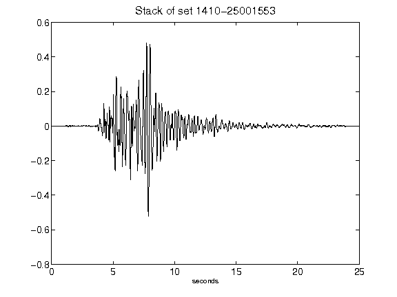](figures/1410-25001553_Stack.png)[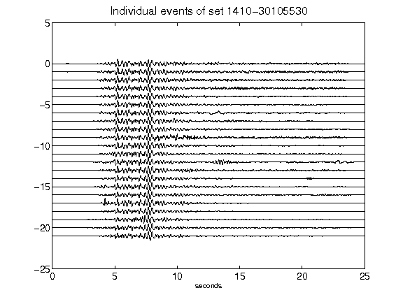](figures/1410-30105530_AllEv.png)[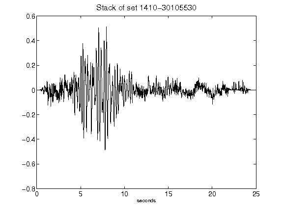](figures/1410-30105530_Stack.png)[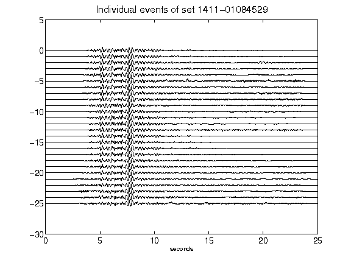](figures/1411-01084529_AllEv.png)[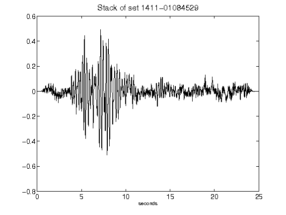](figures/1411-01084529_Stack.png)[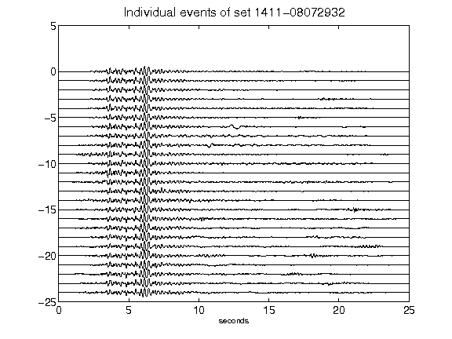](figures/1411-08072932_AllEv.png)[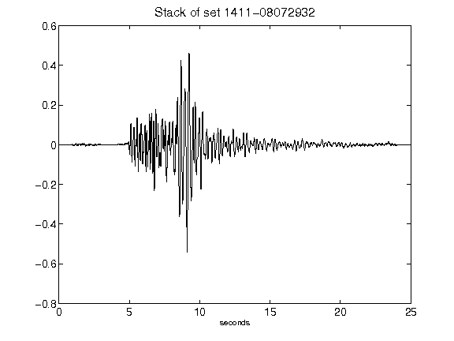](figures/1411-08072932_Stack.png)[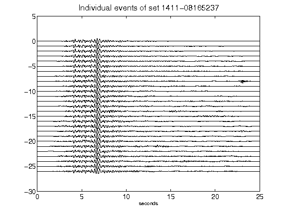](figures/1411-08165237_AllEv.png)[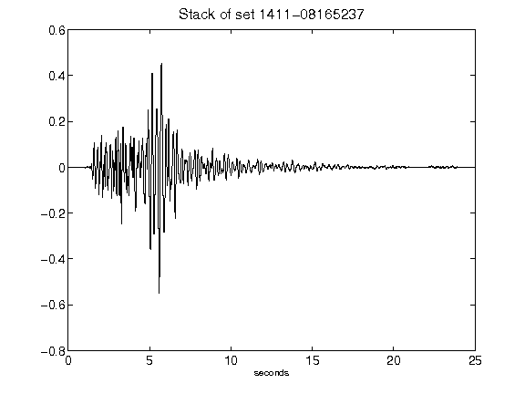](figures/1411-08165237_Stack.png)[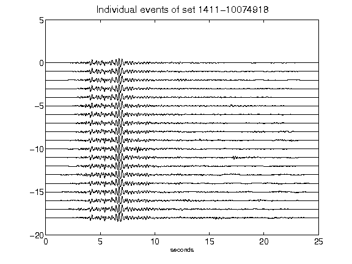](figures/1411-10074918_AllEv.png)[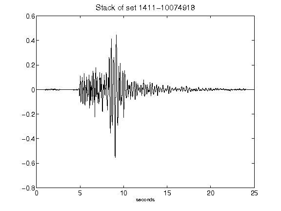](figures/1411-10074918_Stack.png)[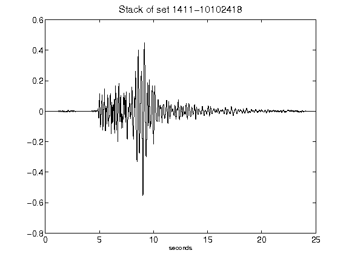](figures/1411-10102418_Stack.png)[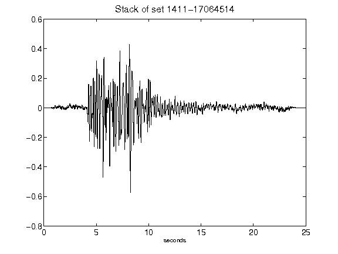](figures/1411-17064514_Stack.png)