# Repeating Earthquake Activity at RCM

## Waveforms
[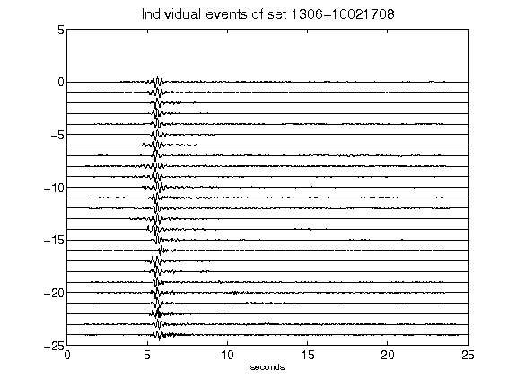](figures/1306-10021708_AllEv.png)[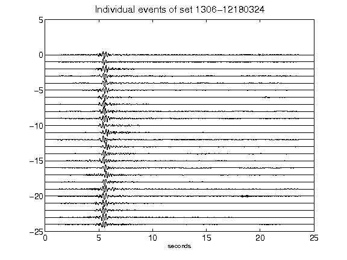](figures/1306-12180324_AllEv.png)[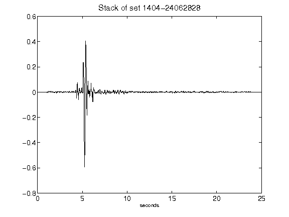](figures/1404-24062828_Stack.png)[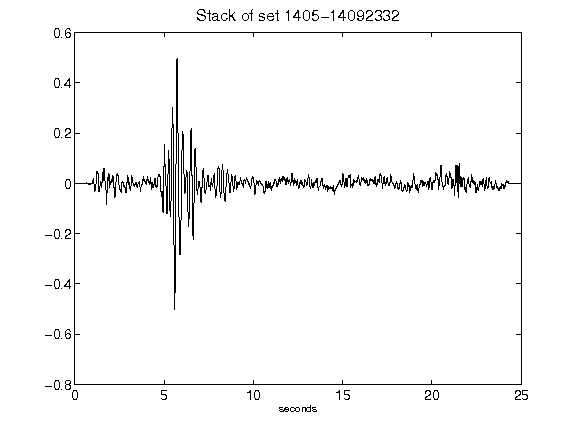](figures/1405-14092332_Stack.png)[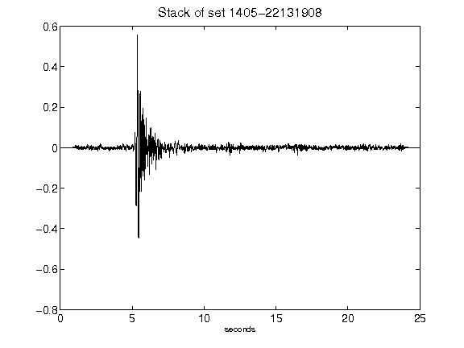](figures/1405-22131908_Stack.png)[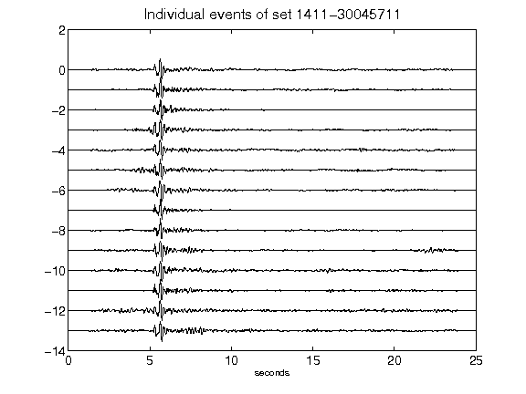](figures/1411-30045711_AllEv.png)[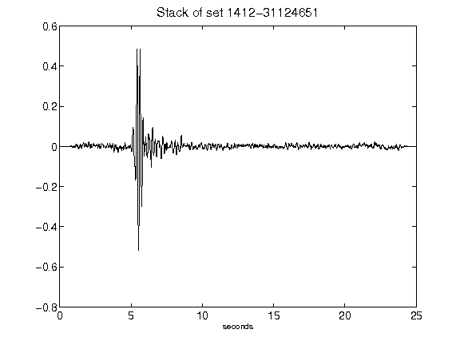](figures/1412-31124651_Stack.png)[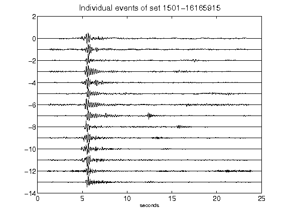](figures/1501-16165915_AllEv.png)[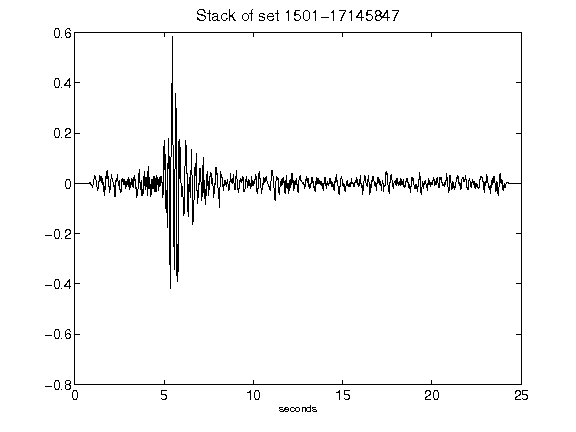](figures/1501-17145847_Stack.png)[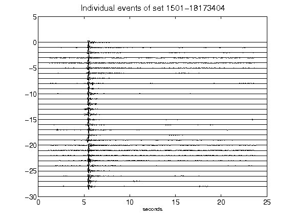](figures/1501-18173404_AllEv.png)[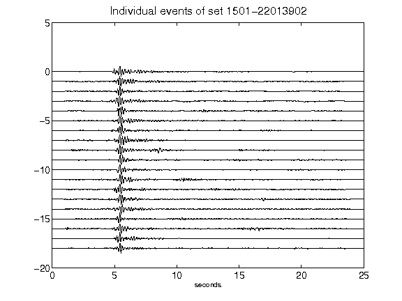](figures/1501-22013902_AllEv.png)[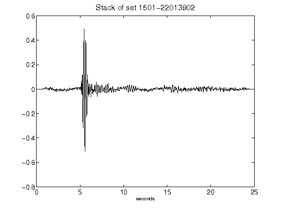](figures/1501-22013902_Stack.png)[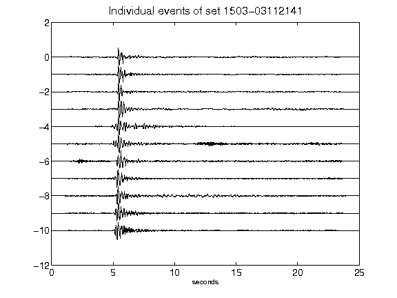](figures/1503-03112141_AllEv.png)[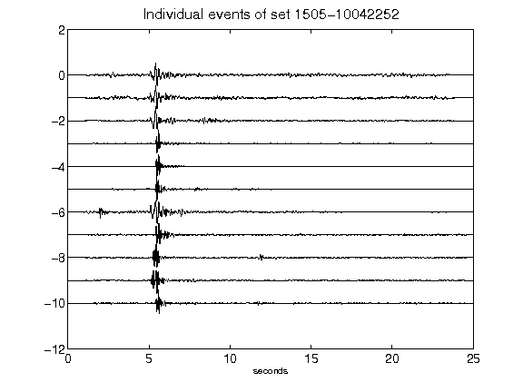](figures/1505-10042252_AllEv.png)[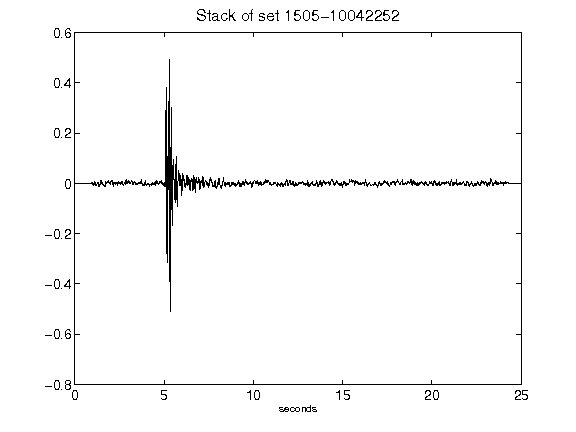](figures/1505-10042252_Stack.png)[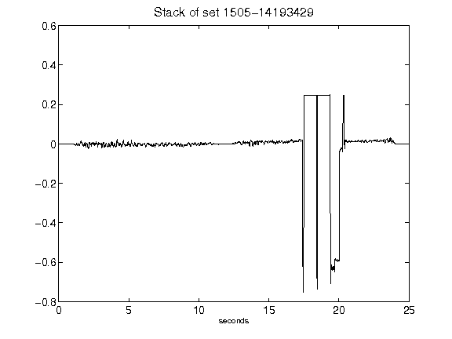](figures/1505-14193429_Stack.png)