# Repeating Earthquake Activity at RCM

## Waveforms
[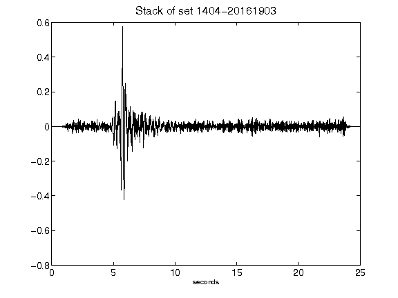](figures/1404-20161903_Stack.png)[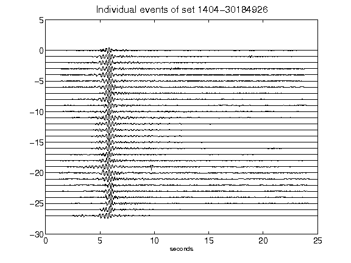](figures/1404-30184926_AllEv.png)[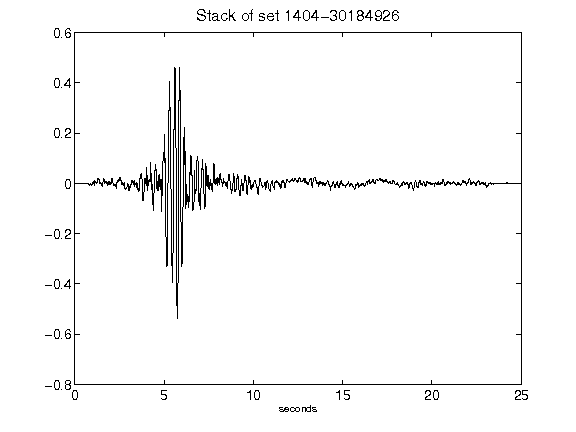](figures/1404-30184926_Stack.png)[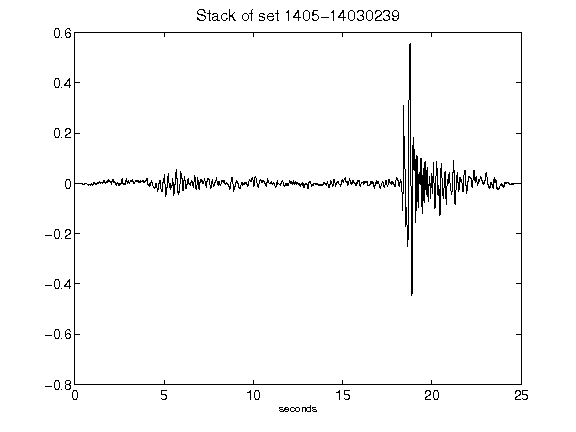](figures/1405-14030239_Stack.png)[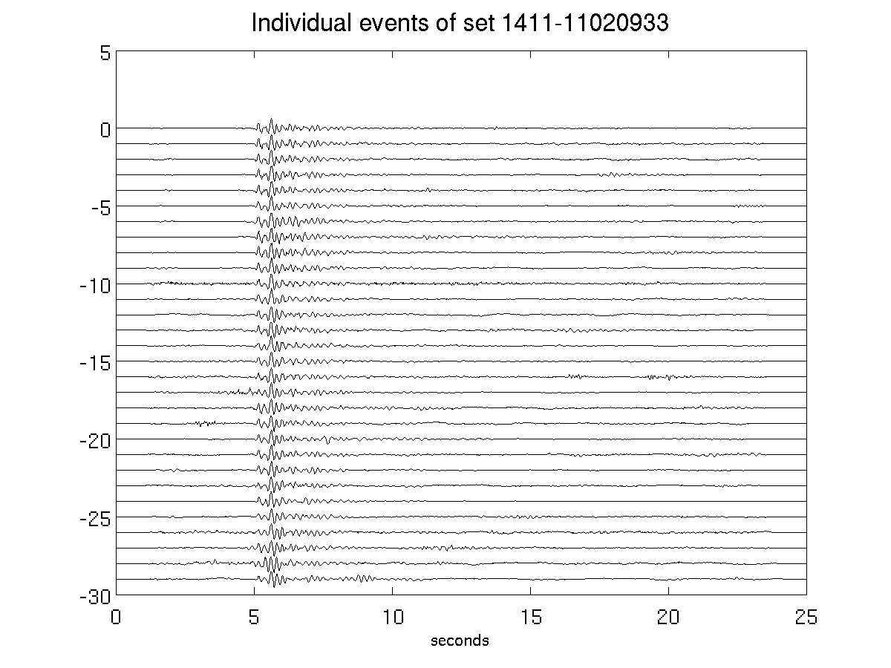](figures/1411-11020933_AllEv.png)[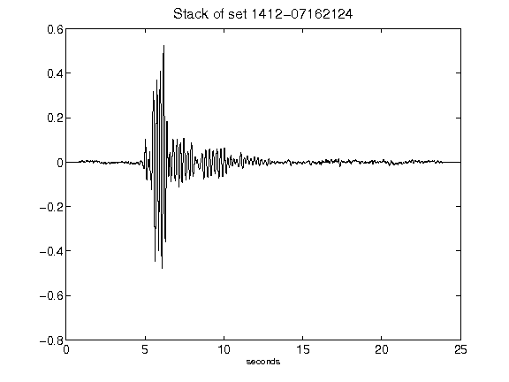](figures/1412-07162124_Stack.png)[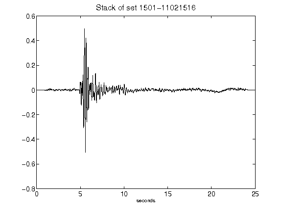](figures/1501-11021516_Stack.png)[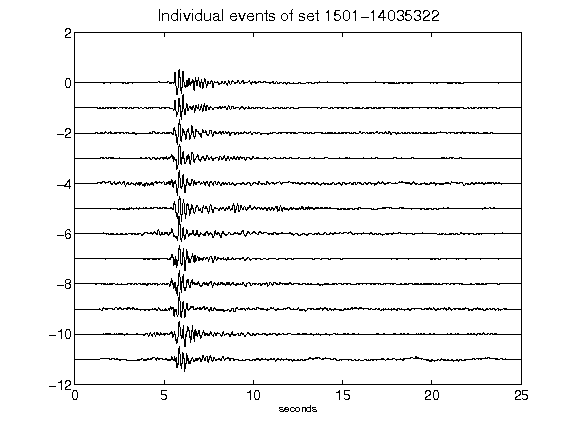](figures/1501-14035322_AllEv.png)[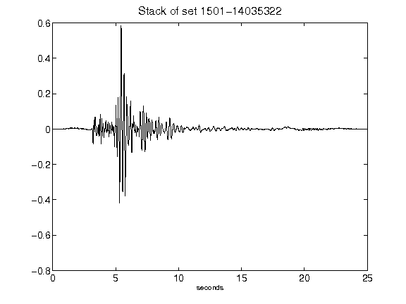](figures/1501-14035322_Stack.png)[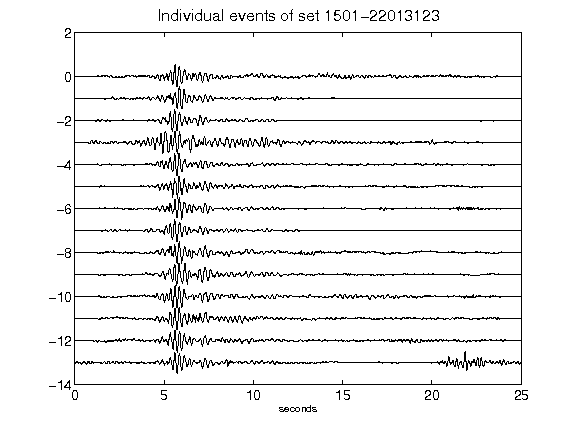](figures/1501-22013123_AllEv.png)[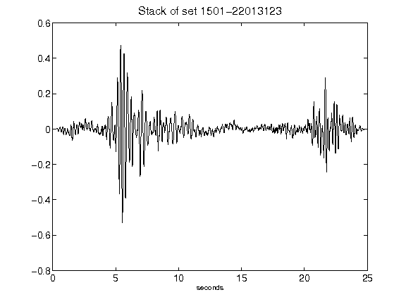](figures/1501-22013123_Stack.png)[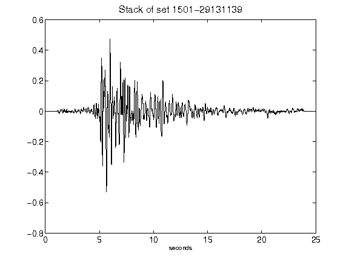](figures/1501-29131139_Stack.png)[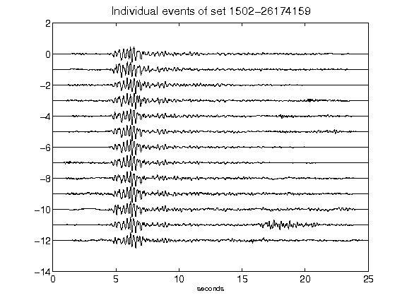](figures/1502-26174159_AllEv.png)[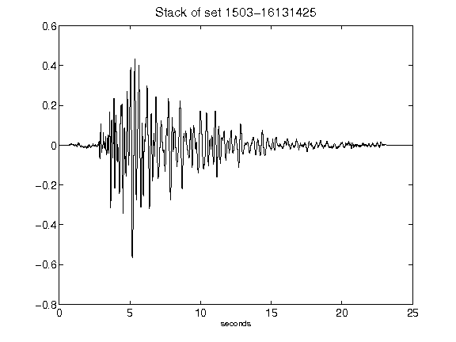](figures/1503-16131425_Stack.png)