# Repeating Earthquake Activity at RCM

## Waveforms
[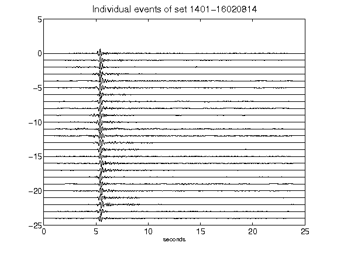](figures/1401-16020814_AllEv.png)[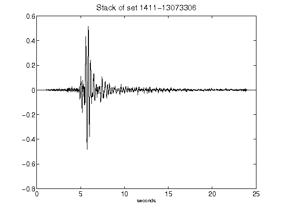](figures/1411-13073306_Stack.png)[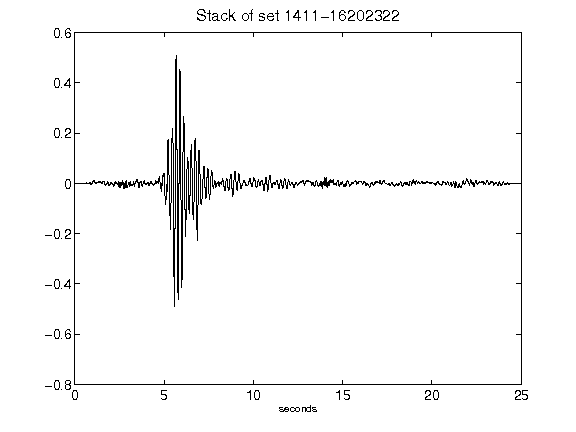](figures/1411-16202322_Stack.png)[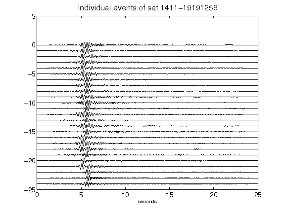](figures/1411-19191256_AllEv.png)[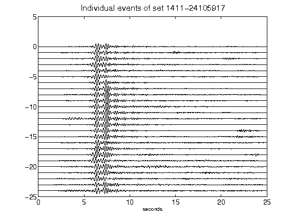](figures/1411-24105917_AllEv.png)[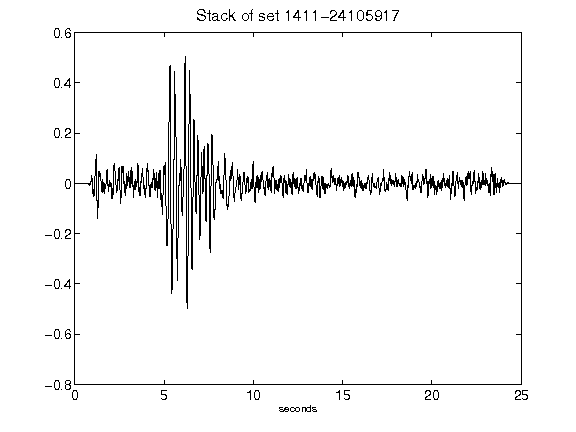](figures/1411-24105917_Stack.png)[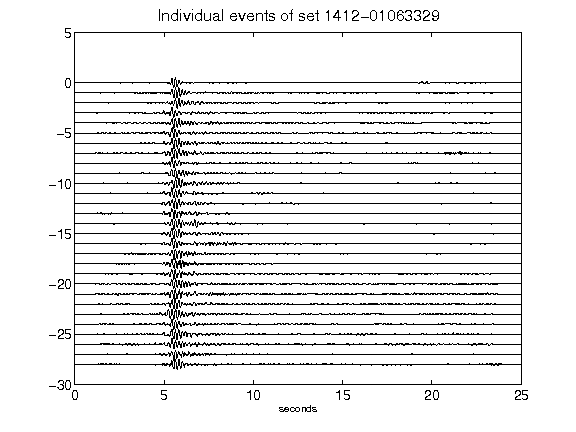](figures/1412-01063329_AllEv.png)[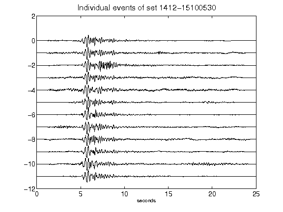](figures/1412-15100530_AllEv.png)[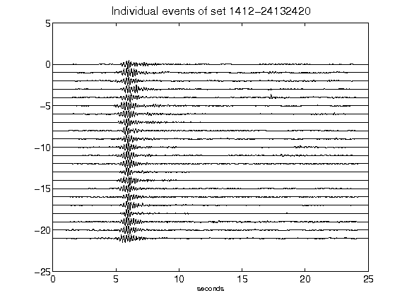](figures/1412-24132420_AllEv.png)[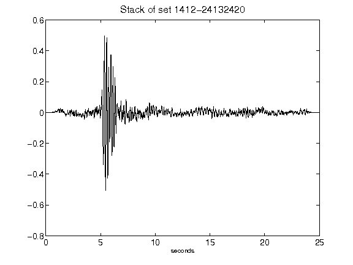](figures/1412-24132420_Stack.png)[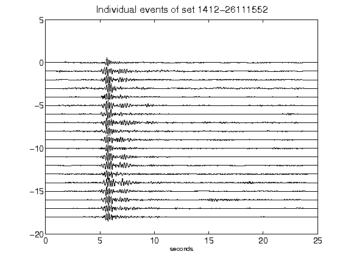](figures/1412-26111552_AllEv.png)[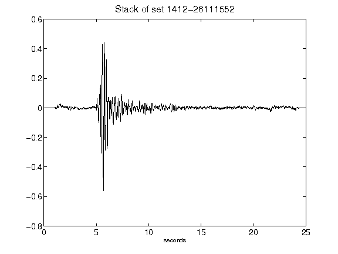](figures/1412-26111552_Stack.png)[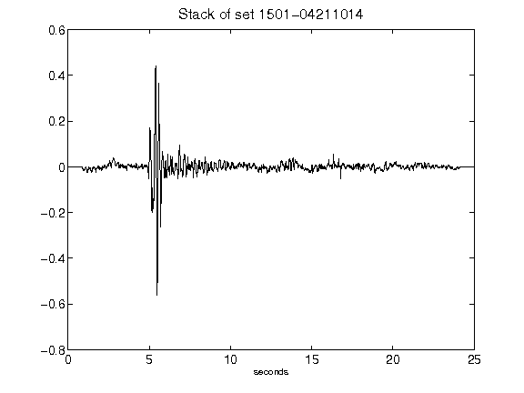](figures/1501-04211014_Stack.png)[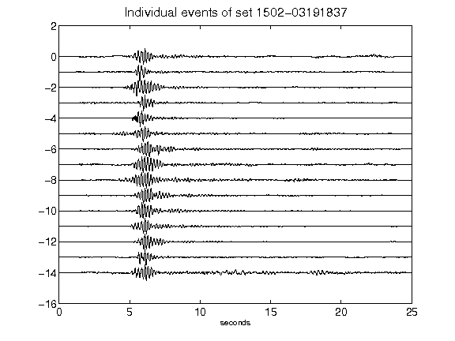](figures/1502-03191837_AllEv.png)[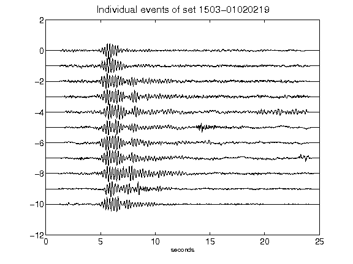](figures/1503-01020219_AllEv.png)[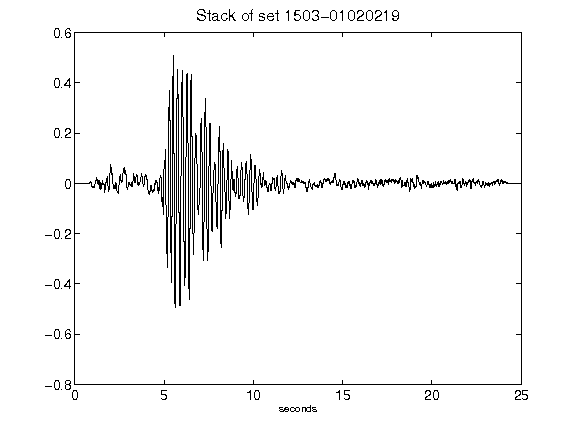](figures/1503-01020219_Stack.png)[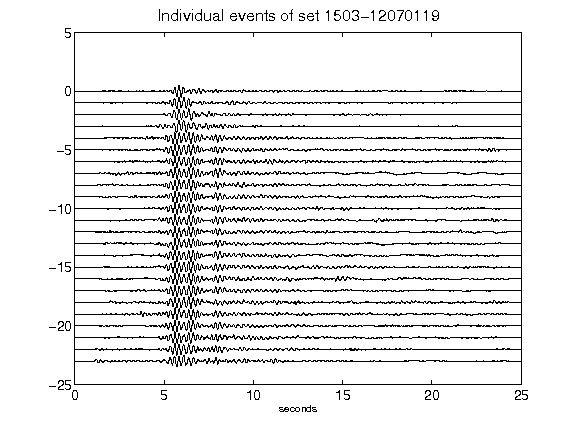](figures/1503-12070119_AllEv.png)[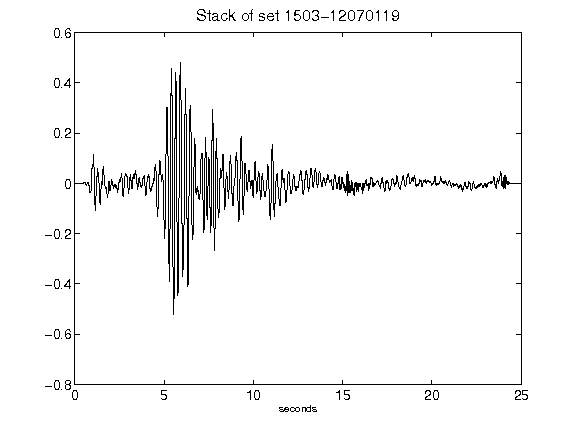](figures/1503-12070119_Stack.png)[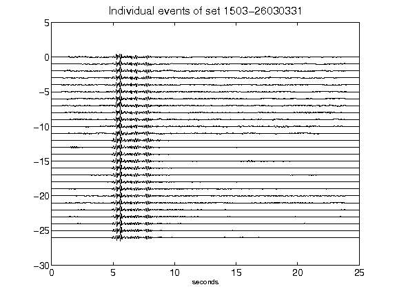](figures/1503-26030331_AllEv.png)[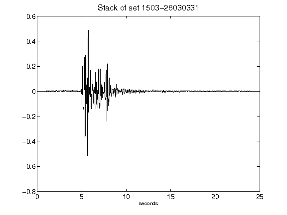](figures/1503-26030331_Stack.png)