# Repeating Earthquake Activity at RCM

## Waveforms
[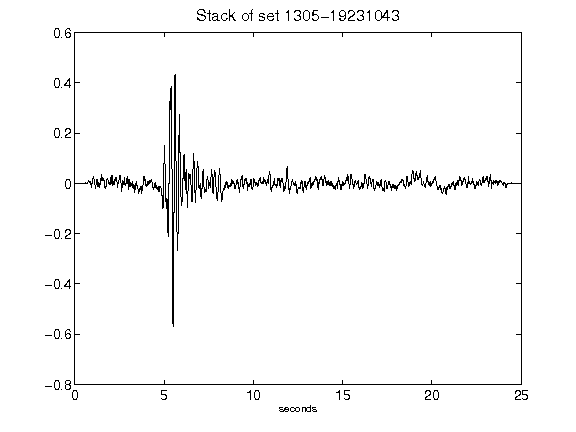](figures/1305-19231043_Stack.png)[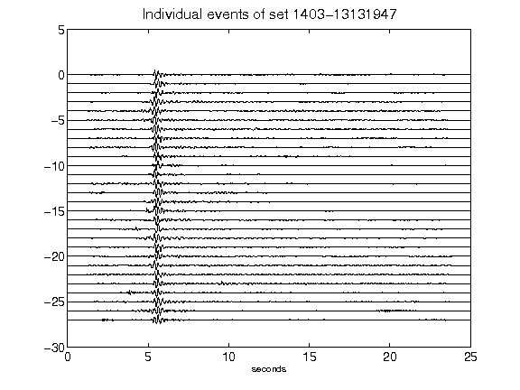](figures/1403-13131947_AllEv.png)[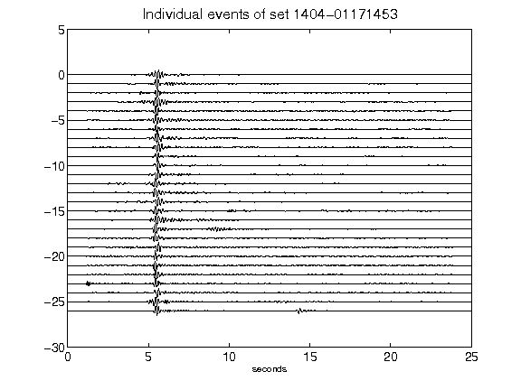](figures/1404-01171453_AllEv.png)[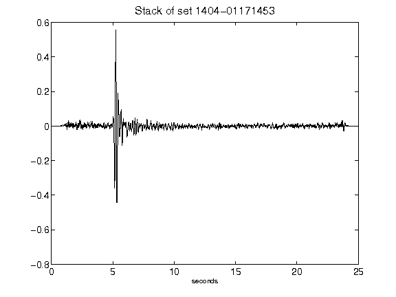](figures/1404-01171453_Stack.png)[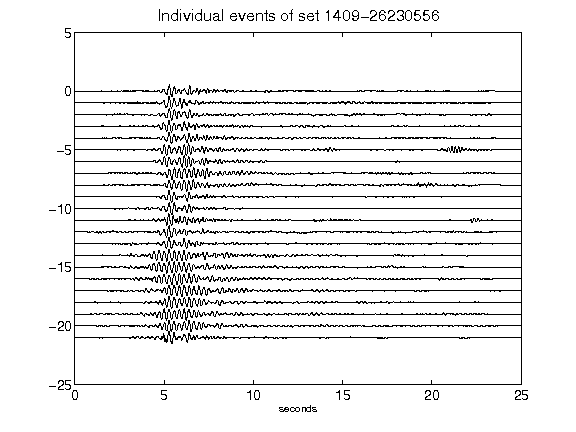](figures/1409-26230556_AllEv.png)[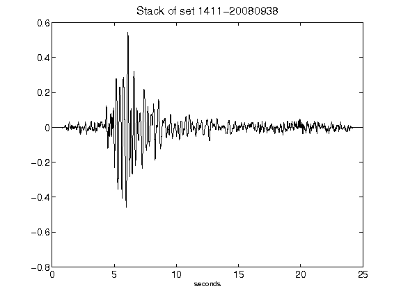](figures/1411-20080938_Stack.png)[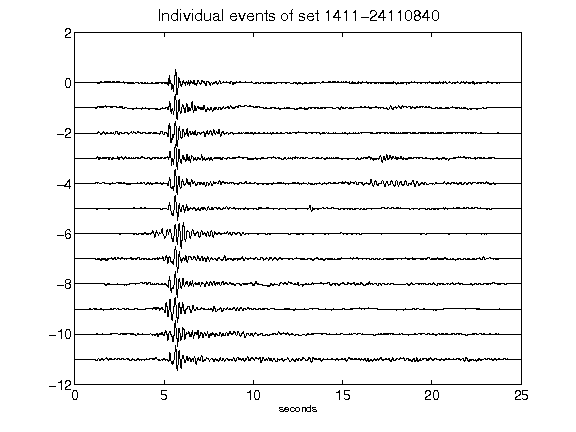](figures/1411-24110840_AllEv.png)[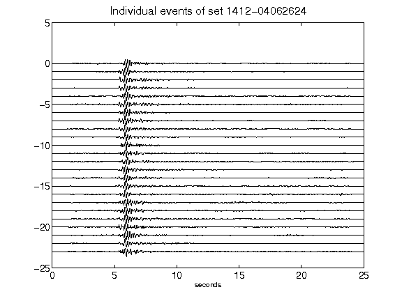](figures/1412-04062624_AllEv.png)[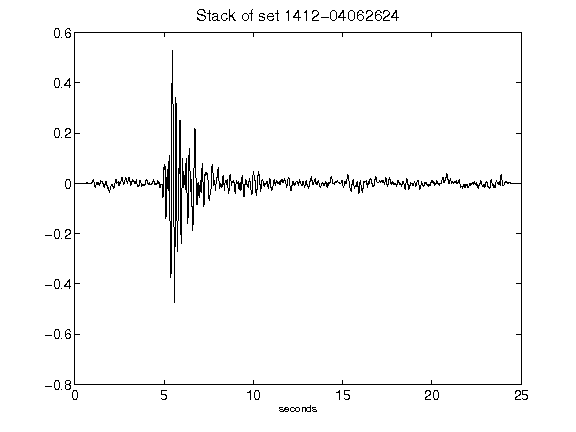](figures/1412-04062624_Stack.png)[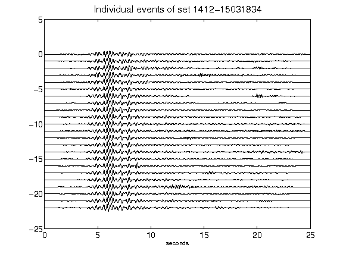](figures/1412-15031834_AllEv.png)[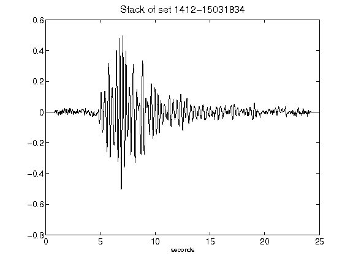](figures/1412-15031834_Stack.png)[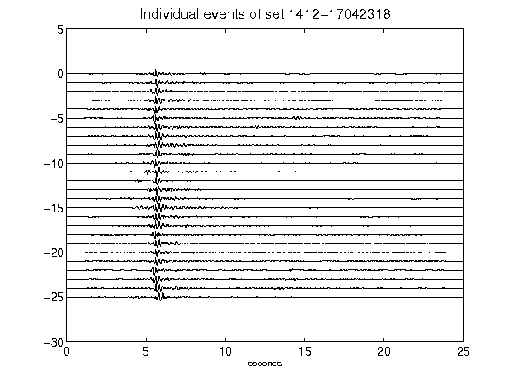](figures/1412-17042318_AllEv.png)[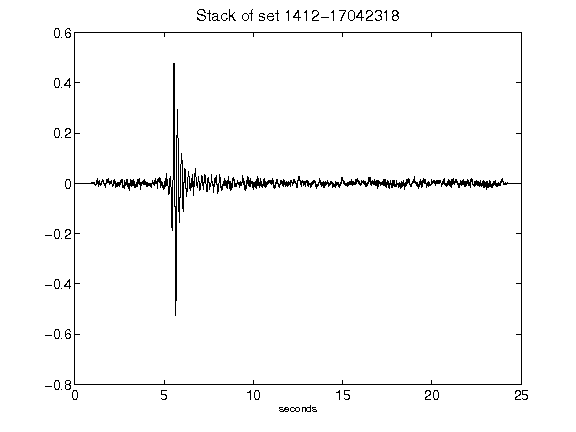](figures/1412-17042318_Stack.png)[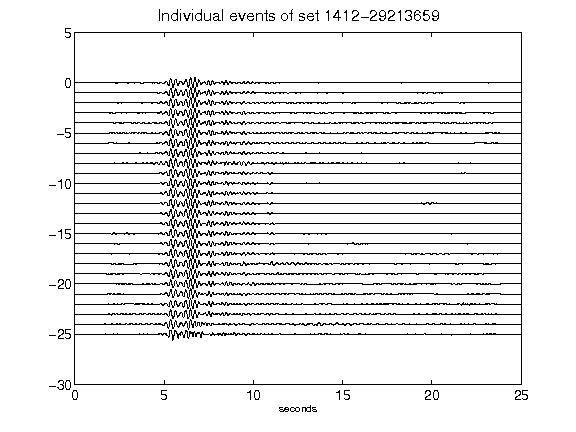](figures/1412-29213659_AllEv.png)[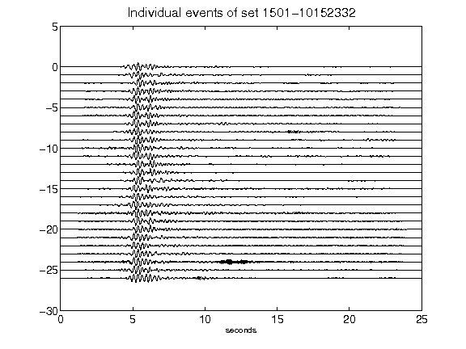](figures/1501-10152332_AllEv.png)[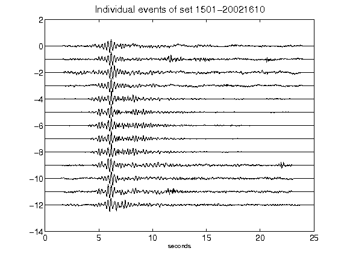](figures/1501-20021610_AllEv.png)[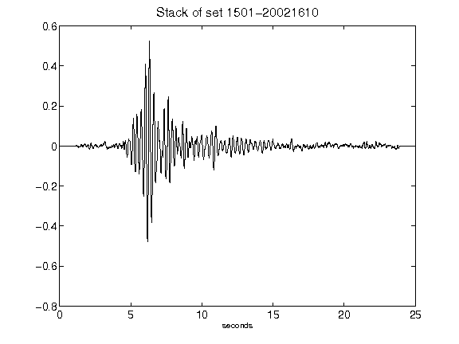](figures/1501-20021610_Stack.png)[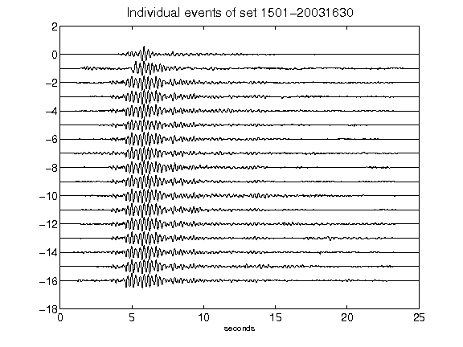](figures/1501-20031630_AllEv.png)[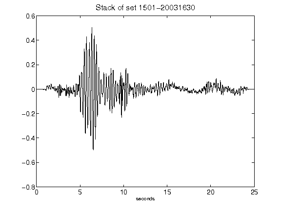](figures/1501-20031630_Stack.png)[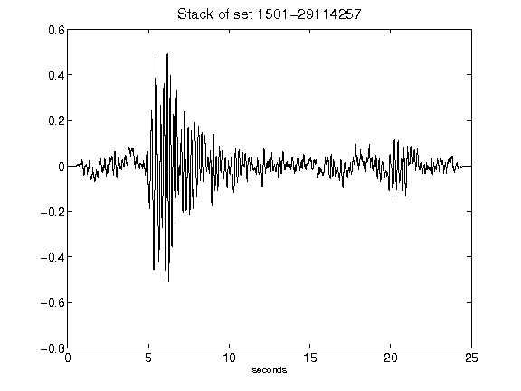](figures/1501-29114257_Stack.png)[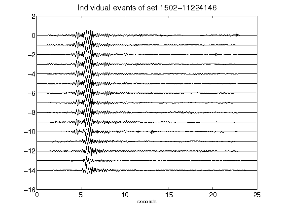](figures/1502-11224146_AllEv.png)[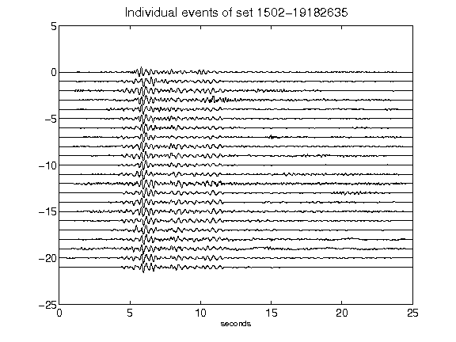](figures/1502-19182635_AllEv.png)[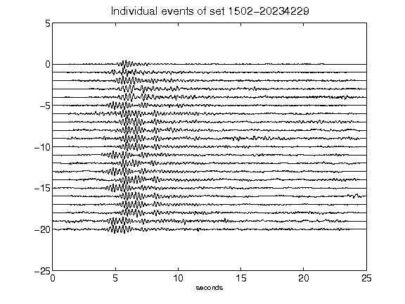](figures/1502-20234229_AllEv.png)[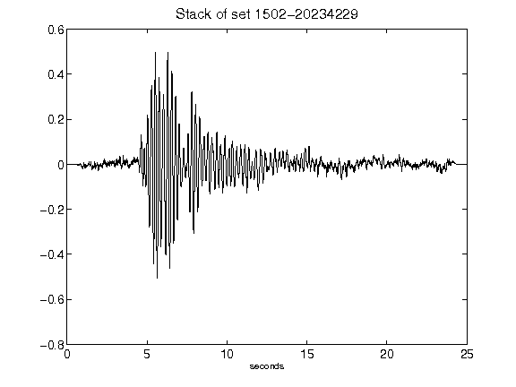](figures/1502-20234229_Stack.png)[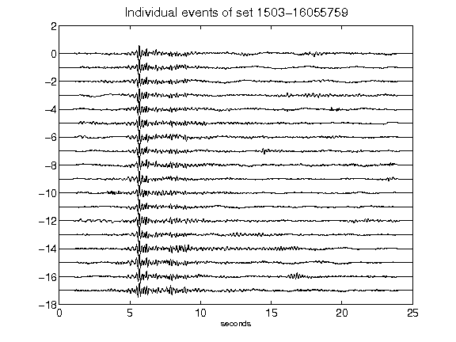](figures/1503-16055759_AllEv.png)[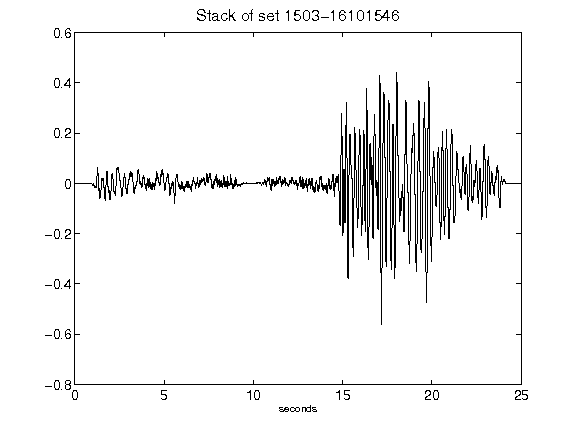](figures/1503-16101546_Stack.png)[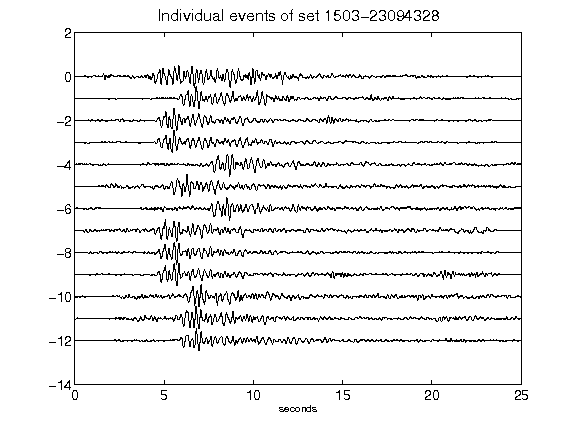](figures/1503-23094328_AllEv.png)[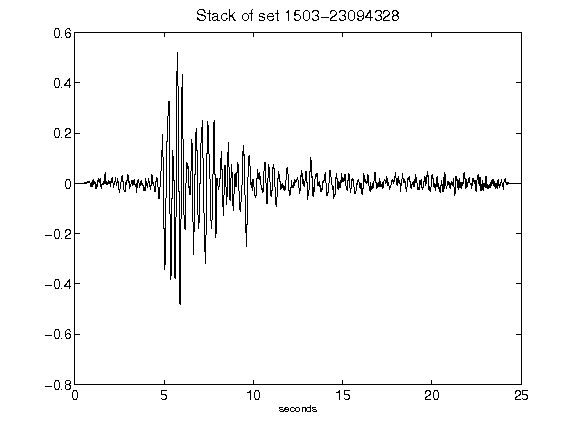](figures/1503-23094328_Stack.png)[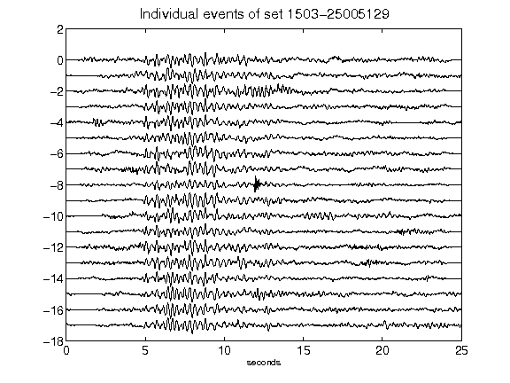](figures/1503-25005129_AllEv.png)[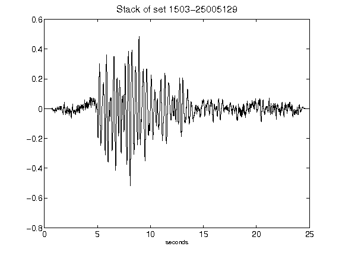](figures/1503-25005129_Stack.png)