# Repeating Earthquake Activity at RCM

## Waveforms
[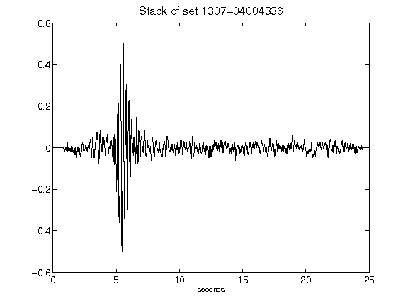](figures/1307-04004336_Stack.png)[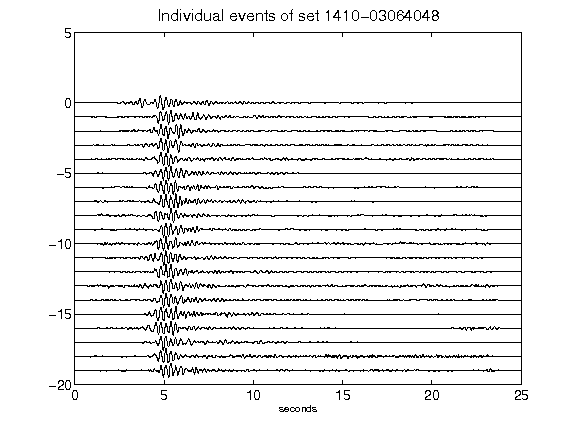](figures/1410-03064048_AllEv.png)[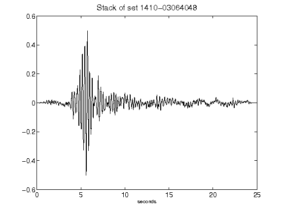](figures/1410-03064048_Stack.png)[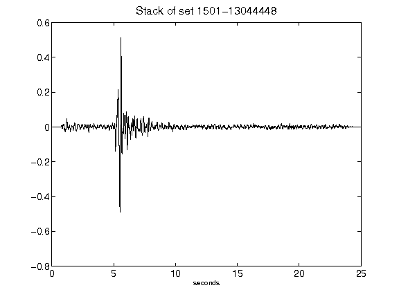](figures/1501-13044448_Stack.png)[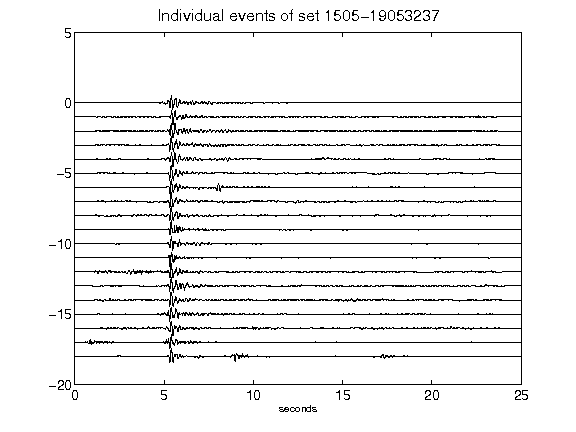](figures/1505-19053237_AllEv.png)[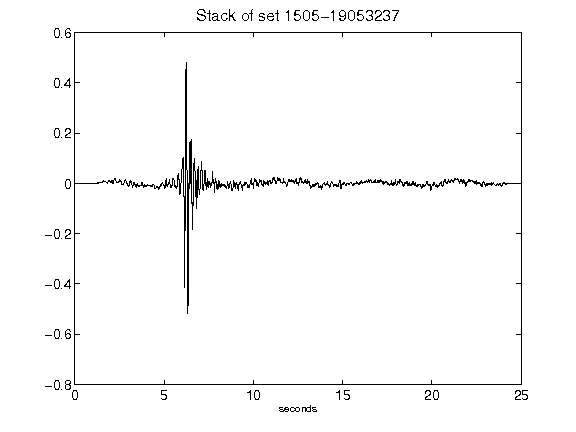](figures/1505-19053237_Stack.png)[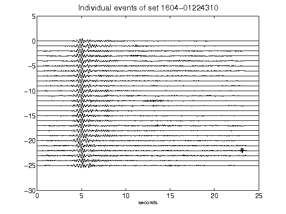](figures/1604-01224310_AllEv.png)[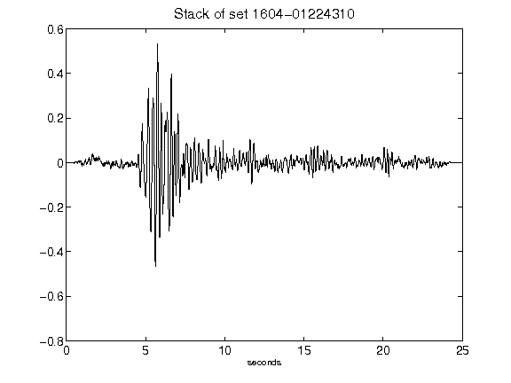](figures/1604-01224310_Stack.png)[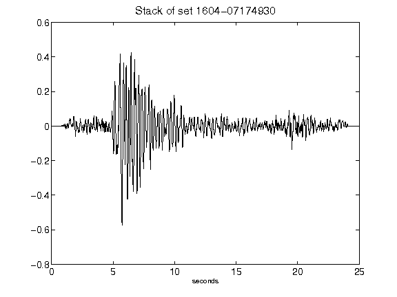](figures/1604-07174930_Stack.png)[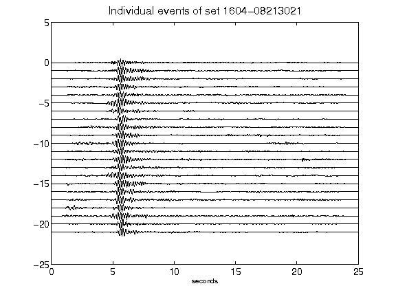](figures/1604-08213021_AllEv.png)[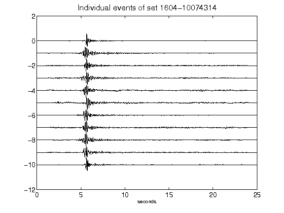](figures/1604-10074314_AllEv.png)[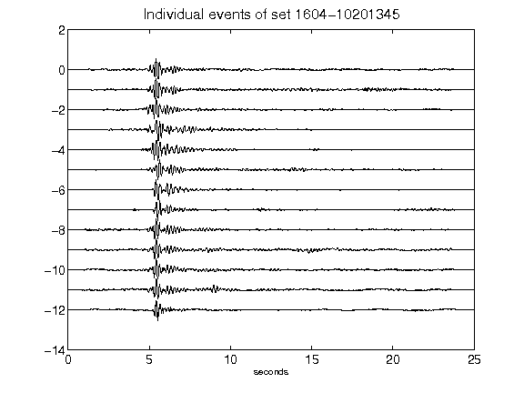](figures/1604-10201345_AllEv.png)[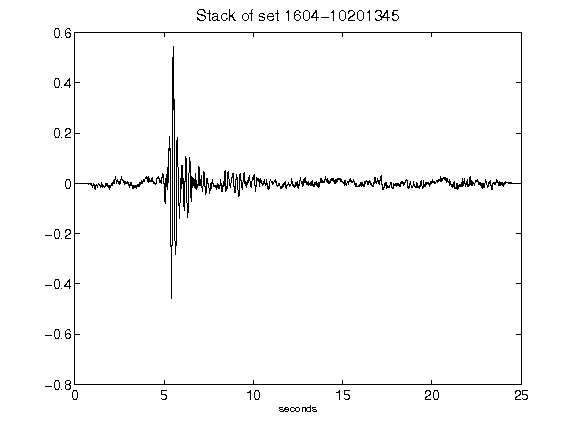](figures/1604-10201345_Stack.png)[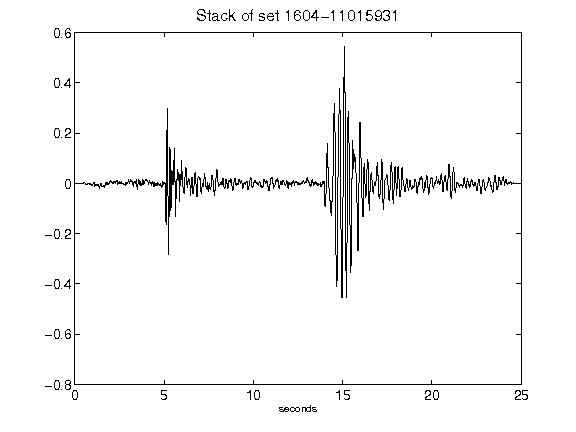](figures/1604-11015931_Stack.png)[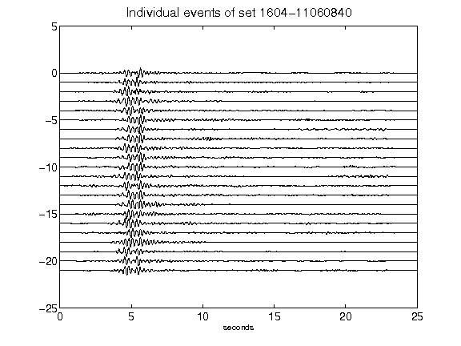](figures/1604-11060840_AllEv.png)[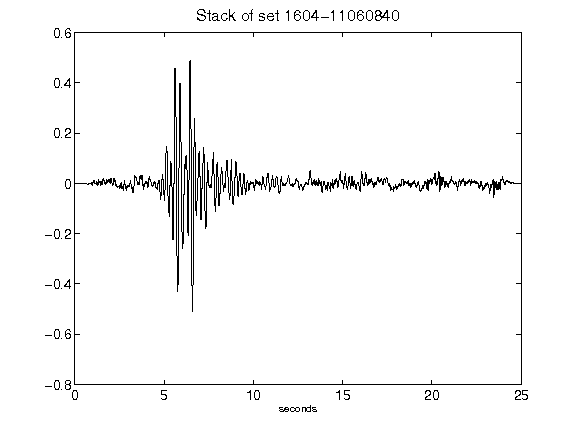](figures/1604-11060840_Stack.png)[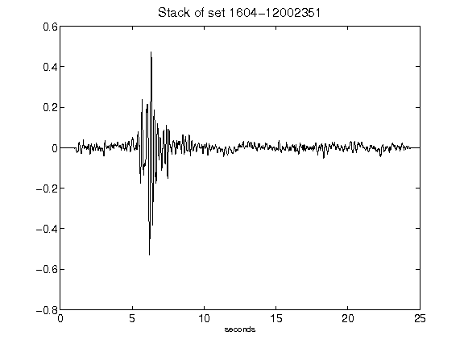](figures/1604-12002351_Stack.png)[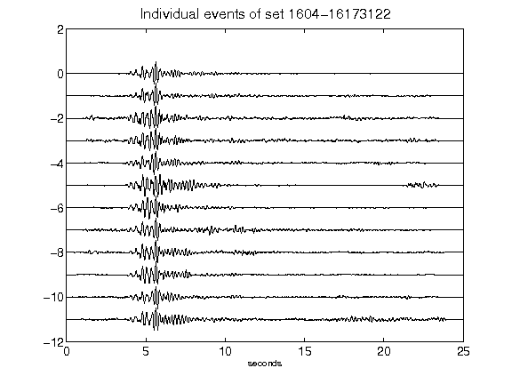](figures/1604-16173122_AllEv.png)[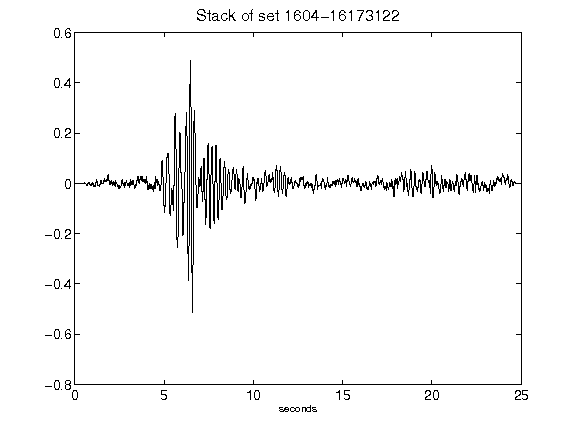](figures/1604-16173122_Stack.png)[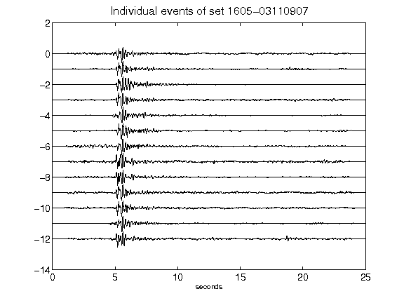](figures/1605-03110907_AllEv.png)[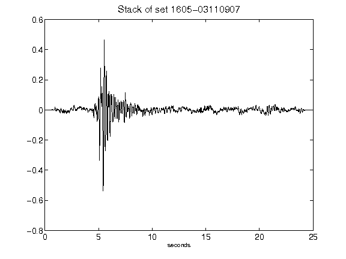](figures/1605-03110907_Stack.png)