# Repeating Earthquake Activity at RCM

## Waveforms
[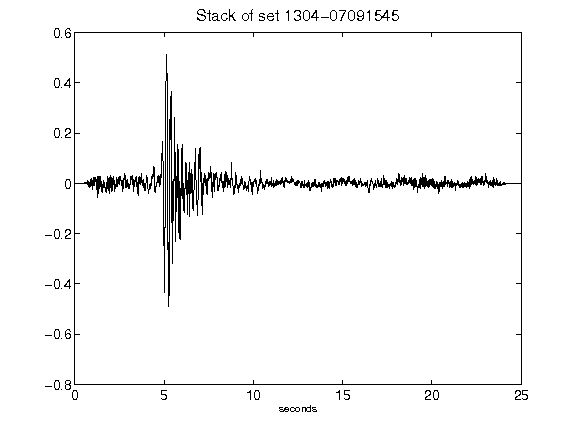](figures/1304-07091545_Stack.png)[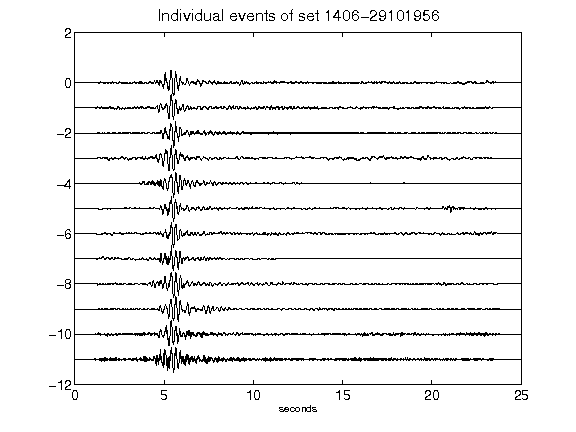](figures/1406-29101956_AllEv.png)[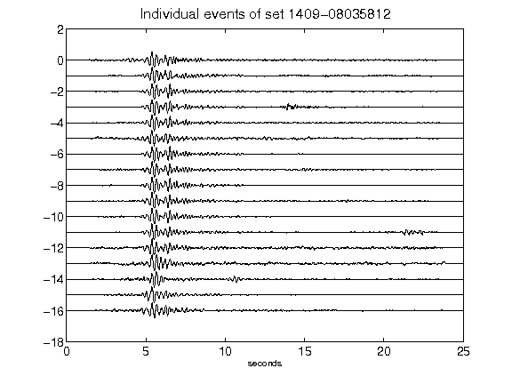](figures/1409-08035812_AllEv.png)[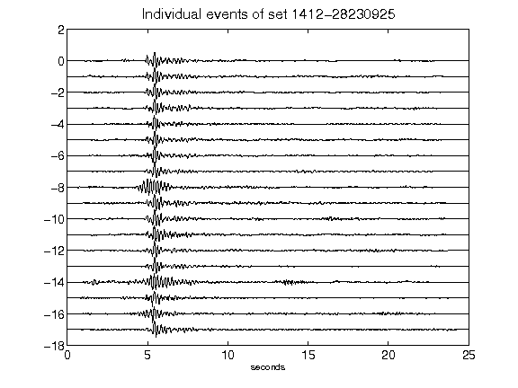](figures/1412-28230925_AllEv.png)[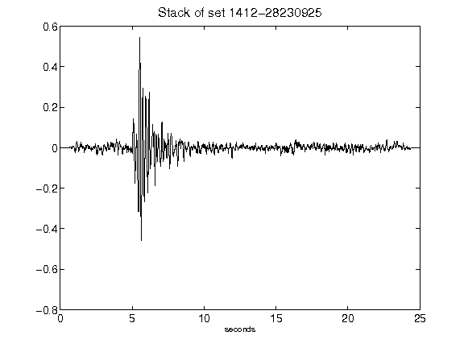](figures/1412-28230925_Stack.png)[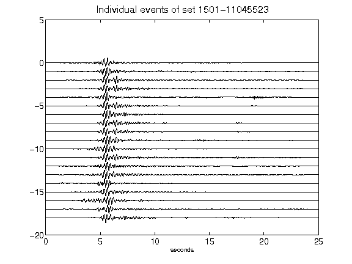](figures/1501-11045523_AllEv.png)[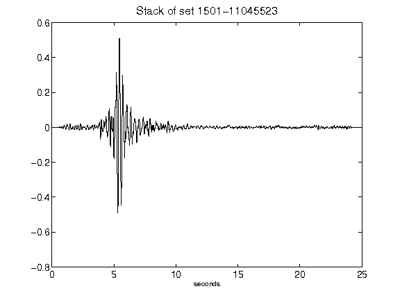](figures/1501-11045523_Stack.png)[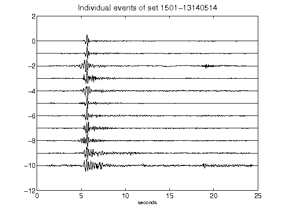](figures/1501-13140514_AllEv.png)[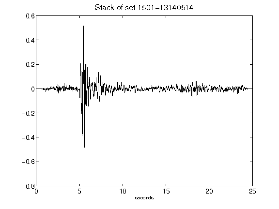](figures/1501-13140514_Stack.png)[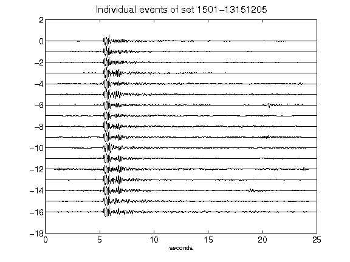](figures/1501-13151205_AllEv.png)[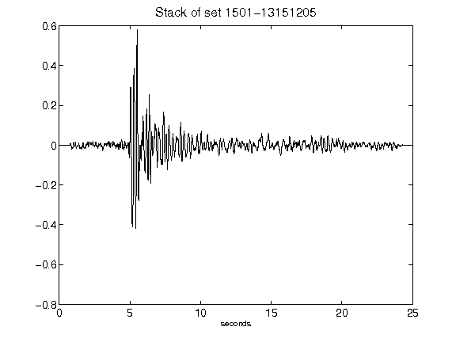](figures/1501-13151205_Stack.png)