# Repeating Earthquake Activity at RCM

## Waveforms
[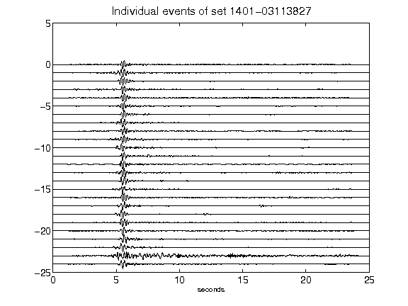](figures/1401-03113827_AllEv.png)[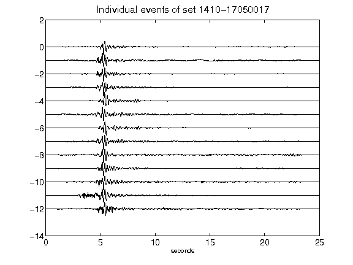](figures/1410-17050017_AllEv.png)[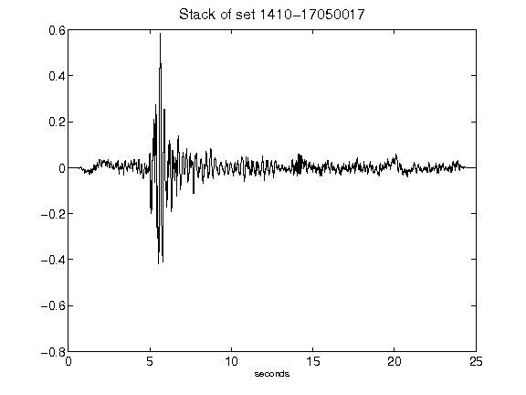](figures/1410-17050017_Stack.png)[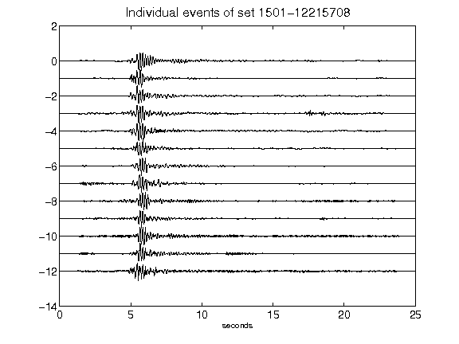](figures/1501-12215708_AllEv.png)[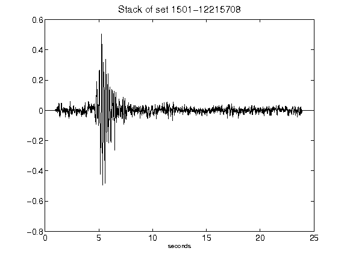](figures/1501-12215708_Stack.png)[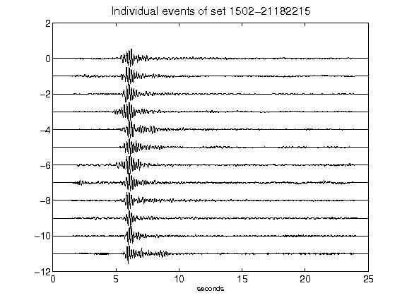](figures/1502-21182215_AllEv.png)[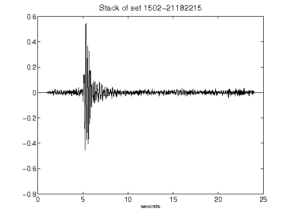](figures/1502-21182215_Stack.png)[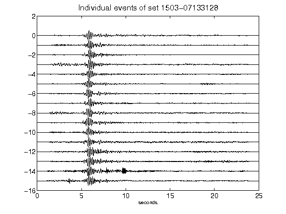](figures/1503-07133128_AllEv.png)[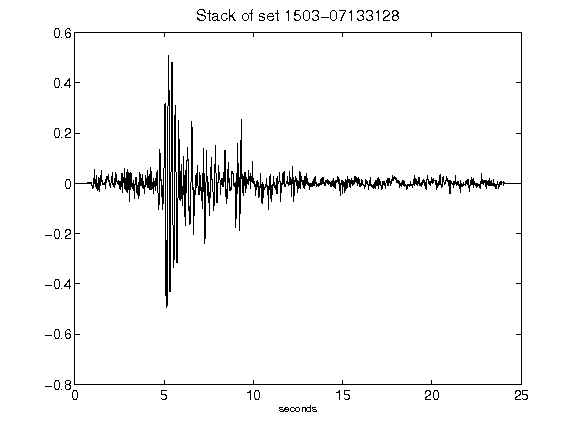](figures/1503-07133128_Stack.png)[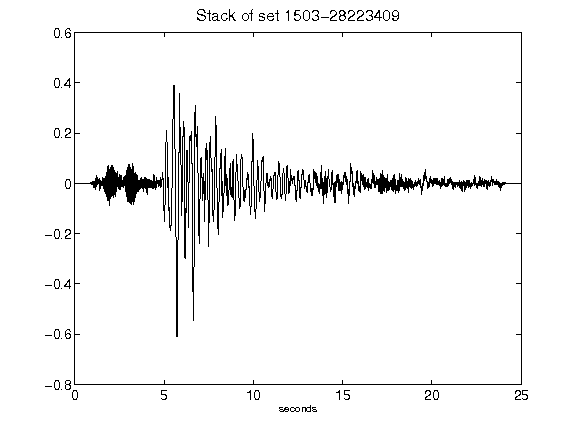](figures/1503-28223409_Stack.png)[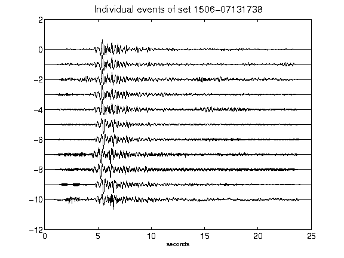](figures/1506-07131738_AllEv.png)[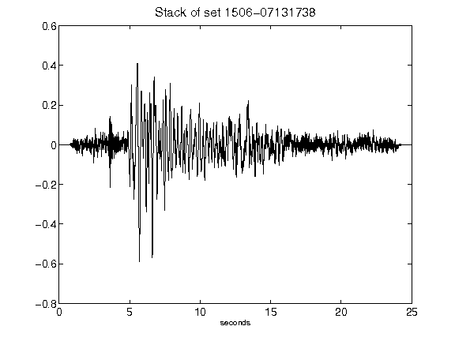](figures/1506-07131738_Stack.png)[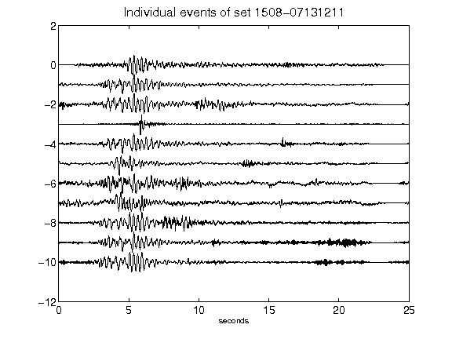](figures/1508-07131211_AllEv.png)[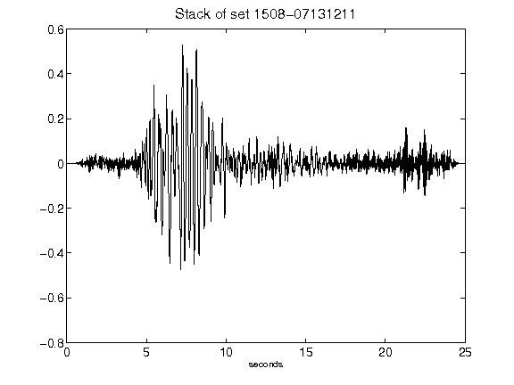](figures/1508-07131211_Stack.png)[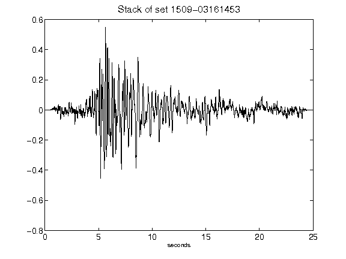](figures/1509-03161453_Stack.png)