# Repeating Earthquake Activity at RCM

## Waveforms
[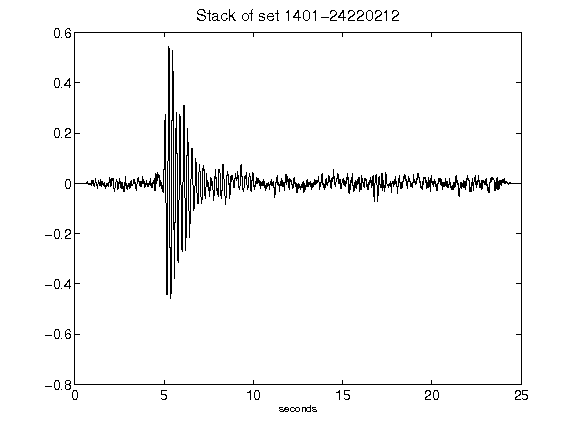](figures/1401-24220212_Stack.png)[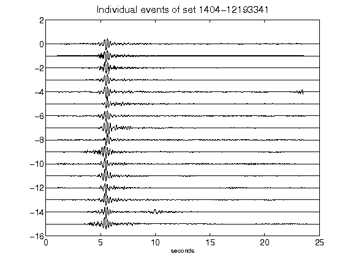](figures/1404-12193341_AllEv.png)[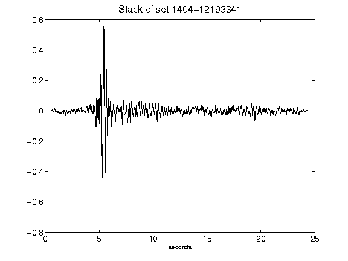](figures/1404-12193341_Stack.png)[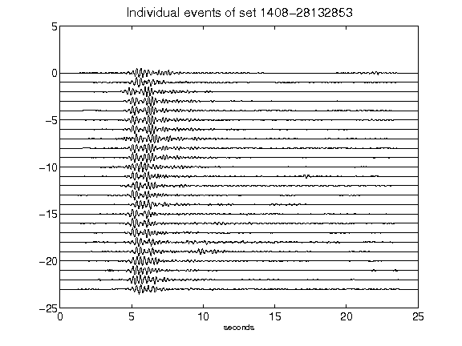](figures/1408-28132853_AllEv.png)[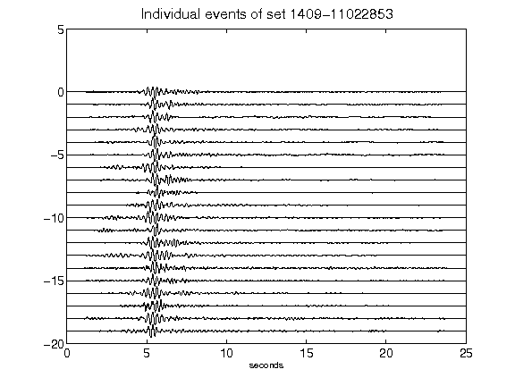](figures/1409-11022853_AllEv.png)[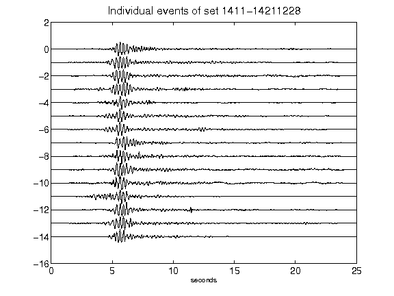](figures/1411-14211228_AllEv.png)[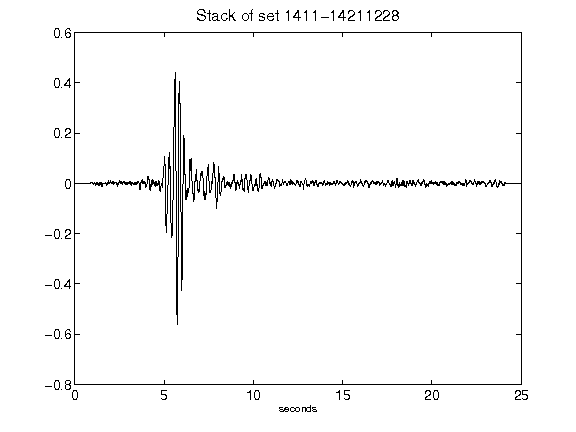](figures/1411-14211228_Stack.png)[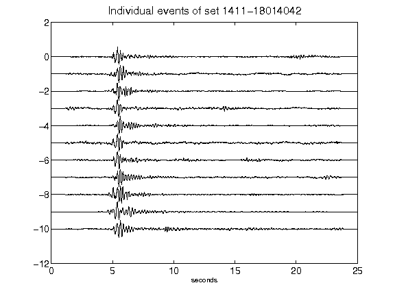](figures/1411-18014042_AllEv.png)[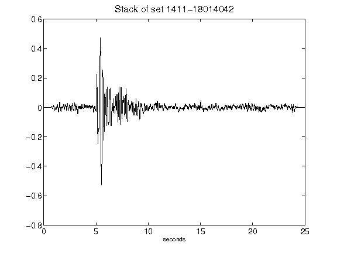](figures/1411-18014042_Stack.png)[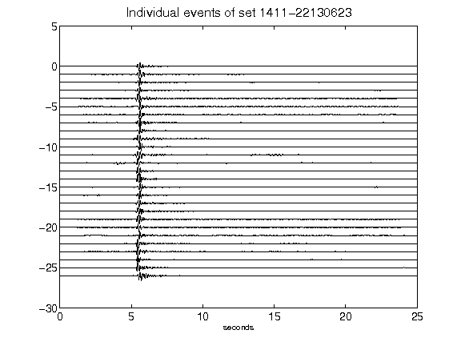](figures/1411-22130623_AllEv.png)[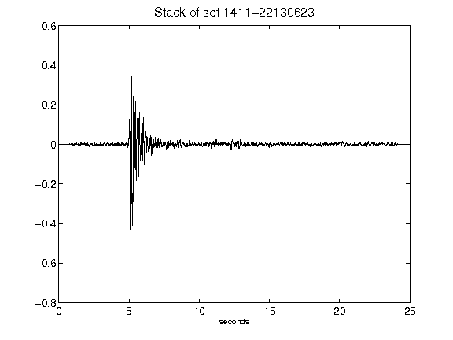](figures/1411-22130623_Stack.png)[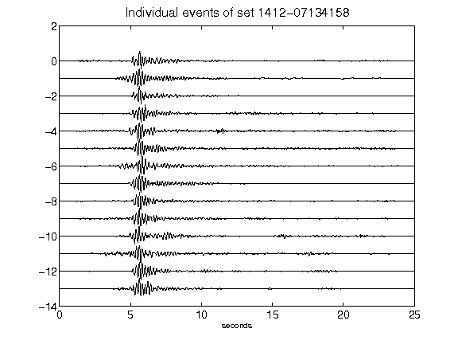](figures/1412-07134158_AllEv.png)[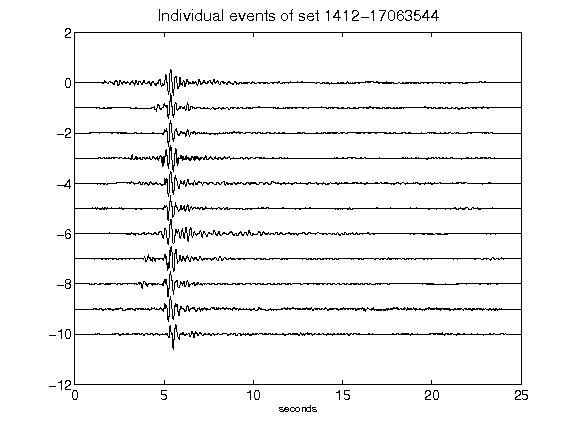](figures/1412-17063544_AllEv.png)[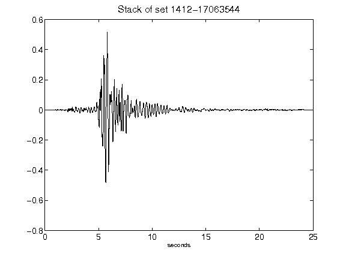](figures/1412-17063544_Stack.png)[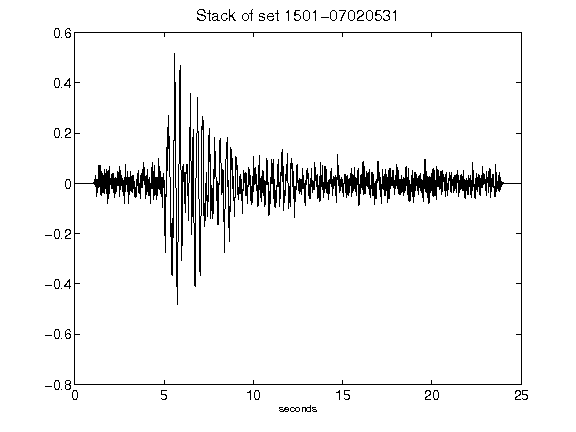](figures/1501-07020531_Stack.png)[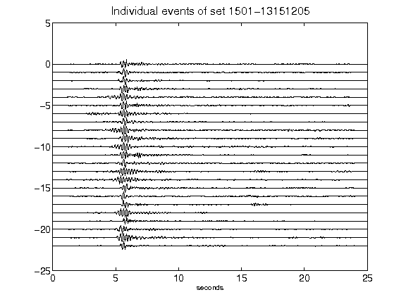](figures/1501-13151205_AllEv.png)[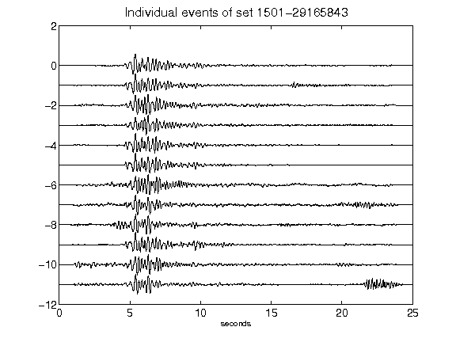](figures/1501-29165843_AllEv.png)[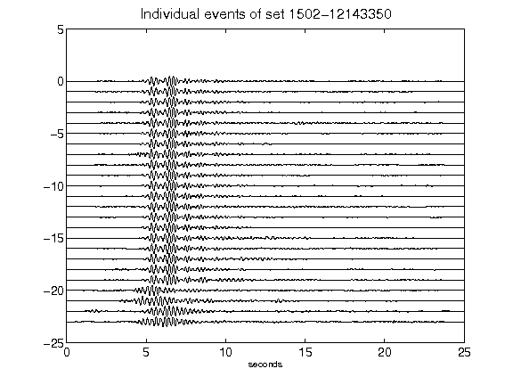](figures/1502-12143350_AllEv.png)[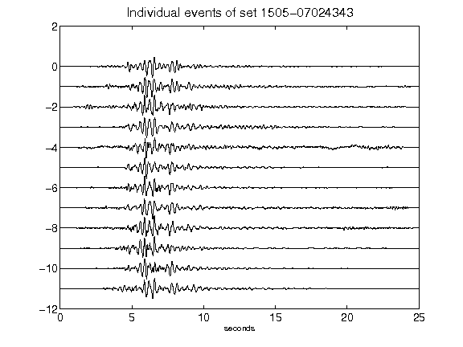](figures/1505-07024343_AllEv.png)[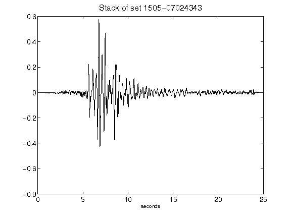](figures/1505-07024343_Stack.png)