# Repeating Earthquake Activity at RCM

## Waveforms
[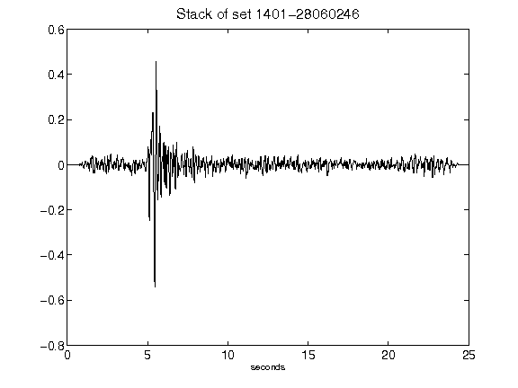](figures/1401-28060246_Stack.png)[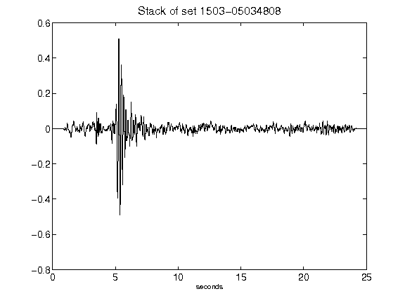](figures/1503-05034808_Stack.png)[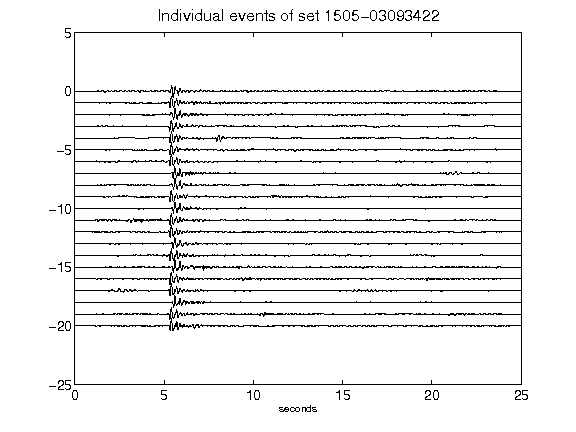](figures/1505-03093422_AllEv.png)[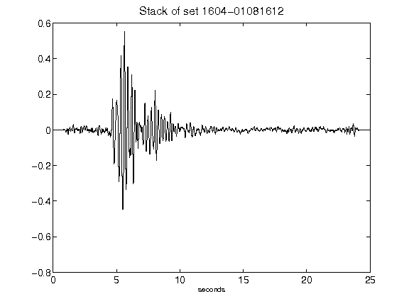](figures/1604-01081612_Stack.png)[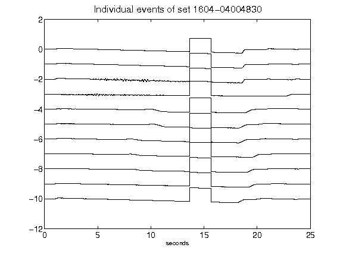](figures/1604-04004830_AllEv.png)[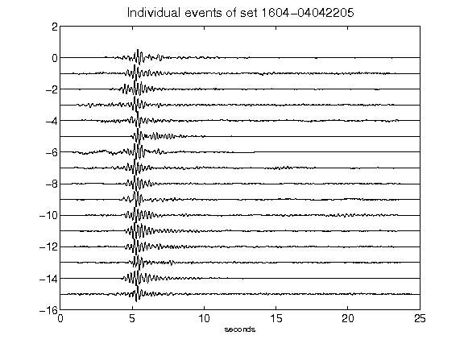](figures/1604-04042205_AllEv.png)[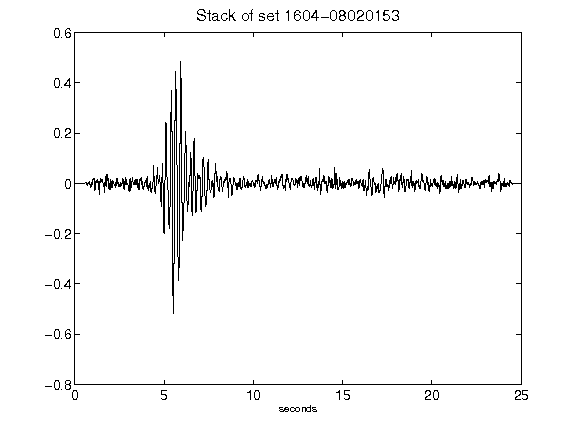](figures/1604-08020153_Stack.png)[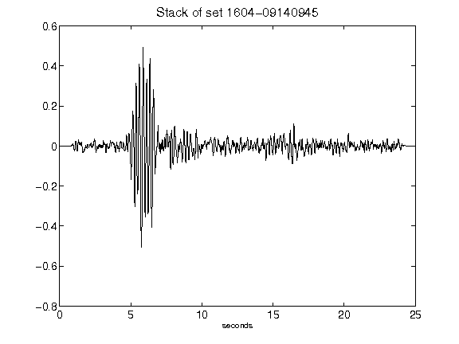](figures/1604-09140945_Stack.png)[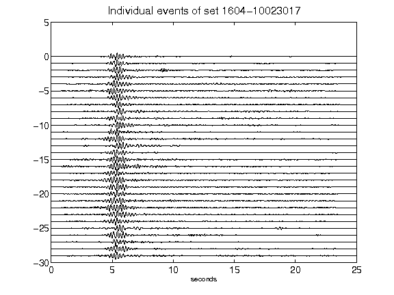](figures/1604-10023017_AllEv.png)[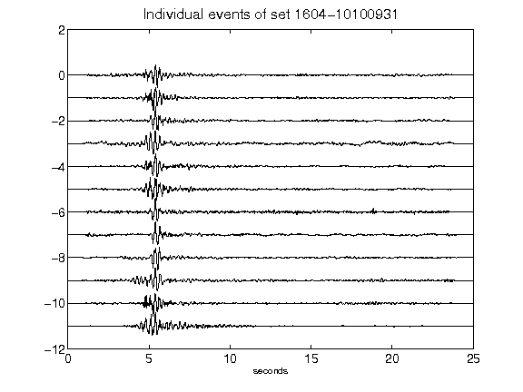](figures/1604-10100931_AllEv.png)[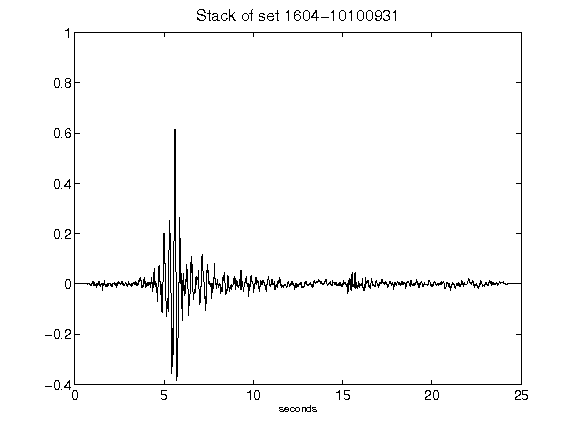](figures/1604-10100931_Stack.png)[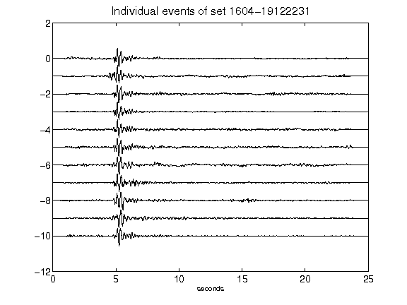](figures/1604-19122231_AllEv.png)[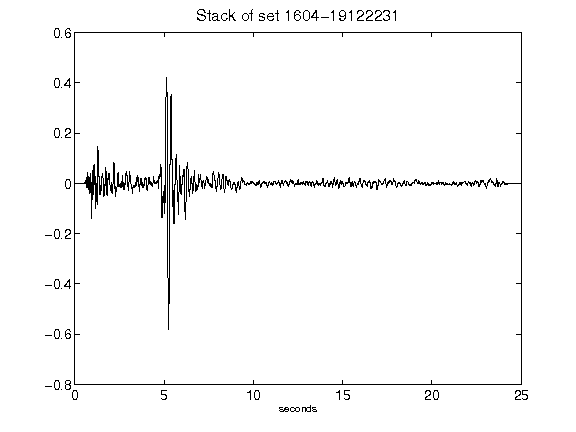](figures/1604-19122231_Stack.png)