# Repeating Earthquake Activity at RCM

## Waveforms
[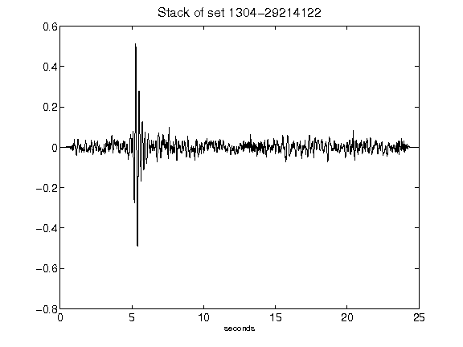](figures/1304-29214122_Stack.png)[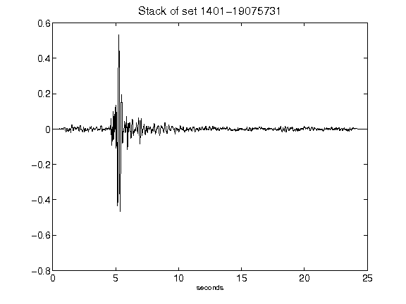](figures/1401-19075731_Stack.png)[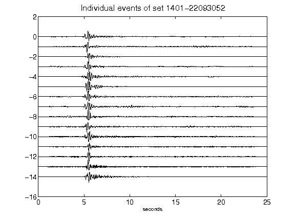](figures/1401-22093052_AllEv.png)[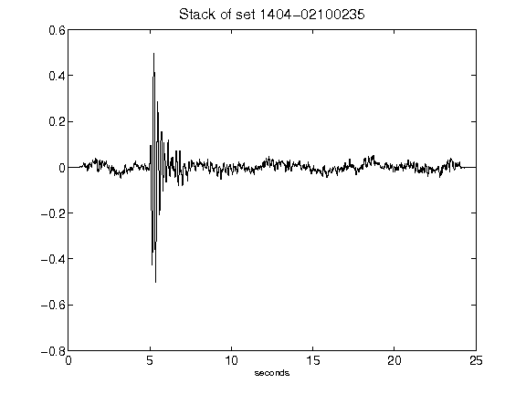](figures/1404-02100235_Stack.png)[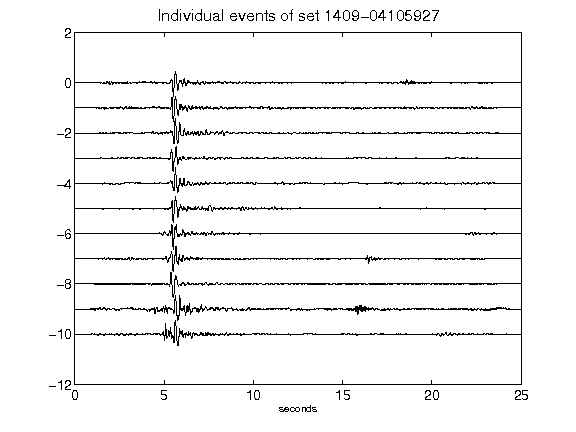](figures/1409-04105927_AllEv.png)[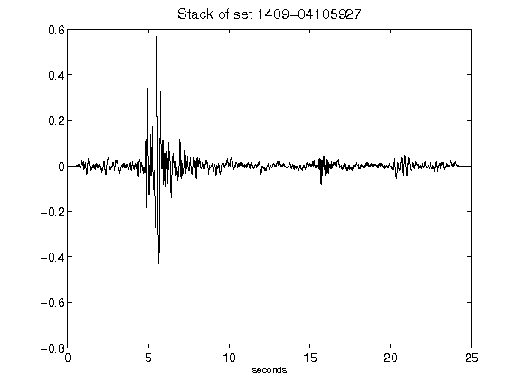](figures/1409-04105927_Stack.png)[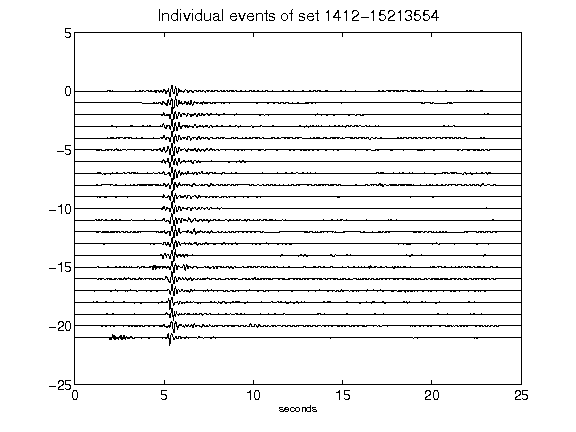](figures/1412-15213554_AllEv.png)[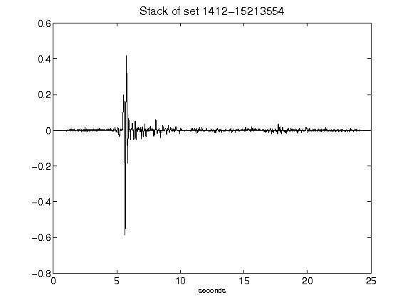](figures/1412-15213554_Stack.png)[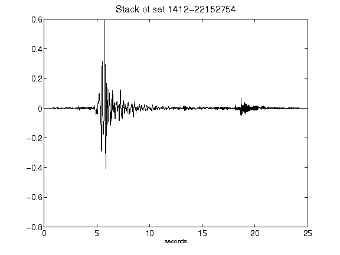](figures/1412-22152754_Stack.png)[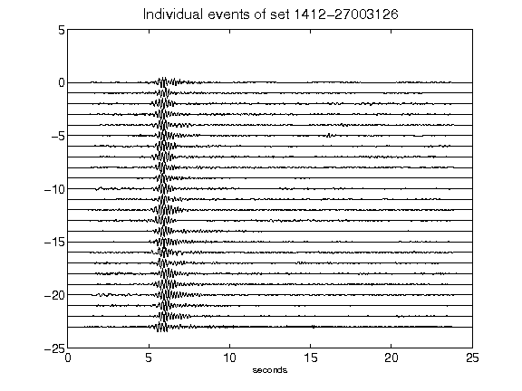](figures/1412-27003126_AllEv.png)[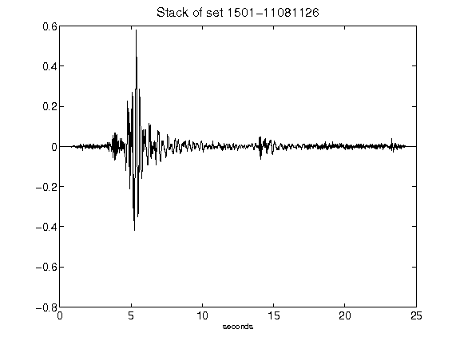](figures/1501-11081126_Stack.png)[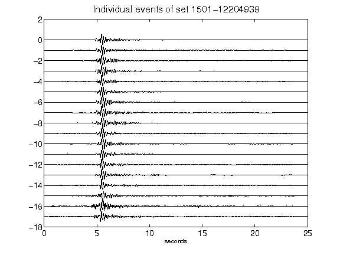](figures/1501-12204939_AllEv.png)[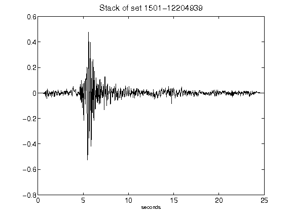](figures/1501-12204939_Stack.png)[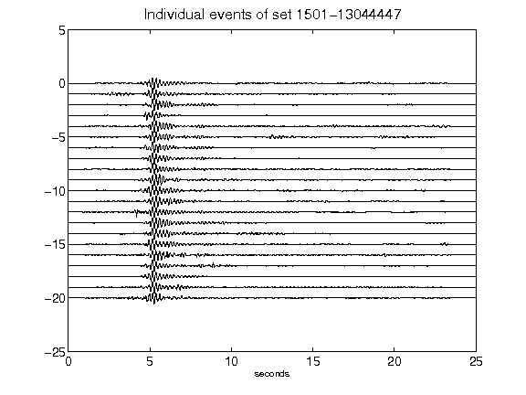](figures/1501-13044447_AllEv.png)[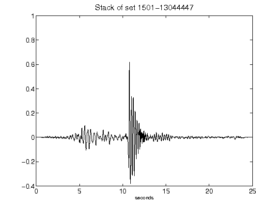](figures/1501-13044447_Stack.png)[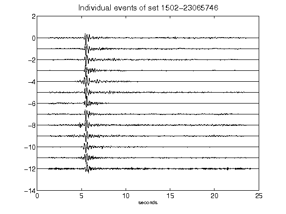](figures/1502-23065746_AllEv.png)[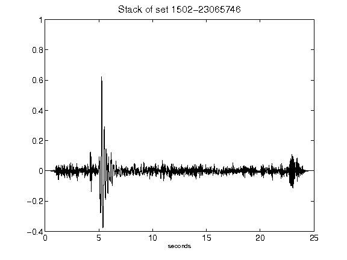](figures/1502-23065746_Stack.png)[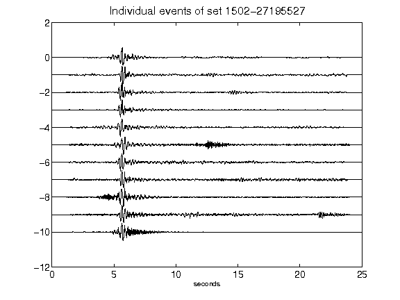](figures/1502-27195527_AllEv.png)[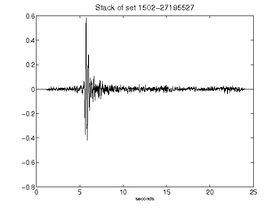](figures/1502-27195527_Stack.png)[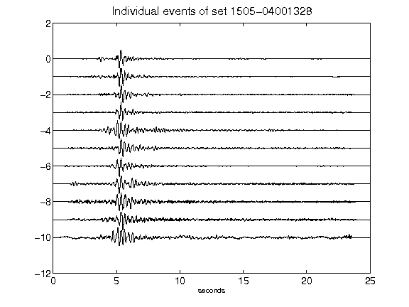](figures/1505-04001328_AllEv.png)[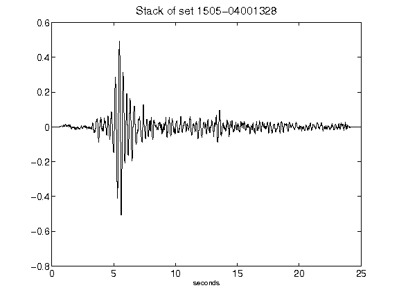](figures/1505-04001328_Stack.png)[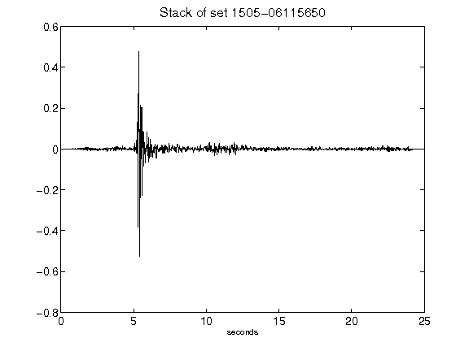](figures/1505-06115650_Stack.png)[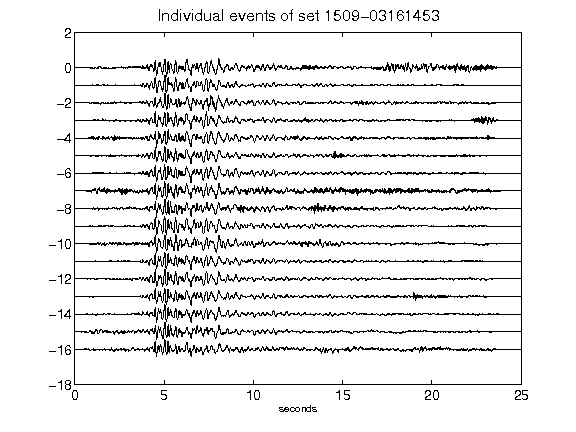](figures/1509-03161453_AllEv.png)