# Repeating Earthquake Activity at RCM

## Waveforms
[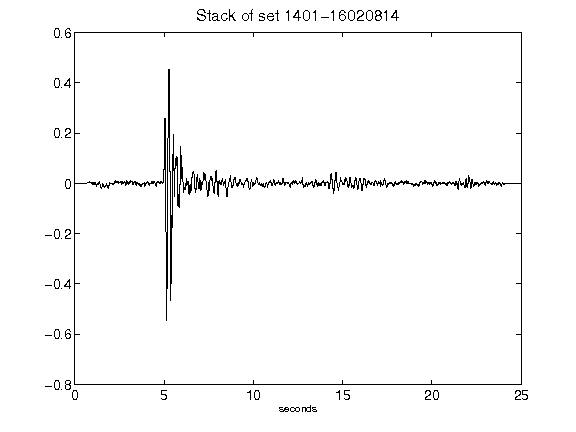](figures/1401-16020814_Stack.png)[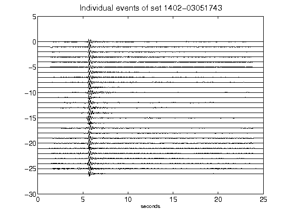](figures/1402-03051743_AllEv.png)[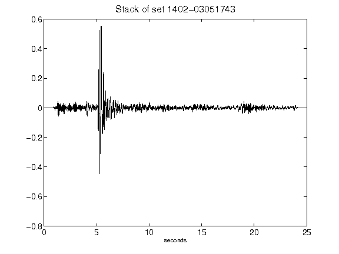](figures/1402-03051743_Stack.png)[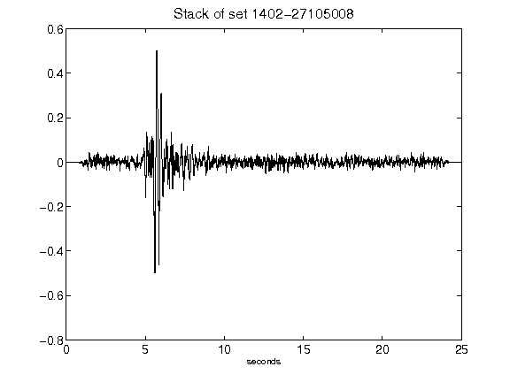](figures/1402-27105008_Stack.png)[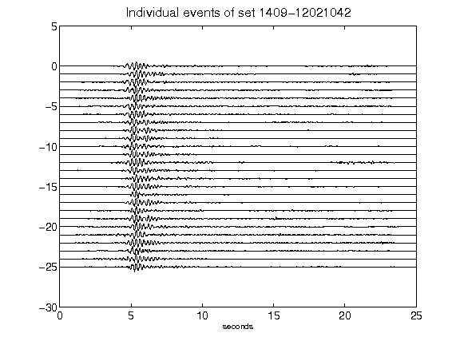](figures/1409-12021042_AllEv.png)[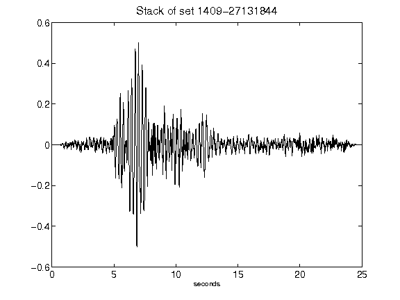](figures/1409-27131844_Stack.png)[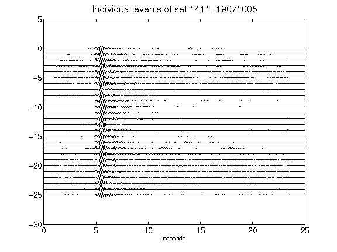](figures/1411-19071005_AllEv.png)[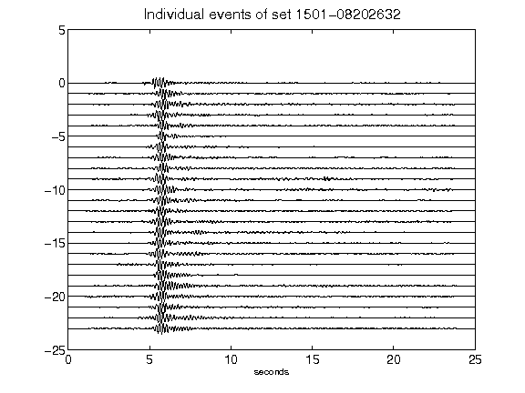](figures/1501-08202632_AllEv.png)[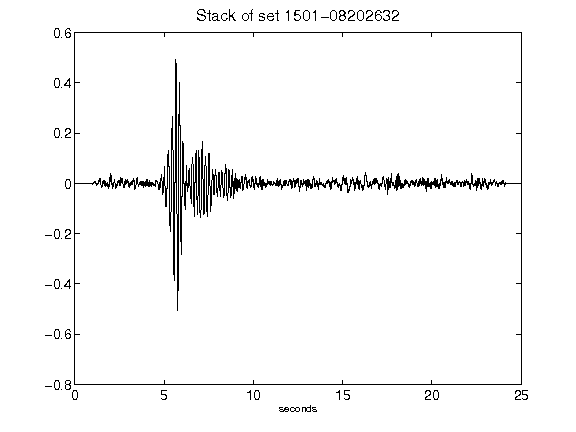](figures/1501-08202632_Stack.png)[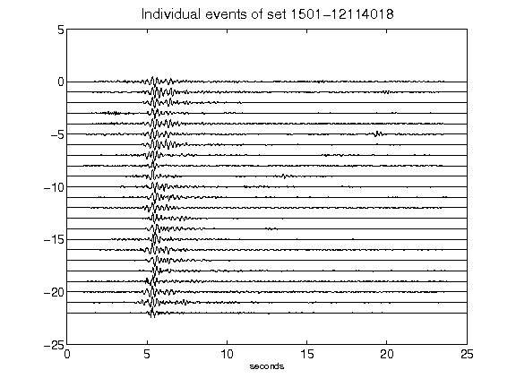](figures/1501-12114018_AllEv.png)[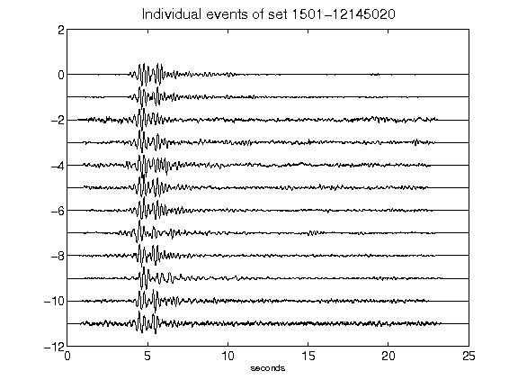](figures/1501-12145020_AllEv.png)[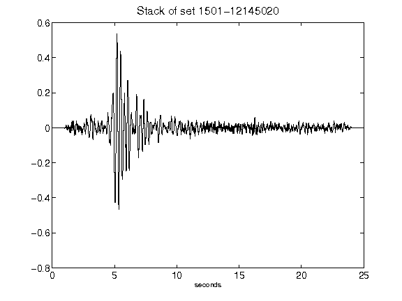](figures/1501-12145020_Stack.png)[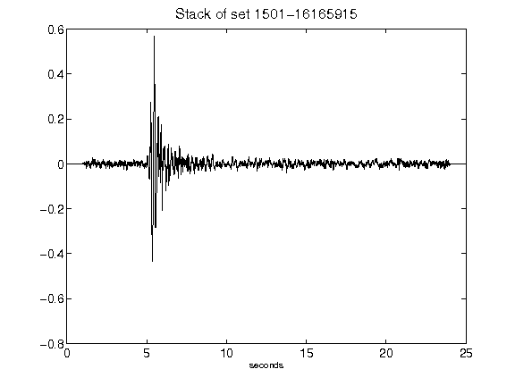](figures/1501-16165915_Stack.png)[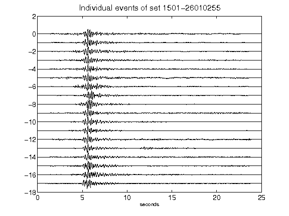](figures/1501-26010255_AllEv.png)[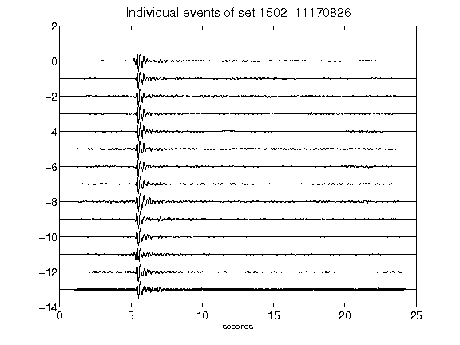](figures/1502-11170826_AllEv.png)[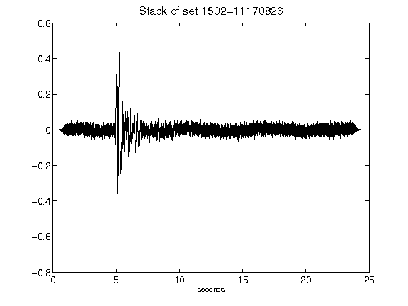](figures/1502-11170826_Stack.png)[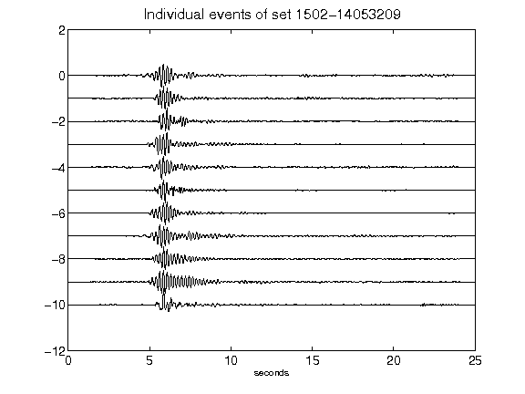](figures/1502-14053209_AllEv.png)[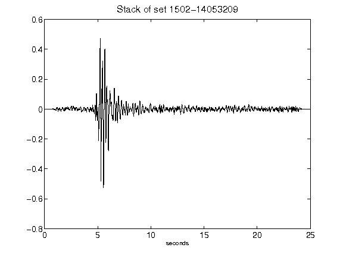](figures/1502-14053209_Stack.png)[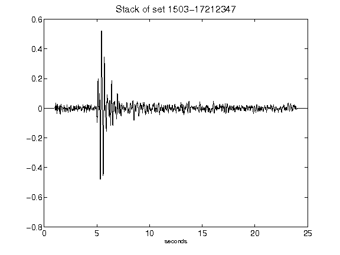](figures/1503-17212347_Stack.png)[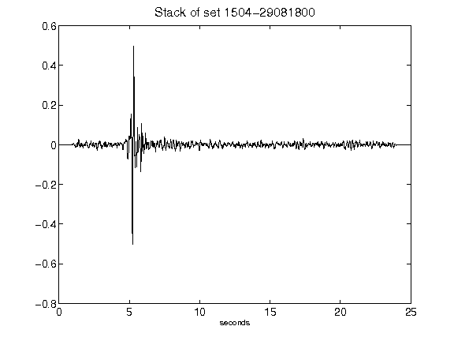](figures/1504-29081800_Stack.png)[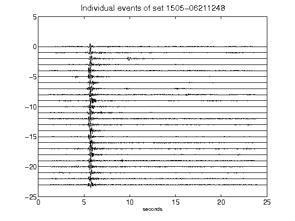](figures/1505-06211248_AllEv.png)[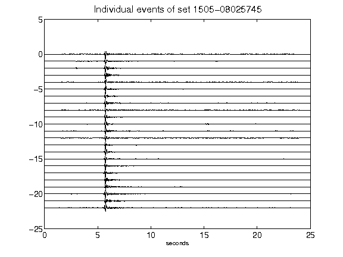](figures/1505-08025745_AllEv.png)[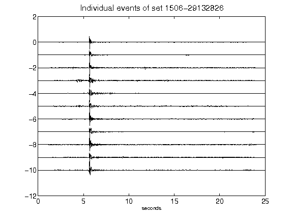](figures/1506-29132826_AllEv.png)[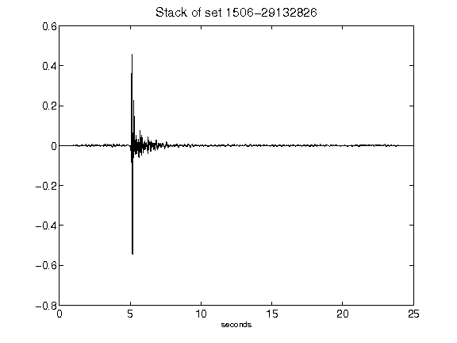](figures/1506-29132826_Stack.png)