# Repeating Earthquake Activity at RCM

## Waveforms
[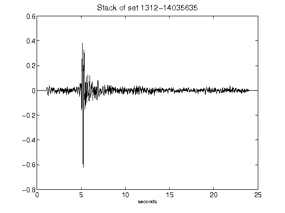](figures/1312-14035635_Stack.png)[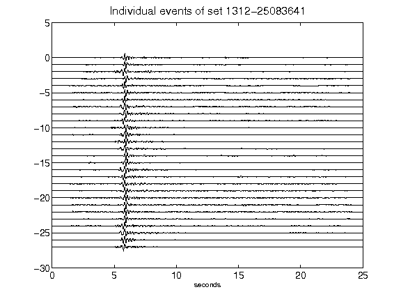](figures/1312-25083641_AllEv.png)[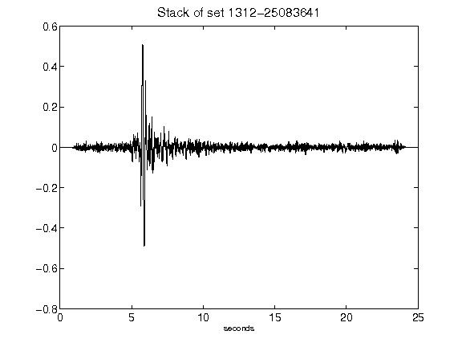](figures/1312-25083641_Stack.png)[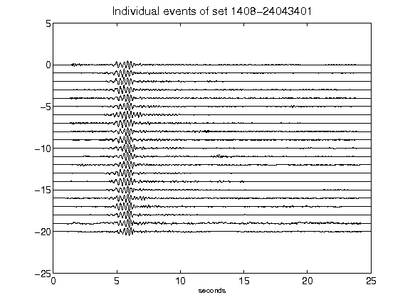](figures/1408-24043401_AllEv.png)[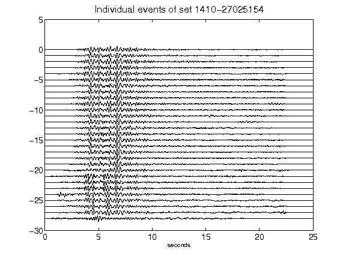](figures/1410-27025154_AllEv.png)[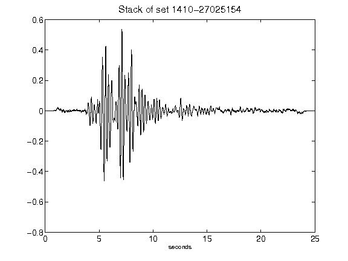](figures/1410-27025154_Stack.png)[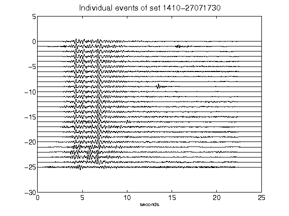](figures/1410-27071730_AllEv.png)[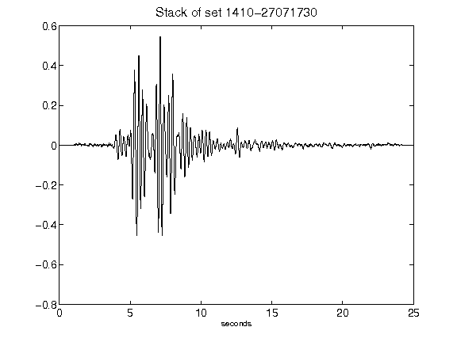](figures/1410-27071730_Stack.png)[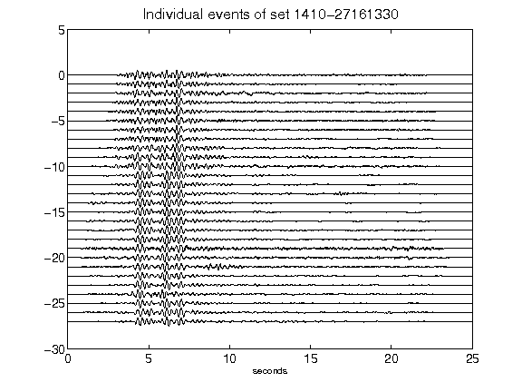](figures/1410-27161330_AllEv.png)[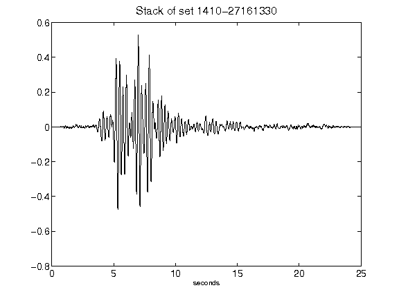](figures/1410-27161330_Stack.png)[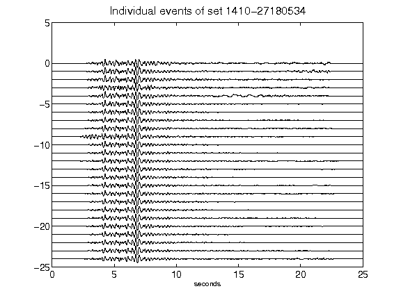](figures/1410-27180534_AllEv.png)[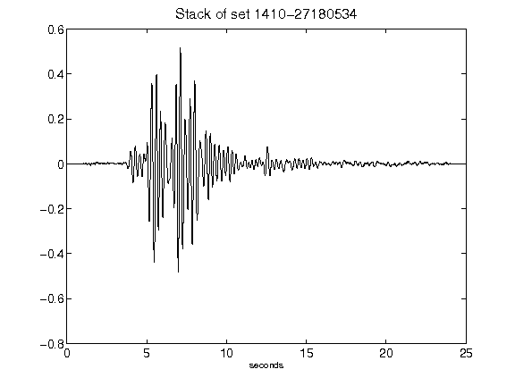](figures/1410-27180534_Stack.png)[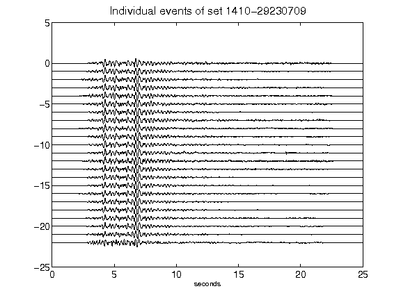](figures/1410-29230709_AllEv.png)[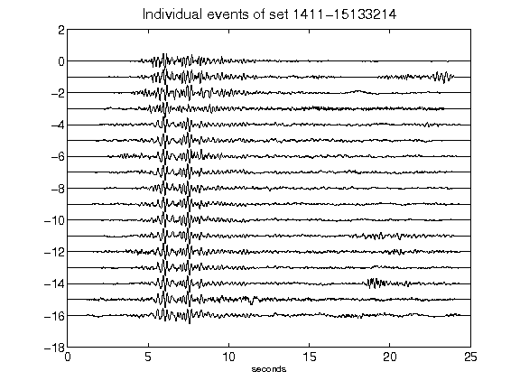](figures/1411-15133214_AllEv.png)[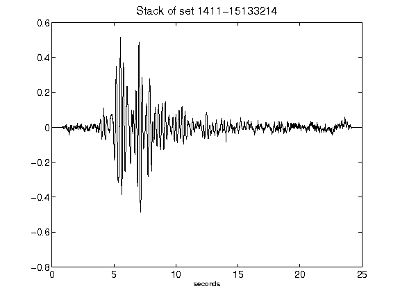](figures/1411-15133214_Stack.png)[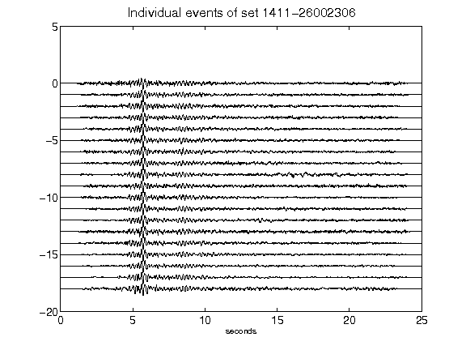](figures/1411-26002306_AllEv.png)[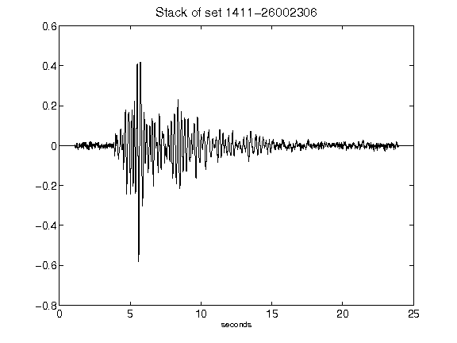](figures/1411-26002306_Stack.png)[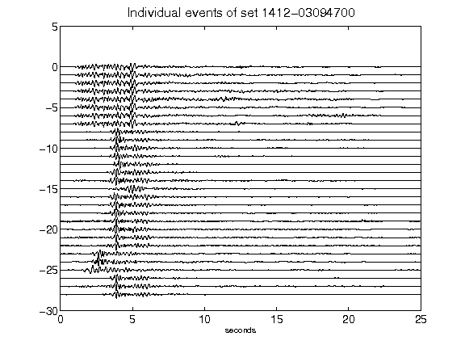](figures/1412-03094700_AllEv.png)[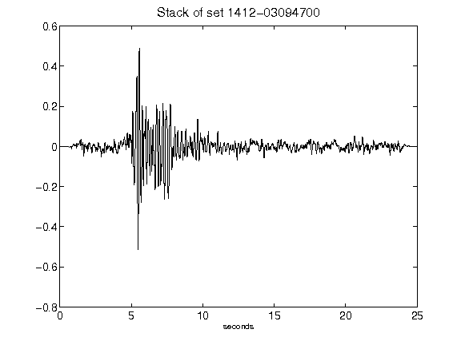](figures/1412-03094700_Stack.png)[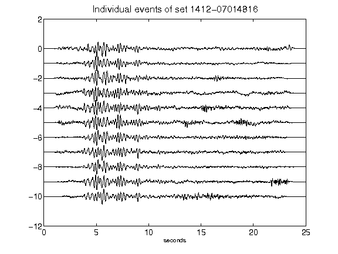](figures/1412-07014816_AllEv.png)