# Repeating Earthquake Activity at RCM

## Waveforms
[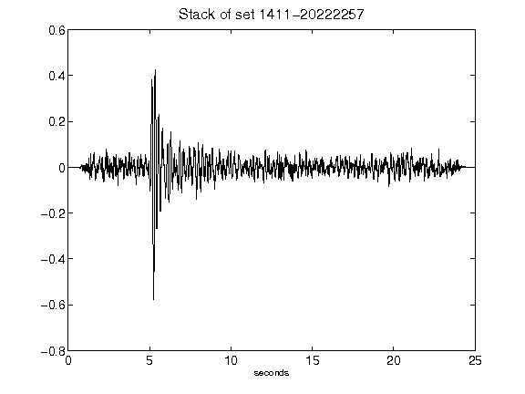](figures/1411-20222257_Stack.png)[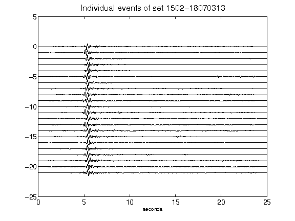](figures/1502-18070313_AllEv.png)[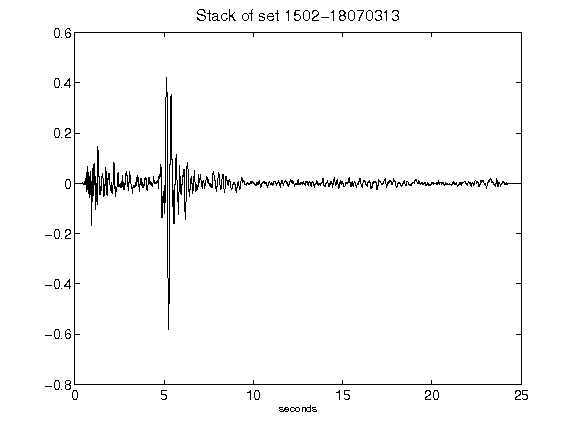](figures/1502-18070313_Stack.png)[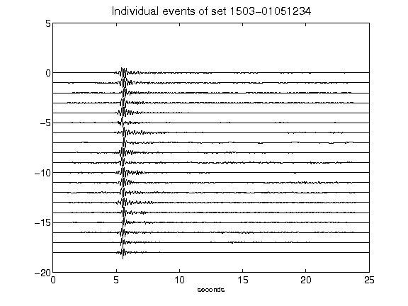](figures/1503-01051234_AllEv.png)[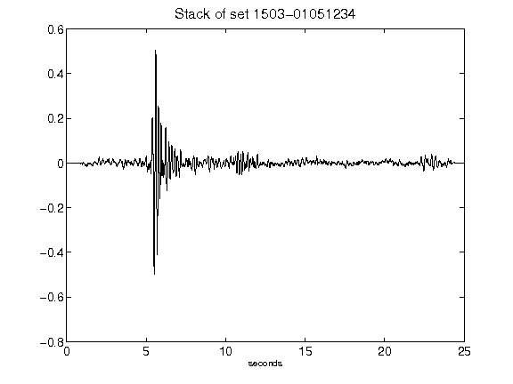](figures/1503-01051234_Stack.png)[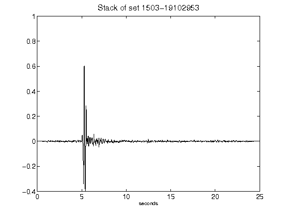](figures/1503-19102953_Stack.png)[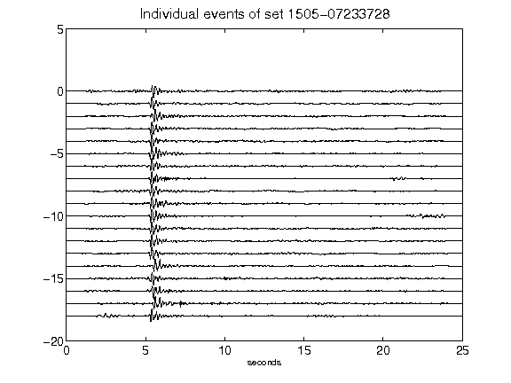](figures/1505-07233728_AllEv.png)[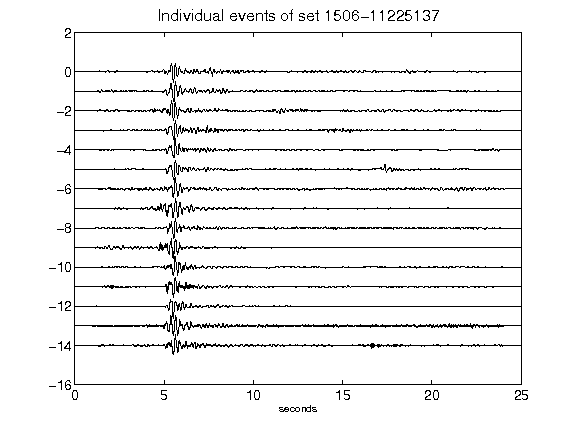](figures/1506-11225137_AllEv.png)[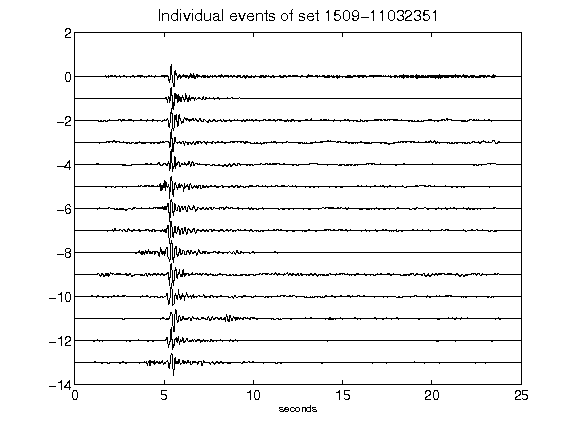](figures/1509-11032351_AllEv.png)[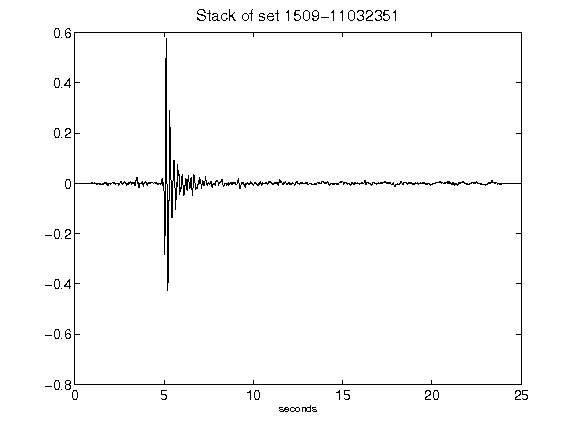](figures/1509-11032351_Stack.png)[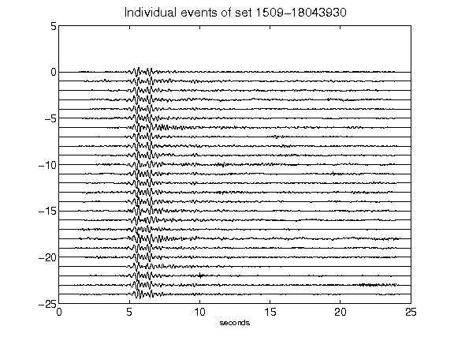](figures/1509-18043930_AllEv.png)[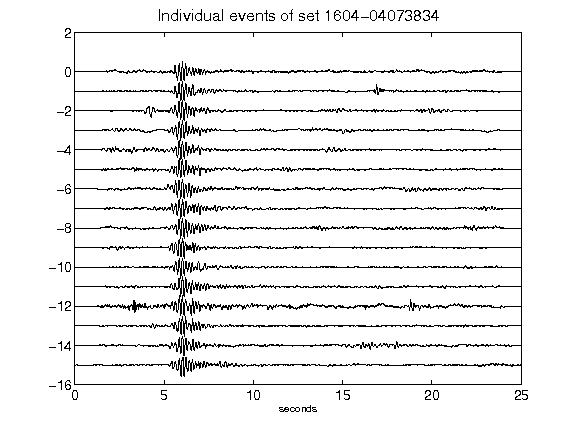](figures/1604-04073834_AllEv.png)[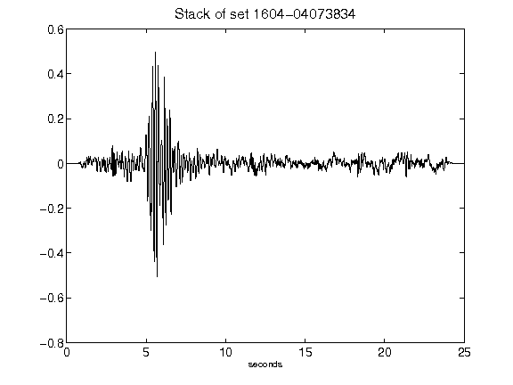](figures/1604-04073834_Stack.png)