# Repeating Earthquake Activity at RCM
  
  

## Waveforms
[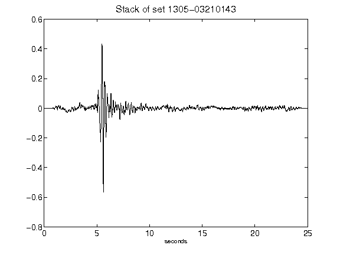](figures/1305-03210143_Stack.png)[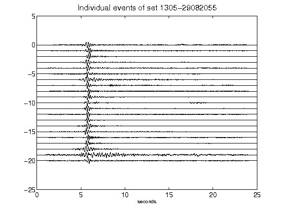](figures/1305-29082055_AllEv.png)[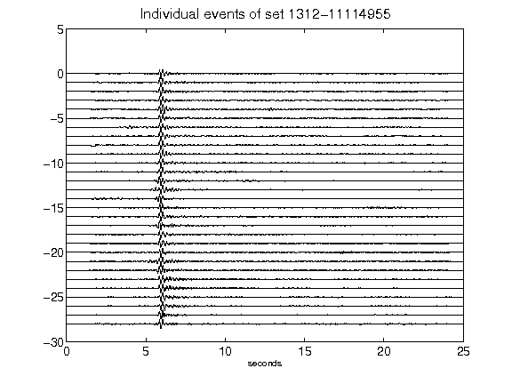](figures/1312-11114955_AllEv.png)[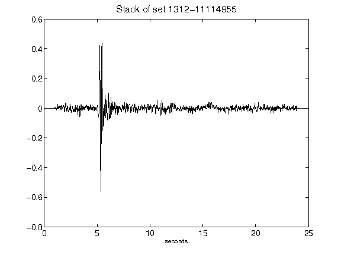](figures/1312-11114955_Stack.png)[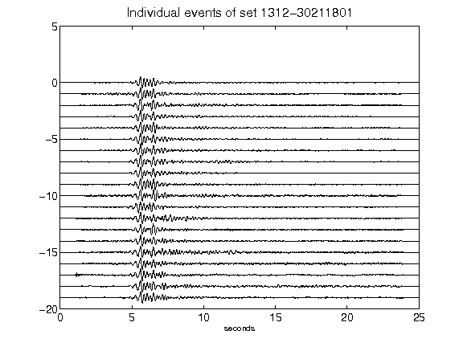](figures/1312-30211801_AllEv.png)[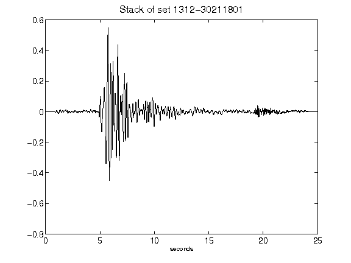](figures/1312-30211801_Stack.png)[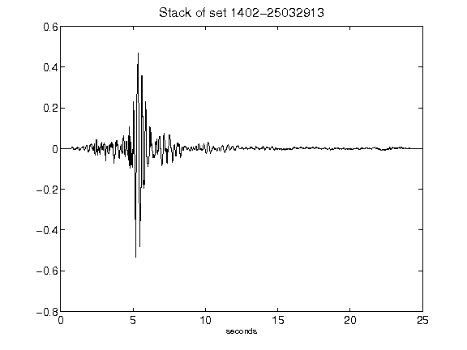](figures/1402-25032913_Stack.png)[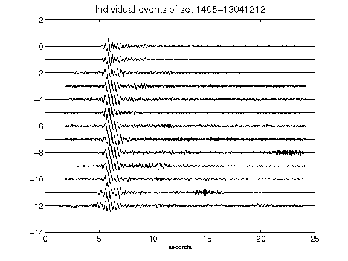](figures/1405-13041212_AllEv.png)[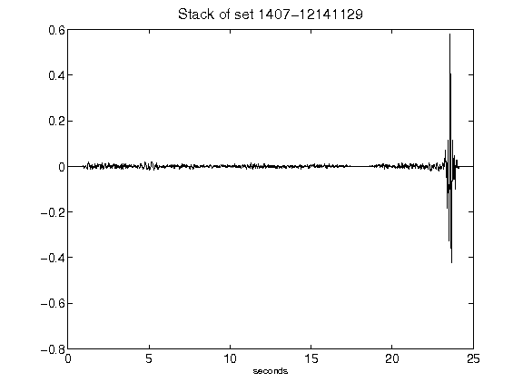](figures/1407-12141129_Stack.png)[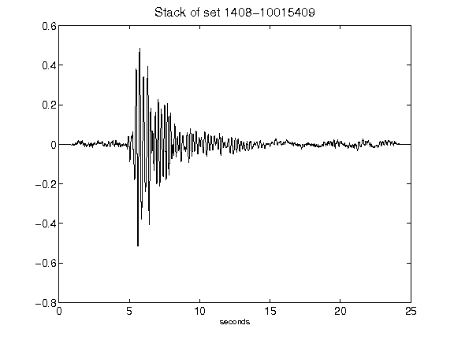](figures/1408-10015409_Stack.png)[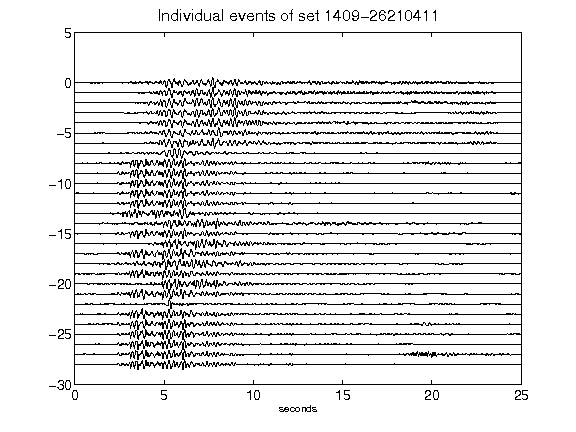](figures/1409-26210411_AllEv.png)[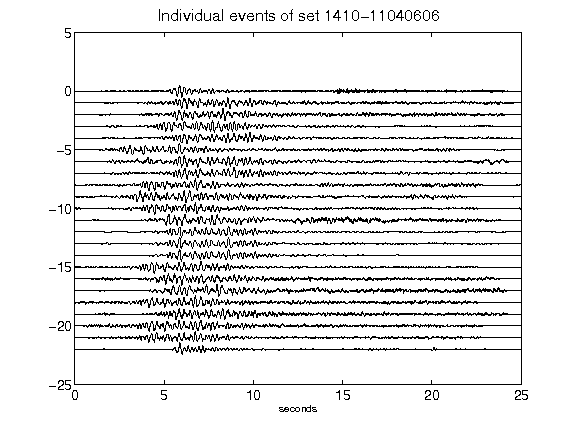](figures/1410-11040606_AllEv.png)[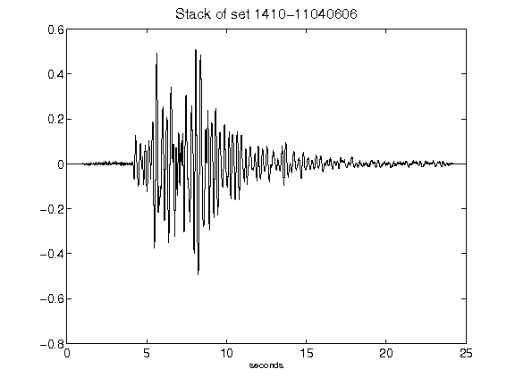](figures/1410-11040606_Stack.png)[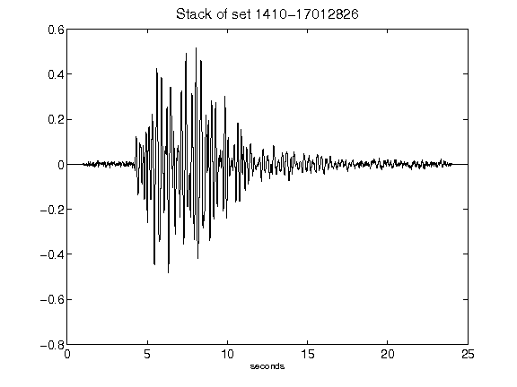](figures/1410-17012826_Stack.png)[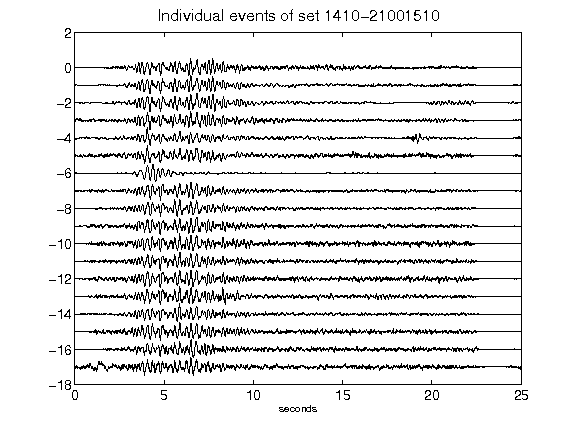](figures/1410-21001510_AllEv.png)[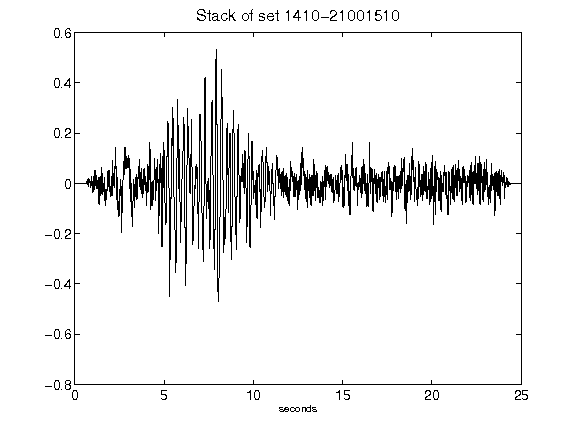](figures/1410-21001510_Stack.png)[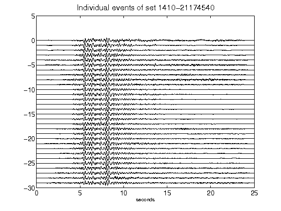](figures/1410-21174540_AllEv.png)[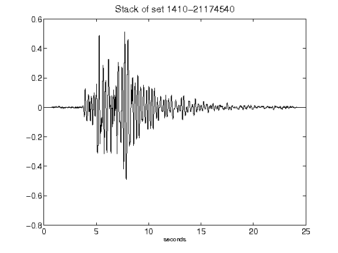](figures/1410-21174540_Stack.png)[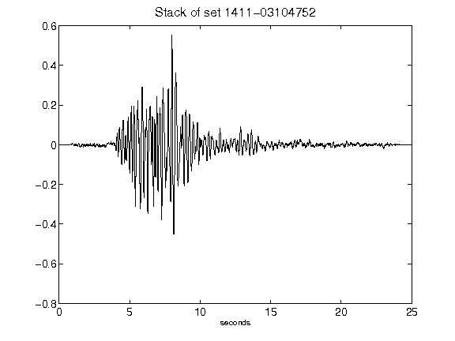](figures/1411-03104752_Stack.png)