# Repeating Earthquake Activity at RCM

## Waveforms
[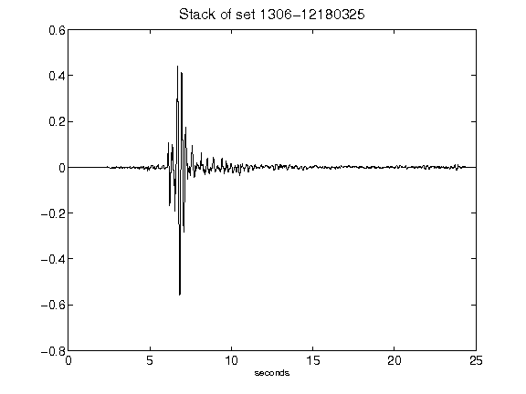](figures/1306-12180325_Stack.png)[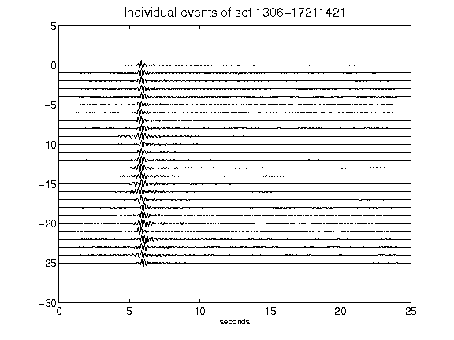](figures/1306-17211421_AllEv.png)[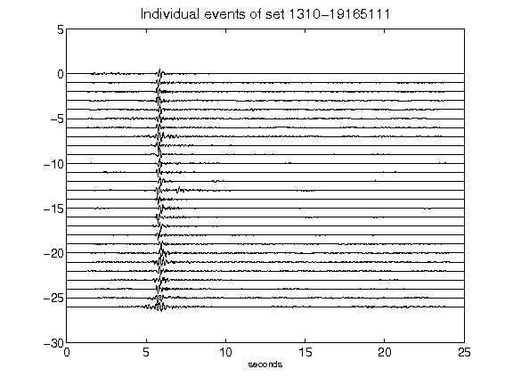](figures/1310-19165111_AllEv.png)[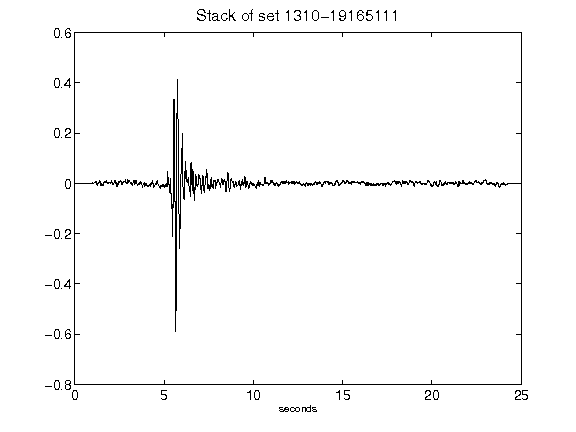](figures/1310-19165111_Stack.png)[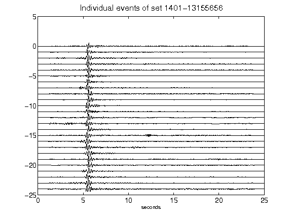](figures/1401-13155656_AllEv.png)[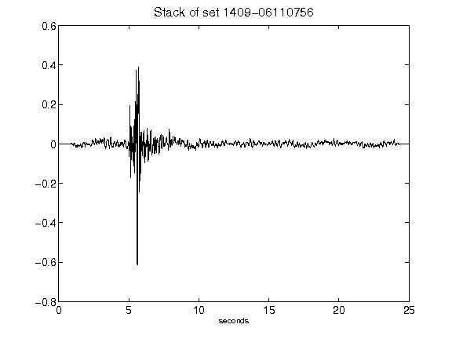](figures/1409-06110756_Stack.png)[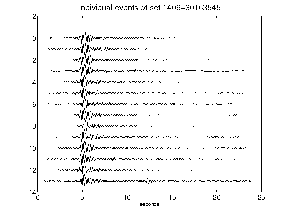](figures/1409-30163545_AllEv.png)[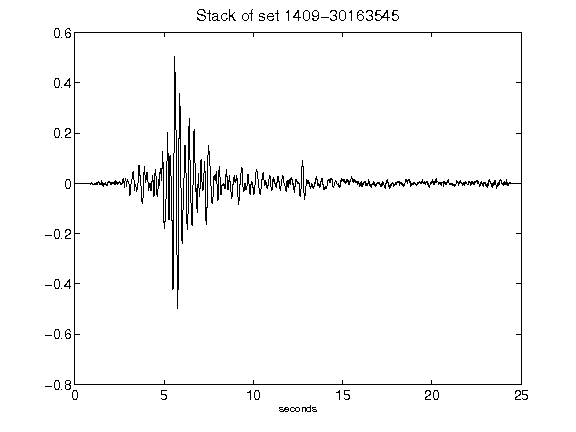](figures/1409-30163545_Stack.png)[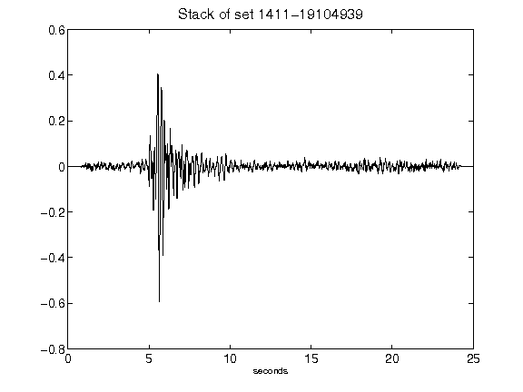](figures/1411-19104939_Stack.png)[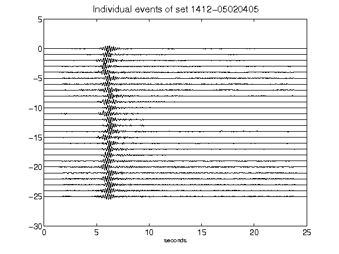](figures/1412-05020405_AllEv.png)[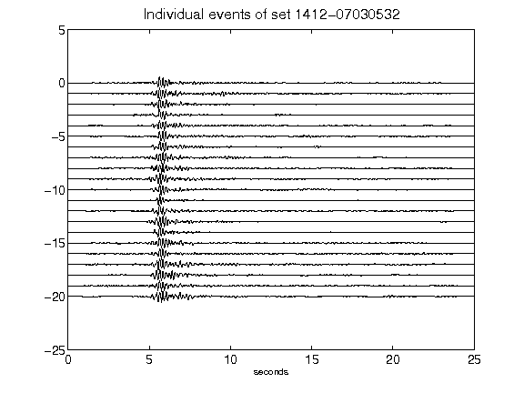](figures/1412-07030532_AllEv.png)[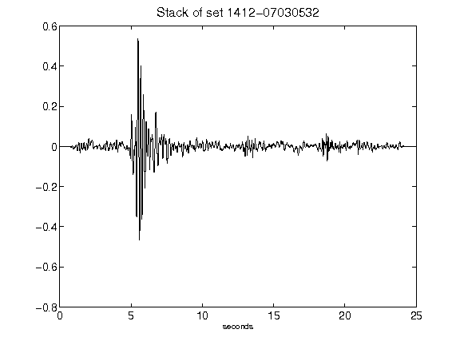](figures/1412-07030532_Stack.png)[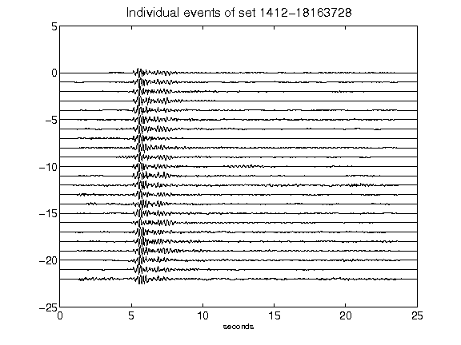](figures/1412-18163728_AllEv.png)[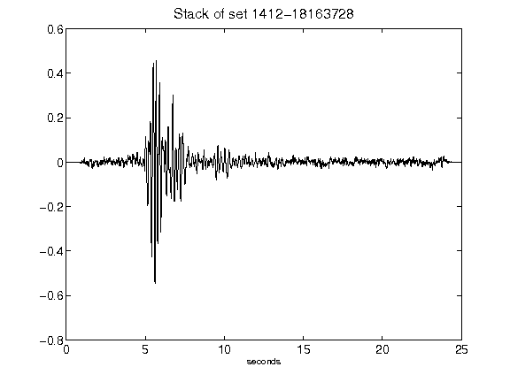](figures/1412-18163728_Stack.png)[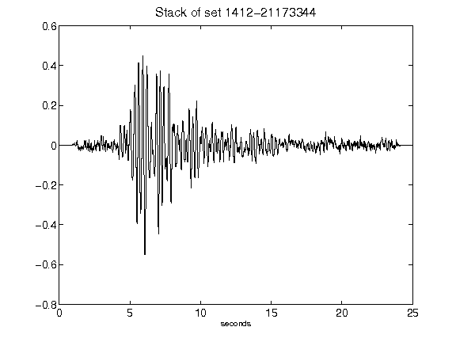](figures/1412-21173344_Stack.png)[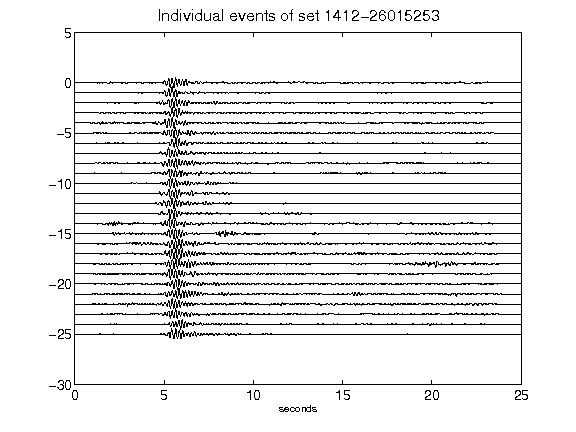](figures/1412-26015253_AllEv.png)[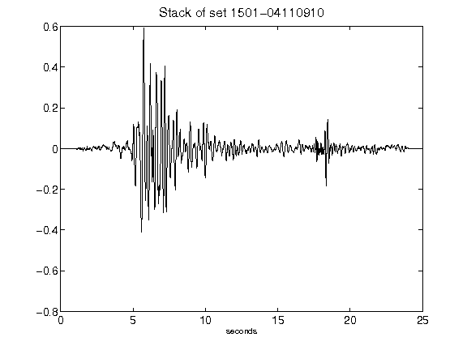](figures/1501-04110910_Stack.png)[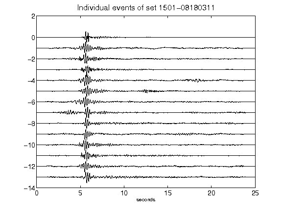](figures/1501-08180311_AllEv.png)[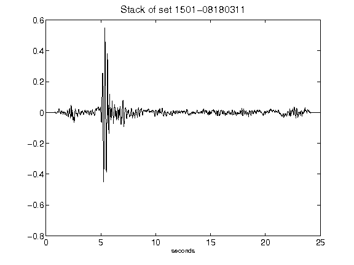](figures/1501-08180311_Stack.png)[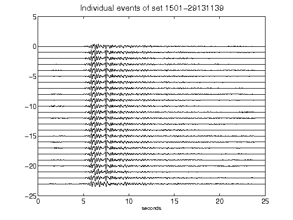](figures/1501-29131139_AllEv.png)[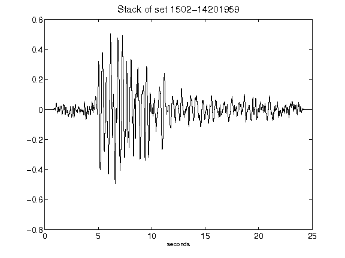](figures/1502-14201959_Stack.png)[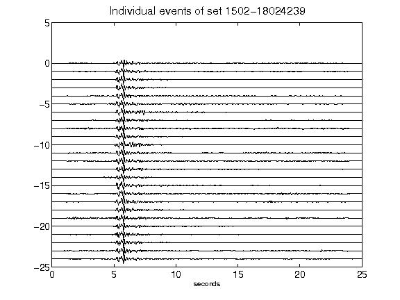](figures/1502-18024239_AllEv.png)[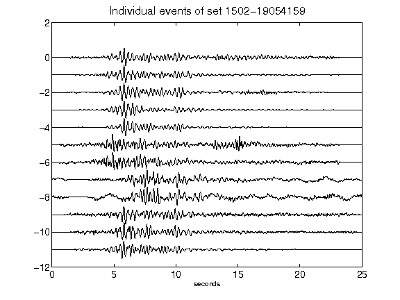](figures/1502-19054159_AllEv.png)[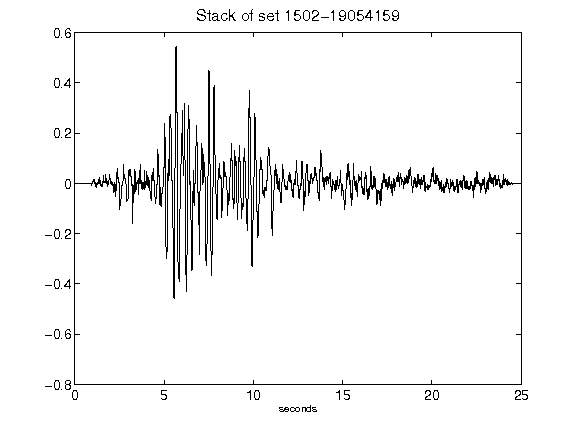](figures/1502-19054159_Stack.png)[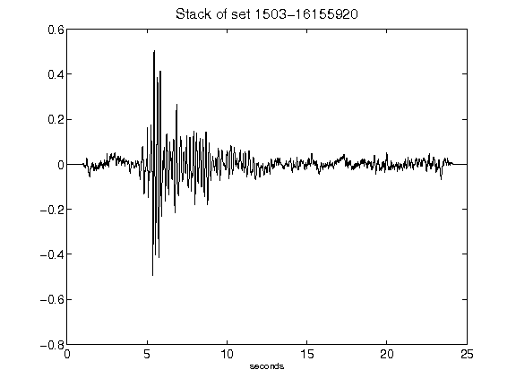](figures/1503-16155920_Stack.png)[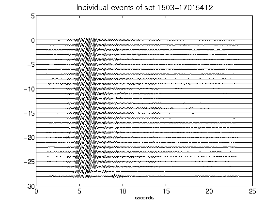](figures/1503-17015412_AllEv.png)[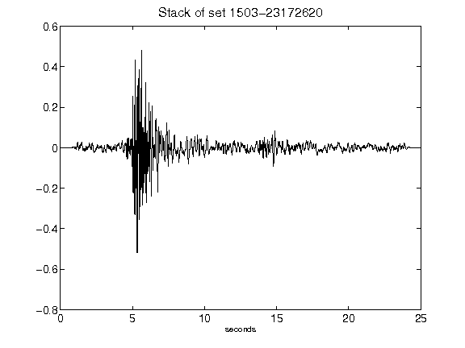](figures/1503-23172620_Stack.png)