# Repeating Earthquake Activity at RCM

## Waveforms
[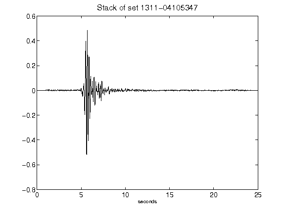](figures/1311-04105347_Stack.png)[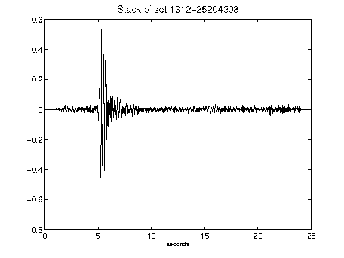](figures/1312-25204308_Stack.png)[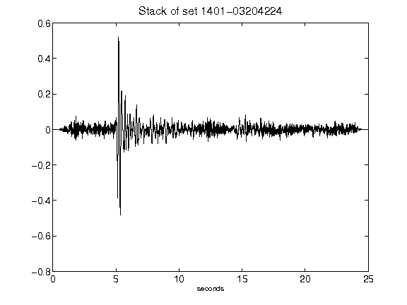](figures/1401-03204224_Stack.png)[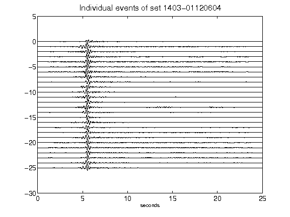](figures/1403-01120604_AllEv.png)[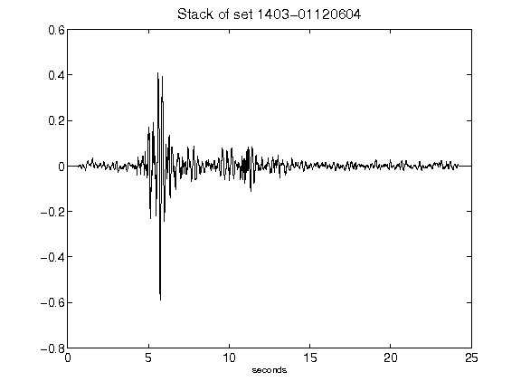](figures/1403-01120604_Stack.png)[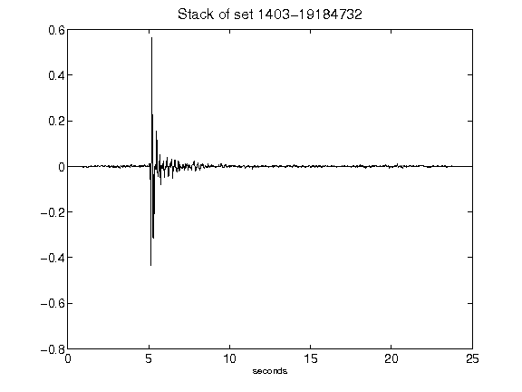](figures/1403-19184732_Stack.png)[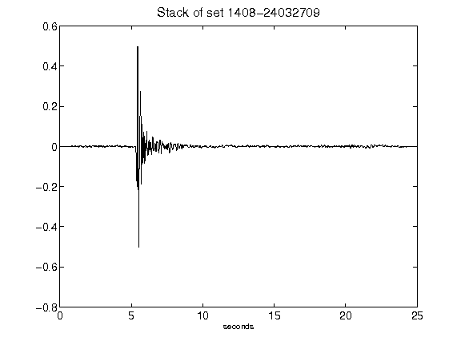](figures/1408-24032709_Stack.png)[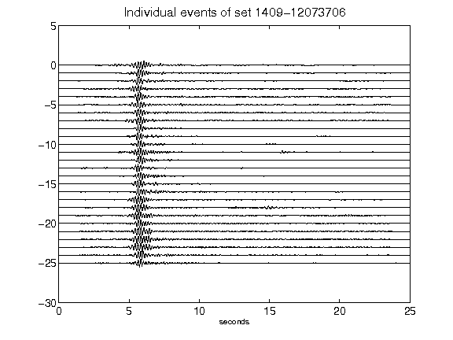](figures/1409-12073706_AllEv.png)[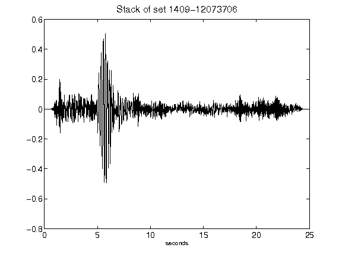](figures/1409-12073706_Stack.png)[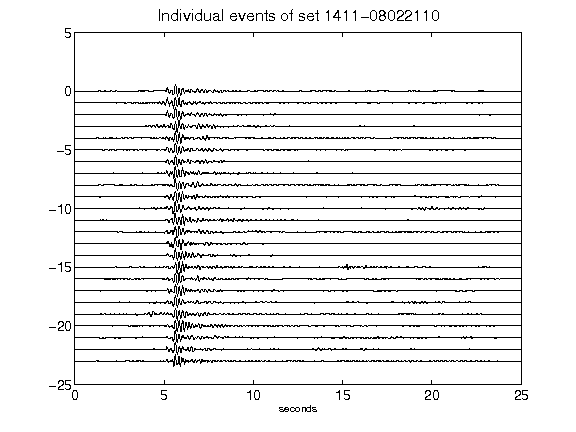](figures/1411-08022110_AllEv.png)[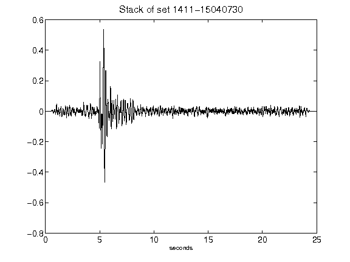](figures/1411-15040730_Stack.png)[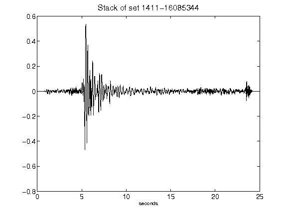](figures/1411-16085344_Stack.png)[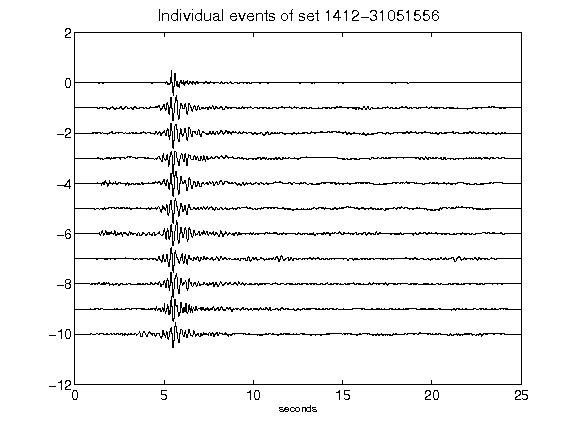](figures/1412-31051556_AllEv.png)[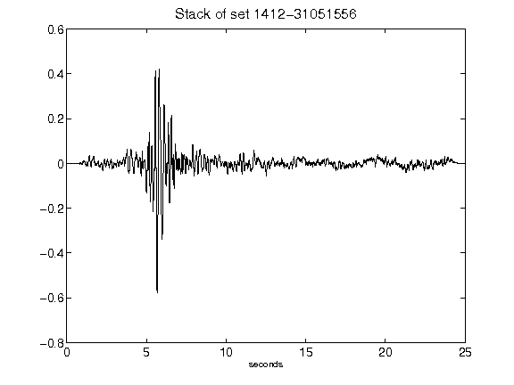](figures/1412-31051556_Stack.png)[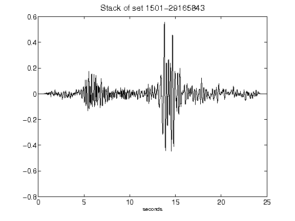](figures/1501-29165843_Stack.png)