# Repeating Earthquake Activity at RCM

## Waveforms
[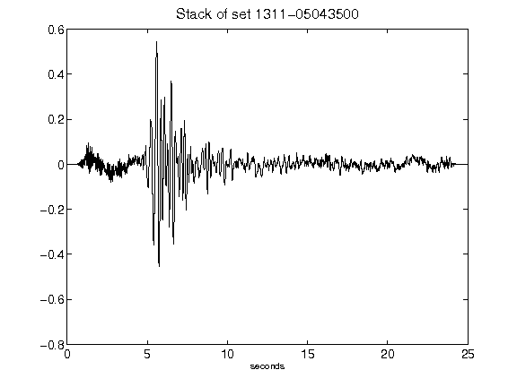](figures/1311-05043500_Stack.png)[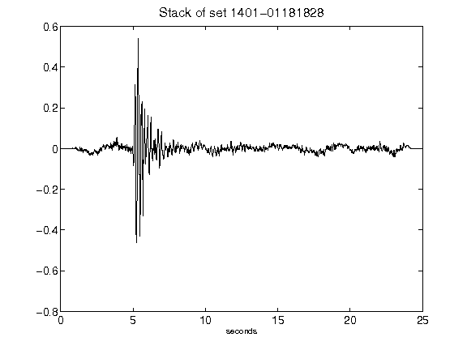](figures/1401-01181828_Stack.png)[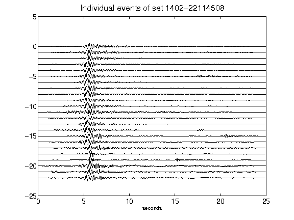](figures/1402-22114508_AllEv.png)[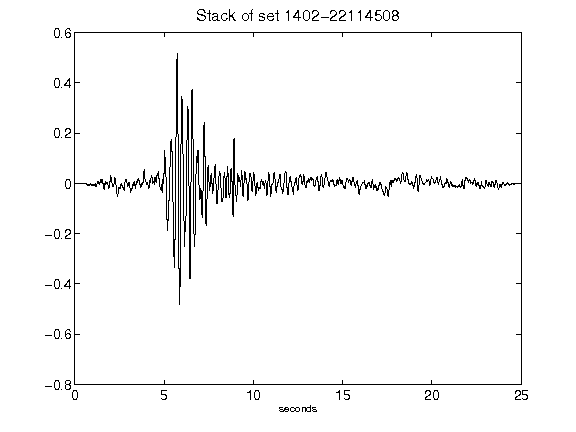](figures/1402-22114508_Stack.png)[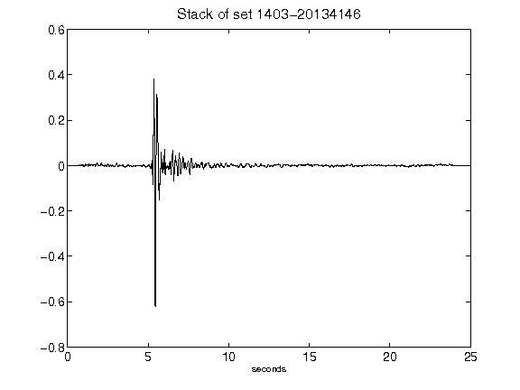](figures/1403-20134146_Stack.png)[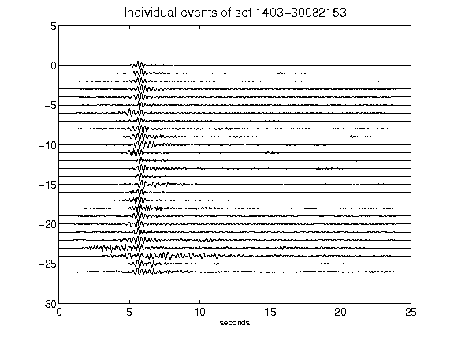](figures/1403-30082153_AllEv.png)[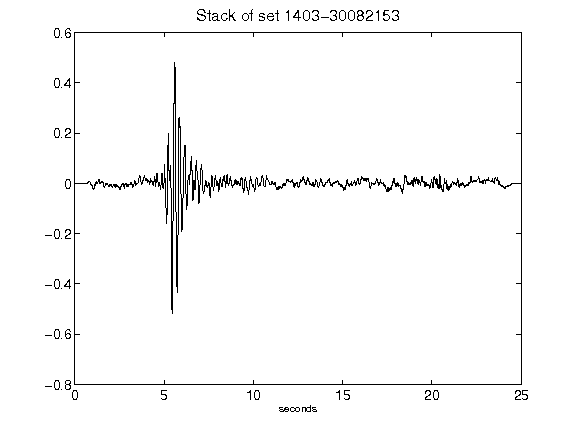](figures/1403-30082153_Stack.png)[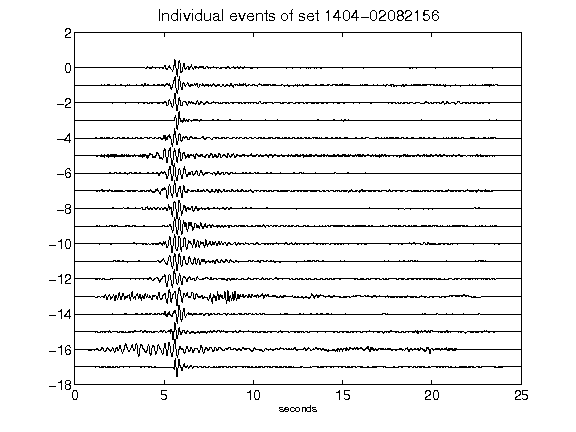](figures/1404-02082156_AllEv.png)[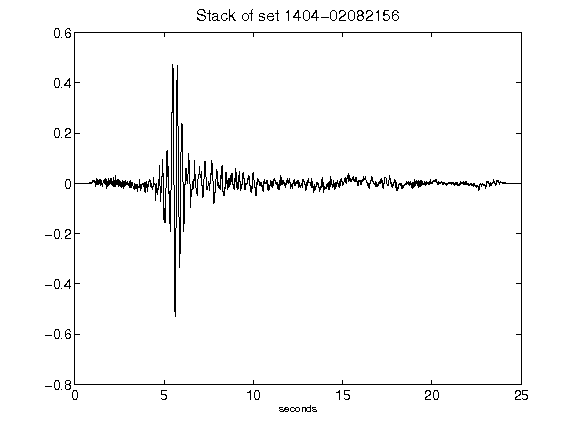](figures/1404-02082156_Stack.png)[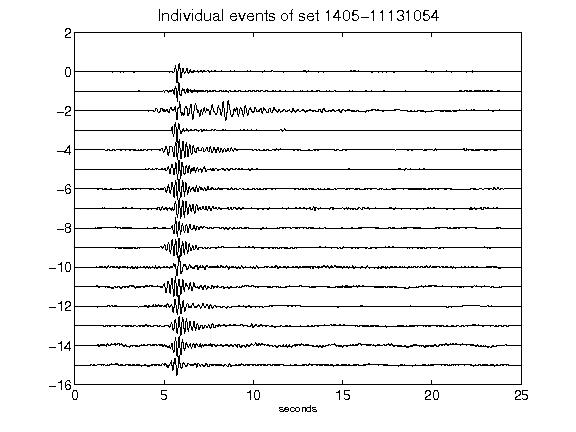](figures/1405-11131054_AllEv.png)[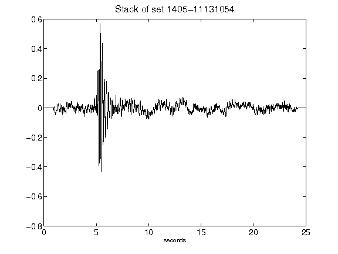](figures/1405-11131054_Stack.png)[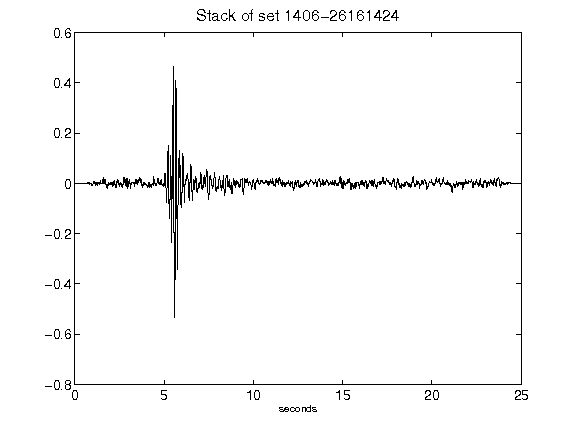](figures/1406-26161424_Stack.png)[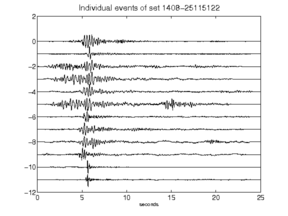](figures/1408-25115122_AllEv.png)[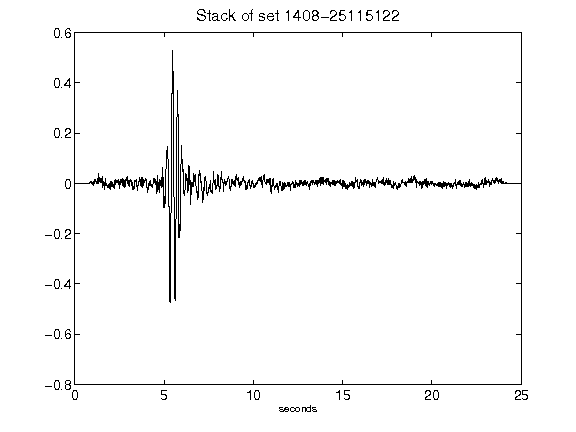](figures/1408-25115122_Stack.png)[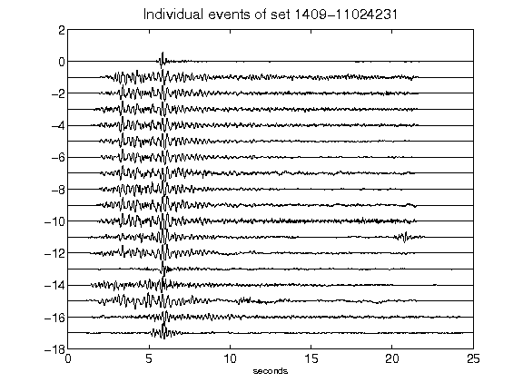](figures/1409-11024231_AllEv.png)[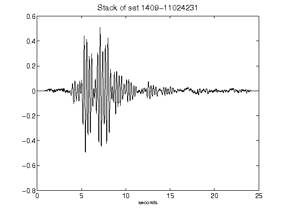](figures/1409-11024231_Stack.png)[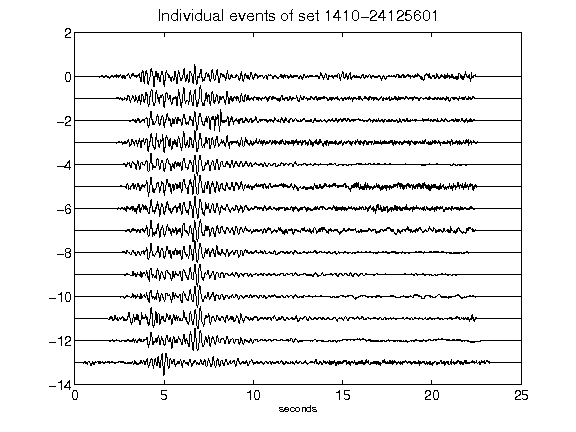](figures/1410-24125601_AllEv.png)[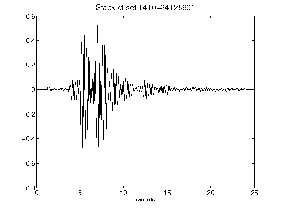](figures/1410-24125601_Stack.png)[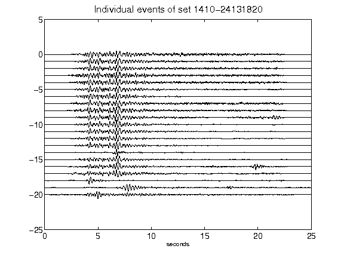](figures/1410-24131820_AllEv.png)[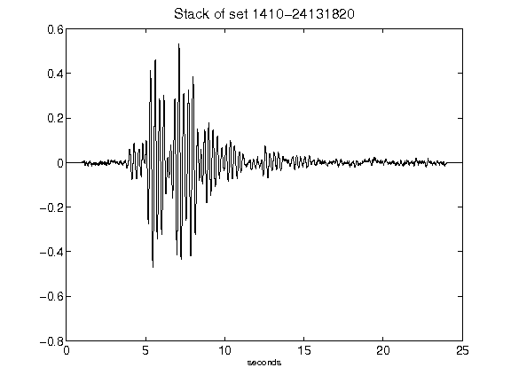](figures/1410-24131820_Stack.png)[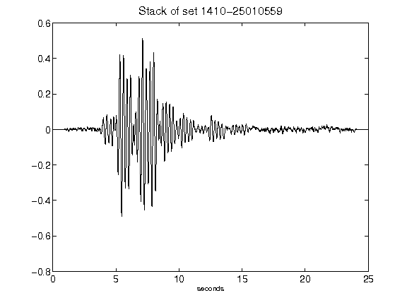](figures/1410-25010559_Stack.png)[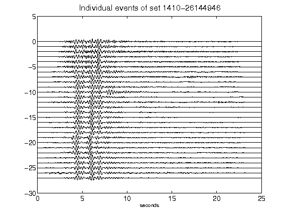](figures/1410-26144946_AllEv.png)[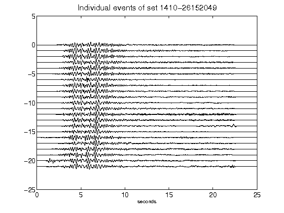](figures/1410-26152049_AllEv.png)[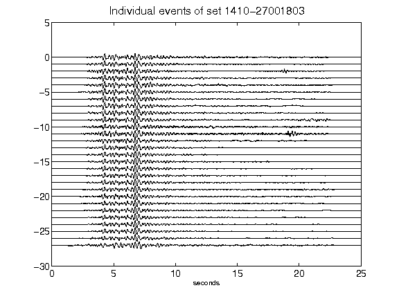](figures/1410-27001803_AllEv.png)[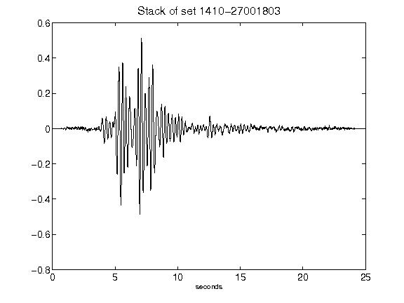](figures/1410-27001803_Stack.png)[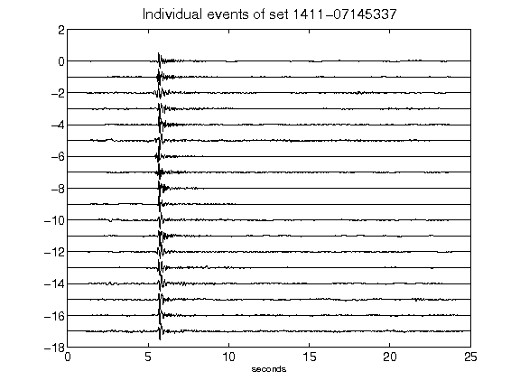](figures/1411-07145337_AllEv.png)[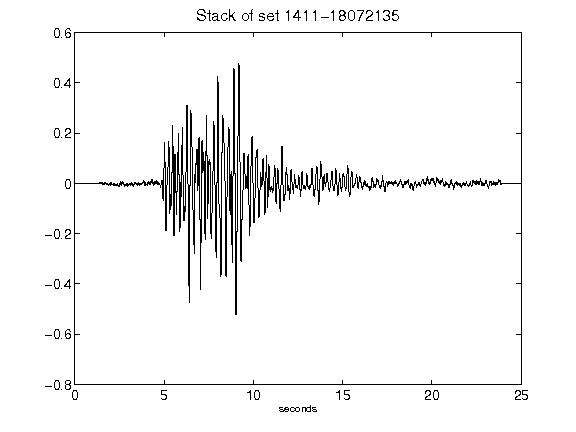](figures/1411-18072135_Stack.png)[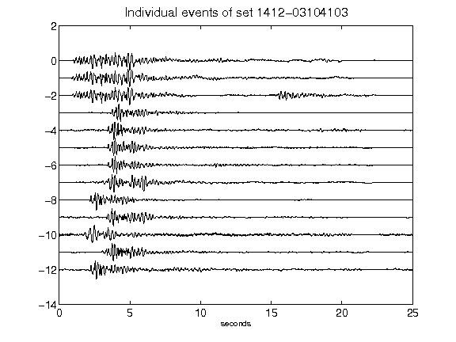](figures/1412-03104103_AllEv.png)[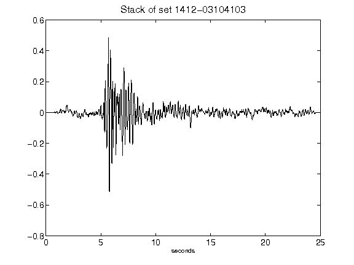](figures/1412-03104103_Stack.png)