# Repeating Earthquake Activity at RCM

## Waveforms
[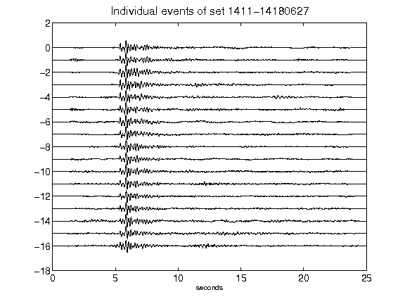](figures/1411-14180627_AllEv.png)[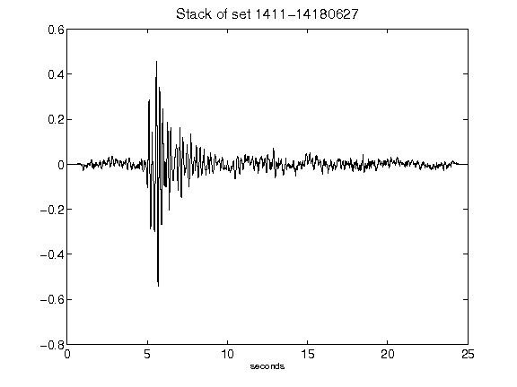](figures/1411-14180627_Stack.png)[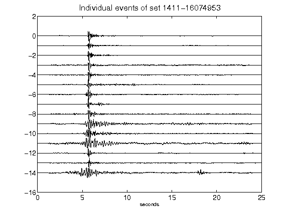](figures/1411-16074953_AllEv.png)[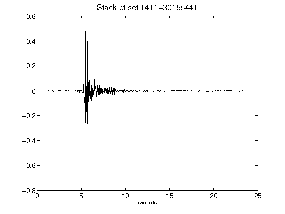](figures/1411-30155441_Stack.png)[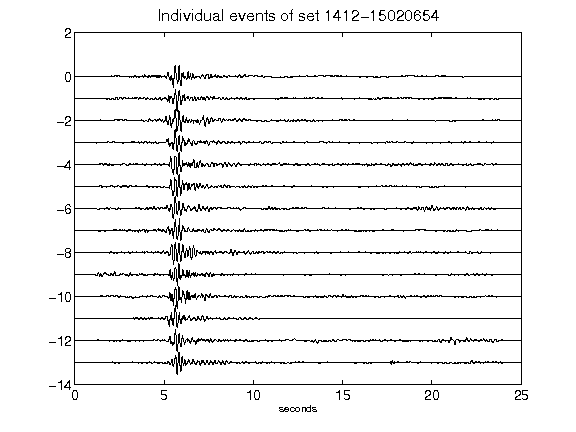](figures/1412-15020654_AllEv.png)[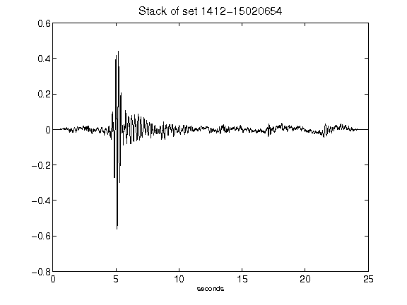](figures/1412-15020654_Stack.png)[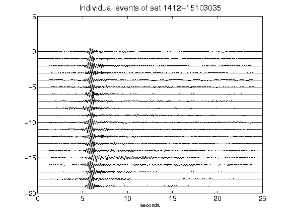](figures/1412-15103035_AllEv.png)[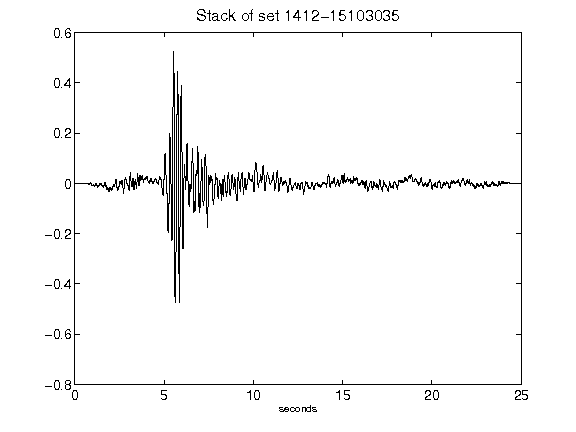](figures/1412-15103035_Stack.png)[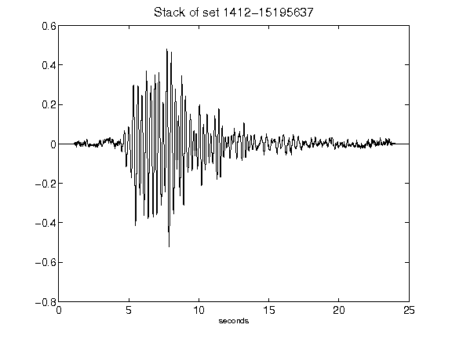](figures/1412-15195637_Stack.png)[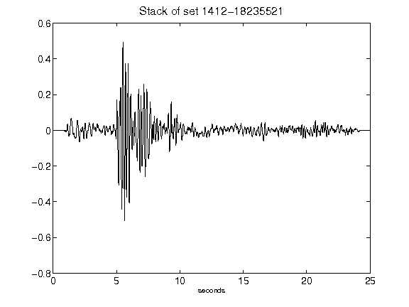](figures/1412-18235521_Stack.png)[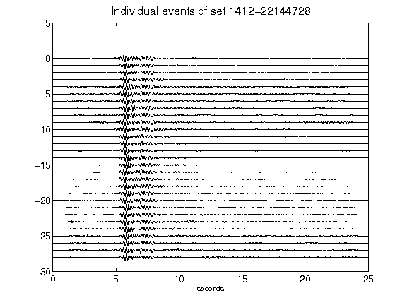](figures/1412-22144728_AllEv.png)[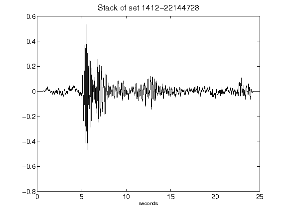](figures/1412-22144728_Stack.png)[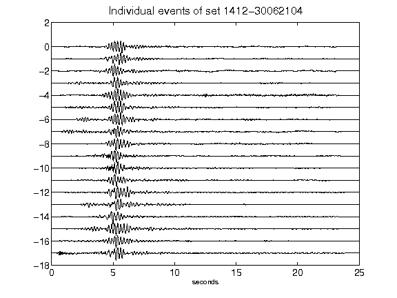](figures/1412-30062104_AllEv.png)[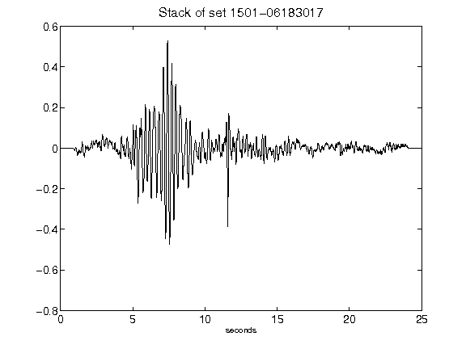](figures/1501-06183017_Stack.png)[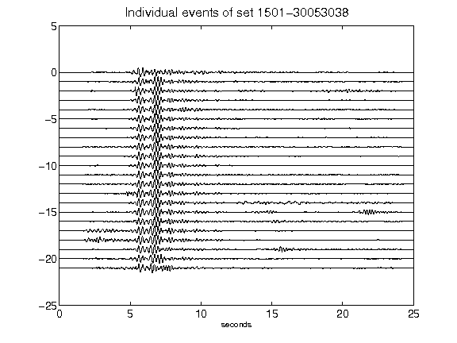](figures/1501-30053038_AllEv.png)[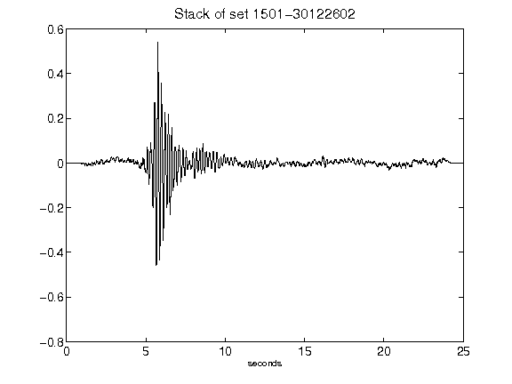](figures/1501-30122602_Stack.png)[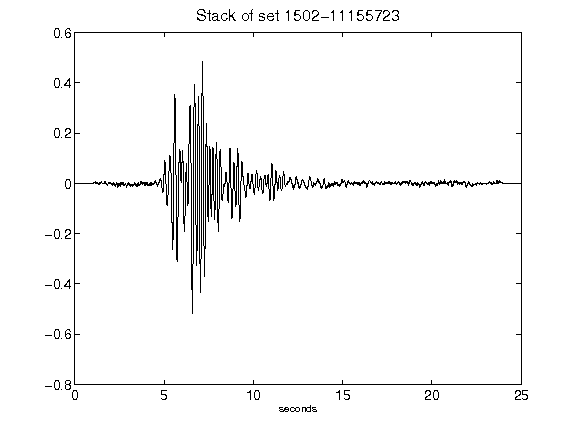](figures/1502-11155723_Stack.png)