# Repeating Earthquake Activity at RCM

## Waveforms
[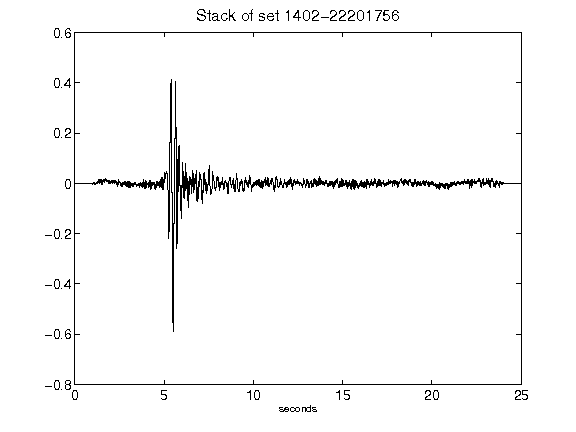](figures/1402-22201756_Stack.png)[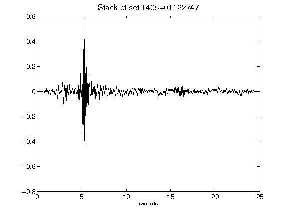](figures/1405-01122747_Stack.png)[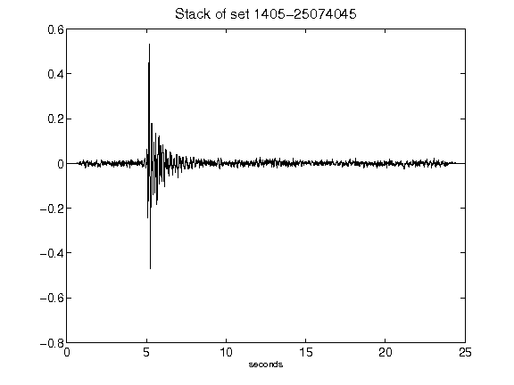](figures/1405-25074045_Stack.png)[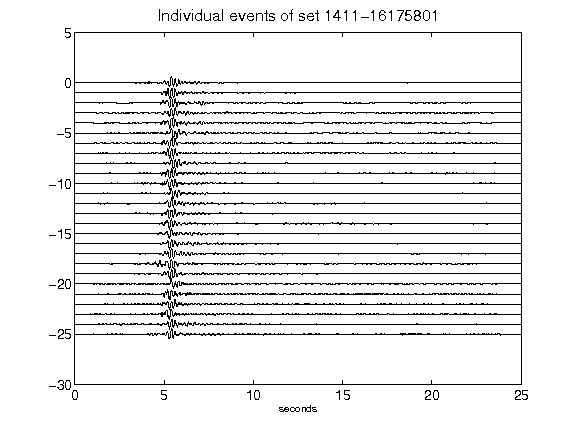](figures/1411-16175801_AllEv.png)[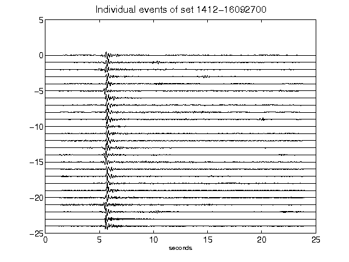](figures/1412-16092700_AllEv.png)[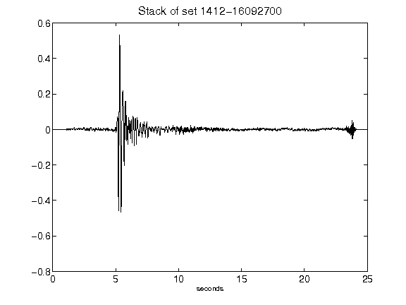](figures/1412-16092700_Stack.png)[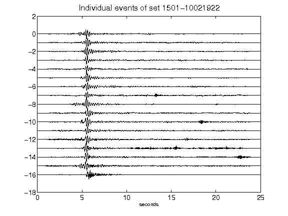](figures/1501-10021922_AllEv.png)[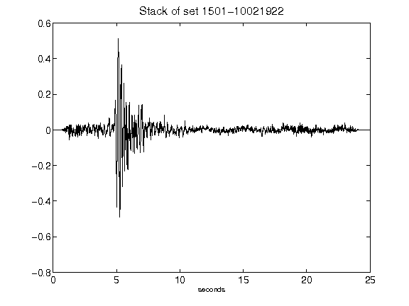](figures/1501-10021922_Stack.png)[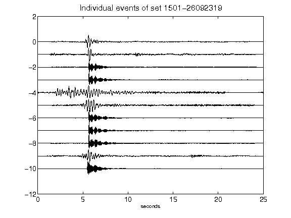](figures/1501-26092319_AllEv.png)[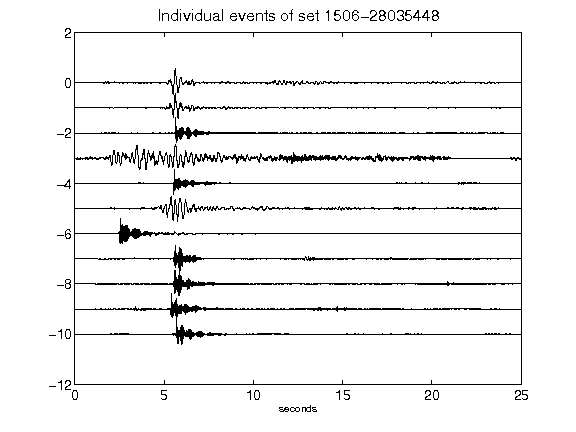](figures/1506-28035448_AllEv.png)[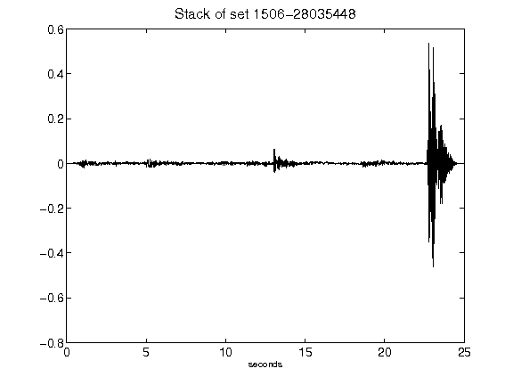](figures/1506-28035448_Stack.png)[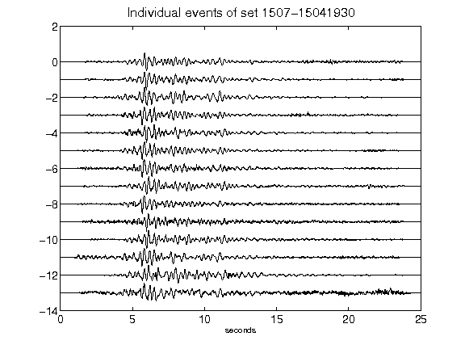](figures/1507-15041930_AllEv.png)[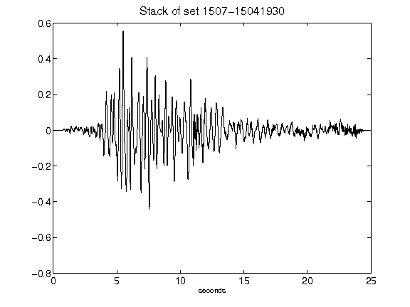](figures/1507-15041930_Stack.png)[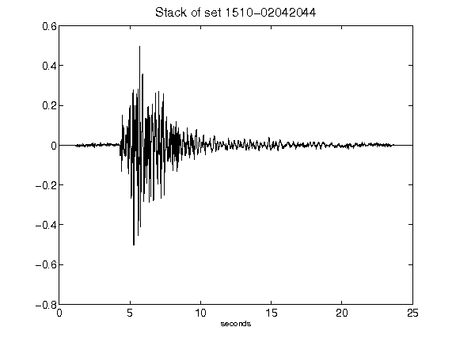](figures/1510-02042044_Stack.png)