# Repeating Earthquake Activity at RCM

## Waveforms
[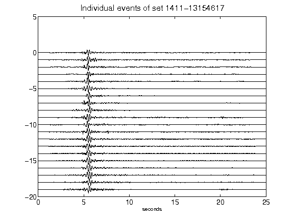](figures/1411-13154617_AllEv.png)[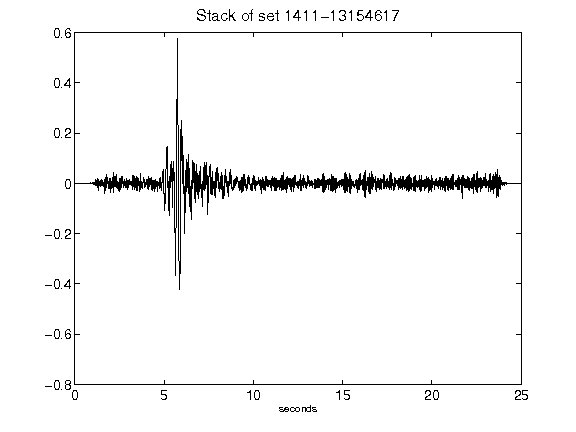](figures/1411-13154617_Stack.png)[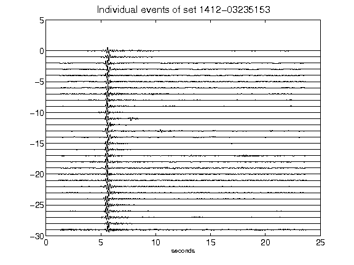](figures/1412-03235153_AllEv.png)[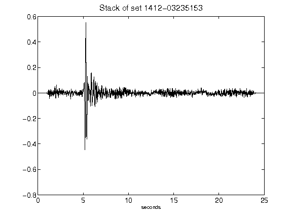](figures/1412-03235153_Stack.png)[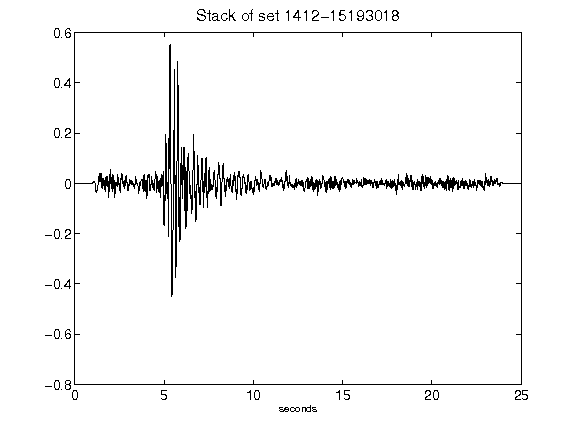](figures/1412-15193018_Stack.png)[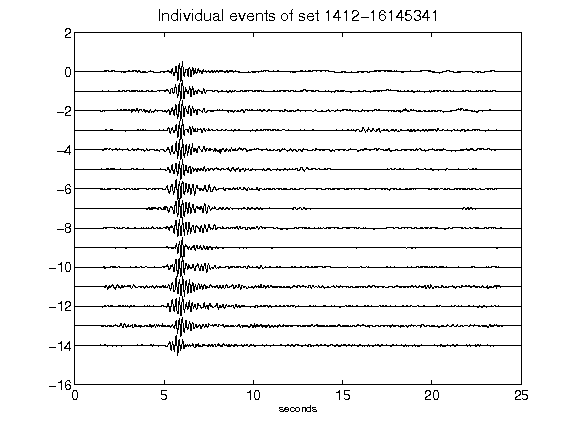](figures/1412-16145341_AllEv.png)[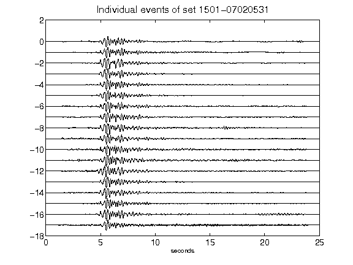](figures/1501-07020531_AllEv.png)[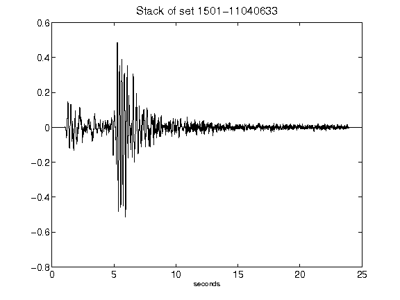](figures/1501-11040633_Stack.png)[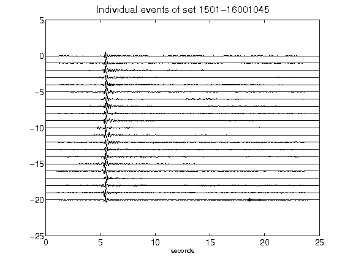](figures/1501-16001045_AllEv.png)[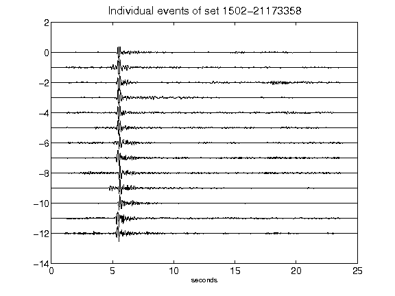](figures/1502-21173358_AllEv.png)[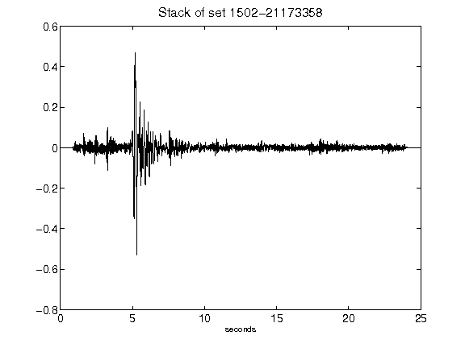](figures/1502-21173358_Stack.png)[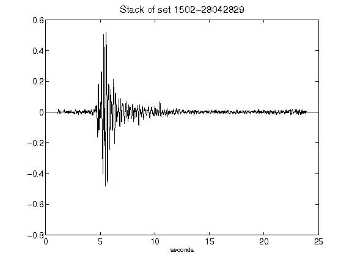](figures/1502-28042829_Stack.png)[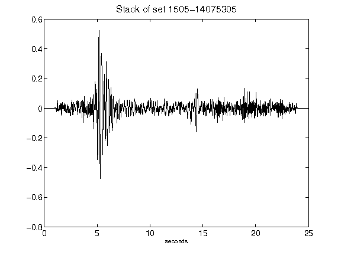](figures/1505-14075305_Stack.png)