# Repeating Earthquake Activity at RCM

## Waveforms
[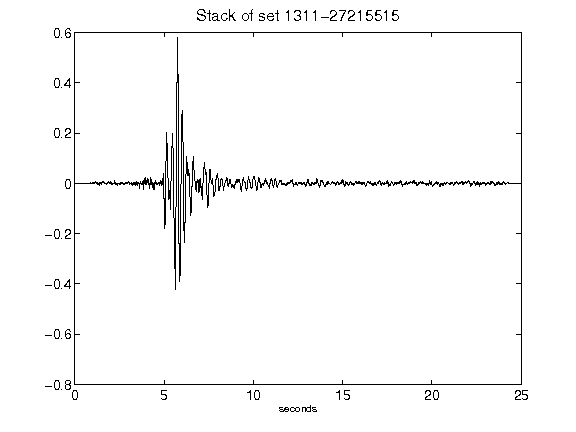](figures/1311-27215515_Stack.png)[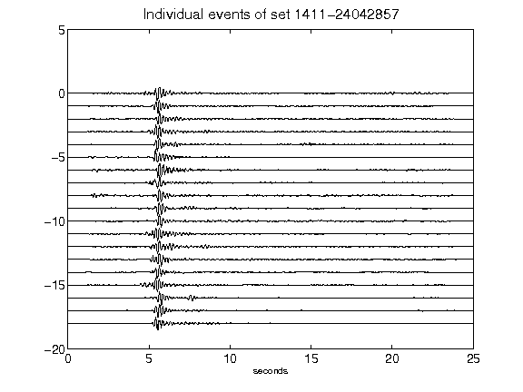](figures/1411-24042857_AllEv.png)[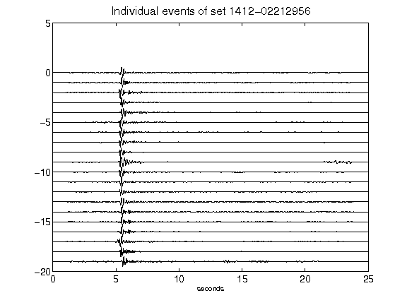](figures/1412-02212956_AllEv.png)[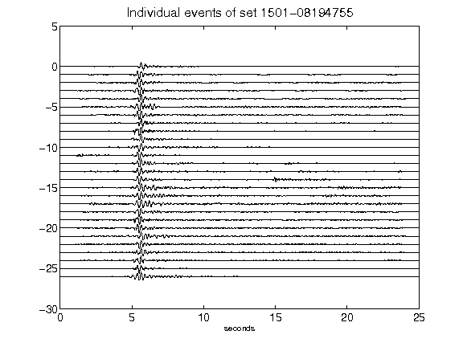](figures/1501-08194755_AllEv.png)[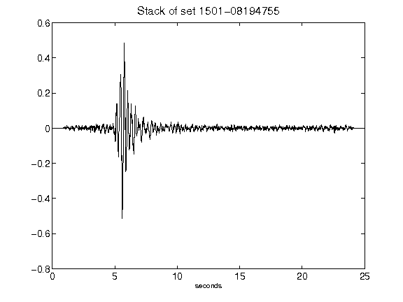](figures/1501-08194755_Stack.png)[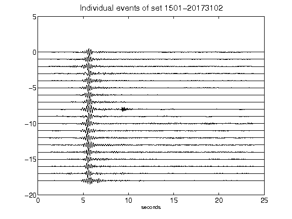](figures/1501-20173102_AllEv.png)[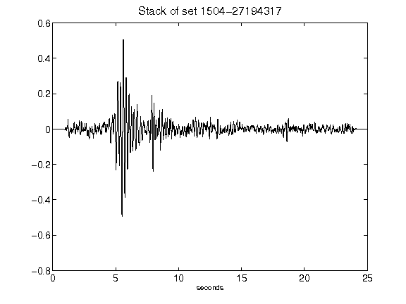](figures/1504-27194317_Stack.png)[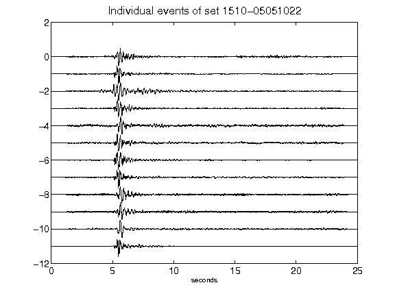](figures/1510-05051022_AllEv.png)[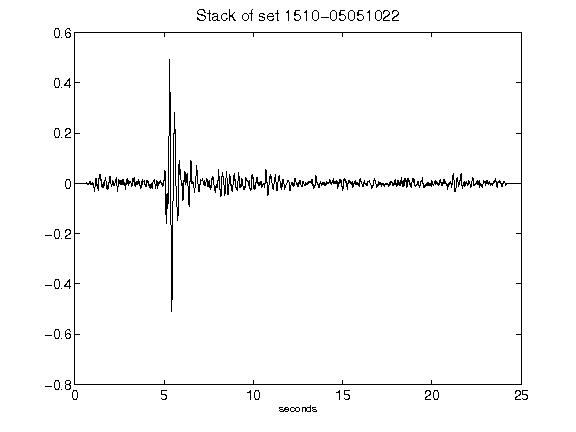](figures/1510-05051022_Stack.png)[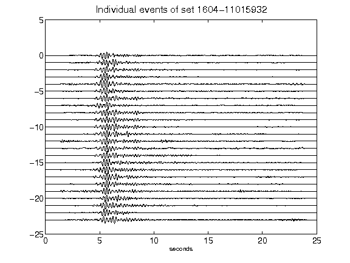](figures/1604-11015932_AllEv.png)[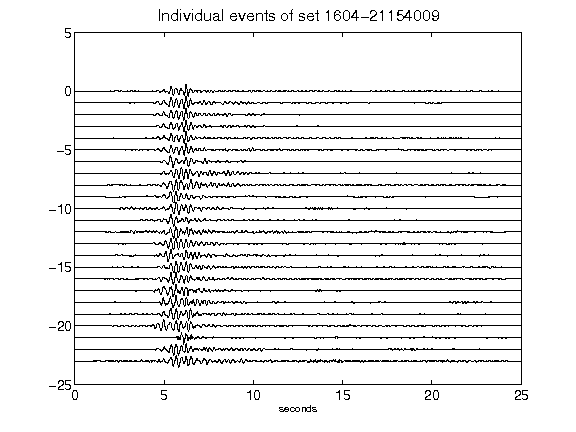](figures/1604-21154009_AllEv.png)[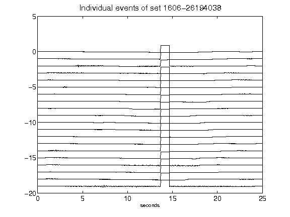](figures/1606-26194038_AllEv.png)[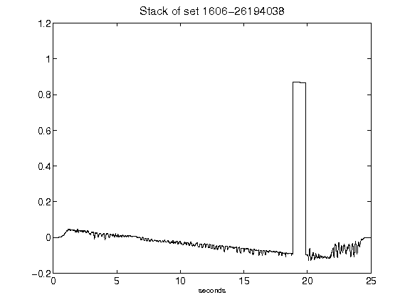](figures/1606-26194038_Stack.png)