# Repeating Earthquake Activity at RCM

## Waveforms
[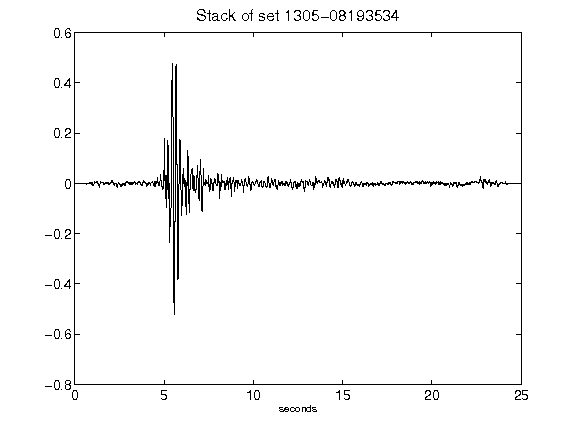](figures/1305-08193534_Stack.png)[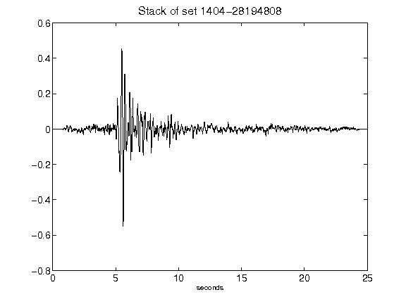](figures/1404-28194808_Stack.png)[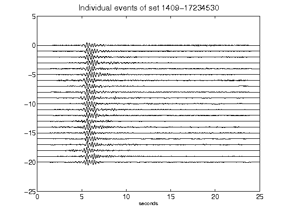](figures/1409-17234530_AllEv.png)[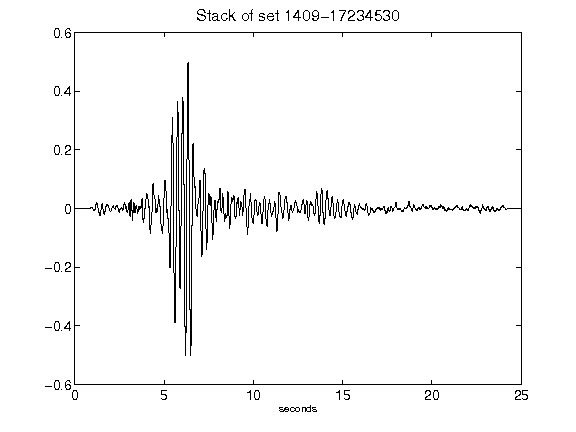](figures/1409-17234530_Stack.png)[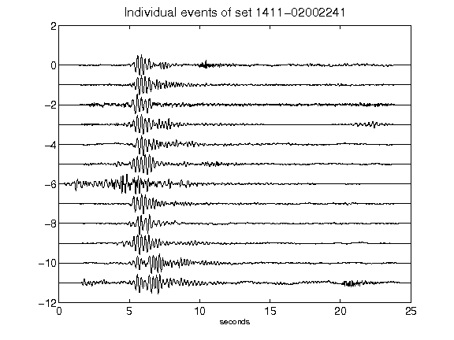](figures/1411-02002241_AllEv.png)[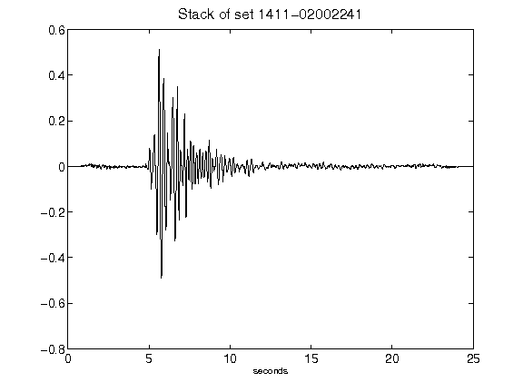](figures/1411-02002241_Stack.png)[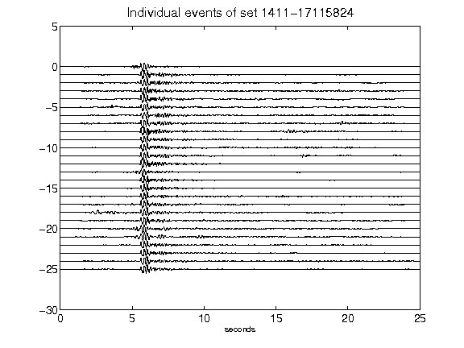](figures/1411-17115824_AllEv.png)[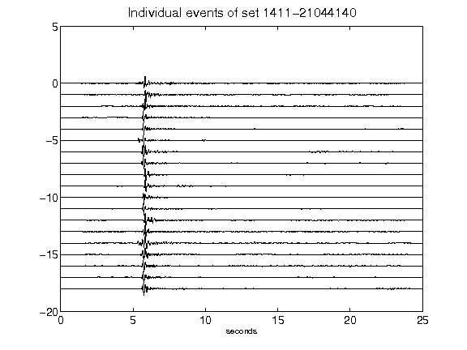](figures/1411-21044140_AllEv.png)[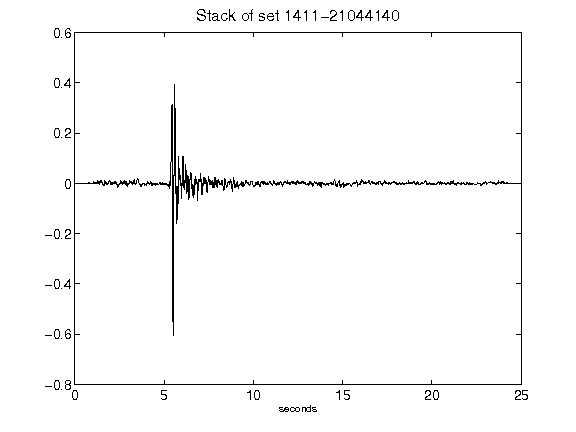](figures/1411-21044140_Stack.png)[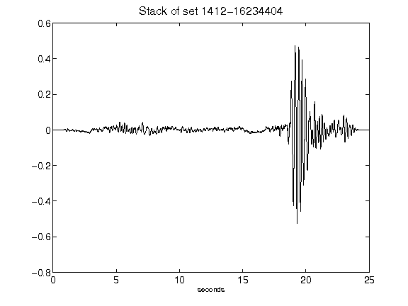](figures/1412-16234404_Stack.png)[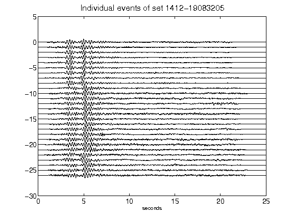](figures/1412-19083205_AllEv.png)[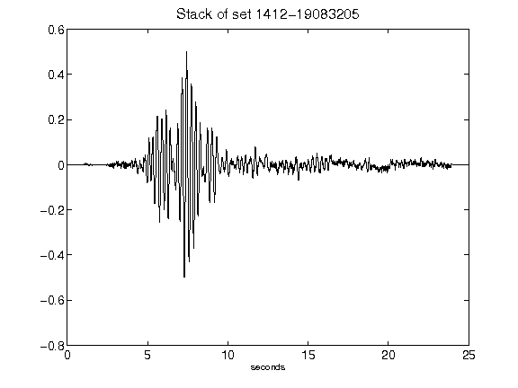](figures/1412-19083205_Stack.png)[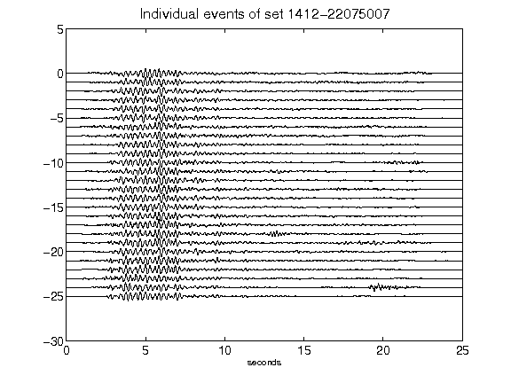](figures/1412-22075007_AllEv.png)[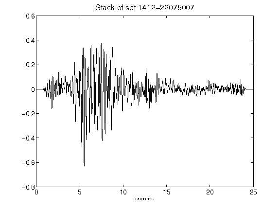](figures/1412-22075007_Stack.png)[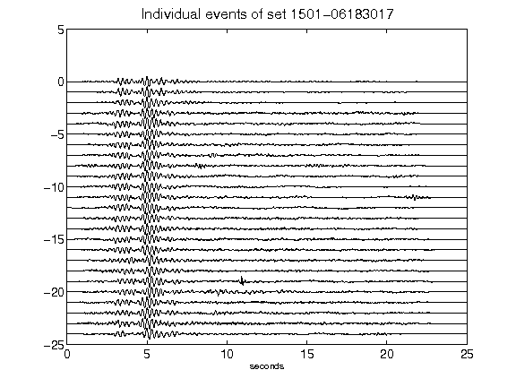](figures/1501-06183017_AllEv.png)[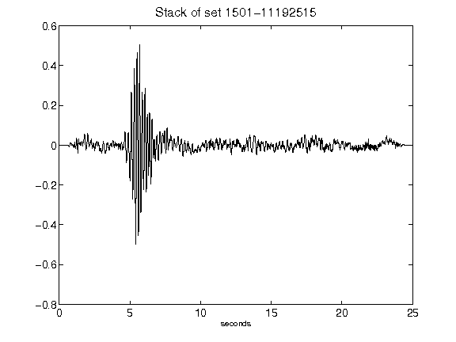](figures/1501-11192515_Stack.png)[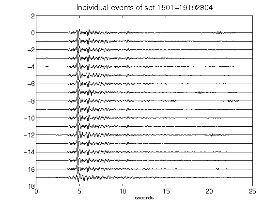](figures/1501-19192804_AllEv.png)[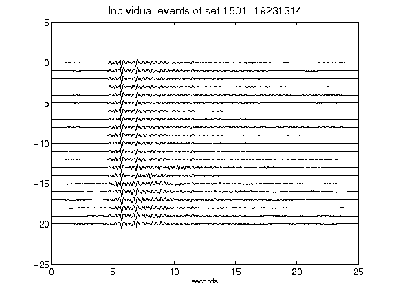](figures/1501-19231314_AllEv.png)[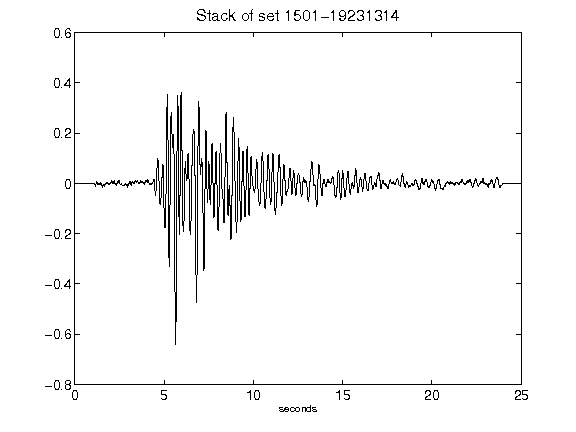](figures/1501-19231314_Stack.png)[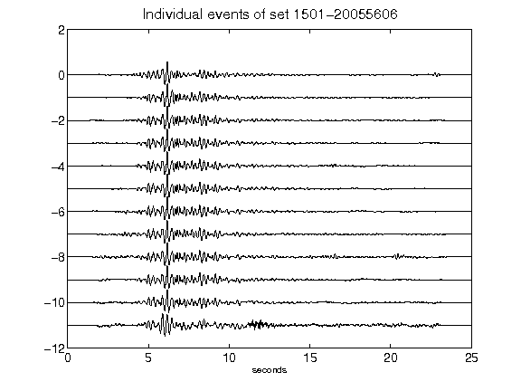](figures/1501-20055606_AllEv.png)[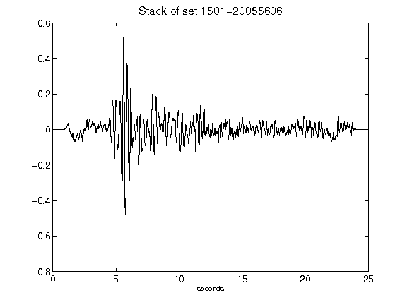](figures/1501-20055606_Stack.png)[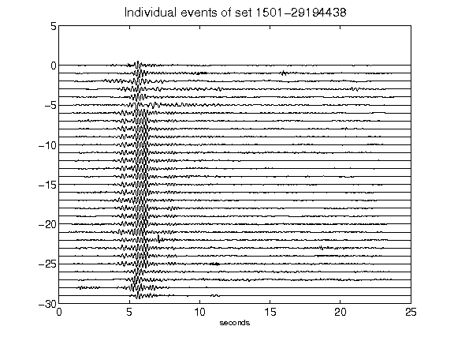](figures/1501-29194438_AllEv.png)[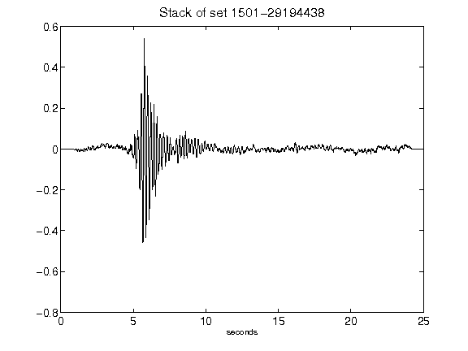](figures/1501-29194438_Stack.png)