# Repeating Earthquake Activity at RCM

## Waveforms
[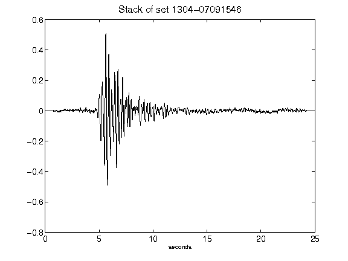](figures/1304-07091546_Stack.png)[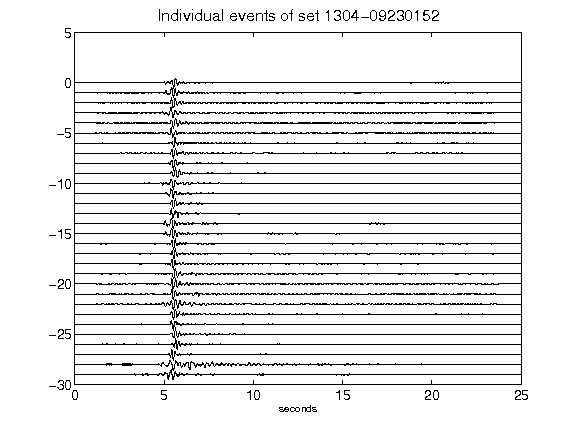](figures/1304-09230152_AllEv.png)[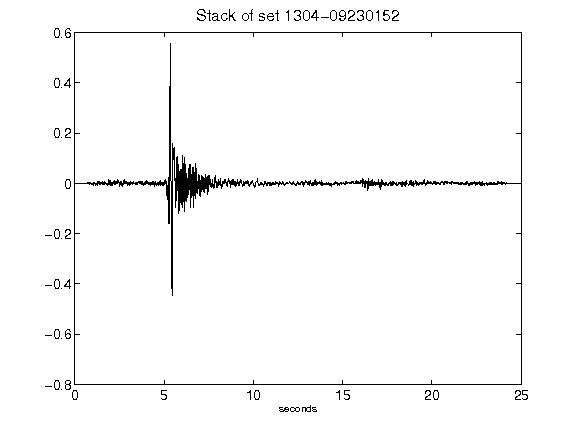](figures/1304-09230152_Stack.png)[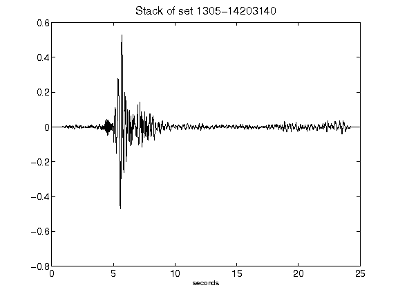](figures/1305-14203140_Stack.png)[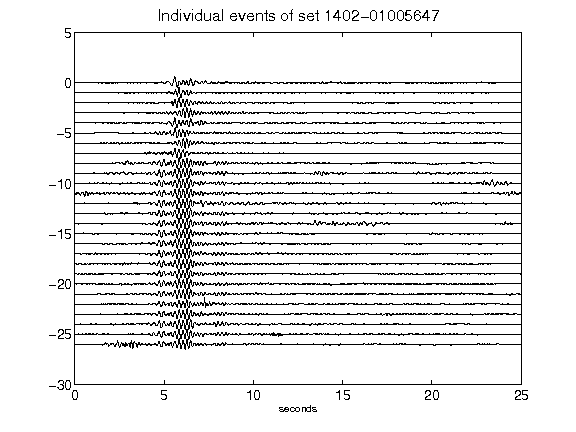](figures/1402-01005647_AllEv.png)[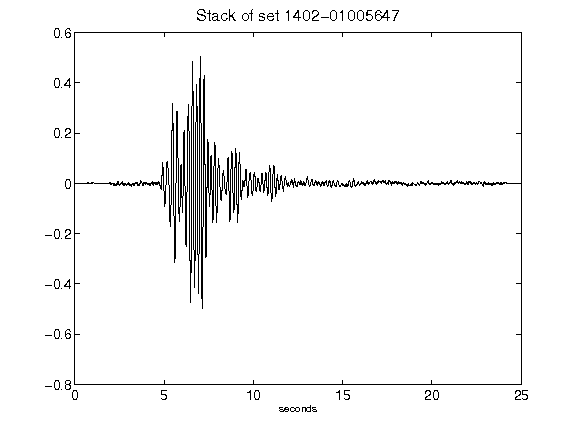](figures/1402-01005647_Stack.png)[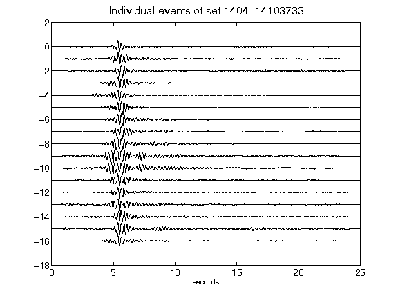](figures/1404-14103733_AllEv.png)[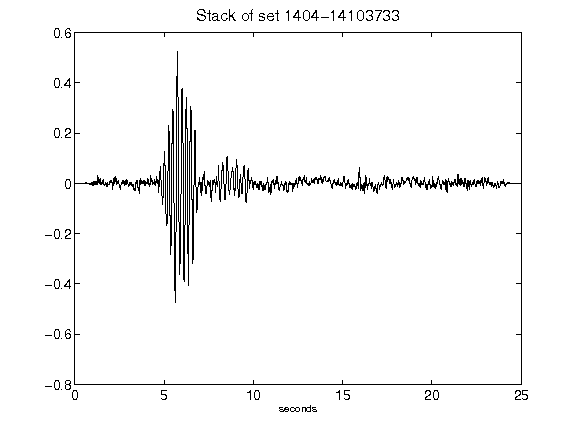](figures/1404-14103733_Stack.png)[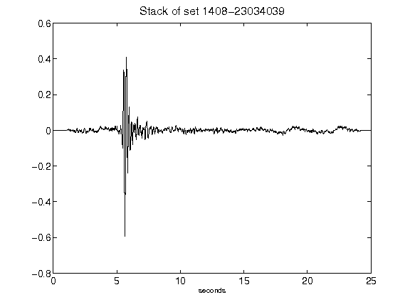](figures/1408-23034039_Stack.png)[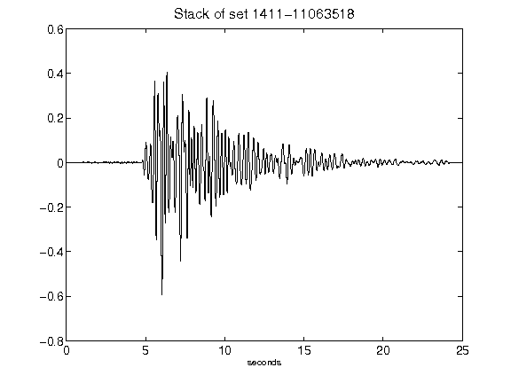](figures/1411-11063518_Stack.png)[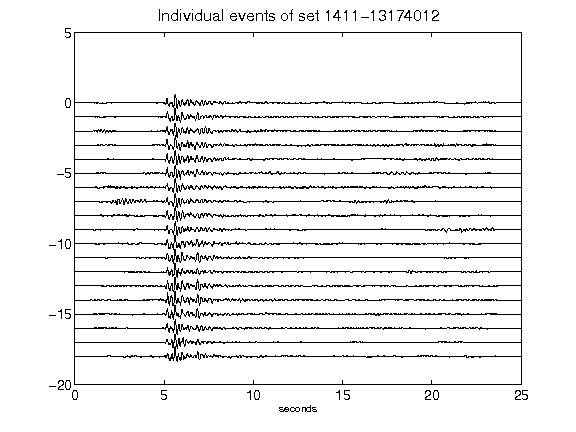](figures/1411-13174012_AllEv.png)[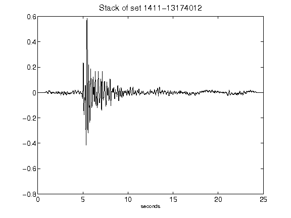](figures/1411-13174012_Stack.png)[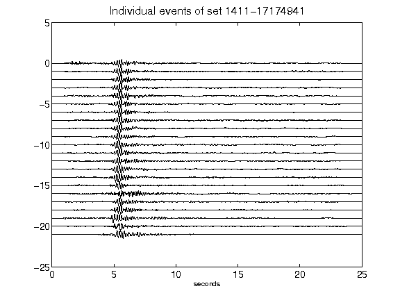](figures/1411-17174941_AllEv.png)[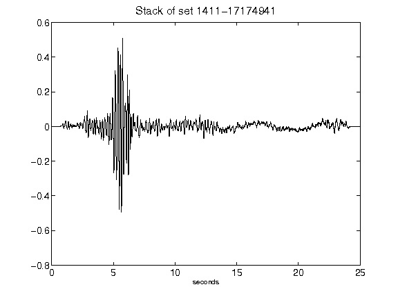](figures/1411-17174941_Stack.png)[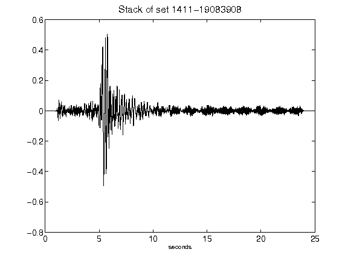](figures/1411-19083908_Stack.png)[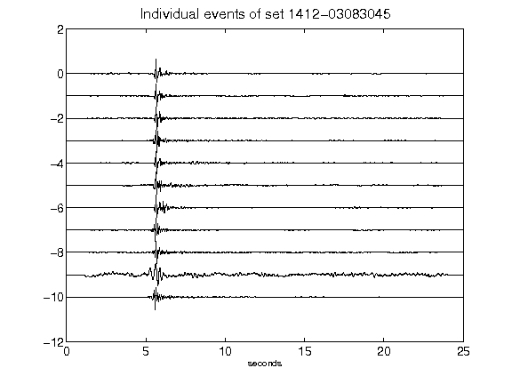](figures/1412-03083045_AllEv.png)[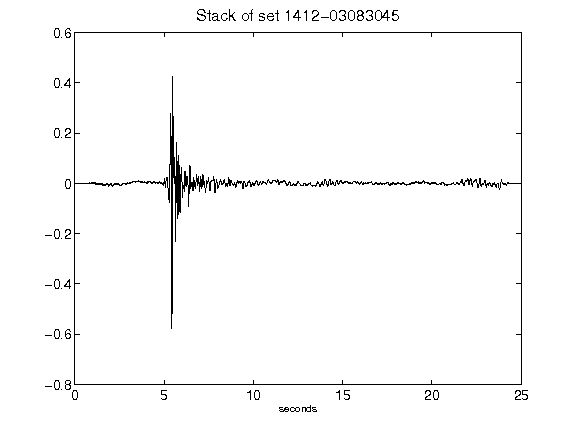](figures/1412-03083045_Stack.png)[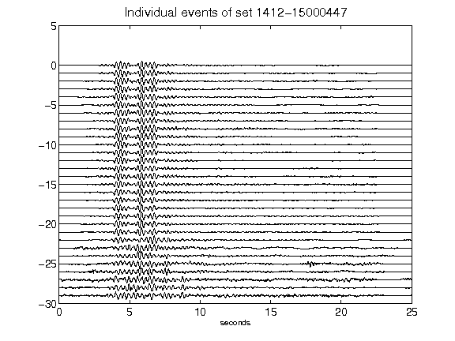](figures/1412-15000447_AllEv.png)[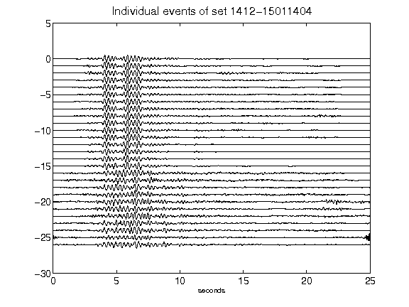](figures/1412-15011404_AllEv.png)[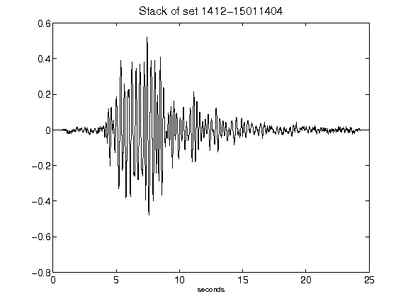](figures/1412-15011404_Stack.png)[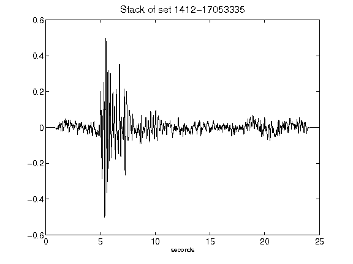](figures/1412-17053335_Stack.png)[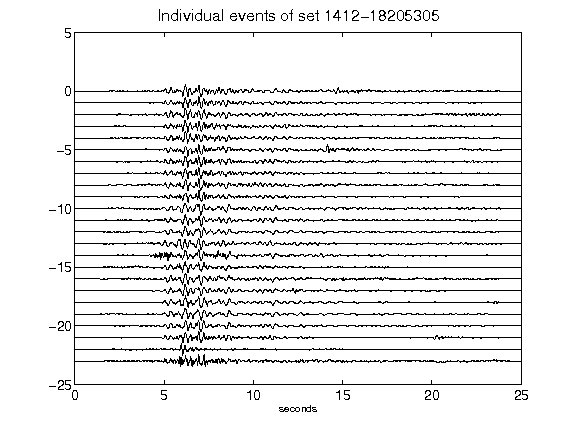](figures/1412-18205305_AllEv.png)[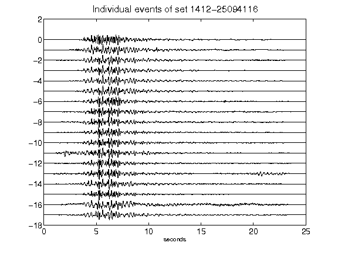](figures/1412-25094116_AllEv.png)[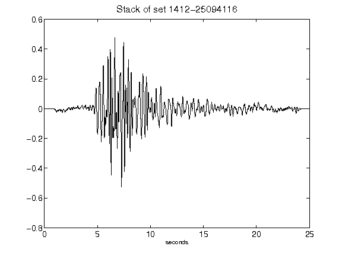](figures/1412-25094116_Stack.png)[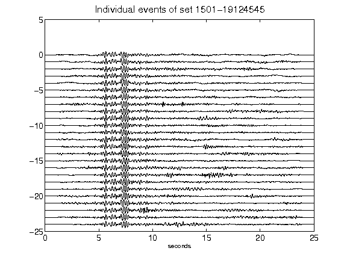](figures/1501-19124545_AllEv.png)[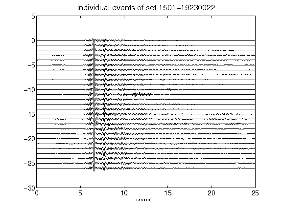](figures/1501-19230022_AllEv.png)[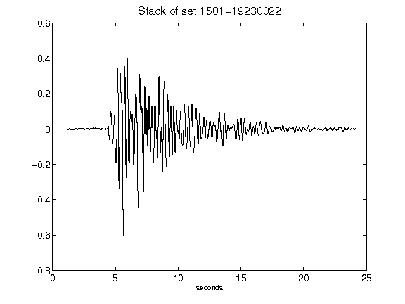](figures/1501-19230022_Stack.png)