# Repeating Earthquake Activity at RCM

## Waveforms
[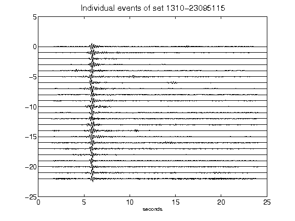](figures/1310-23095115_AllEv.png)[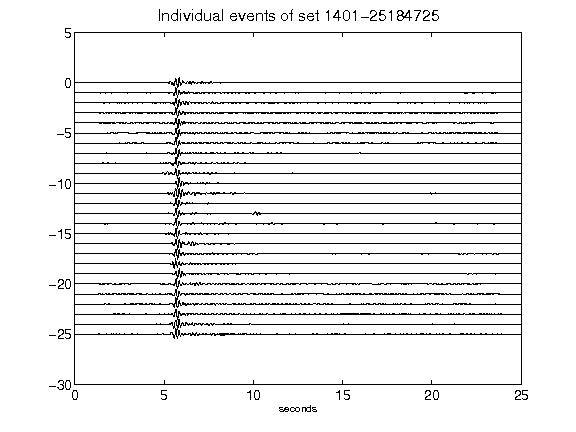](figures/1401-25184725_AllEv.png)[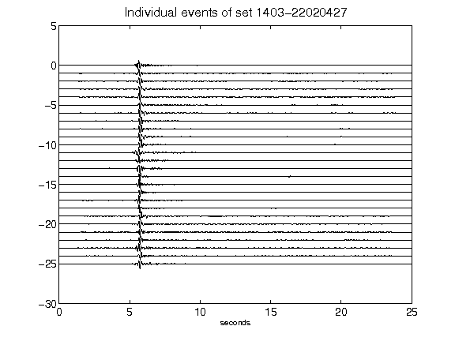](figures/1403-22020427_AllEv.png)[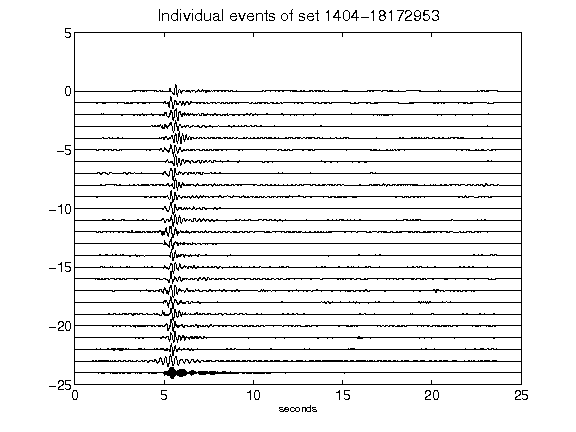](figures/1404-18172953_AllEv.png)[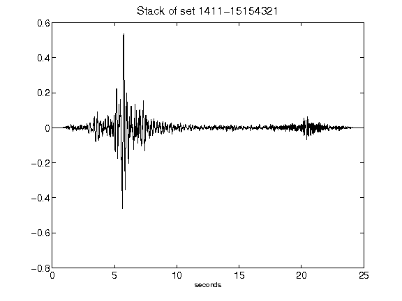](figures/1411-15154321_Stack.png)[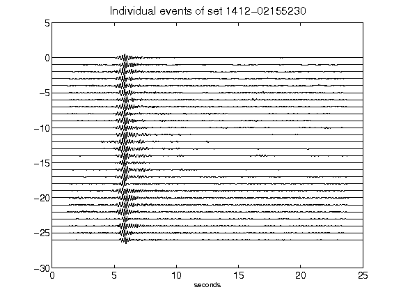](figures/1412-02155230_AllEv.png)[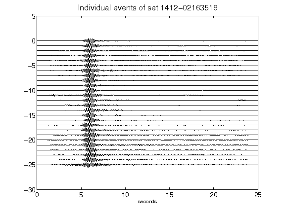](figures/1412-02163516_AllEv.png)[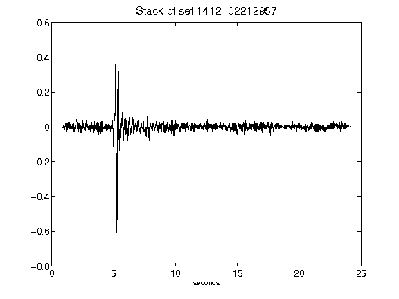](figures/1412-02212957_Stack.png)[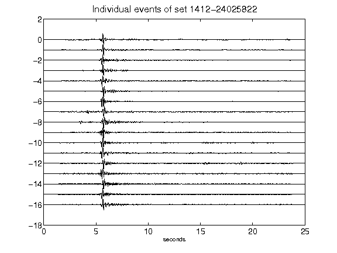](figures/1412-24025822_AllEv.png)[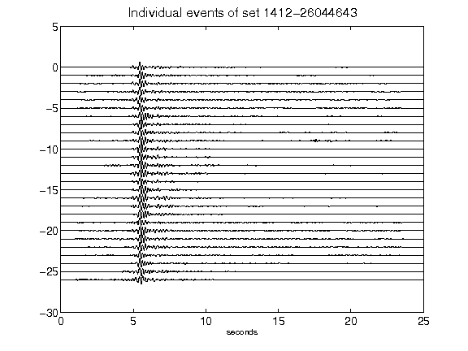](figures/1412-26044643_AllEv.png)[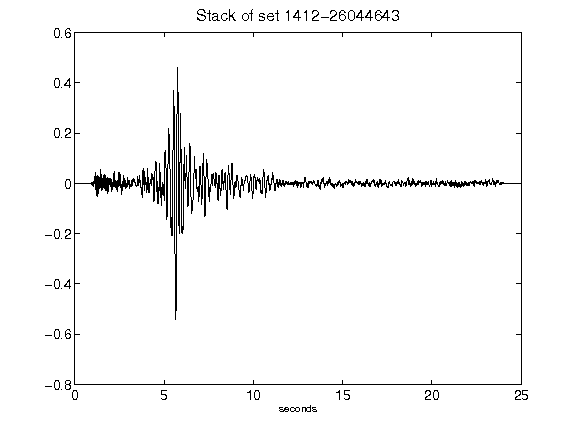](figures/1412-26044643_Stack.png)[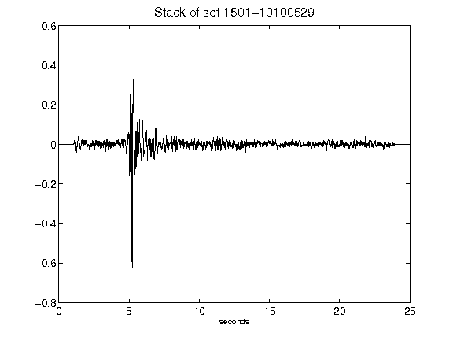](figures/1501-10100529_Stack.png)[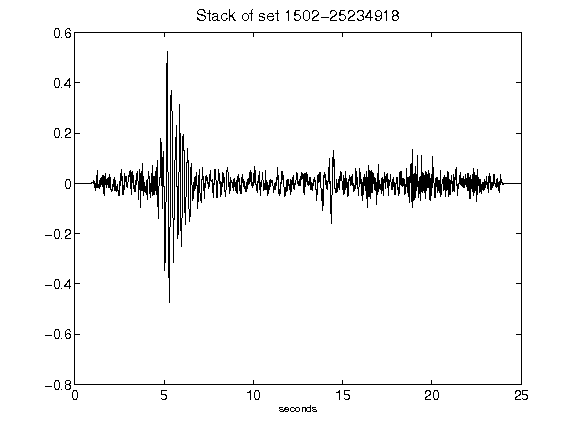](figures/1502-25234918_Stack.png)[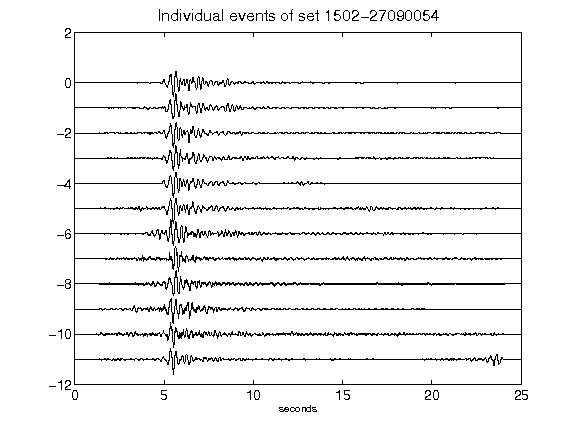](figures/1502-27090054_AllEv.png)[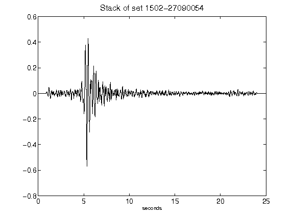](figures/1502-27090054_Stack.png)[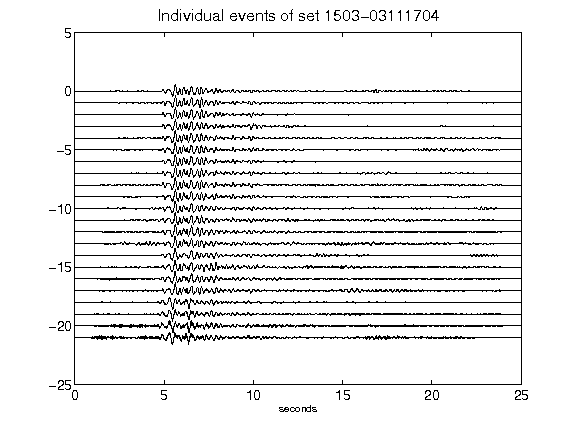](figures/1503-03111704_AllEv.png)[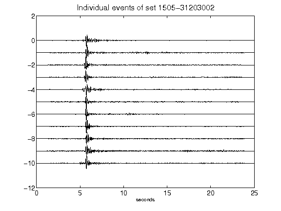](figures/1505-31203002_AllEv.png)[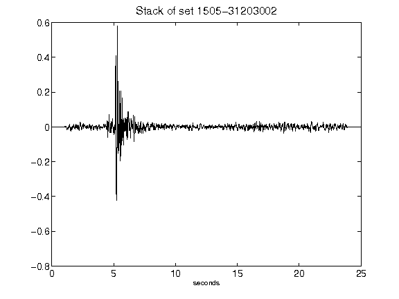](figures/1505-31203002_Stack.png)