# Repeating Earthquake Activity at RCM

## Waveforms
[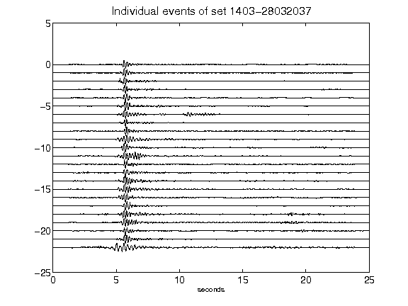](figures/1403-28032037_AllEv.png)[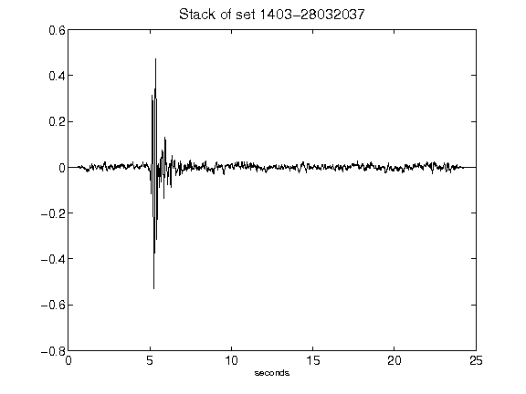](figures/1403-28032037_Stack.png)[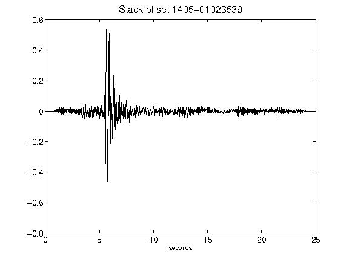](figures/1405-01023539_Stack.png)[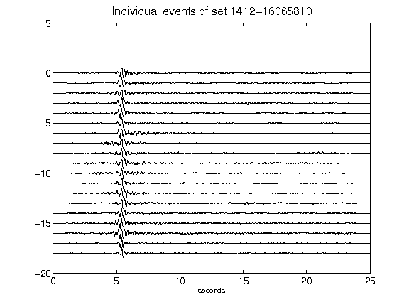](figures/1412-16065810_AllEv.png)[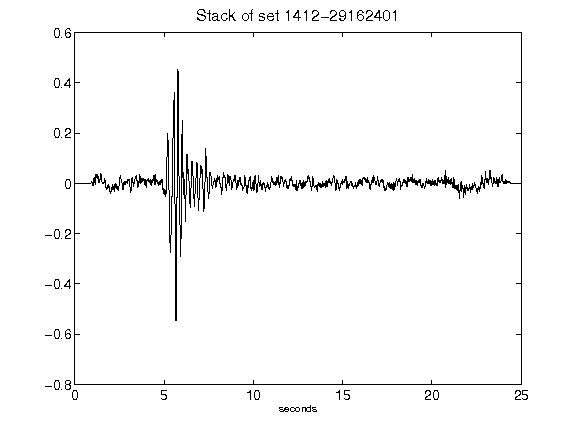](figures/1412-29162401_Stack.png)[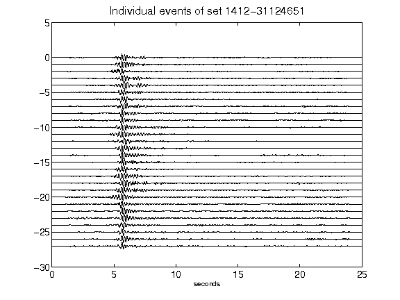](figures/1412-31124651_AllEv.png)[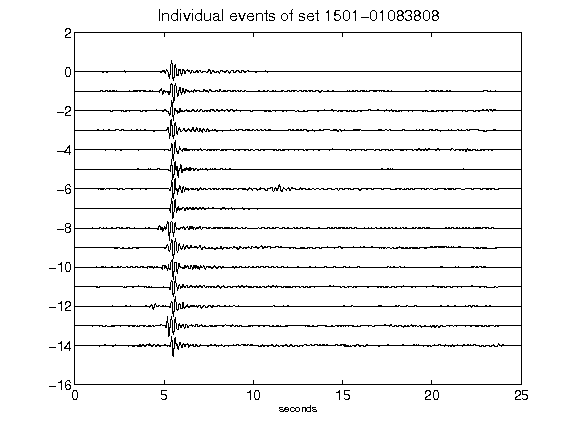](figures/1501-01083808_AllEv.png)[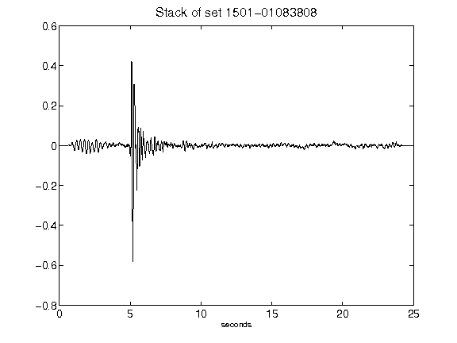](figures/1501-01083808_Stack.png)[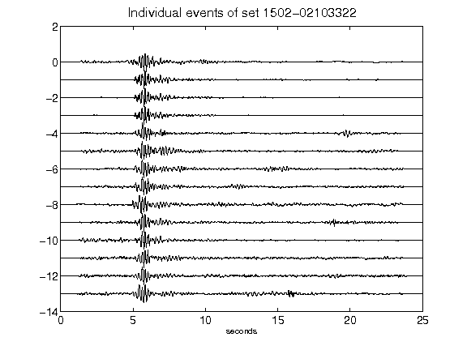](figures/1502-02103322_AllEv.png)[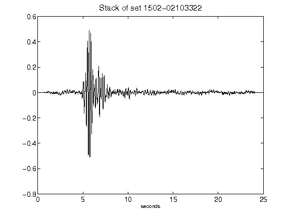](figures/1502-02103322_Stack.png)[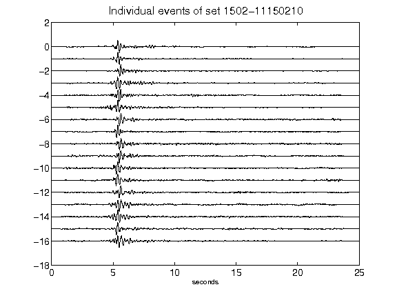](figures/1502-11150210_AllEv.png)[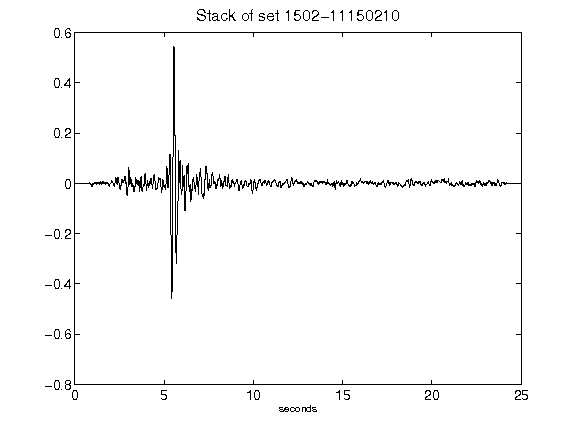](figures/1502-11150210_Stack.png)[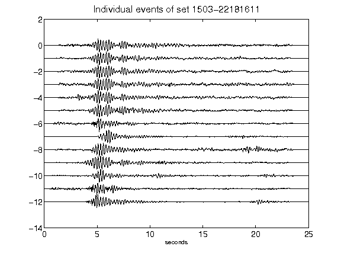](figures/1503-22181611_AllEv.png)