# Repeating Earthquake Activity at RCM

## Waveforms
[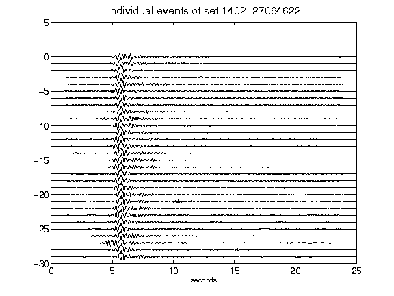](figures/1402-27064622_AllEv.png)[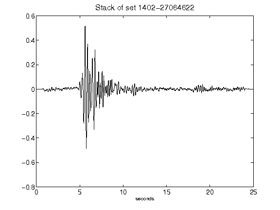](figures/1402-27064622_Stack.png)[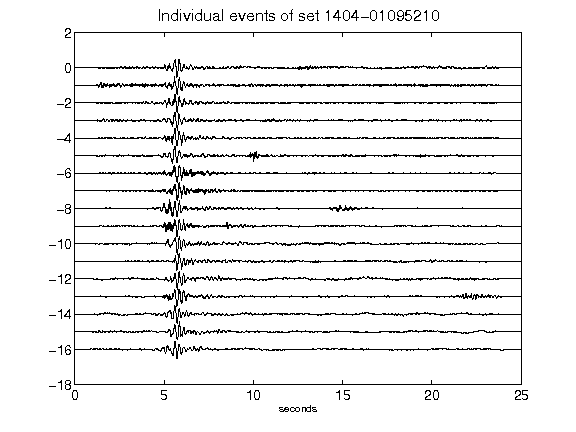](figures/1404-01095210_AllEv.png)[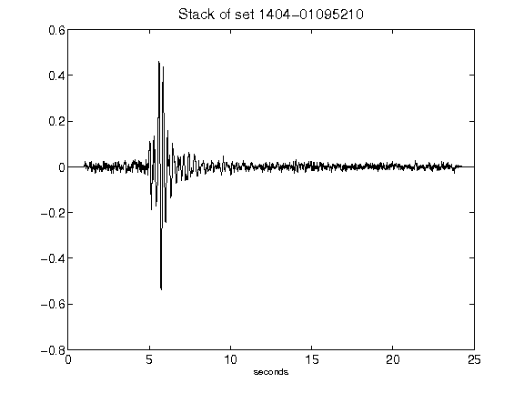](figures/1404-01095210_Stack.png)[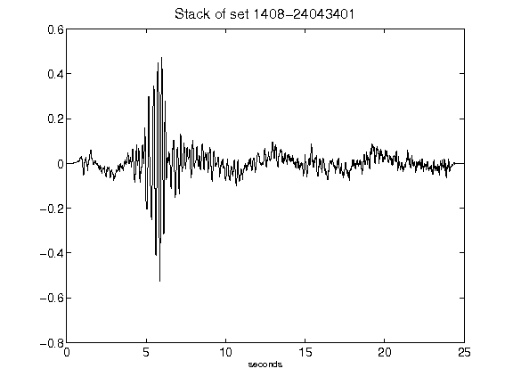](figures/1408-24043401_Stack.png)[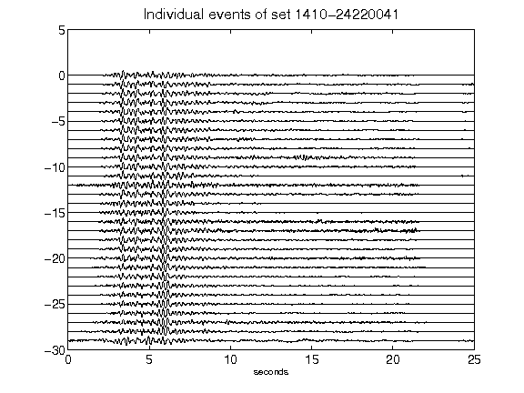](figures/1410-24220041_AllEv.png)[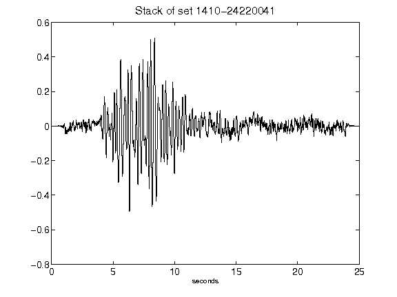](figures/1410-24220041_Stack.png)[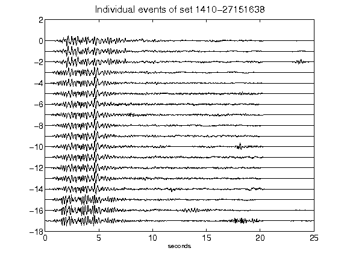](figures/1410-27151638_AllEv.png)[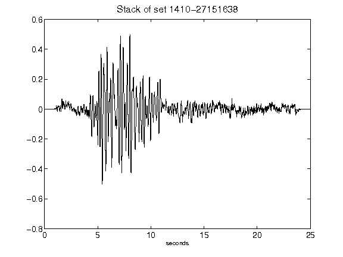](figures/1410-27151638_Stack.png)[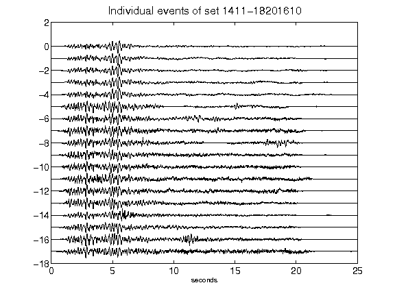](figures/1411-18201610_AllEv.png)[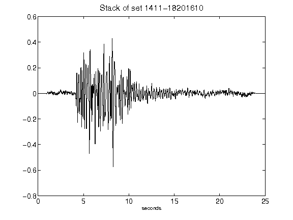](figures/1411-18201610_Stack.png)