# Repeating Earthquake Activity at RCM

## Waveforms
[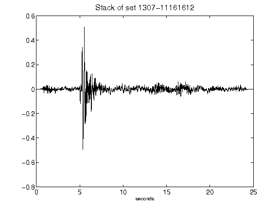](figures/1307-11161612_Stack.png)[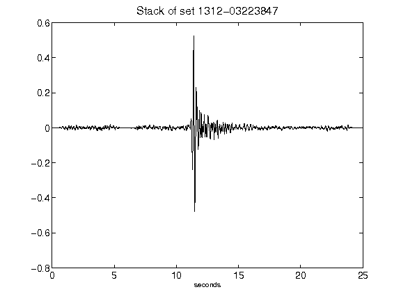](figures/1312-03223847_Stack.png)[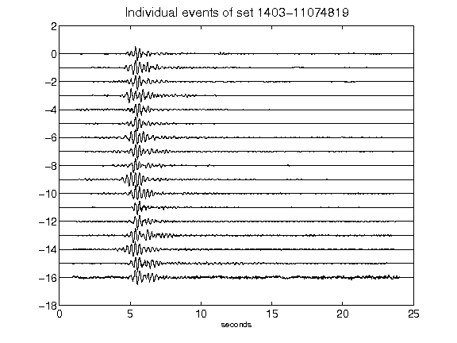](figures/1403-11074819_AllEv.png)[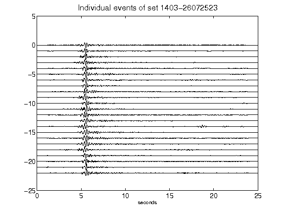](figures/1403-26072523_AllEv.png)[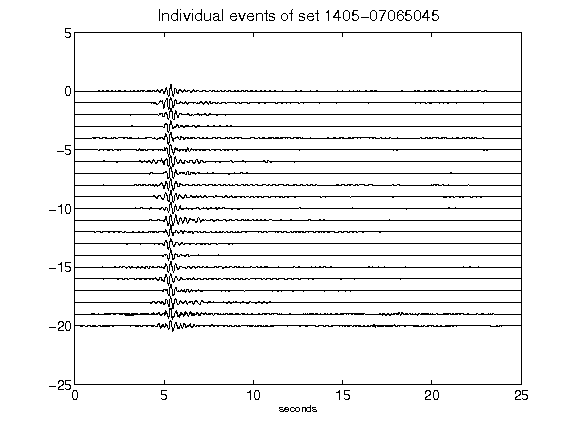](figures/1405-07065045_AllEv.png)[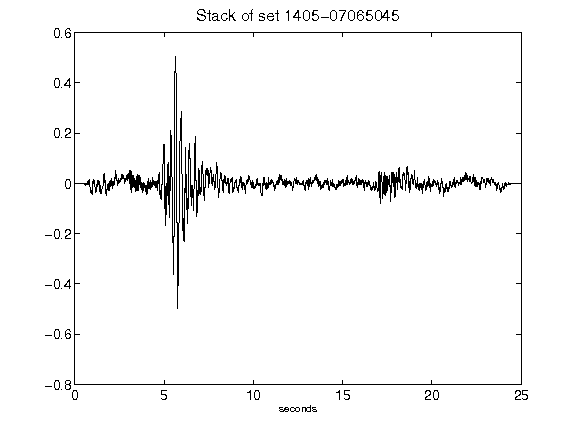](figures/1405-07065045_Stack.png)[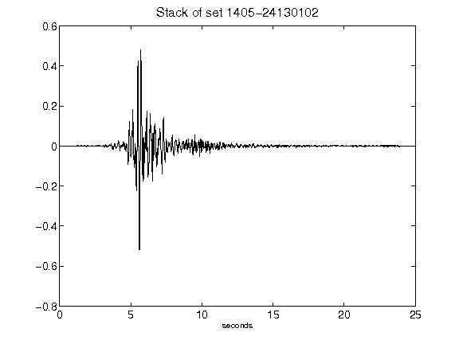](figures/1405-24130102_Stack.png)[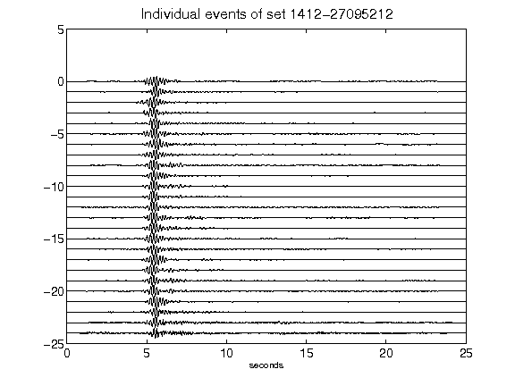](figures/1412-27095212_AllEv.png)[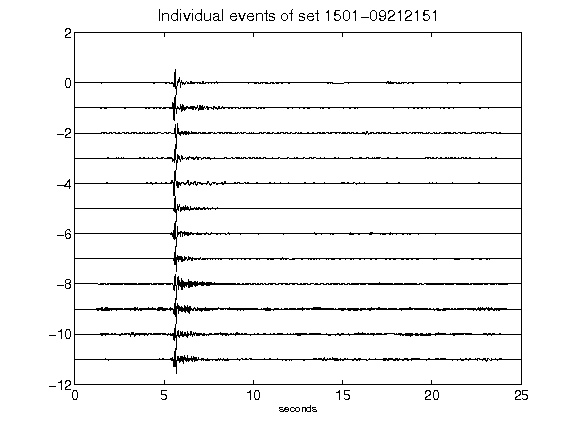](figures/1501-09212151_AllEv.png)[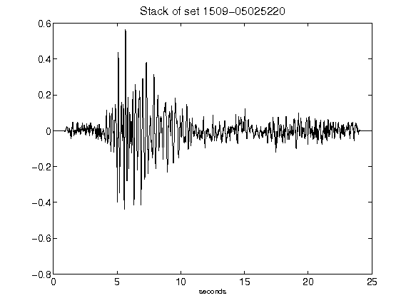](figures/1509-05025220_Stack.png)[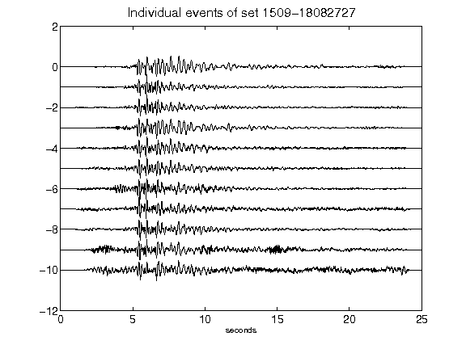](figures/1509-18082727_AllEv.png)